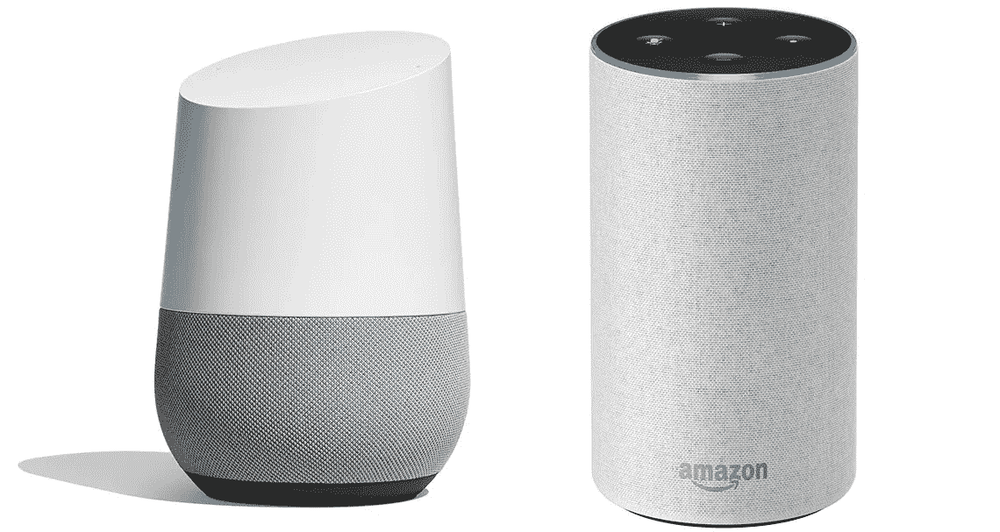

# 亚马逊 Echo 还是 Google Home？

> 原文：<https://medium.datadriveninvestor.com/amazon-echo-or-google-home-e657534a74b5?source=collection_archive---------35----------------------->

Google Home vs Amazon Echo

你还没有语音助手吗？不要担心这是时间问题，迟早你会陷入诱惑或者有人会给你，甚至可能在年底前…

现在的问题是选择哪一个。

如果你不是一个 Mac 粉丝男孩/女孩，我们假设带有 Siri 的 Home Pod 被淘汰了。Siri 超封闭的系统、高昂的价格和微小的进化，使它成为一个只面向苹果忠实用户的生态系统。

我们现在必须在亚马逊或谷歌、谷歌或亚马逊之间做出选择。

# Echo 和 Google Home 在功能上真正的区别是什么？

据我所能证明的，几乎没有区别，更多的是与品牌的亲和力问题。例如，如果你已经有一台 Fire 电视，或者你喜欢你的 Kindle 电子书，你可能更倾向于从亚马逊购买你的语音助手。如果你是一个安卓用户，拥有安卓电视或 Chromecast，那么你可能会选择 Google Home。

# 我能拿这些助手怎么办？

让我们来看看 Amazon Echo 和 Google Home 都可以做的常见事情的列表:音乐、设备控制、查询、日历和事件、例程、警报、列表、技能和动作。

音乐:基本上这是大多数人奉献给他们的声乐助理的事情。到处放音乐是使用最多的资源。这些助手通常以扬声器格式出现是有原因的。在音乐资源方面，亚马逊和谷歌都允许你连接你的 Spotify 帐户，它们都不允许你连接你的 Apple Music 帐户，并且它们不承认对方的音乐系统。

因此，如果你的音乐来自 Spotify，你可以选择你想要的音乐，但 Apple Home Pod 只能与 Apple Music 配合使用。如果你的音乐是 Youtube 音乐，你必须选择 Google Home，如果你的音乐是亚马逊音乐，你可以想象一下。

除了要求您的声乐助理将音乐放在 Spotify 上，您还可以要求他将世界各地的任何电台放在 Spotify 上，只要它在 TuneIn 中，因为两个系统都默认使用该应用程序，无需进行任何配置或帐户。真的很舒服。

**控制设备:**这是下一步，控制一些灯泡，一些插头，目前不是很多。在这方面有一个技术上的联系。所有可以用亚马逊处理的灯泡，也可以用谷歌控制，苹果再次被落在后面，因为它使用一种特定的认证，使任何设备都更加昂贵。就灯泡而言，飞利浦 Hue 系统和宜家 Tradfri 都能与亚马逊和谷歌以及苹果完美合作。

你可以在任何地方找到这些完全兼容 Echo 和 Google Home 的中国插头和开关。如果你不需要调暗灯光，这是一个比所有灯泡系统更便宜的解决方案，而且同样高效。

除了插头和开关，还有许多其他设备可以通过语音助手进行控制，如摄像头、锁或恒温器，尽管每个系统都有自己的可控设备。例如，亚马逊有 Fire TV，这是一种为任何电视提供智能的媒体播放器，而谷歌有 Chromecasts，可以从我们的手机向电视或音乐设备播放视频或音频。

在设备控制领域，亚马逊似乎更先进，因为它不仅毫无问题地促进了 Alexa 在第三方设备中的集成，例如门户网站，脸书的智能屏幕将与 Alexa 兼容，而且还开发了一种非常经济的芯片，允许几乎任何设备都可以通过 Alexa 进行控制。一个微波炉和一个厨房时钟已经在目录中，更多的将很快出现。

对于音乐爱好者来说，新的 Sonos 扬声器已经与 Alexa 兼容，在某种程度上，它们将与 Google Home 兼容。2018 年底前公布，但时间流逝，杳无音信。

询问:今天伦敦的天气如何？我应该带一把雨伞吗？上班要多长时间？二加二等于几？三英里是多少公里？《雨中曲》的主角是谁？等等。等等。Alexa 和 Google Home 都会回答你问他们的所有问题。他们会告诉你公寓楼下那家中餐馆的电话号码，以及皇家马德里周日和谁比赛。

**日历和事件:**两者都可以与您的日历同步。目前，亚马逊能够与你的谷歌日历同步，添加事件，修改它们，等等。您可以通过语音添加新的约会、删除约会、让他们告诉您当天的日程安排等。这里也没有什么需要强调的，两者的工作原理是一样的。

**套路**:一旦开始了套路，就停不下来。只需一个指令，你就可以调暗客厅的灯光、播放音乐、开关其他灯和插头。例如，亚马逊和谷歌都有一个完全可配置的早安程序，其中包括日历事件列表、天气预报、交通和当天的主要新闻。

**闹钟**:你可以创建任意多的闹钟和定时器。人们经常使用这些设备来设置闹钟和定时器。你在厨房，开始做食谱，让你的助手在 18 分钟内通知你。你也可以让他周一到周五七点用你最喜欢的歌叫醒你。亚马逊和谷歌都是这么做的，所以这不会是选择一个或另一个的决定性因素。

**清单**:基本就是购物清单。突然你想起来你必须买扁豆，所以你让你的演讲者把它写在购物清单上，当你去超市的时候它就在那里了。你可以向家人和朋友借你的购物清单。

**技能和动作:**是系统中第三方“应用/内容”的访问方式。就亚马逊而言，该系统非常成熟，谷歌花了很短的时间，但它肯定会很快赶上来。Skills 是亚马逊给这些应用和动作起的名字，谷歌名。例如，在亚马逊，我可以安装一个技能来复制大海的声音或森林中的雨声。我也可以为戈登·拉姆齐安装一个技能，告诉我他最好的食谱。技能是亚马逊兼容第三方设备的方式，有一个技能飞利浦 Hue，宜家，TP-LInk，华硕或者任何中国品牌的插头。

到目前为止，他们共享的功能，然后每个系统都有自己的用户界面，你可能或多或少会喜欢，以及说话的方式，它的设计，调用词，亚马逊的 Alexa，谷歌 Home 的 Ok Google。

亚马逊刚刚发布了一种耳语模式，如果你对 Alexa 耳语，设备将以最小音量回答。谷歌有一个连续的对话模式，让你不必每次都告诉好吧，谷歌，亚马逊有一个汽车设备和一个低音炮，谷歌有三种尺寸的扬声器，其中一个是高品质的。价格非常相似，所以现在，就看你的了。

**更多信息:**

[亚马逊 Echo 的完整目录](https://www.amazon.com/b/ref=aeg_d_cp_nav/ref=s9_acss_bw_cg_acpnav_md1_w?node=9818047011&pf_rd_m=ATVPDKIKX0DER&pf_rd_s=merchandised-search-1&pf_rd_r=WYDWWN1HACSWF4XV49NA&pf_rd_t=101&pf_rd_p=d419bb6d-53c4-4994-87c1-a7c5a2bb8319&pf_rd_i=17934671011)

[Google Home 的完整目录](https://store.google.com/category/connected_home)