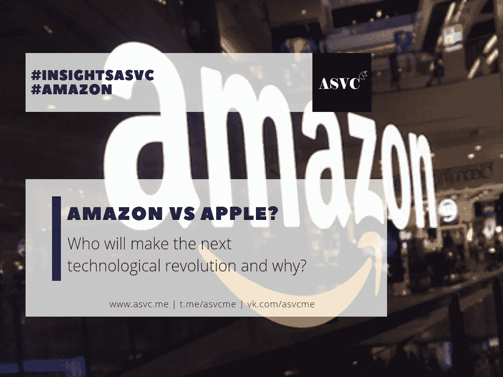

# 亚马逊 vs 苹果？谁将进行下一次技术革命，为什么？

> 原文：<https://medium.datadriveninvestor.com/amazon-vs-apple-who-will-make-the-next-technological-revolution-and-why-5bb9666290ed?source=collection_archive---------8----------------------->

“Amazon cardboard box character figurine” by [Hello I'm Nik](https://unsplash.com/@helloimnik?utm_source=medium&utm_medium=referral) on [Unsplash](https://unsplash.com?utm_source=medium&utm_medium=referral)

[上俄语版*电报博客*](http://t.me/asvcme/133)

旅途中写了一篇文章忘了，决定分享一下。我想知道为什么亚马逊几年来一直亏损，而苹果几十年来一直盈利，但该公司的资本总额都超过了 1 万亿美元。我开始做一个比较分析，我发现，我认为这将有助于你了解他们的战略和商业愿景，管理和技术发展的方法。

**亚马逊**

贝佐斯是一位投资技术和商业模式的战略家，可以等到产品在自己的基础上产生回报。对于亚马逊的领导者来说，团队、用户、技术和资本中的关键人才非常重要。以下是他发展公司的一些方法:

市场是无限的。杰夫·贝索斯认为，公司起步的零售市场在未来会以完全不同的方式形成，而且会非常巨大。数万亿美元——这是他在采访和短信中的定义。或者该公司开创的云市场亚马逊网络服务(AWS)也很大。这个部门的收入今年将达到 2100 亿美元。

**B)这个词是的。在新的技术海洋中，给人们机会是很重要的。公司引入了一种文化:如果下级主管有想法，他想尝试，他需要在增加中说服他的老板等等。第一个“不”会扼杀这个想法。这就是为什么弱小的创业公司往往会绕过强大的风险投资者:如果 99%的人说不，那么 1%的人会说是。这足以让这个想法成真。贝佐斯采用了这个系统，并在他的公司中实施。它叫做通往成功的多条道路。如果双边门所基于的假设被证明是错误的，那么双边门是很容易被放弃的解决方案。数以千计的员工提出他们的想法，数百名高管表示同意。经理知道实验和想法并不是没有失败的。“我们感谢他们，我们希望他们能更好”——贝佐斯的助手说。杰夫不需要看到他们，我也不需要。我们只是相信它，并致力于系统。但事实是，大规模和导致一侧(门导致一侧)，即大量投资，如果有人开始制造技术，产品，它可以改变一些戏剧性的东西，可以花费公司大量投资，然后贝佐斯成为该过程的主要经理，并减缓决策过程。他着眼于三件事:**

**1)竞争观念**，不仅仅是我也想做点什么

**2)规模**(公司有一个基地，换来的是小市场没有意义，你需要一个有巨大市场的全球性东西)

**3)投资回报，创新**(即使是一般规模的创意也应该有资本回报)

上面描述的模型是这样工作的:要么他们回过头来考虑消费者的痛苦、需求和价值(我们注意到人们有这样的行为，让我们为他们提供这样的产品)，要么他们会跑在前面，根据基础建立一个预测:“我们知道如何做一些很酷的事情，我们有技术，让我们测试一下这对我们的用户群是否有必要”。

**C)亚马逊在数据库方面的实力。**在人、技术以及最重要的用户的数据库中。新产品将在此基础上构建。于是，就有了第一个硬件产品——Kindle(电子阅读器)，公司第一个也是正确的产品，对应着公司的价值观和它的来源——书籍。这个产品并没有改变公司，把它带到一个新的高度，但是它给了人们经验。在它之后，在设备生产方面出现了更多的失败:智能手机 Fire 等，但这一经历允许亚马逊制作一个智能专栏。

耐心。掌握业务不仅需要时间，给它成长的机会也很重要。就像花园里的白桦树一样，它们不会在一个月内生长。如果我们能做到。贝佐斯有时不知道产品漂浮在哪里，但他像哥伦布一样试图找到一条通往印度的新路线，而不是地球边缘的悬崖……这种方法令人印象深刻。

我决定更详细地探究他的活动，更深入地探索他是如何创建他的帝国的。毕竟，看到新的贝佐斯、伊万诺夫、马沙、李和约翰对我来说很重要，我们将努力工作，寻找人才。

在我看来，如果苹果不改变其远见卓识和战略，亚马逊有很大的机会获得成功。但是没有他，他们很可能做不到。刚刚意识到他已经离开 7 年了…他在 2011 年离开。

赶快让世界的价值，有人有 90 年，有人更少！一分钟都不要浪费！

