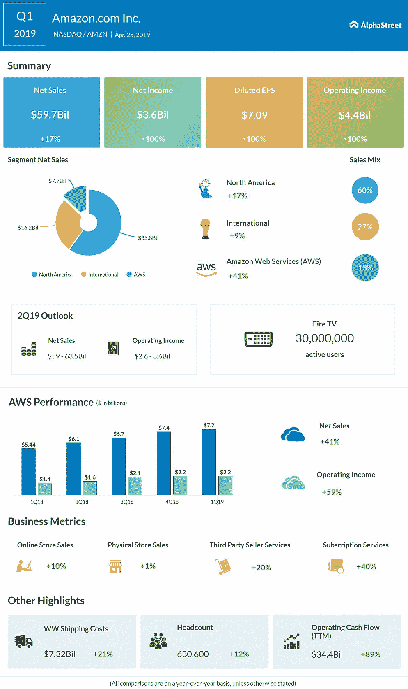
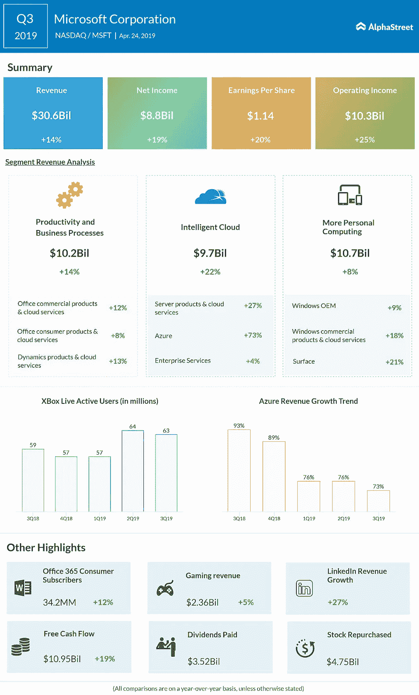
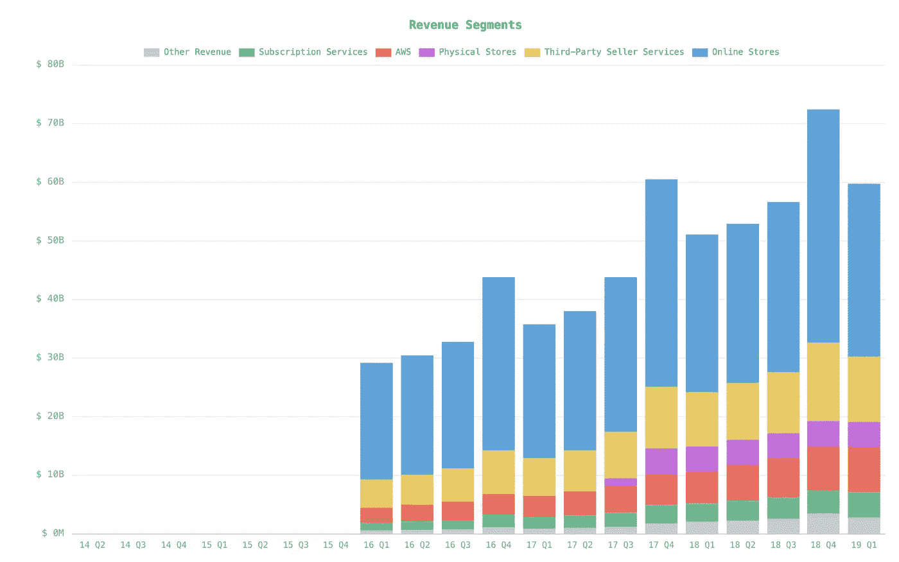
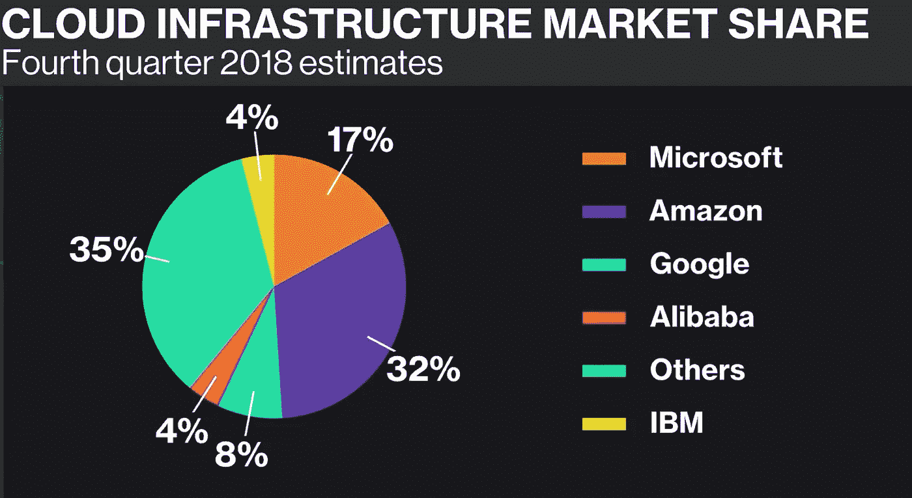
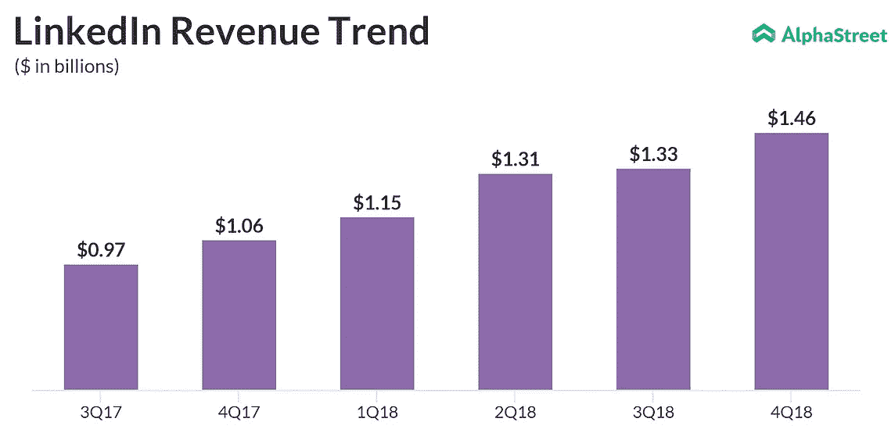
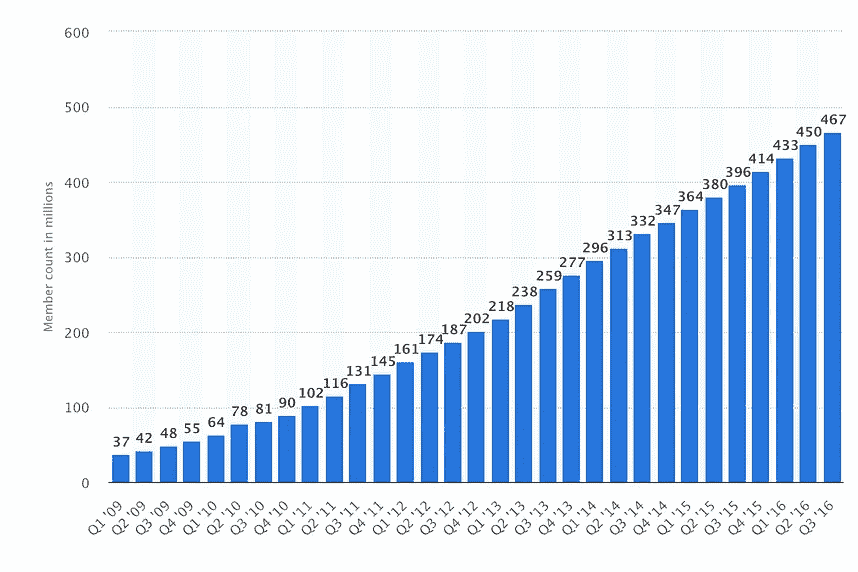

# 亚马逊 vs 微软

> 原文：<https://medium.datadriveninvestor.com/amazon-vs-microsoft-669a3fb1c3e7?source=collection_archive---------0----------------------->

## 在未来 5 到 10 年，哪项业务的表现会更好

伯克希尔·哈撒韦公司上周宣布，他们正在购买大约相当于 1B 价值的亚马逊股票。这让我想知道为什么伯克希尔·哈撒韦公司收购这项业务，而不是科技领域的其他公司。

在这篇文章中，我将仔细研究亚马逊的业务，并将其与微软的业务进行比较，看看在未来 10 年内哪一项似乎是更好的投资。

亚马逊和微软是他们旗下几个不同大企业的联合企业。特别是，亚马逊总是运行一些不同的实验来测试不同的商业模式。根据每项业务的投资结果，亚马逊可能会继续投资。

正如杰夫·贝索斯所说:

> “如果你每年做的实验数量增加一倍，你的创造力也会增加一倍。”

为了投资其他领域，亚马逊直到最近都是零净收入。这意味着亚马逊有足够的[创意](https://www.quora.com/Is-Peter-Thiel-correct-that-Googles-massive-cash-hoard-is-evidence-that-it-does-not-have-enough-ideas-for-how-to-innovate)来投资未来。另一方面，微软十多年来一直在创造利润。

但除了是否有足够的想法这一点，让我们看看这两个不同的业务，并将其分解，以了解为什么或为什么不应该有人根据他们的未来收益投资他们。

让我们并排分析一下亚马逊和微软。

Microsoft grew its bottom line by 1.4B and Amazon grew its bottom line by 1.8B

# 亚马孙

亚马逊在 2018 财年的总收入约为 232 亿 T4，总收益为 98 亿 T7。

看看它的收入明细，亚马逊从几个来源赚钱:**在线商店、第三方卖家服务、实体店、AWS、订阅服务和其他收入**

让我们来分析一下每一个部门，每一个部门的增长情况，以及它们的收益。

## 在线商店

2018 财年，亚马逊在线商店创造了约 122 亿美元的收入。众所周知，亚马逊在这一业务领域没有任何收入。其在线商店的增长正在减速。这项业务的年增长率约为 18%。

## 第三方卖方服务

2018 财年，亚马逊通过其第三方服务创造了 420 亿美元的收入。这个领域也没有产生利润。亚马逊第三方卖家的年增长率为 20%。

对于在线商店和第三方卖家服务，亚马逊不断创新，它有一个巨大的护城河。大约有 1 亿人拥有 Amazon Prime，每年为其会员支付大约 119 美元。

有了这笔现金在手，亚马逊就能够投资于其送货服务。在不久的将来，亚马逊承诺在某一天为 Prime 用户提供产品。它将在下一季度投资约 8 亿英镑，为其用户提供一日送达服务。竞争远远落后。亚马逊是在线商务的领导者，远远领先于 T2 和 T3。它拥有大约 48%的市场份额。

当顾客要求他们的产品时，亚马逊在同一天送货，这不会太遥远。我们将会看到这是否会改变消费者的行为。

这个领域在一段时间内不会成为亚马逊的利润驱动力，但在很长一段时间内，它将是一个巨大的可防御市场。这个市场上唯一真正的竞争对手是沃尔玛，他们只占有 4%的市场份额。

## 亚马逊网络服务

这是亚马逊内部最有趣的区域。AWS 代表了大约**250 亿**的收入，年增长率为 36%。该领域的营业收入约占其 2018 财年收入的 30%或**75 亿美元**。

## 实体店

2018 财年在 **17B** 附近的实体店。这个地区不产生利润。这主要是来自全食超市的收入。2016 财年，当全食超市还是一家独立公司时，它一年创造了约 0.2 亿美元的收益。如果他们大幅增加收入，那将令人惊讶。

## 订阅服务

这相当于每年约 14 亿英镑。这个领域的收入基本上取决于用户为亚马逊 Prime 支付的费用。亚马逊 Prime 用户约有 1 亿，每用户每年收费约 120 美元，这意味着大部分收入来自 Prime

## 其他收入

这个领域产生了大约 100 亿美元的收入，并且每年以 117%的速度增长。这一领域主要是由广告，但也包括其他小型企业。2018 财年的广告收入约为[**4.6B**](https://variety.com/2018/digital/news/amazon-us-digital-ad-revenue-google-facebook-1202947923/)**。对于亚马逊来说，广告的成本并不高。**

**这一领域主要是利润，但它的增长速度没有过去的 T21 快。天空不是极限。该地区的收入同比增长了 36%。**

**这是亚马逊收益中最大的份额。但是这个地区的发展速度没有过去那么快了。如果这是亚马逊收益的未来，那么收益将不会像过去那样快速增长。**

## **分解它**

**亚马逊 2019 年第一季度的净收入在**3.6 亿**左右。大约 70%的收入来自 AWS，其余来自广告业务。亚马逊广告业务同比增速放缓至 36%，而 AWS 同比增速为 50%。**

# **微软**

**在 2018 财年，微软创造了大约**1000 亿**的收入和**160 亿**的收益，但在第二季度，它冲销了大约**140 亿**的收益。**

**与谷歌一样，微软在云业务上起步较晚，但与谷歌不同，微软一直在挤压这一业务。**

**自从萨提亚掌权以来，它似乎一直在正确的领域投资。微软已经从诺基亚撤资，并开始改变在其他一些领域的策略。在萨提亚的领导下，微软收购了一些公司，包括 Github 和 LinkedIn。这两项收购对微软来说价值巨大。部分之和大于整体**

**让我们看看它的不同业务，并分析它们做得如何。微软的收入可以分为三个不同的部分:**

## **Azure(智能云)**

****

**微软收入的最大驱动力之一是其云业务。Azure 在 2018 财年创造了大约 267 亿美元的收入。微软是所有竞争对手中增长最快的。其中，似乎微软产生了大约 77 亿美元的收益或 100 亿美元的营业收入。该地区正以每年 30%的速度增长。**

## **生产力和业务流程**

**这一领域为微软创造了大约 400 亿美元的收入。该地区去年 **的营业收入约为 [**15B** 。这是微软收入中最大的一部分。这个领域由 Office 和 Office 365 等产品组成。微软一直以 15%至 30%左右的速度持续增加其 Office 365 用户群(包括 Office 和 Office 365)。这个区域包括 LinkedIn。让我们仔细看看。](https://view.officeapps.live.com/op/view.aspx?src=https://c.s-microsoft.com/en-us/CMSFiles/SlidesFY19Q3.pptx?version=3bdcbd10-82e1-ca82-fa33-5d5d0a31a3ce)****

****领英****

********

**Revenue growth and number of users over time**

**2018 财年，Linkedin 的收入约为 53 亿英镑，盈利 0.6 亿英镑。LinkedIn 的收入同比增长 29%。这种趋势可能会继续下去。Linkedin 拥有约 2 . 6 亿 MAU 和近 5 亿注册用户。这是脸书用户群的八分之一。**

**如果 LinkedIn 保持 30%的年增长率，他们可能会在 5 年内接触到 1B 用户。多年来，LinkedIn 的业务没有受到直接威胁。LinkedIn 有一个很大的护城河:它的网络效应。LinkedIn 的收入和盈利增长速度将快于其用户增长速度。**

## **个人计算**

**2018 财年，该地区产生了大约 **43B** 的收入和 **12B** 的营业收入。它包括 Windows 操作系统、Surface 收入、Xbox 和搜索的销售。该地区的年增长率因地区而异，从 12%到 20%不等。**

# **总而言之**

**微软和亚马逊的云业务产生了大约相同的收入，并且以相似的速度增长。亚马逊的其余收入来自其广告业务，每年产生大约 40 亿美元的收入。微软的个人电脑业务产生的收益是亚马逊广告业务的 3 倍。即使亚马逊保持目前的增长速度，微软的个人计算领域没有增长，亚马逊也需要 4 年时间才能在广告上获得与微软个人计算部门一样多的收入。**

**亚马逊的市值现在在 920 亿左右，微软的市值在 980 亿左右。如果你看看未来十年的潜在收益，似乎微软有一个更好的立足点。正如本杰明·格拉哈姆所说:**

> **“从短期来看，市场是一台投票机，但从长期来看，它是一台称重机”**

**如果伯克希尔·哈撒韦正在收购亚马逊的业务，为什么不收购微软？**