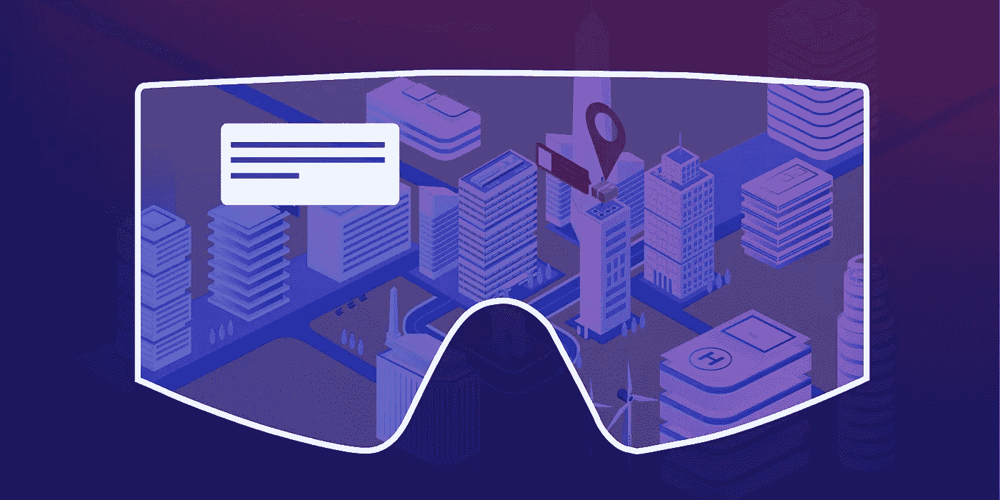
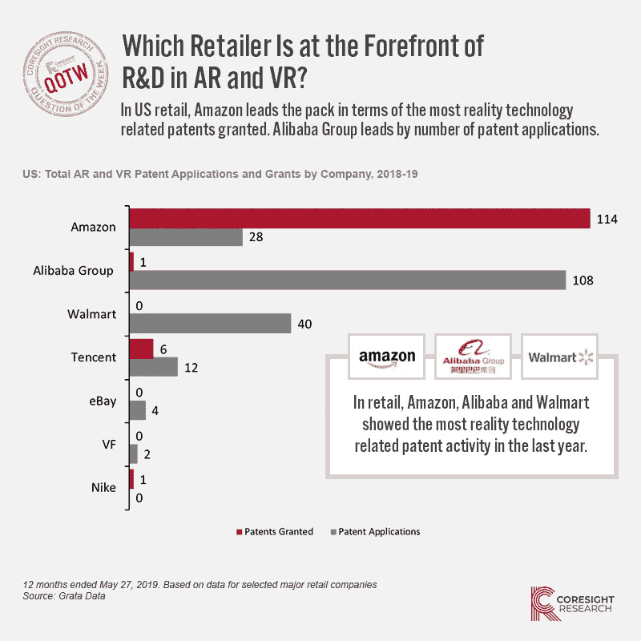

# 亚马逊押注增强现实将提高运营效率

> 原文：<https://medium.datadriveninvestor.com/amazons-bet-that-augmented-reality-will-increase-operational-efficiency-5f90ace1518b?source=collection_archive---------10----------------------->

亚马逊最近公布了一项专利，展示了增强现实解决商业问题的潜力。这项名为[增强现实辅助交付](http://www.freepatentsonline.com/10373377.html)的专利是一种依赖 AR 耳机与亚马逊包裹交付代理沟通最佳时间、路线和停车位置等信息的应用，以促进包裹的快速交付。

**商业问题**

根据这项专利，这是一个商业问题:“有经验的送货代理人经常会了解到关于送货路线和送货区域的信息，这些信息不会反映在路由应用程序生成的送货路线中。”换句话说，递送路线并不总是包含有助于代理高效工作的关键信息，例如帮助代理以最快方式递送和离开的最佳停车位置，或者当没有门卫时将包裹放在哪里。

 [## 人工智能和虚拟现实的融合-你能期待什么|数据驱动的投资者

### 在技术领域，融合是合乎逻辑的一步。就在几十年前，你可能需要一个专门的…

www.datadriveninvestor.com](https://www.datadriveninvestor.com/2018/08/30/the-convergence-of-ai-rv-what-you-can-expect/) 

**解决方案**

[正如 GeekWire](https://www-geekwire-com.cdn.ampproject.org/c/s/www.geekwire.com/2019/amazon-lays-technology-guide-delivery-agents-augmented-reality/amp/) 所报道的，AR 将帮助解决如下问题:

●根据该专利，计算机服务器将跟踪特工的位置和去向。

●当代理进行巡视时，由其他司机(根据他们自己的经验)输入到数据库中的有用的送货提示(如理想的停车位置)将通过 AR 耳机发送给司机。正如 GeekWire 中提到的，“当你看着公寓大楼的入口时，你甚至可以让钥匙盒的位置闪烁。”

[专利本身](http://www.freepatentsonline.com/10373377.html)包含了更多关于 ar 界面如何工作的细节。

**我的拍摄**

亚马逊专利展示了增强现实、混合现实和虚拟现实等沉浸式现实的一个基本事实:沉浸式现实可以通过创建以不同用户群体为中心的可爱产品/体验来推动业务增长，从而实现真正的突破。在这里，我们可以确定两个用户组:

●主要用户群:配送员。

●二级用户群:终端客户。

在亚马逊专利的例子中(一种设计，还不完全是一种产品)，亚马逊试图使用 AR 来支持向客户交付产品，以确保他们的客户对该品牌拥有出色的端到端体验:浏览、订购和交付——我们知道高效的交付是将客户带回亚马逊的关键竞争优势。

像这样的解决方案可以以积极的方式极大地影响送货代理人——通过最大限度地减少他们重新安排路线或找出实际卸货位置所需的时间(想想运营效率)，而不必搜索芝加哥的一套四居室公寓或浪费时间寻找一个教练室。

还要考虑对二级用户群(最终客户)的潜在影响。他们可以更准确地估计交付时间来接收包裹，并且投递位置将更加一致和可靠——想想客户满意度(是的，我在我的后院发现了包裹，并想知道为什么一家企业认为我的后院是放置我的包裹的最佳位置)。

AR 产品可能会为亚马逊价值链中的多个用户组提供一个可爱的解决方案:公司(亚马逊)、送货代理商和消费者。我要求其他公司想出一些方法，让你能够运用创新，为你企业供应链或产品中的多个用户群体创造出可爱的产品。

**大局**

纵观阿里巴巴和沃尔玛等一些主要零售商，我们看到亚马逊和阿里巴巴的专利投资要大得多。这一发现让我们相信，这些公司正在研究新的方法，将品牌和产品与消费者联系起来，并在他们的整体价值链上进行创新。然而，特别是知道这两家全球公司一直以扩张和扰乱其他行业而闻名，我不认为看到它们使用一些革命性的技术冒险进入新的领域会是一个太大的飞跃。

此外，该应用程序表明，我们才刚刚开始应用技术来真正改变供应链。我们最近在博客上写了关于[区块链如何让供应链管理成为一个更可持续的过程](http://www.moonshotio.com/2019/05/15/why-collaboration-and-design-sprints-are-crucial-to-creating-a-sustainable-future/)。供应链[创新的时机已经成熟](https://www.michiganstateuniversityonline.com/resources/supply-chain/innovation-in-supply-chain-management/)。事实上，供应链可以成为改变全球经济的[催化剂](https://www.scmr.com/article/supply_chain_management_has_changed_the_world_economy)。亚马逊是推动这种变化的完美候选人。该公司已经成为一个主要的交付巨头，拥有自己独立的生态系统。像沃尔玛一样，这是一家利用其规模和实力实现变革的领头羊公司。

**创造与业务成果相关的可爱的沉浸式现实体验**

沉浸式现实正在许多行业快速普及，从娱乐、AEC(建筑、工程和施工)到零售等等。但许多企业正在努力定义沉浸式现实的用例，并相应地进行预算。在 Moonshot，我们了解这些挑战。我们创建了特定的活动来确定正确的使用案例，并协助制定数字战略路线图，这将有助于业务决策者对创新充满信心，并将新产品理念带入生活。要了解如何应用混合现实解决业务问题，请联系 Moonshot 团队！