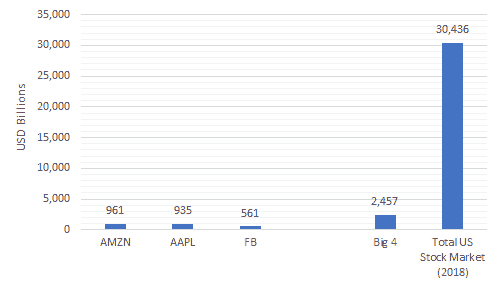
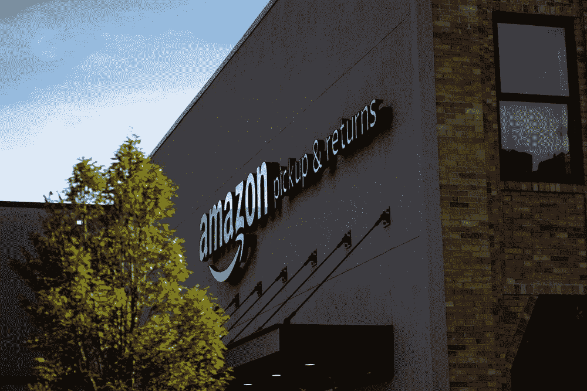

# 亚马逊的终极业务

> 原文：<https://medium.datadriveninvestor.com/amazons-ultimate-business-63e98e875ba6?source=collection_archive---------17----------------------->

亚马逊是历史上最有价值的公司之一。就估值而言，它是全球前十大公司之一。亚马逊股票市值为 9540 亿美元(2019 年 7 月)，交易价格接近 2000 美元，令人震惊。该公司是四大巨头之一，或称为[四人帮](https://www.cnet.com/news/eric-schmidt-gang-of-four-rules-tech/)，另外苹果、脸书和微软占据了美国股票市场约 11%的份额。

Chart by mhassaballa.com

大多数公众都知道亚马逊是一家在线零售商。它通过令人难以置信的快速高效的递送系统进行竞争，提供一日送达和免费送货服务。为了实现这一目标，亚马逊运营着高度自动化的仓库，此外还有极其高效的物流和交付系统。

 [## 2019 年即将改变世界的技术|数据驱动的投资者

### 很难想象一项技术会像去年的区块链一样受到如此多的关注，但是……

www.datadriveninvestor.com](https://www.datadriveninvestor.com/2019/01/17/the-technologies-poised-to-change-the-world-in-2019/) 

简而言之，亚马逊是公众眼中电子商务的圣杯。亚马逊不为大众所知的一面是亚马逊网络服务(AWS)，这一点我们将在后面详细讨论，这使得[接近亚马逊营收的一半](https://www.itproportal.com/news/aws-now-makes-up-over-half-of-all-amazon-revenue/)。

Photo by [Bryan Angelo](https://unsplash.com/@bryanangelo?utm_source=unsplash&utm_medium=referral&utm_content=creditCopyText) on [Unsplash](https://unsplash.com/search/photos/amazon?utm_source=unsplash&utm_medium=referral&utm_content=creditCopyText)

现在让我们回到 1994 年，30 岁的前华尔街投资银行家杰弗里·p·贝佐斯用他父母的积蓄(T3)中的 10 万美元(T2)创办了亚马逊。该公司从 1997 年的估值 4.63 亿美元增长到 2018 年的估值 1 万亿美元，增长了 20 万%。粗略计算一下，如果有人在亚马逊 1997 年首次上市时购买了价值 20 美元的股票，并一直持有到 2018 年的峰值，这些股票将价值 23，000 美元。尽管这是一个令人难以置信的增长故事，但贝佐斯创办亚马逊的希望更多于致富。贝佐斯希望每个人都能使用他的网站进行网上购物。伴随着他个人的成功而来的是一段[婚姻传奇](https://www.vox.com/identities/2019/1/10/18176048/jeff-bezos-ami-extortion-medium-photos-divorce)，悲剧地以[离婚](https://www.vox.com/identities/2019/1/10/18176048/jeff-bezos-ami-extortion-medium-photos-divorce)告终，并产生了世界上最新的[最富有的女亿万富翁](https://qz.com/1591569/getting-to-know-mackenzie-bezos/)。

Jerod Harris/Getty Images

回到亚马逊的业务，当你调查高层人物时，这里的故事有点简单。亚马逊网络服务(AWS)产生[收入](https://www.zdnet.com/article/in-2018-aws-delivered-most-of-amazons-operating-income/)和[利润](https://www.cnbc.com/2019/04/25/aws-earnings-q1-2019.html)，它托管 [5%的互联网和主导](https://w3techs.com/technologies/details/ho-amazon/all/all)[云服务](https://www.geekwire.com/2018/state-cloud-amazon-web-services-bigger-four-major-competitors-combined/)。理论是，亚马逊利用 AWS 的利润来收购更小、更新、有前途和有竞争力的企业。在电子商务领域，亚马逊[鼓励](https://services.amazon.com/selling/benefits.htm)卖家在其平台上销售和做广告，同时通过价格竞争[挤压卖家的利润](https://www.bloomberg.com/news/articles/2018-03-20/amazon-is-said-to-squeeze-suppliers-to-curb-losses-in-price-wars)，如果一个产品非常成功，亚马逊将推出一个[类似的产品](https://www.amazon.com/stores/AmazonBasics/AmazonBasics/page/947C6949-CF8E-4BD3-914A-B411DD3E4433)，杀死所有竞争对手。这种策略受到了批评，被认为是过度操纵和垄断，尽管它通过以较低的价格提供优质产品而使公众消费者受益。

Photo by PhotoMIX Ltd. on [Pexels.com](https://www.pexels.com/photo/person-using-black-and-white-smartphone-and-holding-blue-card-230544/)

尽管如此，亚马逊的故事远比成为电子商务垄断者或巨型云和托管服务要复杂得多。亚马逊的价值来自于其在[运营](https://datafloq.com/read/amazon-leveraging-big-data/517)中对[数据](https://www.tibco.com/blog/2018/06/27/a-culture-of-analytics-why-amazon-netflix-succeed-while-others-fail/)的有效[使用](https://www.investopedia.com/articles/insights/090716/7-ways-amazon-uses-big-data-stalk-you-amzn.asp)。这在商业世界中并不是什么新鲜事，像 [P & G](https://en.wikipedia.org/wiki/Procter_%26_Gamble) 这样的公司在过去的 20 年里一直[利用消费者数据](https://hbswk.hbs.edu/archive/american-business-1920-2000-how-it-worked-pg-changing-the-face-of-consumer-marketing)来[建立战略](https://www.thebalancesmb.com/market-research-was-born-in-the-field-proctor-and-gamble-2297142)到[主导](https://www.thebalancesmb.com/market-research-history-brand-management-at-pandg-2297141)并创造[长期可持续利润](https://www.macrotrends.net/stocks/charts/PG/procter-gamble/revenue)。在亚马逊的案例中，它是大规模使用内部消费者数据和利用[机器学习](https://aws.amazon.com/big-data/datalakes-and-analytics/)的结合，以便占据主导地位。亚马逊的[优势](https://www.forbes.com/sites/jonmarkman/2017/06/05/amazon-using-ai-big-data-to-accelerate-profits/#2576e8616d55)，以及最终的商业目标是[成功](https://www.tibco.com/blog/2018/06/27/a-culture-of-analytics-why-amazon-netflix-succeed-while-others-fail/)通过使用自动化高效系统，学习和理解客户的好恶、情绪，并对未来需求做出良好预测。在这样做的同时，亚马逊销售其产品，如 [Fire TV](https://www.businessinsider.com/amazon-fire-tv-stick-prime-day-deal) 、 [Echo Show](https://en.wikipedia.org/wiki/Amazon_Echo_Show) 和 [Echo dot](https://www.lifewire.com/amazon-dot-4149509) ，这些产品提供了更多关于客户的数据。亚马逊还将在亚马逊 Prime Video 和 Alexa 和 Amazon cloud 等服务上向客户出售更多信息，同时带来额外收入。

Photo by Mati Mango on [Pexels.com](https://www.pexels.com/photo/people-walking-on-gray-top-road-2519024/)

退一步讲，这是亚马逊业务的浓缩版:

在美国消费者，尤其是年轻专业人士的眼中，亚马逊是一家伟大的公司，对于 IT 行业来说也是如此。他们提供快速可靠的服务，在大多数时候真正为消费者增加价值。在电子商务方面，该公司成功地扩大了业务范围，提供了比其他在线零售商更低的价格和更好的服务。此外，亚马逊不断推出新的[产品和服务](https://en.wikipedia.org/wiki/List_of_Amazon_products_and_services)，让生活变得更加轻松。在互联网方面，亚马逊运营着可靠的互联网云，[为从托管、计算、云甚至机器学习在内的各种服务提供了优惠价格](https://aws.amazon.com/pricing/)。

Photo by Pixabay on [Pexels.com](https://www.pexels.com/photo/airport-business-cabinets-center-236093/)

然而，这是有代价的；亚马逊的大规模业务运营带来了税收影响、[反垄断问题](https://www.washingtonpost.com/technology/2019/07/09/apple-amazon-facebook-google-testify-congress-antitrust/?utm_term=.536ef1aff8a1)、对某些员工的[问题](https://www.engadget.com/2019/07/08/amazon-warehouse-workers-prime-day-strike/)，以及对[小企业主](https://www.bloomberg.com/opinion/articles/2019-02-19/amazon-uses-search-to-undercut-small-businesses-on-its-site)和零售商的问题。亚马逊的药剂让新的电子商务玩家很难进入这个领域，很难有竞争力并取得成功。

亚马逊的业务是一个复杂的话题。该公司规模庞大，备受争议，对全球零售和贸易的未来充满希望。公司在许多人的生活中变得越来越重要和有价值。不可否认的是，亚马逊让许多人的生活变得更加轻松。这里的关键是保持这种可持续性，只有未来能告诉我们。

Photo by Colin Schmitt on [Pexels.com](https://www.pexels.com/photo/man-using-camera-between-crowd-2110183/)

本文原载[此处](https://mhassaballa.com/2019/07/17/amazons-ultimate-business/)