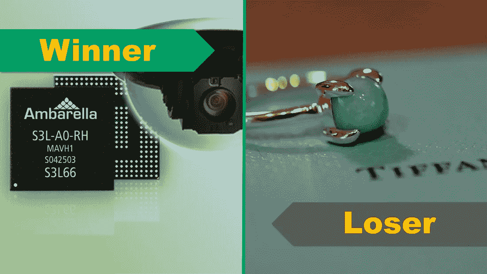

# 安巴雷拉赢了，蒂芙尼输了！两者都是中国的礼遇！

> 原文：<https://medium.datadriveninvestor.com/ambaralle-won-tiffany-lost-both-courtesy-to-china-700e6da81379?source=collection_archive---------30----------------------->

上周，我们生活在美中之间所谓的关税战中。毫不奇怪，中国成为本周最有趣的两个股市故事的燃料。对一家公司来说，中国正在改变命运。另一方面，这让它感到沮丧。​

**赢家:安巴雷拉公司(股票代码:AMBA)，上涨 19%**

在自 2018 年初以来损失约 42%的价值后，该公司耐心的投资者正在庆祝本周股价增长 19%。该公司是一家设计高品质、紧凑型视频处理芯片的公司。并且，GoPro 一直是其最大的客户。由于 GoPro 努力保持相关性，并超越仅仅是一种产品的奇迹，Ambarella 无法走出 GoPro 的阴影。本周，该公司宣布了其季度收益，隧道尽头出现了一丝曙光。它宣布了在汽车市场的首个重大胜利，以及与两家一级亚洲客户在计算机视觉系统芯片市场的新设计合同。那些顾客是谁？他们不透露姓名。我不怪他们。在这种激烈的、充满政治色彩的环境中，你对亚洲客户说得越少，吓跑投资者的危险就越小。看起来中国正在扭转该公司的命运。

[访问 Ambarella 的股票卡](https://stockcard.io/AMBA)

**输家:蒂芙尼公司(股票代码:TIF)，下跌超过 12%！**

蒂芙尼三分之一的收入都来自热爱奢侈品的中国顾客。本周，该公司宣布此类收入正在下降。而且，当投资者听说收入岌岌可危时，他们吓坏了。与本周初相比，蒂芙尼的股价下跌了 12%。该公司正计划对其纽约旗舰店进行大量投资，从历史上看，它一直能够保持其品牌认知度。对于奢侈品来说，他们的品牌就是一切。如果蒂芙尼能够让客户相信，拥有蒂芙尼品牌的珠宝显示了他们的上流社会地位，这种较低的股价并不是什么大不了的事情。

[访问蒂芙尼的库存卡](https://stockcard.io/TIF)

本期就到这里！如果你觉得这篇文章有帮助，别忘了鼓掌并分享给你的朋友！下周我们将看到另一版最激动人心的股票市场故事！

附言:如果你是一个初学长期股票市场投资者，这个视频系列是为: