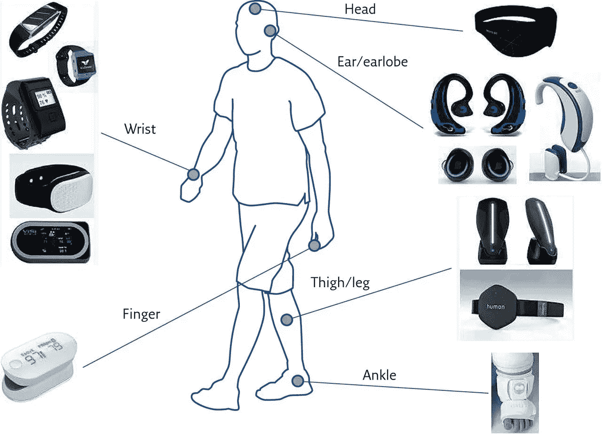
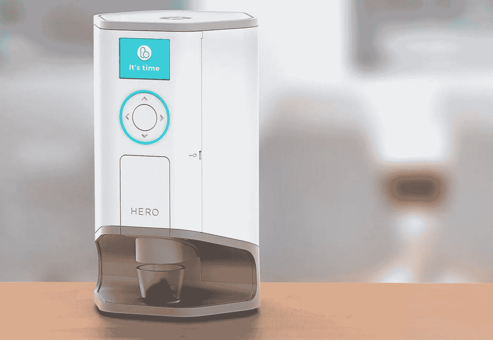
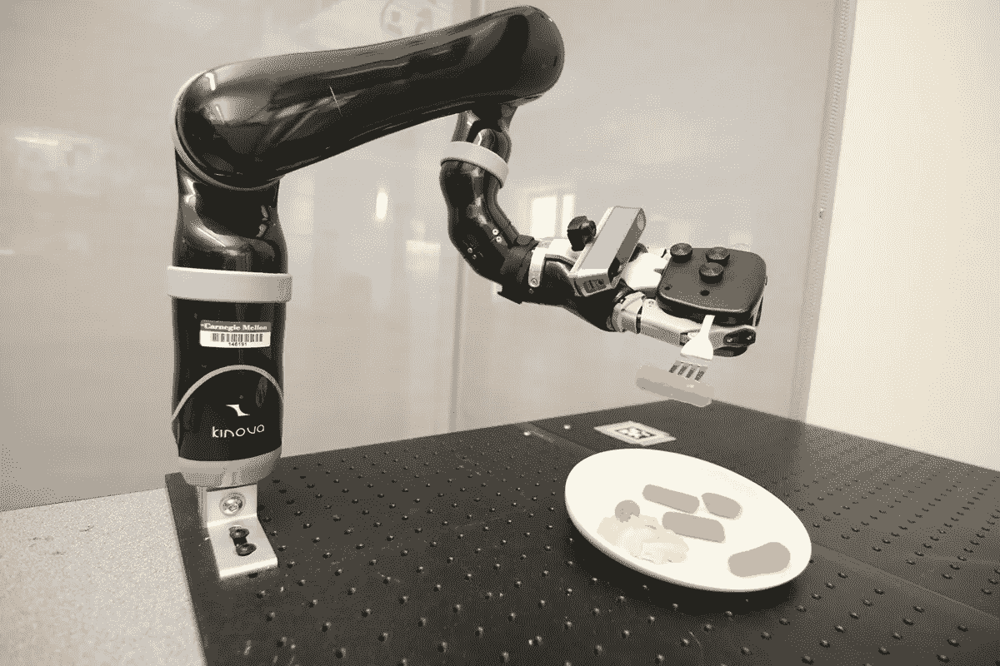

# 环境辅助生活:迈向智能生活的一步！

> 原文：<https://medium.datadriveninvestor.com/ambient-assisted-living-a-step-towards-a-smart-living-ea84a746affc?source=collection_archive---------14----------------------->

人是群居动物。他信奉合作相处，互相帮助，共同度过难关。他相信 ***“团结就是力量”这句话；*** 他生活的方方面面都遵循这个原则。

人类的进化经历了一个漫长的过程。人类最初是生活在野外的孤独个体，后来以家庭、社区、国家的形式生活在一起，现在整个人类是一个整体。

正是人类社会的这种社会结构赋予了这个种族 ***群居动物的称号。***

不管多么喜欢社交的人，仍然没有一个人愿意过依赖他人的生活。人天生具有独立的天性，因此总是在寻找方法使自己越来越独立，或者，你可以说，最少依赖他人。

在童年时期，一个孩子的所有需求都由父母照顾，我们没有多少办法让孩子独立。在青年时期，人处于巅峰状态，基本上可以独立做自己想做的事情。

问题是在生命的后期出现的，也是需要解决的地方。

随着年龄的增长，这个人变得越来越虚弱。他的健康恶化，他的免疫系统变弱，使他容易患各种疾病。很快，他的能量减少到需要外界帮助来完成甚至基本的日常任务的程度。

随着人口的增加，这种老年人的数量日益增加。这些老年人有各种各样的护理需求，但没有足够的卫生工作者来照顾他们。这意味着更多的家庭成员不得不承担非正式照顾者的角色。

为了应对这种情况，家庭成员、护理人员和卫生专业人员必须跳出框框，寻找一些创造性的解决方案，以完成确保老年人安全和健康质量的挑战性任务。

> 需要是发明之母

这种必要性催生了今天的**智能世界！**

今天的智能世界由智能家居设备、智能手机、可穿戴设备和软件应用组成，极大地影响了人类的生活方式。这些技术赋予了一个人很大的权力，从而大大减少了对他人的依赖。

这些智能技术不仅改变了生活方式，也彻底改变了人类生活的方方面面。

这些智能技术带来了**环境辅助生活(AAL)的概念。这就是我们对确保老年人生活质量这一挑战的回答！**

A**mbient Assisted Living(AAL)**提供一个由智能设备、医疗传感器、无线网络、计算机和软件应用组成的系统，用于医疗保健监控。AAL 可用于各种目的，如预防、治疗和改善老年人的健康状况。

**AAL 的目标是**确保老年人的安全和健康质量，延长老年人在自己喜欢的环境中独立生活的年数。此外，通过允许患者控制自己的健康状况，它减少了非正式护理人员的数量。

这方面的另一项新兴技术是**环境智能(AmI)。**它被定义为计算系统感知其环境并对人的存在做出反应的能力。

基于环境智能的系统被称为 **AAL 工具。**

有各种各样的 AAL 工具，每一个都有自己不同的应用。AAL 工具，如药物管理工具和药物提醒，允许老年人控制自己的健康状况。

AAL 科技还可以利用移动应急响应系统、跌倒检测系统和视频监控系统为老年人提供更多的安全保障。

其他 AAL 技术提供日常活动帮助，基于监测日常生活活动和发出提醒，以及帮助移动和自动化。

最后，这些技术可以让老年人更好地与同龄人以及家人和朋友联系和沟通。

**信息技术(IT)** 将 AAL 的概念推向了新的高度。在疾病管理中使用基于信息技术的系统使患者能够控制情况，从而降低医疗保健成本。

在这种情况下，他们的治疗将在家中进行，通过使用智能技术和设备，实时监测和评估关键数据，在必要时触发警报并提出建议。

家人和亲戚也将获得授权，因为他们将实时访问收集的信息。

今天，**智能手机**是我们生活中最常见也是最重要的元素。这些智能手机配备了各种传感器，如加速度计、陀螺仪、近程传感器和全球定位系统(GPS)，可用于检测用户活动和移动性。

**贴片、可穿戴设备、智能服装等形式的非侵入式传感器**(不涉及将仪器引入身体)也被开发出来，用于监测健康信号。

您可以使用红外传感、光学传感和示波器等技术，通过可穿戴传感器测量血糖、血压和心输出量。

此外，可以通过各种传感器对活动进行连续实时监控，例如，加速度计和陀螺仪捕捉加速度和方向。温度计可以用来追踪体温。

在老年，随着一个人的健康状况恶化，他或她必须依赖一堆各种各样的药物，当然是根据他们的健康状况。但是到了老年，由于要服用几种药物，人们往往会忘记每天的剂量。幸运的是，AAL 带着神奇的药丸分配器再次来拯救我们。

**药丸分配器**是在指定时间释放药物的装置。药丸分配器通常用于帮助个人在给定的日期和时间服用他们的处方药或每日补充剂。

药丸分配器包含几个隔间，在隔间中可以存储几种药物。当服药时间到了，该设备自动将预先测量的剂量释放到一个容易打开的小隔间中，并发出响亮的警报，表明该服药了。

如果患者不服药，药丸分配器将向监控站发送信号，监控站可以联系患者、家人或护理人员来解决这种情况。

AAL 成就的巅峰是**辅助机器人。**辅助机器人通过帮助老年人的日常活动，帮助他们克服身体限制，并使他们能够维持社交生活。这些日常活动可以分为三类:

**日常生活活动 **(ADL)****

**日常生活中的乐器活动****(IADL)******

******日常生活活动增强 **(EADL)********

********

******ADL** 任务包括自我维护活动，如喂食、穿衣、梳理等。ADL 辅助机器人有助于执行基本的 ADL 任务，例如，取回掉落的物体、检测和抓取家用物品、将老人或病人从床上或轮椅上转移。****

******IADL** 的任务包括在日常生活中使用仪器的能力，如使用电话、准备食物等。IADL 机器人协助它们各自的任务，例如，协助用户进行个人卫生、膳食准备/消费、购物和移动。一些机器人甚至可以用听诊器检查生命体征。****

******EADL** 任务包括参与社会活动，如从事业余爱好、社交等。与 EADL 相关的机器人帮助完成诸如爱好、交流和学习等任务。****

****EADL——辅助机器人分为服务机器人和陪伴机器人。服务机器人帮助人们与机器人互动。**伴侣机器人**通过扮演伴侣的角色来增强情感健康。****

****除了帮助老年人完成日常生活活动、IADL 和 EADL 任务之外，机器人还可能有助于监控、与技术互动、远程呈现，以及提醒老年人物体的位置或服药等任务。****

****目前的 AAL 系统为确保老年人的独立性以及实时监测他们的健康状况提供了许多机会。****

****不断发展的庞大技术世界使老年人在年老时继续过独立生活成为可能，从而使护理人员或家庭成员更容易跟踪亲人，而不必牺牲他们的整个生活。****

****然而，使用几个关键的新兴技术，如智能手机和可穿戴设备，辅助机器人，智能家居，智能服装已经使这个梦想成真；未来仍有许多挑战需要研究人员去解决！****

# ******参考文献:******

1.  ****[拉什迪和米哈伊尔迪斯(2013 年)。老年人环境辅助生活工具调查。 *IEEE 生物医学和健康信息学杂志*，【在线】17(3)，第 579–590 页。](https://www.cise.ufl.edu/~prashidi/Papers/JBHI2013.pdf)****
2.  ****[维基百科贡献者。(2017 年 11 月 26 日)。药丸分配器。在*维基百科，免费百科*。检索 2018 年 12 月 22 日 13:25，来自](https://en.wikipedia.org/w/index.php?title=Pill_dispenser&oldid=812133749)****
3.  ****[Costa R .等人(2009)环境辅助生活。Corchado J.M .，Tapia D.I .，Bravo J .(编辑)2008 年第三届普适计算与环境智能研讨会。软计算进展，第 51 卷。施普林格、柏林、海德堡](https://rd.springer.com/chapter/10.1007%2F978-3-540-85867-6_10)****