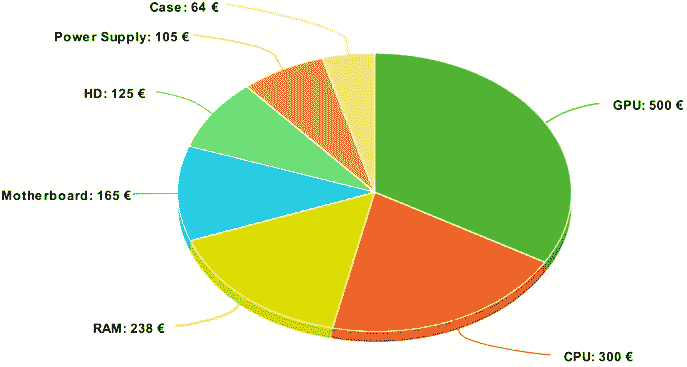
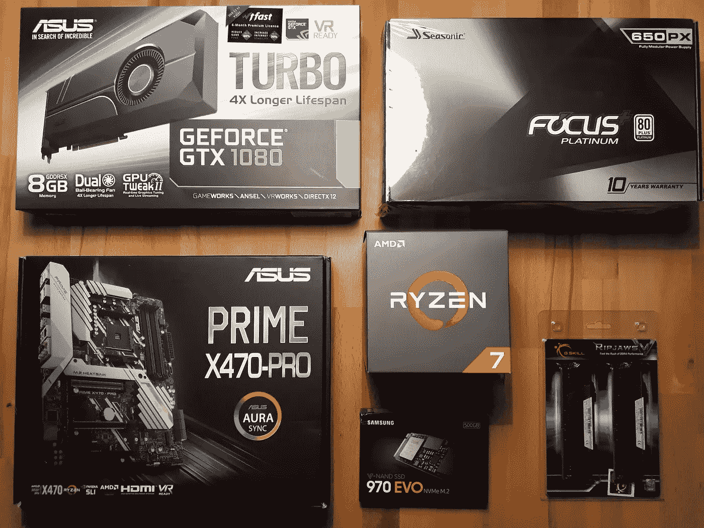
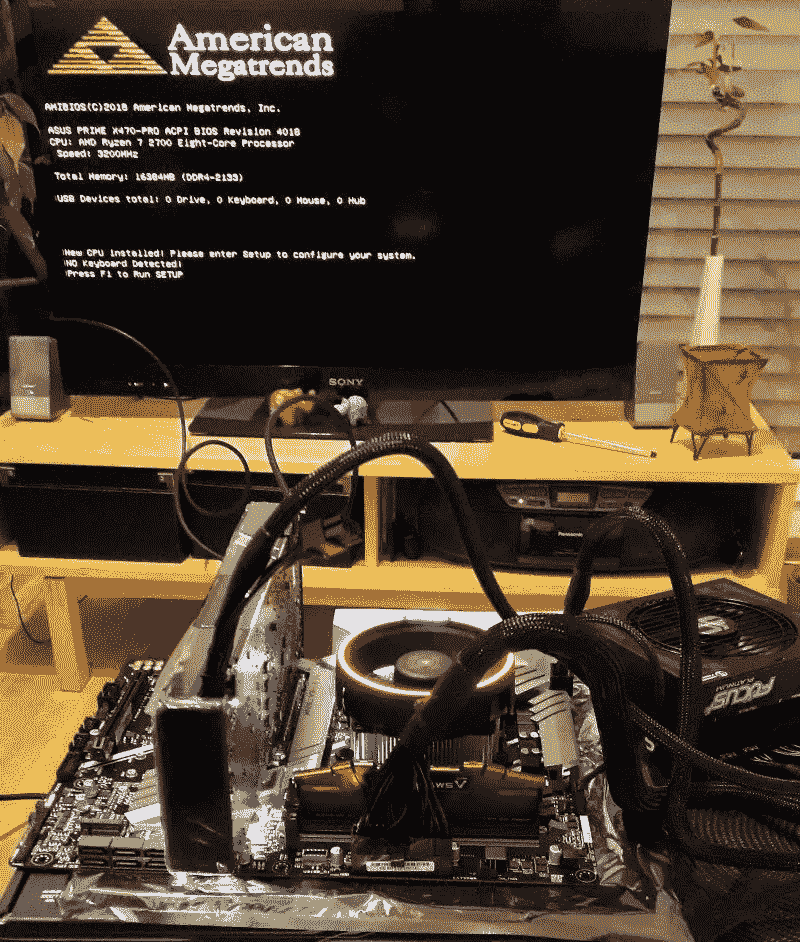
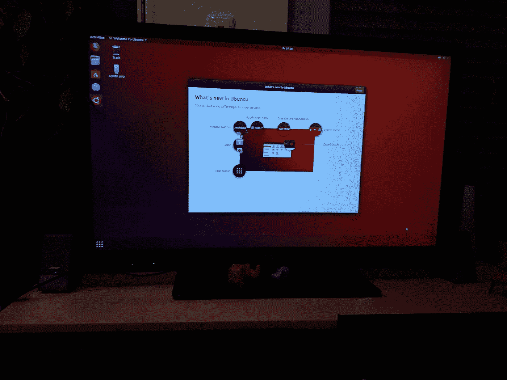

# 基于 AMD 锐龙公司的深度学习服务器构建

> 原文：<https://medium.datadriveninvestor.com/amd-ryzen-based-deep-learning-server-build-8fcd8f2139d7?source=collection_archive---------8----------------------->

[](http://www.track.datadriveninvestor.com/1B9E)

由于我还没有看到那么多基于 AMD 锐龙的构建(与基于英特尔的构建相比)用于深度学习，我想我应该用我的经验对社区做出贡献。我获得自己的深度学习服务器的动机与大多数发布了他们构建的深度学习/ fast.ai 爱好者类似:我从亚马逊 AWS 开始，这很好，直到我开始认真对待 Kaggle，并开始每月记下大约 140€的账单(包括偶尔的“忘记关机 EC2-instance”)。我决定走 AMD 的路，因为处理器-冷却器组合比英特尔的情况稍微便宜一些。我的目标是建立一个服务器，我可以从“任何有互联网的地方”从我的 MacBook Air 访问它。在接下来的内容中，我将描述构建所需的步骤，然后是基本的(可从家庭网络访问的)SSH 服务器设置。确保我的笔记本电脑在“任何有互联网的地方”都可以访问被证明是非常具有挑战性的，因为我的路由器位于 NAT 服务器之后，它只给我一个 ipv6 地址。因此，我将把这个话题留到另一篇文章中，一旦我自己尝试了一些东西。

所涉及的步骤与大多数构建博客相似，只是多了一个在案例中安装之前测试部件的步骤:

1.  选择组件
2.  测试组件
3.  安装硬件
4.  安装操作系统(Ubuntu 18.04)
5.  安装用于深度学习的驱动程序和库
6.  设置远程访问

## 选择组件

Tim Dettmer 的博客在感受“GPU 场景”和帮助决定如何选择其余组件方面非常有帮助。我脑海中挥之不去的几点是:

1.  先决定你的 GPU 需求，把大部分预算分配到这上面。GPU 速度决定了你的训练时间。
2.  CPU 在这里不是真正的主力，所以你不一定需要最快的。你也不要低估它，因为它在做数据扩充计算，这也有助于训练时间。
3.  RAM 很重要！能拿多少就拿多少。

我使用 PCPartPicker 来检查组件的兼容性。

我的零件清单:[https://de.pcpartpicker.com/list/dbhQBb](https://de.pcpartpicker.com/list/dbhQBb)
CPU:AMD 锐龙 7 2700 3.2GHz 8 核处理器
主板:华硕— Prime X470-Pro ATX AM4 主板
内存:G.Skill — Ripjaws V 系列 32GB(2x 16GB)DDR 4–2133 内存
存储:三星—970 Evo 500 GB m . 2–2280 固态硬盘
显卡:华硕— GeForce GTX 1080 8GB

我从 Mindfactory 购买了大部分组件，除了华硕的 Nvidia 1080 GPU(当时只在亚马逊上有售)和 K&M 电脑(德国这里的一家流行连锁店)的 CPU。



Approximate cost breakdown. Total cost 1497€.

我用我的电视作为显示器，家里有一个键盘和鼠标，我需要用它们来安装软件。我建议买一些热化合物，以防在建造过程中需要。

**测试组件**

零件花了几天时间才到达，当我得到所有的零件时，我显然渴望开始工作。在开始全面构建之前，我决定做一个没有用例的基本构建，以确保组件基本上工作正常。



The components are finally here! Hope it works!

我发现[JayzTwoCents](https://youtu.be/gHAelSOF6f0)的这个视频真的很有帮助。以下是步骤:

1.  将 CPU 固定在主板上。
2.  固定内存(我建议只固定一个棒，只在这一点上测试最低限度)。你应该会听到咔哒声。
3.  安装 CPU 冷却器。这可能是棘手的，因为它需要一个令人惊讶的大力量把它拧进去！这不太像宜家的建筑。在开始这一步之前，请慢慢来，因为你最好不要因为热粘贴等原因而再次这样做。我猜风扇有两个可能的方向。我用的是远离 RAM 插槽的带 AMD logo 的。考虑一下你希望风扇的电线如何连接到它的电源。如果你需要不止一次的尝试，你将需要重新申请热化合物。我用的是米粒法。
4.  安装图形卡。再次，等待“咔哒”声
5.  连接电源电缆。
6.  打开电源(主电源和 PSU)。
7.  打开主板。我需要在它上面短接适当的针。没有电源按钮。



Phew! The components work!

此时，CPU 冷却器风扇开始旋转，主板上的 led 灯亮起，最终显示正确硬件信息的美国大趋势屏幕让我松了一口气。

然后，我拆卸了除 CPU 和 CPU 冷却风扇以外的所有部件，并为最后的组装做好了准备。

## 设置硬件

我按照主板说明和海盗船案件说明进行了最后的设置，所以我不打算在这里重复这些步骤。需要注意的重要一点是，您希望首先将主板+CPU+冷却器单元(来自上面的测试版本)固定在机箱中，然后再固定其余部分。这应该很容易，现在你可以更有信心地做到这一点，因为你从上面的测试构建中知道，这些部分基本上是工作的。

## 安装操作系统(Ubuntu 18.04)

要做到这一点，你需要一个可启动的 u 盘，它可以通过从 [Ubuntu 下载页面](https://www.ubuntu.com/download/desktop)下载磁盘镜像来创建。我用的是桌面版。

转到 BIOS(重新启动时按 F2 或 DEL 键)并导航到允许您从可启动 USB 棒启动的选项。从那里来说轻而易举。不到 10 分钟，我就进入了友好的 Ubuntu 开始屏幕。



Welcome to the machine!

要获得最新信息，请在终端中键入以下内容:

```
sudo apt-get update
sudo apt-get upgrade
```

## 安装 GPU 驱动程序和 CUDA

Ubuntu 16.04 上似乎有很多东西，但 Ubuntu 18.04 上几乎没有。最后[这个帖子](https://askubuntu.com/a/1036265)来救场了。这就是我所需要的一切:

```
sudo add-apt-repository ppa:graphics-drivers/ppa
sudo apt-get update
sudo ubuntu-drivers autoinstall
```

然后重新启动，完成后，回到终端并键入:

```
sudo apt install nvidia-cuda-toolkit gcc-6
nvcc --version
```

## 安装 cuDNN

我使用了在 [SDK 文档](https://docs.nvidia.com/deeplearning/sdk/cudnn-install/index.html#download)中描述的 TAR 文件方法。遵循的基本步骤是:

1.  从 [Nvidia、](https://developer.nvidia.com/cudnn)
    下载 TAR 文件(注:我去了“存档的 cuDNN 版本”找到了与你的 CUDA 版本对应的正确版本。我想我有 CUDA 版本 9.1，这意味着我需要 cuDNN 版本 7.1.3)
2.  拆开 tarball: `tar -xzvf cudnn-9.0-linux-x64-v7.tgz`
3.  将这些文件复制到正确的 CUDA 目录并更改权限

```
sudo cp cuda/include/cudnn.h /usr/local/cuda/include
sudo cp cuda/lib64/libcudnn* /usr/local/cuda/lib64
sudo chmod a+r /usr/local/cuda/include/cudnn.h /usr/local/cuda/lib64/libcudnn*
```

## 安装 Anaconda

我遵循了文档中的 5 步安装说明，它就像描述的那样工作。我喜欢它包含了一个测试安装的方法:`conda list`。

## 安装 fastai 库

我按照 fastai [自述文件](https://github.com/fastai/fastai/blob/master/README.md#installation)中的 conda 安装说明(针对 GPU)进行了操作，正如我所料，在真正的 fastai 风格中，它运行得非常好:

```
conda install -c pytorch pytorch-nightly cuda92
conda install -c fastai torchvision-nightly
conda install -c fastai fastai
```

## 安装 OpenSSH

我运行这个命令来安装 OpenSSH 服务器:

```
sudo apt install openssh-server
```

为了配置 OpenSSH 服务器的行为，我使用了 [SSH 服务器文档](https://help.ubuntu.com/lts/serverguide/openssh-server.html.en)。我认为最好使用带密钥但没有密码的认证。很明显，还有很多东西可以定制和/或确保安全。

将密钥复制到正确的位置后，您就可以通过以下方式从家庭网络登录到您的服务器:

```
ssh <username>@<your_servers_local_IP>
```

获得`<your_servers_local_IP>`的一个方法是登录到你的路由器，检查哪些计算机用哪个 IP 地址连接。

现在您已经启动并运行了 SSH 服务器，如果它已经打开，那么至少可以从您的家庭网络**访问它。**

## 使服务器能够远程启动

局域网唤醒允许用户远程启动服务器(从家庭网络)。然而，这需要您的服务器通过**局域网电缆**连接到路由器。这里描述的步骤是。

注意:您应该使用`ifconfig`来找出以太网设备名称(及其 MAC 地址)。并不总是像大多数文章显示的那样。可能是类似 **enp1s10** 的东西。

在我的 MacBook Air 上，我使用的是 wakeonlan 应用程序，而不是上面介绍的 powerwake:

```
sudo apt install wakeonlan
wakeonlan <MAC-Address>
```

现在，您可以在家庭网络中通过笔记本电脑轻松打开服务器，一切都设置为远程工作。下面是使用 jupyter notebook 的最后一个注意事项。

## 设置 Jupyter 笔记本

要远程使用 Jupyter Notebook，您必须设置某种类型的端口转发。这里有一个简单的方法。这些步骤是:

1.  在服务器上，使用
    和`jupyter notebook —-no-browser --port=8080`运行 Jupyter Notebook
2.  在笔记本电脑上设置了一个隧道与:
    `ssh -N -L 8080:localhost:8080 <remote_user>@<remote_host>`
3.  在笔记本电脑上，进入浏览器并输入:`[http://localhost:8080/](http://localhost:8080/)`。您可能需要输入将从终端获得的令牌。

所以现在你应该准备好 kaggle 或者做你的人工智能原型。希望这篇文章能激励你继续自己的构建。我祝你好运，并期待听到成功的故事(和特质！)的其他版本。

## 其他激励因素:

[从头开始构建和设置您自己的深度学习服务器](https://towardsdatascience.com/build-and-setup-your-own-deep-learning-server-from-scratch-e771dacaa252)
[构建您自己的深度学习盒子](https://towardsdatascience.com/building-your-own-deep-learning-box-47b918aea1eb)
[价值 1700 美元的伟大深度学习盒子:组装、设置和基准](https://blog.slavv.com/the-1700-great-deep-learning-box-assembly-setup-and-benchmarks-148c5ebe6415)

# 来自 DDI 的相关帖子:

[](https://www.datadriveninvestor.com/2019/01/23/deep-learning-explained-in-7-steps/) [## 用 7 个步骤解释深度学习——数据驱动投资者

### 在深度学习的帮助下，自动驾驶汽车、Alexa、医学成像-小工具正在我们周围变得超级智能…

www.datadriveninvestor.com](https://www.datadriveninvestor.com/2019/01/23/deep-learning-explained-in-7-steps/) [](https://www.datadriveninvestor.com/2019/01/23/which-is-more-promising-data-science-or-software-engineering/) [## 数据科学和软件工程哪个更有前途？-数据驱动型投资者

### 大约一个月前，当我坐在咖啡馆里为一个客户开发网站时，我发现了这个女人…

www.datadriveninvestor.com](https://www.datadriveninvestor.com/2019/01/23/which-is-more-promising-data-science-or-software-engineering/)