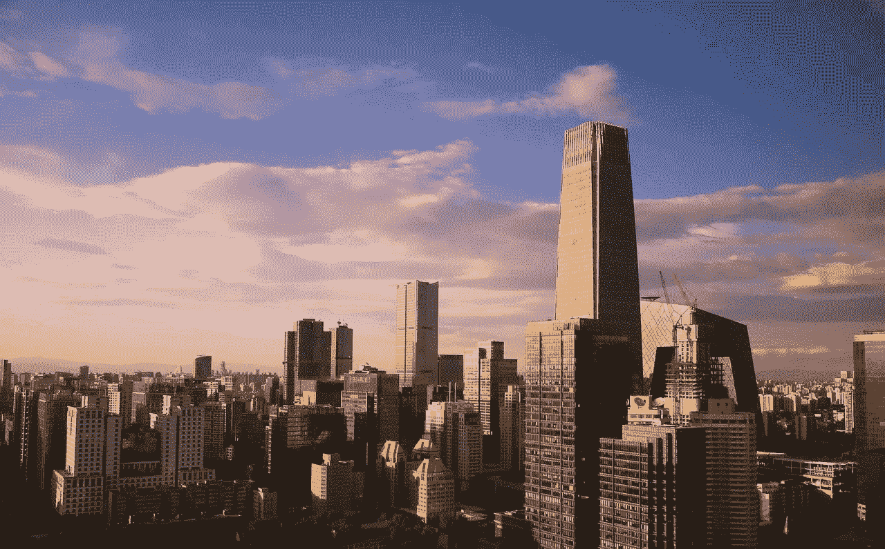
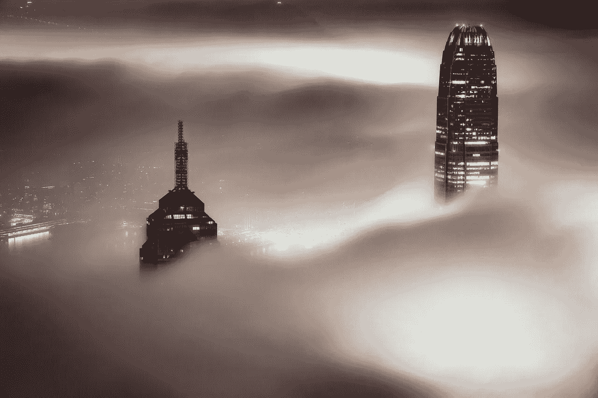
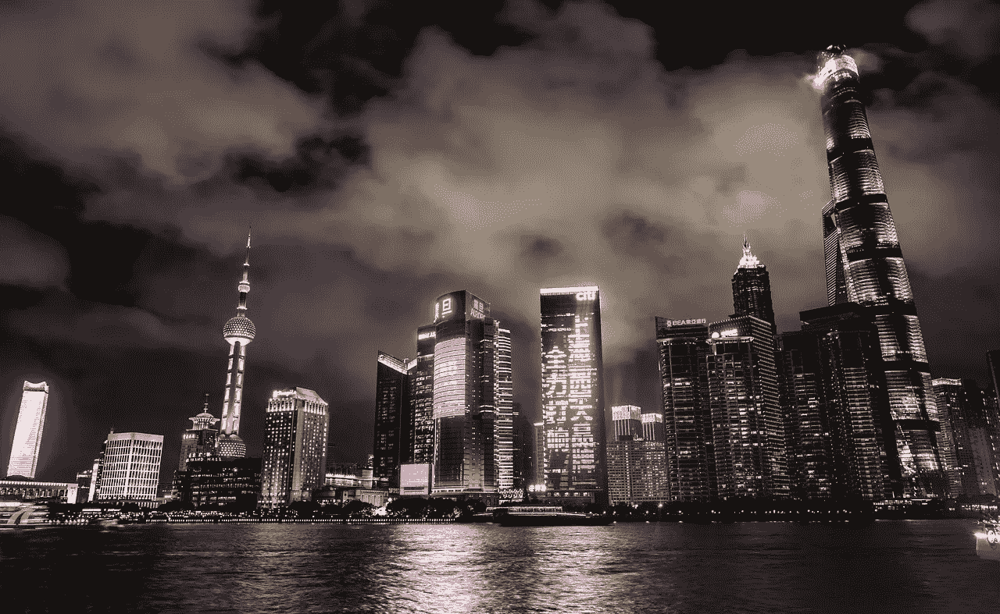
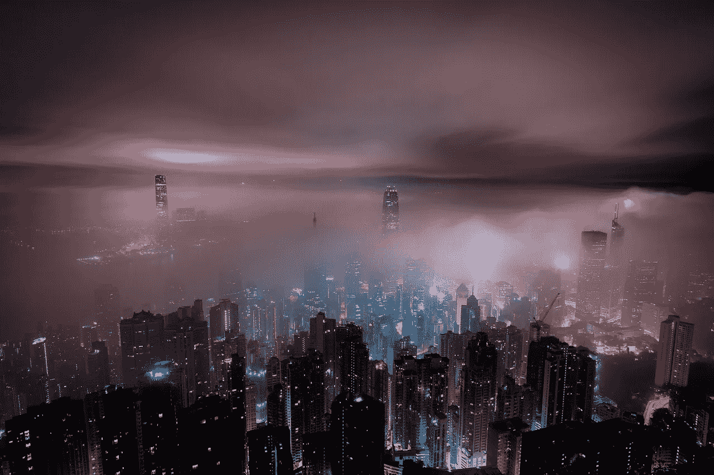
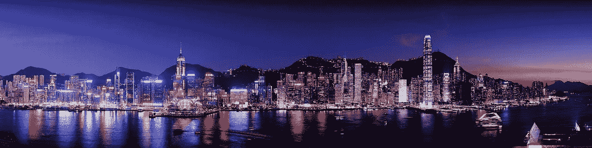
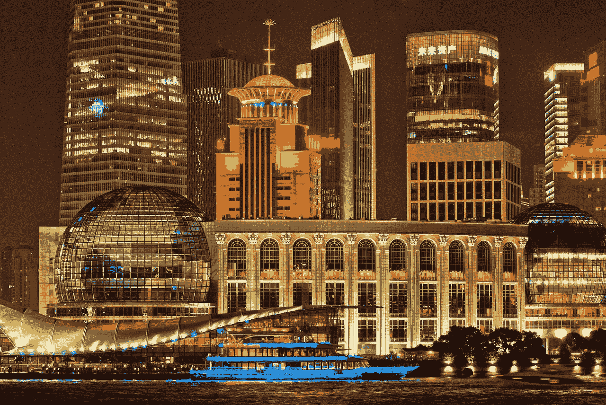
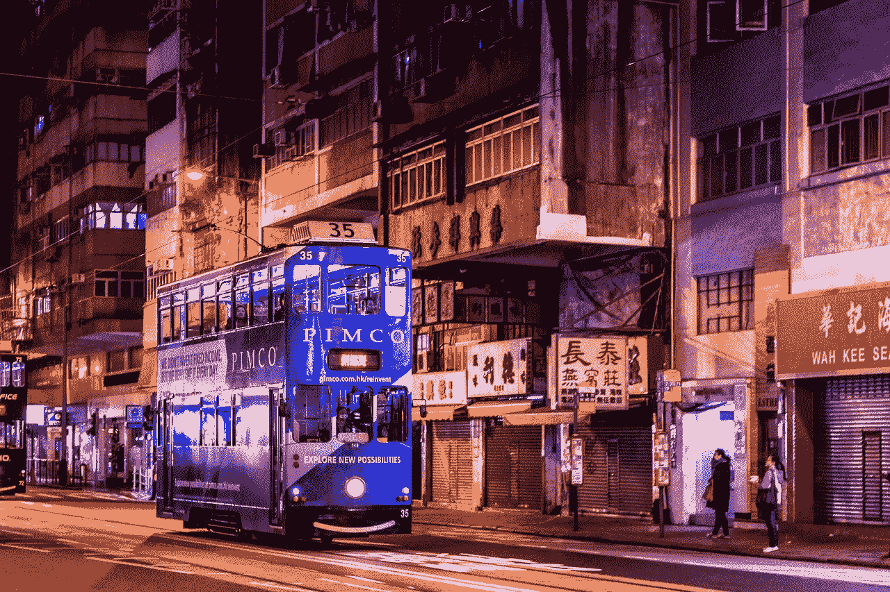

# 美国任由中国摆布，但我们的领导人还不知道——目前还不知道

> 原文：<https://medium.datadriveninvestor.com/america-is-at-chinas-mercy-but-our-leaders-do-not-know-it-yet-ec573fac4ce5?source=collection_archive---------3----------------------->

经济指标显示美国任由中国摆布。然而，美国的思想领袖对新的国际等级秩序一无所知。

例如，*外交政策*的“国际关系专家”不明白为什么特朗普政府拒绝对中华人民共和国实施制裁。事实上，*《外交政策》*甚至打出了标题“[神秘消失的中国制裁案](https://foreignpolicy.com/2019/04/11/the-mysterious-case-of-the-disappearing-china-sanctions/)”

 [## 为什么包容性财富指数比 GDP 更能衡量社会进步？-数据驱动…

### 你不需要成为一个经济奇才或金融大师就能知道 GDP 的定义。即使你从未拿过 ECON 奖…

www.datadriveninvestor.com](https://www.datadriveninvestor.com/2019/03/08/why-inclusive-wealth-index-is-a-better-measure-of-societal-progress-than-gdp/) 

然而，威尔·斯塔顿在最近的*数据驱动投资者* [文章](https://www.datadriveninvestor.com/2019/04/01/the-international-relations-debt-crisis/)中解决了这个神秘的案例。具体来说，斯塔顿写道，“通过在最合适的时机收回美国债务，中国可以终结美国实施国际制裁的能力。”

# **中国如何用债务控制美国**

为了解释，美国有 22.202 万亿美元的国债，美国债务时钟[估计](http://www.usdebtclock.org/)。与此同时，中国持有 1.13 万亿美元或超过 5%的美国联邦政府债务。事实上，中国是美国政府债务的最大持有者。

因此，中国人可以随时出售这些债务。此外，如果北京突然抛售所有美国债务，可能会破坏美国的信用评级，提高山姆大叔的借贷成本。

在最坏的情况下，美国可能无法借钱。因此，中国可能会迫使国会增税，这在美国无异于政治自杀。

显然，没有一位面临连任的总统想处理这个问题。因此，唐纳德·j·特朗普总统(纽约州共和党)搁置了所有制裁中国的计划。

# **中国经济超过美国**

中国摆布美国的力量正在增长；因为中华人民共和国的经济最早可能在明年超过美国成为世界最大经济体。具体来说，渣打银行的分析师预测中国的国内生产总值(GDP)将在 2020 年成为世界第一，*市场观察* [报道](https://www.marketwatch.com/story/us-economy-could-slip-from-top-spot-in-2020-and-keep-slipping-analysts-say-2019-01-14)。

此外，一个*视觉资本家*T2 预测显示，美国将在 2030 年成为世界第三大经济体。具体来说，*视觉资本家*预测中国将在 2030 年以 64.2 万亿美元的 GDP 成为世界第一。与此同时，印度将以 46.3 万亿美元的 GDP 排名第二，美国将以 31 万亿美元排名第三。

因此，美国可能在 11 年内成为二流经济强国。因此，当有人从故宫打电话来时，总统别无选择，只能非常友好。

最后，据市场观察[计算](https://www.marketwatch.com/story/chinas-trade-surplus-with-us-hit-record-in-2018-2019-01-13)，2018 年中国对美国的贸易顺差升至创纪录的 3233.2 亿美元。此外，2018 年中国对美国的出口额增长了 11.3%。

在这种情况下，对中国贸易的任何干扰都可能让美国经济陷入萧条。因此，特朗普不再在巡回演讲中提到中国，并将他的推文转向墨西哥移民。

# **经济战结束了，中国赢了**

合乎逻辑的结论是，经济战已经结束，中国赢了。然而，华盛顿和纽约的大多数美国领导人并不了解现实。

例如，特朗普政府中的极端民族主义新保守主义知识分子想要“粉碎中国”，哈里·j·卡齐亚尼斯在美国保守派*上声称。幸运的是，特朗普总统无视这种愚蠢。*

**

*然而，新保守主义者的好战表明了美国思想领袖所处的危险的交替现实。解释一下，美国领导人表现得好像现在是 1988 年，美国拥有全球。*

*例如，俄罗斯的威胁困扰着像 MSNBC 艺人雷切尔·玛多这样的左派人士；柏林墙倒塌 30 年后。事实上，*美国保守派* [指责](https://www.theamericanconservative.com/articles/how-rachel-maddow-turned-into-infowars/comment-page-1/)Maddow 散布荒谬的阴谋来证明她的主张。*

*与此同时，前特朗普顾问史蒂夫·班农正在组织一个智库，以促进与中国的冲突，美国保守派 [声称](https://www.theamericanconservative.com/articles/steve-bannon-declares-war-on-china/)。因此，班农希望美国对抗一个经济实力更强的国家。因此，特朗普将班农赶出政府也就不足为奇了。*

# ***对不起美国，这是中国的世界***

*像班农和马多这样的幻想家将不得不适应一个悲哀的事实，那就是这是中国的世界。美国人只是生活在那个世界里，越来越多地向中国支付租金。*

*比如，**；*令人上瘾的射击游戏轰动了美国年轻人的生活和思想，由一家中国公司持有 40%的股份。澄清一下，*堡垒之夜的*创造者 Epic Games 由中国科技和社交媒体巨头 [**腾讯控股**](https://en.wikipedia.org/wiki/Tencent) **(ADR: TCEHY)** 持有 40%的股份；与北京关系密切，信念资本研究[揭示](https://seekingalpha.com/article/4200438-fortnite-tencents-value-creation-work)。**

**此外，腾讯是世界上最大的游戏公司，其投资组合中有*英雄联盟*、*极品飞车*和 *FIFA Oneline 3* 等热门游戏。因此，年轻的美国人每次伸手拿游戏控制器时都要向中国支付租金。**

****

**在这种情况下，腾讯可能会封锁美国人最喜爱的娱乐节目，造成严重破坏。如果腾讯在总统选举前一周关闭堡垒之夜，年轻的美国人会如何投票？**

# ****美国作为英国****

**一个将从美国的困境中大笑的群体是英国人。英国人会笑，因为他们的国家在 20 世纪也经历过类似的从主导地位跌落的过程。**

**解释一下，1900 年，大英帝国是世界顶级军事强国，拥有最大的海军。就像今天的美国一样。然而，到了 1900 年，美国拥有了世界上最大的国内生产总值(GDP)。**

**BBC [报道](http://news.bbc.co.uk/2/hi/uk_news/7174996.stm)经济学家认为美国的 GDP 在 19 世纪 90 年代早期超过了英国。然而，直到 1899 年开始的[布尔战争](https://www.britannica.com/event/South-African-War)，英国精英们才意识到现实。解释一下，女王陛下的政府意识到它必须对美国友好；因为经济现实迫使英国借钱资助华尔街的布尔战争。**

# ****中国如何主宰美国****

**奇怪的是，英国衰落的一个结果就是现在的北美地图。在他有趣的书*中，Graham Allison 提到英国在布尔战争中给了美国大部分英属哥伦比亚的北部海岸线。***

******

***英国放弃了对领土的强烈历史要求；这包括朱诺号，因为他们需要美国的钱。为了澄清，西奥多·罗斯福总统(纽约州共和党)要求在加拿大的太平洋海岸划出一条狭长地带，以确保美国人能够进入克朗代克金矿。泰迪得偿所愿是因为英国人需要为他们的帝国买单。***

***鉴于这一历史，美国可以放弃其在菲律宾、中东、中亚和韩国的军事基地和盟友，以获得中国的资金和市场。总之，需要中国资金的美国总统可能会向北京做出一些令人难以置信的让步。***

# *****美国如何保护自己免受中国的威胁*****

***有一个策略可以让美国利用其经济实力来削弱中国的崛起。然而，这一战略不涉及关税、制裁或贸易战。***

***相反，美国可以利用硅谷、华尔街和好莱坞正在产生的现金来加强美国的经济地位。解释一下，美国可以增加对企业和富人的税收，并将部分收入投资于主权财富基金。***

***主权财富基金是一个为了国家利益将一个国家的部分财富进行再投资的机构。特别是，[主权财富基金](https://pitchbook.com/news/articles/what-is-a-sovereign-wealth-fund)像对冲基金一样运作；或者是风险资本家，把国家的钱投资到金融市场和商业中。此外，主权财富基金(SWF)投资于基础设施、研发、社会项目、教育和其他国家需求。***

******

# *****中国如何主宰金融市场*****

***毫不奇怪，中国也正在赢得主权财富基金的竞赛。中国投资公司，中华人民共和国的主权财富基金，以 9414.17 亿美元的投资额位居世界第二，主权财富基金研究所[计算](https://www.swfinstitute.org/fund-rankings/sovereign-wealth-fund)。***

***然而，中国领土上还有第二只主权财富基金，即价值 5093.53 亿美元的香港金融管理局投资组合。因此，中国有 1.45 万亿美元投资于两只主权财富基金。***

***因此，中国是主权财富基金的最大投资国；比挪威多了近 5 亿美元。挪威政府养老基金 9899.34 亿美元是最大的单一主权财富基金。然而，中国的主权财富基金储备轻松超过挪威——当你加上香港的时候。***

***具体来说，北京任命香港政府；控制香港金融管理局的投资组合。因此，中国共产党理论上控制着 1.45 万亿美元的投资。***

******

***因此，中国可以通过撤资来扰乱世界市场。事实上，中国人从证券和股票市场撤出所有主权财富基金资金，可能会导致全球市场崩盘。因此，数千万美国人的 401ks 可能在一夜之间变得一文不值。***

# ***主权财富基金可以保护美国免受中国的威胁***

***与此同时，美国没有主权财富基金，这使美国在与中国的竞争中处于严重劣势。例如，中国可以通过其两只主权财富基金购买美国国债。***

***因此，美国必须建立一个主权财富基金来保护自己免受中国的威胁。例如，一家美国主权财富基金可以买入美国国债，以抵消中国持有的美国国债。***

***重要的是，美国主权财富基金可以收购中国政府债务，抵消中国对美国债务的所有权。具体来说，中国人将害怕出售美国债务，因为山姆大叔可以出售他们的债务。***

******

***此外，主权财富基金允许一个国家通过投资外国股票或公司来展示其经济实力。例如，美国主权财富基金可以购买中国上市公司的股份；比如腾讯控股，给山姆大叔一些对那些企业的影响力。***

# *****富人如何削弱美国，增强中国*****

***创建一只美国主权财富基金将是困难的；因为建造一座这样的建筑需要美国的富人缴纳更多的税。***

***例如，皮尤研究中心[计算出](https://www.pewresearch.org/fact-tank/2017/10/06/a-closer-look-at-who-does-and-doesnt-pay-u-s-income-tax/)价值 200 万美元或以上的美国人支付 27.5%的有效税率。与此同时，据*贸易经济* [计算](https://tradingeconomics.com/france/personal-income-tax-rate)，法国公民价值超过 152，260€(172，046.19 美元)的要缴纳 45%的税率。有趣的是，法国目前的个人所得税税率处于历史最低水平。***

**然而，美国政客倾向于削减富人和企业的税收。例如，共和党在 2017 年将公司税率从 35%降至 21%。此外，公共诚信中心称，不缴纳所得税的美国公司数量从 2017 年的 30 家增加到 2018 年的 60 家。**

****

**因此，美国缺乏财政纪律可能会让美国很快沦为第二或第三等级强国。因此，美国领导人最好习惯生活在中国的世界里。美国任由中国摆布，因为我们的领导人拒绝为了国家利益利用美国的经济实力。**