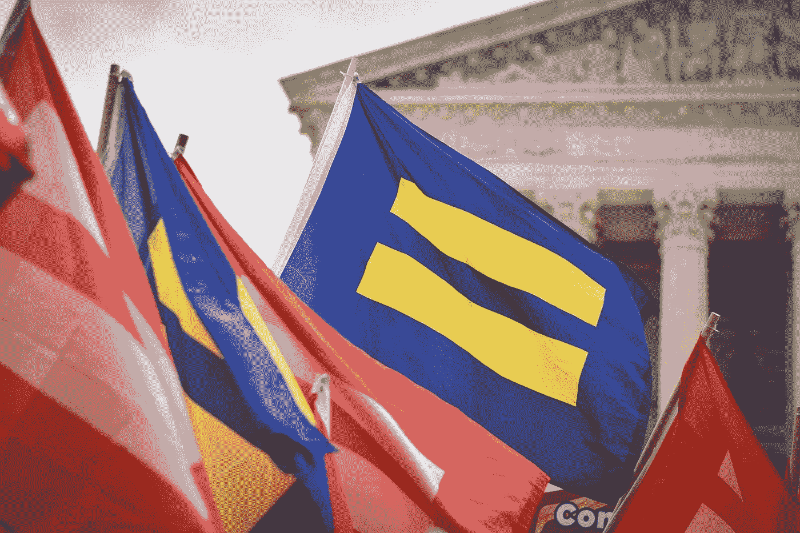

# 美国联邦法院系统具有危险的政治性

> 原文：<https://medium.datadriveninvestor.com/americas-federal-court-system-is-dangerously-political-754f0d9ea137?source=collection_archive---------4----------------------->

Photo by [Claire Anderson](https://unsplash.com/@claireandy?utm_source=medium&utm_medium=referral) on [Unsplash](https://unsplash.com?utm_source=medium&utm_medium=referral)

美国的政客们正不加掩饰地努力获取权力和影响力。纵观历史，这些追求经常会导致公众抗议和伦理法的通过。政治家还是有很多优势的。他们可以通过写书、授课赚钱，甚至从商业、房地产和投资中赚取某些类型的外部收入。然而，最高法院的法官们并没有受到公众对他们行为的监督。最高法院大法官的秘密生活经常被忽视，但在 2016 年斯卡利亚大法官在一个私人牧场去世时，这些秘密生活短暂地成为人们关注的焦点。一次后来被报道由身份不明的人或团体支付的旅行——他的住宿、食物、饮料、娱乐、旅行都免费提供给已故的法官。为什么政客们从外部捐赠者那里得到好处，而我们的最高法院大法官却没有，会引起公愤？我认为这是因为我们没有意识到法庭的真正政治性。

由于法官是由当选总统提名的，预计会涉及一些政治因素。然而，法院系统的政治化一直在稳步增长。在乔治 H.W 布什总统选择苏特法官进入法院后，苏特法官最终比共和党人希望的更加自由，两党总统开始对潜在的司法候选人进行测试，以确保他们的政治与自己的政治一致。在奥巴马政府期间，共和党人多次阻止奥巴马总统的司法任命，最终拒绝让加兰法官举行听证会，尽管他是在奥巴马总统任期结束前近一年被提名的。相比之下，特朗普政府在他上任的头两年里批准的法官比任何其他总统都多。特朗普和共和党人强调这是他们最大的成就之一。这些任命，再加上一连串的政治裁决，是美国法院系统变得多么政治化的明显迹象。

 [## 保护主义、政治和经济动荡|数据驱动的投资者

### 美国股市昨日出现 400 多点的大幅反转，为未来的事情发出了警告信号。市场…

www.datadriveninvestor.com](https://www.datadriveninvestor.com/2018/06/28/protectionism-politics-economic-turmoil/) 

美国的法院系统应该是非政治性的。法院的目的是根据法律做出裁决，而不是根据谁在游说他们或他们的个人信仰。随着美国政府各部门权力的分离，国会是否能在宪法上给法院设置道德标准就成了一个问题。但是最近，最高法院已经转变成一个非选举产生的国会，而不是一个无党派机构。特朗普总统允许他的最高法院候选人名单由联邦主义者协会(Federalist Society)亲自挑选，这于事无补。联邦主义者协会是一个代表全国极右翼政策的团体。

如果我们发现，就在影响这些公司的关键投票前几周，这些公司为国会议员提供所有费用支付的旅行，美国人会感到愤怒。但是现在，这正是发生在我们最高法院法官身上的事情。在审判前几周，代表案件进行辩护的团体正在支付正义的旅行费用。

Photo by [Matt Popovich](https://unsplash.com/@uh?utm_source=medium&utm_medium=referral) on [Unsplash](https://unsplash.com?utm_source=medium&utm_medium=referral)

宪法规定最高法院是政府的一个独立分支，但是宪法并没有赋予最高法院决定其他分支的行为是否符合宪法的权力。这是他们在马布里诉麦迪逊案中给自己的权力。然而，正如首席大法官罗伯茨在他的确认听证会上所说，如果最高法院有这种权力，那么他们就不仅仅是召集舞会和罢工了。他们的决定对美国人的生活非常有影响，因为他们废除或支持最大的立法。看看过去几年的决定。最高法院推翻了限制选举资金数额的法律，使美国在我们如何让公司和团体影响选举方面与世界其他国家相比成为局外人。仅仅在过去的二十年里，法院通过停止佛罗里达州的重新计票，限制患者保护与平价医疗法案，裁定支持同性婚姻，限制工会的权利，决定了 2000 年选举的结果。这些决定应该留给人民和他们在州政府和联邦政府中选出的代表来决定，而不是一个连广播他们的听证会都懒得广播的法院。

法院的政治化不仅仅是现任大法官的错，数百年来，法院也一直在做出超出最高法院原有范围的决定。首先，总统们挑选的候选人是政治老手，而不是我们国家最有司法头脑的人。克拉伦斯·托马斯被快速提拔为法官，并被要求担任最高法院法官，尽管他的大部分职业生涯都是在政治上而不是在法庭上度过的。我们最近的大法官 Bret Kavanaugh 是上世纪 90 年代建议弹劾克林顿总统的团队成员之一，后来在乔治·w·布什总统领导下的白宫任职，布什总统后来选择他为 DC 上诉法院法官，这一举动甚至在当时也被视为政治性的。

我早就认为最高法院并没有按照最初的意图运作，我相信情况越来越糟。我坚信废除学校种族隔离、允许女性在生殖健康问题上做出自己的决定以及允许所有人结婚是正确的。我只是不确定法院是否有权做出这些决定。我不认为法院有权决定是否可以限制枪支法，或者我们的医疗保健法的合宪性。本质上，我认为马布里诉麦迪逊案的判决是错误的。然而，我对法院会驳回这一决定不抱希望。我真正想要的是美国人开始关注最高法院，它努力保持低调。

我认为，最高法院应该受到更多的关注。他们应该公开他们的诉讼程序，并允许电视转播听证会，这样美国人就可以观看那些直接和显著影响他们生活的最大案件。我认为，法官不应被允许接受试图影响他们的公司和团体的礼物，至少他们应该报告他们去了哪里，谁为之付钱。我认为，美国人应该要求我们的法官不是政治操作人员，以确保他们根据法律而不是他们个人的政治信仰来决定案件。这意味着我们必须对我们的法院更感兴趣，并更密切地关注谁被选中。