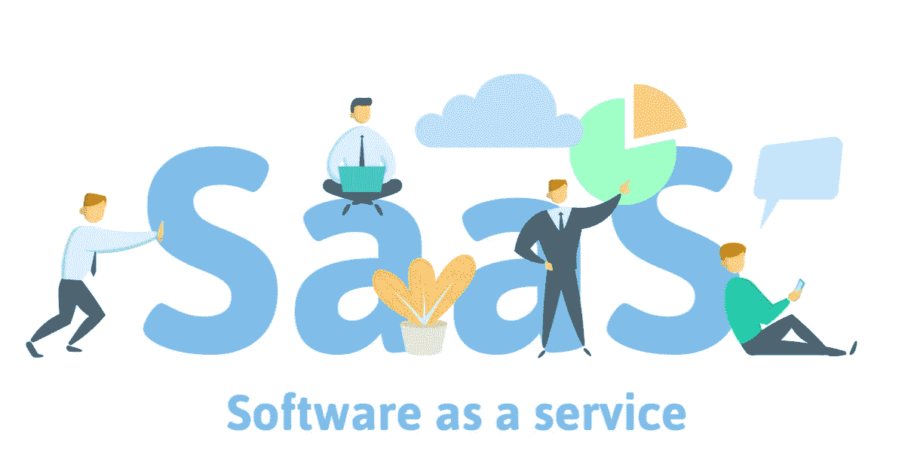

# 使用 SaaS 战略加快您 2020 年的业务增长

> 原文：<https://medium.datadriveninvestor.com/amp-up-your-business-growth-in-2020-with-saas-strategies-58e9fdc7bd1c?source=collection_archive---------12----------------------->

过去的十年经历了云革命的风暴。公司们争先恐后地染指云。虽然许多人花时间权衡了云的利弊，但一旦明白了，他们就争先恐后地争夺云，有些人是为了维持，有些人是为了获得竞争优势。

在这里，SaaS 带来了好消息。事实证明，它是帮助公司理解云设置的好处的一个交易撮合者。

根据统计数据，2020 年将是云计算的突破性一年。

> [到 2020 年，83%的企业工作负载](https://www.forbes.com/sites/louiscolumbus/2018/01/07/83-of-enterprise-workloads-will-be-in-the-cloud-by-2020/#49ea3b6d6261)可能会转移到云，预计 SaaS 市场今年也会膨胀，达到[1570 亿美元，是 2014 年的两倍多。](https://www.statista.com/statistics/510333/worldwide-public-cloud-software-as-a-service/)

虽然统计数据表明云只会向前冲，但 SaaS 尤其会在这场比赛中处于领先地位。

 [## 信息图:云之旅|数据驱动型投资者

### 聪明的业务领导者理解利用云的价值。随着数据存储需求的增长，就像过去一样…

www.datadriveninvestor.com](https://www.datadriveninvestor.com/2018/09/22/infographic-journey-to-the-clouds/) 

在深入探究 SaaS 将成为 2020 年最热趋势的原因之前，让我们先了解一下这个云模型。

# 了解 SaaS

SaaS 或软件即服务云模型很容易理解。这里，“即服务”一词意味着向客户提供某种服务。

什么事？

没问题。它是“软件”，从术语“软件即服务”中可以明显看出。

但是它与传统软件有什么不同和更好的地方呢？

好吧，为了回答这个问题，我们将不得不回到 SaaS 进入市场之前软件是如何被购买和使用的。

早些时候(2000 年的第一个十年)，要获得一个软件安装程序，你要么从互联网上下载安装程序，要么从商店购买光盘。此外，您不能直接将安装程序安装到电脑上。在安装之前，必须勾选 PC 配置的先决条件列表，例如存储、处理能力和附加软件驱动程序(因软件而异)。

对于企业来说，所涉及的努力和资金是前者的十倍。组织投入大量资金购买高配置计算机/硬件/服务器、大量数据存储和企业许可证。

SaaS 方案的出现省去了这一切麻烦。企业不再需要了解软件的技术规范。开始使用该软件不需要安装硬件。有了 SaaS，访问软件变得像登录你的电子邮件帐户一样简单。

# 定义 SaaS

简而言之，SaaS 是一种按需分发软件的方法或模式，它不是将软件下载到本地计算机上，而是通过互联网在 web 浏览器上进行访问。在这里，软件托管在第三方(服务提供商)的场所，而不是您自己的场所。

# 任何企业都不能忽视的五大 SaaS 优势

# 1.运营成本低

与内部部署系统不同，SaaS 模式不需要任何基础设施设置。这两个组织都没有被强制购买单独的软件许可证。在这里，前期基础设施成本被完全消除。

相反，系统会提示客户通过从可用选项中订阅合适的高级计划来注册软件访问。很少有服务提供商还根据组织需求提供定制价格。因此，使用该软件的成本被削减到最低限度。

SaaS 解决方案的一个主要优势是中途更换服务提供商的灵活性。与内部部署系统不同的是，客户不会一辈子只依赖一家服务提供商。他们可以中途中断服务，或者在需要时更换服务提供商。

例如，最初，公司可以订阅月度计划，最终可以根据使用情况和服务质量将其升级为季度或年度计划。

这种灵活性让企业大大松了一口气。以前，一旦购买了服务，更换服务提供商或终止服务是一项很难协商的交易。

# 2.易于设置

基于 SaaS 的云模型广泛流行的主要原因之一是易于设置。这种模式完全消除了基础设施在安装过程中的作用。客户不再需要为理解安装过程、了解技术规格、购买额外的硬件或安排额外的空间来放置硬件而烦恼。

在 SaaS 模式中，客户——组织或个人——只需要，

1.  订阅服务
2.  创建用户
3.  打开在线软件门户
4.  输入他们的用户凭据
5.  开始使用软件

这个过程就像登录你的社交媒体账户一样简单。

# 3.可量测性

以前，扩展基础架构的困难是企业发展的一大打击。每次企业计划扩展其系统时，他们都必须投入大量精力来采购新的基础架构，将其集成到现有的基础架构中，并暂停运行操作，直到系统成功扩展。

这不仅需要大量的时间和精力，而且集成到现有的基础架构中也是一件有风险的事情。如果在集成中没有遵循正确的过程和步骤，整个现有的基础设施可能会面临崩溃。

SaaS 模型控制着这种临界状态，确保在扩展过程中不会有任何损坏或破坏。SaaS 提供商在其实施了安全措施的数据中心拥有丰富的资源，因此，升级或缩减流程不会影响现有系统。事实上，云中的扩展过程要快得多，也容易得多。

# 4.集成和更新

SaaS 模式已经成功地打破了以前传统结构的孤立架构。为了实现这一点，它允许多个应用程序实时相互通信。信息在应用程序之间传输，以确保无缝和一致的流动。应用程序的集成非常有利于在单个流程中编织多个流程。它将努力优化到最小，结果优化到最大。

此外，在 SaaS 模式下，软件升级是自动化的。早些时候，该组织不得不手动搜索和更新已发布的错误修复和升级。但是有了 SaaS，所有的软件都会在云提供商端自动升级，而不会妨碍正在进行的工作或现有的信息。

# 5.远程连接

SaaS 应用程序因其远程连接特性而大受欢迎。如前所述，这些应用程序只需要互联网连接和一个设备(计算机/移动设备)就可以启动。这意味着用户可以随时随地访问他们的应用程序，而不必坐在座位上。

朝着这个方向前进，公司也在推出专用的移动或 iPad 应用程序。他们致力于为用户提供无缝、无障碍的远程连接体验。这对于动态的组织非常有用，在这种组织中，工作是在移动中进行的，而不是固定的设置。

# 五个 SaaS 解决方案成为头条新闻

每天都有许多 SaaS 玩家带着创新的目的进入市场。

通过从众多解决方案中选择最佳方案，企业可以利用这些 SaaS 解决方案来自动化不同的流程。

举个例子，

1.  [**sales force**](https://www.salesforce.com/in/)**是一个著名的 based CRM 应用程序，允许企业与其客户建立持久的关系。SalesForce 系统地积累和整理潜在客户和客户的信息，帮助企业识别新的机会。CRM 收集的信息便于客户服务团队更快、更有效地解决客户查询。**

**2. [**谷歌套件**](https://gsuite.google.co.in/intl/en_in/) 是一个完整的 SaaS 软件包，可以访问类似于 MS Office 的软件。这个套件包含了谷歌文档、谷歌表单、谷歌幻灯片等的组合。通过手机和台式机随时随地访问、编辑和共享文件。**

**3. [**Slack**](https://slack.com/intl/en-in/) 是一款协作软件，帮助团队指尖对准工作。它允许实时消息传递、存档、视频通话、文档共享等，以组织和管理公司的内部业务沟通。**

**4.[**Servetel**](https://servetel.in/)**是一款帮助企业与客户沟通的在线电话套件。它提供了一系列解决方案，将整个沟通过程集中在一个门户网站上。从精心制作 IVR 设计到路由、记录和分析所有电话，一切都可以在一个门户网站上完成。****

****5.[**Concur**](https://www.concur.co.in/)**简化组织中的差旅和费用管理流程。这种基于网络和移动设备的解决方案可以预订旅行计划，生成数字费用报告，并在工具本身上管理报销申请。使用该工具，公司节省了大量收集和提交报销账单的人工工作。******