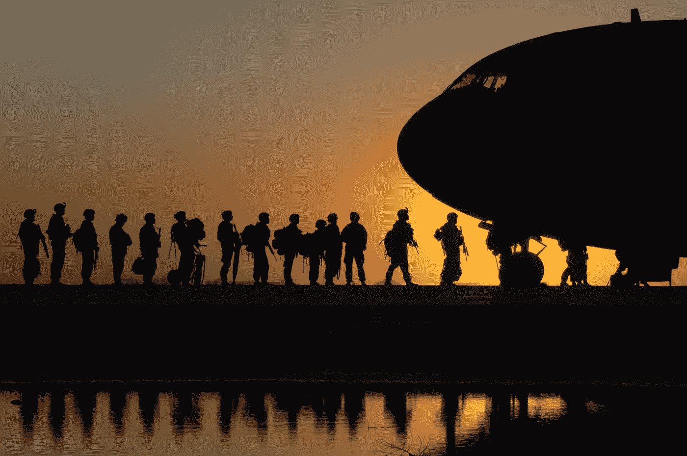

# 战争委员会里的 AI？为什么这在不久的将来不会发生。

> 原文：<https://medium.datadriveninvestor.com/an-ai-in-the-war-council-why-that-may-not-happen-in-the-near-future-8e1383d9dc76?source=collection_archive---------31----------------------->

**人的状况**

战争。

在普通人的脑海中，它会让人联想到鲜血、血块、钢铁和旗帜。几千年来，人类通过参与大规模冲突来实现战略目标。

今天，社会不赞成这种原始和灾难性的行为。然而，在人类历史的大部分时间里，战争是常态，而不是例外。军事领域的创新引领了其他领域的创新。从历史上看，军事技术比商业技术更先进、更有效。我们货架上一些最受欢迎的商品是战争的产物。此外，战争也塑造了杰出的思想家，如孙子、克劳塞维茨、库尔特·冯内古特等等。我们的社会是由战争建立的。战争塑造了我们的思想。我们的技术因战争而发展。

自从人类第一次组织军队以来的几千年里，人类已经逐渐放弃了祖先的生活方式。他不打猎。他不收集。他不种地。他不建造。他召唤，思考，发展。随着过去的工业变得自动化，人类用大脑解决问题，越来越多地将繁重的工作交给机械仆人。然而，他仍然发动战争。

克劳塞维茨的名言:“战争是政治以其他方式的延续”已经被历史教授、社会科学家和军事头脑所铭记。冲突已经渗透到经济、社会和政治领域，如果国家没有获得对军队的主权，这是不可能的。过去，军队统治着社会。现在，情况正好相反。财富是由经济活动产生的，而不是征服。繁荣是策略联盟的结果，而不是强迫。更自由、更开放的社会比孤立的城堡享有更高的生活水平。游戏规则已经改变。我们不再下我们祖先的棋了。游戏有了新规则，随之而来的是新方法。

**战争领域的人工智能**

大数据。机器学习。人工智能。这些流行语就像万圣节的糖果一样在企业界满天飞。私营部门的新技术令人兴奋。自动化是有争议的，但仍然令人兴奋。

1997 年，IBM 的深蓝在国际象棋世界冠军加里·卡斯帕罗夫的比赛中击败了他。通过原始计算能力，超级计算机能够“可视化”每个场景的 3 个步骤，并选择最佳的移动。这不是人类智力水平的例子。相反，深蓝利用其超强的记忆和速度来判断棋步并选择最佳棋步。

只要有冲突，新技术就主宰了战场。拥有先进武器的军队总是能战胜装备较差的敌人。战车艰难地穿过步兵。弹弓推倒了城堡。子弹让钢铁盔甲变得毫无用处。然而，决策方面的技术还没有让人类指挥官过时。一个 AI 能在人类会满意的高压环境下做出艰难的决定吗？为了理解人工智能如何在控制室发挥作用，我们应该首先掌握军事组织和决策过程。

**通过 MDMP 做出军事决策**

军事组织从公元前 2000 年开始发展。现代军事结构出现在 19 世纪末。军事参谋系统有三个共同的特点:训练人员的教育系统，指挥官授予的权力，由适当的人员执行命令，每个人履行指定职责的既定程序。

第二次世界大战期间，美国军队扩充到 800 多万士兵。随着供应链和员工手册规模的扩大和变得更加复杂，新的决策方法得以实施，以节省与德国人和日本人进行毁灭性战争的必要时间。

军事决策过程(MDMP)确保问题得到明确界定，最佳行动方案是经过深思熟虑而不是任意选择的。决策者使用分析和直觉来做决定。决策者依靠道德价值观，如真理、力量、善良和美学来指导行动。在压力下，决策者使用启发式方法——被定义为人类快速有效地解决问题的思维捷径。尽管启发法有助于我们的祖先在自然界的恶劣条件下生存下来，但在今天的现代社会中，它们会导致错误的判断。平民和战斗人员都在日常决策中使用流行的启发式方法。

人类在战场上决策的另一个关键因素是将事件发展和潜在结果可视化的能力，就像棋盘一样。此外，通过指挥链的执行必须顺畅。

在军队中有三种类型的计划:详细的、功能的和概念的。详细规划重在执行。职能规划支持物流并确保顺利运营。概念规划处理大规模的目标和目的。按照这种层次结构，规划还有另一个层面。承诺计划包括在特定的环境条件下，在短时间内准备资源。应急计划是指资源没有实际投入，并且存在很多不确定性。定向规划完全放弃了物理资源的使用，因为初步计划是为了应对各种各样的潜在情况而制定的。

这些是在冲突环境中使用的主要 MDMP 工具。为了在战争状态下取得更好的结果，军队必须加快决策过程。不幸的是，即使有更好的通信技术，人为因素将继续限制决策的速度。关键决策的另一个方面是优化。人类如何确保一个决策是帕累托最优的——这个选择不会让任何预期的一方比没有做出这个决策时“情况更糟”?人工智能有可能解决这两个问题。

**人工智能在决策者空间的潜在优势和劣势**

决策者盒中的人工智能可以被固有地编程或“学习”如何以比人类更快的速度遵循适当的 MDMP 协议。决策者将能够比官员更快地处理和适应大量数据，并获得更强的分析能力。人类和人工智能决策者之间的另一个区别是启发式。人类决策者对思维捷径的主要使用源于时间限制。人工智能可能会面临信息限制。尽管如此，由于其巨大的数据处理和分析能力，理论上机器在做出最佳决策时会有更好的衡量标准。然而，它需要理解什么是最优。可视化的人的方面和对目标的行动可能需要时间在机器上复制。想象一下，如果一个被编程为下棋的人工智能突然被扔进一场围棋比赛，然后是井字游戏。不断变化的条件和不断调整的目标是战争中区分征服者和被征服者的一个重要方面。

**不久的将来**

在过去的十年中，技术已经开始在军事环境中排挤传统的人类角色。发展正在进行中，以看到波浪冲击海岸线。在奥巴马政府期间,“捕食者”无人机被广泛用于打击巴基斯坦农村地区的武装分子。这种技术的使用是有争议的，原因有两个:它在击中目标时缺乏辨别能力，以及将人带出驾驶舱的概念。捕食者无人机发射导弹导致平民伤亡。大型爆炸是不精确的。随着无人机装备更好地选择性瞄准威胁，这个问题将会消退。另一个问题是需要从道德角度解决的。批评家们将驾驶捕食者无人机比作玩电子游戏，在游戏中，飞行员远离场景，不再需要考虑生命的危险。主要的论点是，通过机器人战争和人工智能开发的战略的创新，将人类从等式中完全删除，将使战争减少到像 MMORPG 一样的部落冲突。

现阶段，巴基斯坦和也门等国的无人机袭击已经减少，尽管更先进的军事技术正在全球范围内进行测试。世界上最大的两个大国，中国和美国，寻求在人工智能和军事能力方面占据主导地位，其他国家也加入进来，利用这种技术保持对地区对手的军事优势。

硅谷已经开始在战争环境中试验人工智能，尽管是间接的。为了在更真实的冲突环境中训练 AI，开发者转向了《星际争霸》等游戏。在这样一个实时环境中，快速思考主导着长期规划。启发式训练的重点是估算不同行动方案的成本，并迅速剔除最低效的方案。

适用于人工智能的高级启发式和决策方法将改变 MDMP，使其更适合具有超强计算能力的人工生命。

**活尸之火还是潘多拉魔盒**

从理论上讲，一个从决策箱指挥机器军队的人工智能将能够从基地控制每一个单位，因此将通信时间减少到接近 0。一个人工智能为一支包含任何战斗能力的人类的军队做出决策，将不得不根据不可预见的人类行动不断调整其策略。此外，沟通差距和结构化的指挥链将增加实施时间。增加了人工智能决策者的两支军队将如何行动？整个国家的命运会依赖于处理速度和计算能力吗？

我们可能在很长一段时间内都不知道答案。战争是人类的领域，尽管听起来很粗俗。

尽管战争的后勤、目标和准备落在棋盘的长期规划上，但战术进步、不断变化的环境条件和对手施加的情况取代了实时《MMORPG 星际争霸》提出的挑战，这是一个人工智能尚未成功通过的测试。战争是启发式的领域。最公式化的军事教科书都明白这一点。当高压情况出现时，战斗人员必须依靠数百万年的进化本能。尽管试探法在现代社会中会导致不利的局面，但潜在的心理捷径在战场上是至关重要的。没有一台机器不成功地模仿这一点，使它成为一名有能力的战斗指挥官。

目前，我们将不得不满足于阅读克劳塞维茨等人的著作，他们能够概括战争的不可预测性。对于他的开创性著作《T2 论战争》中提出的所有观点，他建议读者不要遵循一套为每种情况量身定制的规则或策略。有这种建议的不止他一个人。灵活性将是对人工智能战斗指挥官的真正考验。

尽管无人驾驶飞机将飞向天空，智能武器将增强士兵的能力，大量数据将提供关于国家敌人的关键信息，但战争自动化的批评者可以放心，在可预见的未来，战争将由人类决策者发动，就像人类首次制造武器以来一样。