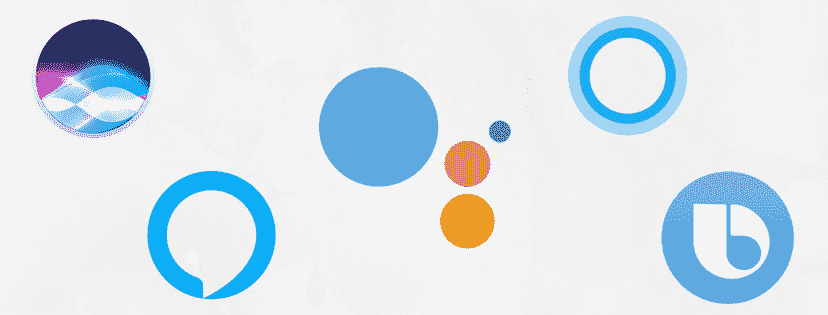

# 人工智能作家(写作和技术的融合)；

> 原文：<https://medium.datadriveninvestor.com/an-ai-writer-amalgamation-of-writing-technology-c7a2423118f?source=collection_archive---------2----------------------->

## 当今智能虚拟助手的幕后制作！

## “嘿 Siri”、“Ok Google”、“Alexa”、“Cortana”、“Hi bix by”……我们都被这些短语包围着，或者说 4 个人中有 3 个人是！(随机事实使这看起来很明显。)

By [Brooke Lark](https://unsplash.com/@brookelark?utm_source=medium&utm_medium=referral) on [Unsplash](https://unsplash.com?utm_source=medium&utm_medium=referral)

你是你生活的主人，你应该追随你的激情。所有其他基本的、平庸的或平常的事情都可以由你的个人虚拟助理来处理。从设置早上闹钟到拨打人性化电话，她都在你身边。

## 但是谁会支持她呢？

虚拟助手是一种应用程序，它可以使用语音命令或文本来帮助您完成任务。这些功能在大多数智能手机和独立设备上都可以使用，比如智能音箱。

[The tech giants rule the world of automation and more precisely, the data-ridden world.](http://cdn.shopify.com/s/files/1/0238/0391/articles/Untitled_design_2_1024x1024.png?v=1511215706)

## -互联网和人工智能。

没有互联网，这些基于云的设备是没有生命的。它们接收大量数据，并将其输入人工智能平台，包括自然语言处理、语音识别和机器学习。你是数据制造者，你为复杂的人工智能算法制造食物，以便更好地学习、处理、分析和预测用户的需求。

Data war?

虽然这些人工智能驱动的超级英雄通过变得更聪明和使我们的任务更容易来正确地完成他们的工作，但他们可能仍然会引起隐私问题，他们会洗耳恭听。但是我们不必担心，对吗？

*仅供参考，我们的数据能揭示什么？*

This doesn’t make a sense, ugh.

## 作家、记者、诗人和语言大师。

我们可以为这些软件工程师、开发人员和设计师的虚拟助手背后的惊人技术鼓掌，但幕后还有更多。喜剧演员、诗人、作家、记者和其他各种语言大师正在硅谷铺平道路。这些有助于在人工智能工具中构建人的本质。

由于这些虚拟助手与用户密切直接打交道，因此这些机器不要像机器一样，而是更加用户友好，这一点至关重要。聊天的能力可以基于提供给它的内容而被拟人化和个性化。包括人类术语“hmms”和“umms ”,使它听起来很自然。

We bring emotions and a humanly-essence.

# 一个机器人的生活故事。

人工智能作家需要建立机器人的个性。他们就像老师教孩子如何说话。即使是平凡的任务也需要创造性地去完成。机器人是角色，你必须制作剧本和笑点。

它不应该只是一个接受订单的机器人——根据谷歌的说法，谷歌已经从皮克斯和洋葱雇佣了作家。他们的工作是让助理听起来更像人类，而不像机器人。情感联系——这是他们需要的，也正是用户需要的！

作家的魔力不仅仅局限于谷歌。Siri 以机智风趣的回答著称。这显然不是由任何人工智能算法。一份[苹果公司的工作清单被发现](https://www.businessinsider.in/Apple-Is-Hiring-Writers-To-Give-Siri-More-Funny-Things-To-Say/articleshow/21441229.cms)，寻找可以帮助发展和丰富 Siri 的人。

是什么让 Cortana 变得很土？Cortana 的[个性团队由各种作家](https://money.cnn.com/2015/07/30/technology/windows10-microsoft-cortana/index.html)组成——文案、散文家、诗人、小说家、编剧和一些记者。所有的闲谈都属于他们的范围。他们想把它变成一个舒适区。

一个人不能离开 Alexa (Echo 醒来；关掉它！)后面。有各种内置的库，其中包括一些(*山谷对小山说了什么？你是多山的！令人捧腹的双关语和笑话。Alexa 命令列表[不会让你失望。](https://www.cnet.com/how-to/amazon-echo-the-complete-list-of-alexa-commands/)*

> 海洋对另一个海洋说了什么？
> 没什么，他们只是挥挥手。

哈。哈。哈。