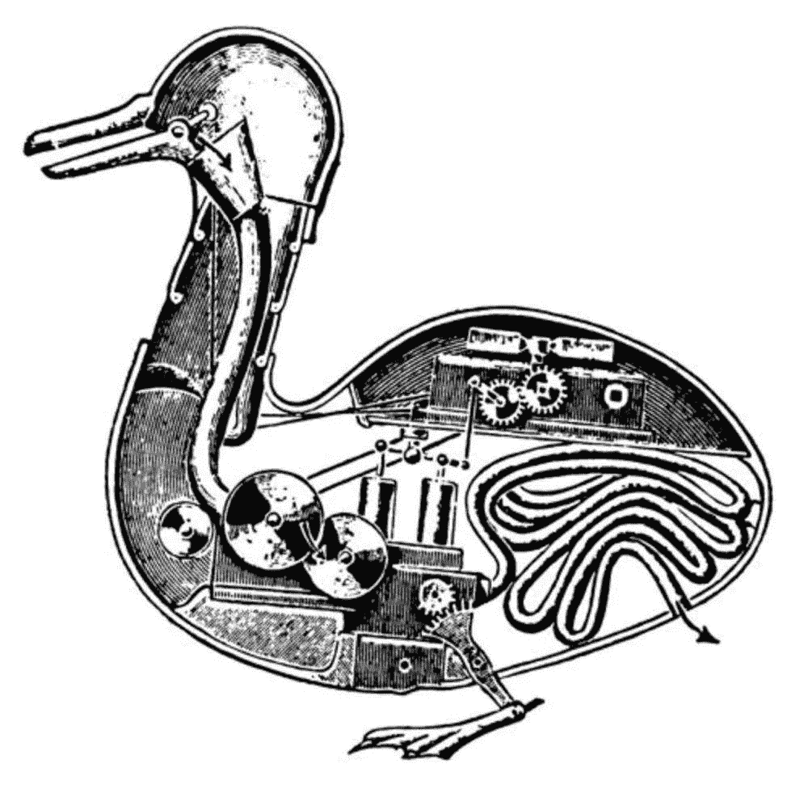

# 一个算法不会取代你的工作，它只是不会雇佣你

> 原文：<https://medium.datadriveninvestor.com/an-algorithm-wont-replace-your-job-it-just-won-t-hire-you-3707844e7545?source=collection_archive---------23----------------------->

在越来越多的行业中，每份工作申请都不是由人来审核的。你的下一次面试可能会由一个算法和一个活生生的有知觉的人的一点点帮助来决定。雇主使用简历算法来帮助[根据某些关键词或短语放弃](https://www.reuters.com/article/us-amazon-com-jobs-automation-insight/amazon-scraps-secret-ai-recruiting-tool-that-showed-bias-against-women-idUSKCN1MK08G)申请——远在人类能够审查它们之前。当然，这在大多数人看来是短视的。雇主可能很容易错过一个好的申请人，这相当于根据申请中的某个关键词将一份工作申请扔进了碎纸机。

简历算法决定以数字方式粉碎哪些候选人，决定保留哪些候选人；出现了很多问题。性别歧视？有了算法就简单多了。问问[亚马逊](https://slate.com/business/2018/10/amazon-artificial-intelligence-hiring-discrimination-women.html)就知道了。你可能很快就会问更多的公司——很有可能在不久的将来我们会听到类似的故事。

很少有人认为算法需要以一种没有偏见的方式来编写。大多数时候，程序员不会编写带有歧视性的代码。然而，设计考虑到无意偏差的算法，说起来容易做起来难。即使这很容易编程，仍然存在人类故意设计带有种族主义、性别歧视和歧视的代码的问题。

在一个致力于排斥的行业，就像致力于制造会造成无法量化的社会破坏的设备一样，这种代码似乎已经存在。我们只是还不知道。

目前，围绕人工智能和算法并没有太多的监管。特朗普政府确实启动了一项[倡议](https://www.washingtonpost.com/opinions/the-trump-administration-gives-a-needed-prod-on-artificial-intelligence/2019/02/18/5661a65e-30a5-11e9-8ad3-9a5b113ecd3c_story.html?utm_term=.f05cf0b2533e)来鼓励人工智能的投资和发展。然而，关于人工智能的法规却明显缺失。他的大多数内阁成员似乎都很享受歧视，这已经成为他们职业生涯的核心部分；几乎没有希望任何“标准”将实际解决歧视机器人的问题，这些机器人将越来越多地做出影响我们生活的决定。人工智能具有改善我们生活诸多领域的惊人能力——社会、政治甚至个人——但如果我们不制定某种政策指令或法规，人工智能更有可能只会让现有的社会不平等变得更糟。

如果人工智能列车之前没有全速加速，现在肯定是了。我们的目的地在一百英里外，刹车失灵了。