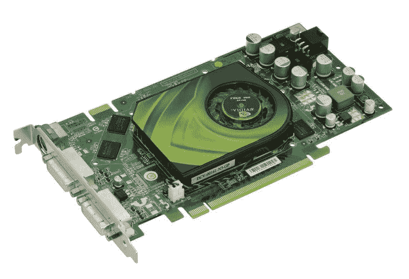
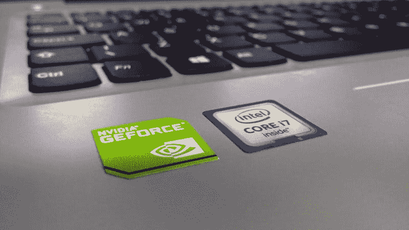

# FAANG 的替代品——市场疯人院

> 原文：<https://medium.datadriveninvestor.com/an-alternative-to-the-faang-market-mad-house-1f9941f229ff?source=collection_archive---------1----------------------->

除了自吹自擂的 FAANG 股票，可能还有更便宜的替代品。我称之为 [NAMPOF](https://marketmadhouse.com/nampof-an-alternative-to-fang-stocks/) ，我的选择提供了一些红利。

经典的 [FAANG](https://www.investopedia.com/terms/f/fang-stocks-fb-amzn.asp) 由**脸书(NASDAQ: FB)** ，**亚马逊(NASDAQ: AMZN)** ，**苹果(NASDAQ: AAPL)** ，**网飞(NASDAQ: NFLX)** ， **Alphabet (NASDAQ: GOOGL)** 或者 Google。

我不喜欢 FAANG，因为它很贵，因为只有 FAANG 股票；苹果支付股息。此外，我认为市场先生严重高估了三只 FAANG 股票；字母表，网飞和脸书。

# FAANG 定价过高

尤其是，FAANG 对许多投资者来说太贵了。以下是 2019 年 9 月 13 日起的价格。

*   脸书:187.19 美元
*   亚马逊:1839.34 美元
*   苹果:218.75 美元
*   网飞:294.15 美元
*   字母表 1240.03 美元(护目镜)

鉴于这些股价，2019 年 9 月 13 日购买一股 FAANG 的成本为 3，779.46 美元。另外，你目前只能从一只 FAANG 股票——苹果公司——获得股息收入。我认为，没有股息会破坏拥有一家现金充裕的公司的目的。如果一家现金充裕的公司不与你分享现金，那么持有这家公司的股票有什么意义？

也就是说，FAANG 有很多让人喜欢的地方。它的成员都是高增长的，并产生大量的现金。

# 我的替代法昂

我对 FAANG 的选择是 NAMPOF。NAMPOF 由**英伟达(纳斯达克:NVDA)** 、**苹果(纳斯达克:AAPL)** 、**微软(纳斯达克:MSFT)** 、 **PayPal(纳斯达克:PYPL)** 、**甲骨文(纽约证券交易所:ORCL)** 和**脸书(纳斯达克:FB)** 组成。

英伟达:181.94 美元

苹果:218.75 美元

微软:137.32 美元

贝宝:107 美元

甲骨文:53.75 美元

脸书:187.19 美元

NAMPOF 比 FAANG 便宜。例如，我估计在 2019 年 9 月 13 日，它的一个合并“份额”成本为 885.95 美元。

因此，你可以用一单位 FAANG 的价格购买超过四股 NAMPOF。说得详细点，876.46 美元乘以 4 就是 3543.80 美元。同时，FAANG 的合并成本在 2019 年 9 月 13 日为 3，779.46 美元。

请注意，这些成本将不同于实时股票价格。不幸的是，我不知道如何用实时股票价格不断更新文章。

# FAANG 的股息支付替代方案

有趣的是，NAMPOF 可能会支付 2.11 美元的总股息。这是四个支付股息的 NAMPOF 成员。

英伟达:64₵

苹果:77₵

微软:46₵

甲骨文:24₵

因此，每股 NAMPOF 可以产生 2.11 美元的股息。然而，FAANG 的一部分可以产生 77₵的股息，它在 2019 年 9 月 13 日的价格为 3，779.46 美元。

因此，我认为 FAANG 是一个伟大的成长股，但却是一个可怕的收益股。然而，我认为 NAMPOF 可能既是一个良好的成长股，也是一个不错的股息股。

# FAANG 的一些成长股替代品

FAANG 对投资者的主要吸引力在于其增长能力。增长很重要，因为增长会带来现金和收入。然而，没有现金和收入的增长对大多数投资者来说是无用的。

FAANG 正在急剧增长。斯托克罗认为，在截至 2019 年 6 月 30 日的季度中，脸书的收入增长率为 27.62%。然而，在经历了两个季度的收入增长下滑后，苹果在同一季度的份额为 1.02%。

亚马逊在该季度的收入增长率为 19.89%。网飞的收入在那个季度增长了 26%。最后， **Alphabet(纳斯达克代码:GOOG)** 同期收入增长 19.25%。

NAMPOF 提供了高增长率，因为它包含两个 FAANG 成员:苹果和脸书。与此同时，Stockrow 报告称，微软上一季度的收入增长率为 1.07%。在截至 2019 年 6 月 30 日的季度中，甲骨文的收入增长下降了 1.02%，贝宝的收入增长了 11.82%。

然而，NAMPOF 包含一家面临收入增长大幅下滑的公司 NVIDIA。例如，在截至 2019 年 7 月 28 日的季度，英伟达的收入增长率下降了-17.42%。然而，就在 2018 年 7 月 29 日，NIVIDIA 报告的季度收入增长率为 40.04%。因此，英伟达比任何 FAANG 股票都有更大的收入增长。

因此，我认为 NAMPOF 提供的收入增长水平可以与 FAANG 相媲美。然而，NAMPOF 的份额成本是 FAANG 总成本的四分之一。

# 这些非 FAANG 股票产生了大量现金

最后，我喜欢 NAMPOF 的股票，因为它们能产生大量现金。例如，PayPal 在 2019 年 6 月 30 日报告的自由现金流为 10.35 亿美元，融资现金流为 24.98 亿美元，运营现金流为 22.01 亿美元。

令人印象深刻的是，[微软](https://geekcrunch.reviews/will-microsoft-msft-make-money-from-github/)报告称，截至 2019 年 6 月 30 日，季度运营现金流为 521.85 亿美元，自由现金流为 120.57 亿美元。截至 2019 年 5 月 31 日，甲骨文提供的运营现金流为 145.51 亿美元，投资现金流为 265.57 亿美元，自由现金流为 40.09 亿美元。

令人难以置信的是，苹果在 2019 年 6 月 29 日报告的运营现金流为 494.81 亿美元，投资现金流为 466.94 亿美元，自由现金流为 96.36 亿美元。脸书报告季度运营现金流为 179.24 亿美元，2019 年 6 月 30 日自由现金流为 49.83 亿美元。此外，英伟达在 2019 年 7 月 28 日提供了 16.56 亿美元的运营现金流，50.4 亿美元的投资现金流和 8.23 亿美元的自由现金流。

# 这些方的替代品提供了大量的价值

NAMPOF 股票提供了很多价值。

例如，英伟达拥有 71.05 亿美元的现金和等价物；2019 年 7 月 28 日，短期投资 13.7 亿美元，总资产 141.87 亿美元。与此同时，PayPal 拥有 49.09 亿美元现金和等价物；66.72 亿美元的短期投资和 483.91 亿美元的资产。

截至 2019 年 6 月 30 日，微软拥有 113.56 亿美元的现金和等价物，总资产为 2865.56 亿美元。截至 2019 年 5 月 31 日，甲骨文拥有 205.14 亿美元的现金和等价物，173.13 亿美元的短期投资和 1060.13 亿美元的总资产。

令人印象深刻的是，苹果拥有 505.30 亿美元的现金和等价物；2019 年 9 月 10 日，短期投资 440.84 亿美元，资产 3222.39 亿美元。此外，截至 2019 年 6 月 30 日，脸书拥有 138.77 亿美元的现金及等价物，347.19 亿美元的短期投资，以及 1170.06 亿美元的总资产。

因此，我认为如果你投资 NAMPOF，你的钱会有很大的价值。更重要的是，市场先生目前低估了 NAMPOFs，使它们成为典型的价值投资。

# NAMPOF 比 FAANG 更安全、更多样化

特别是其中两个 NAMPOFs 苹果和微软是老牌科技品牌公司。史蒂夫·乔布斯和他的公司在 1976 年创立了苹果公司；例如，比尔·盖茨在 1975 年创立了微软。

同时，NAMPOF 公司经营各种业务。PayPal 从事金融服务，甲骨文从事商业软件和金融技术。[苹果](https://appleinsider.com/articles/19/09/11/apple-becomes-trillion-dollar-company-once-again)是一家设备制造商，正在进军娱乐和金融服务领域。

[微软](https://marketmadhouse.com/is-microsoft-the-best-value-in-tech/)提供各种各样的软件、云服务、设备和视频游戏。NVIDIA 是一家深入参与人工智能、游戏、基础设施和游戏的芯片制造商。

此外，[脸书](https://geekcrunch.reviews/facebook-fb-is-a-value-investment/)是一个社交媒体帝国，正在大量投资金融服务、金融科技、[加密货币](https://geekcrunch.reviews/can-telegrams-ton-compete-with-facebooks-project-libra/)、[区块链](https://libra.org/en-US/)和[虚拟现实](https://www.facebook.com/business/news/insights/how-virtual-reality-facilitates-social-connection)。因此，没有哪一个 NAMPOFs 是固步自封的。这导致未来的增长和更多的钱。

此外，[脸书](https://geekcrunch.reviews/facebook-fb-is-a-value-investment/)是一个社交媒体帝国，在金融服务、金融科技、[加密货币](https://geekcrunch.reviews/can-telegrams-ton-compete-with-facebooks-project-libra/)、[区块链](https://libra.org/en-US/)和[虚拟现实](https://www.facebook.com/business/news/insights/how-virtual-reality-facilitates-social-connection)方面投入巨资。因此，没有哪一个 NAMPOFs 是固步自封的。这导致未来的增长和更多的钱。

*原载于 2019 年 9 月 14 日*[*https://marketmadhouse.com*](https://marketmadhouse.com/an-alternative-to-the-faang/)T22。