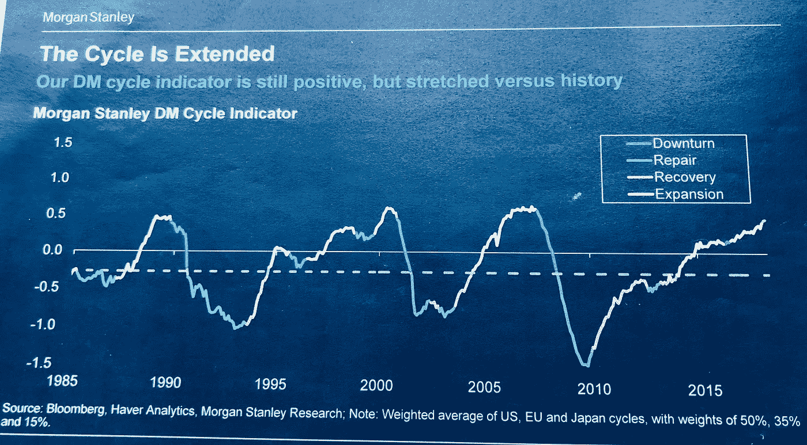

# 对当前经济周期的另一种观点——以及如何应对

> 原文：<https://medium.datadriveninvestor.com/an-alternative-view-on-the-current-economic-cycle-and-what-to-do-about-it-aa4b42f579bb?source=collection_archive---------9----------------------->

Thanks to Christine Roy on unsplash.com

你是否花时间思考寻找完美投资机会的方法？如何避免麻烦和拥挤的交易？如何发现全球经济的现状和未来？理解**我们在全球经济周期**中所处的位置是一个很好的起点。问题是去哪里寻找价值。

上周，我在巴西和乌拉圭进行投资者之旅，会见了 30 多家投资公司。大多数人会告诉你，我们在这个周期中“迟到了”。美国、欧洲和亚洲的许多专业投资者和经济学家都会同意:大金融危机结束已经 9 年了，随着一场大衰退和市场崩盘的出现，当前的周期将在某个时候不得不停止。很快。“因为扩张太久了”。

Source: Morgan Stanley, 2018 (a mediocre pic from my iphone)

是真的吗？五个数据点可以帮助找到答案。

***

**1。成长**

在经济周期的后期，增长是有弹性的，但峰值增长已经过去。今天看起来会发生什么:全球增长继续保持强劲，今年将增长+3.7%(即使与之前的估计相比仅下调了 0.1%)，明年将增长+3.7%(国际货币基金组织数据，2018 年 10 月)。增长是由全球更强劲的消费者、更强劲的企业投资和公共支出推动的。这通常是一个对股票有利的环境，但几乎所有的股票市场都下跌了(标准普尔 500 和巴西的 Bovespa 指数是一个明显的例外)。不解？

**2。中央银行**

在周期的后期，央行通常会加息，以减缓过热的经济。通胀率上升吞噬了实际收益机会和投资回报，同时让人们的消费变得更加昂贵。这对债券投资者来说是负面的，从技术上来说，他们通过降低投资组合的“久期”(从而降低利率风险)来降低风险。对股票来说，这可能是好的，也可能是坏的，取决于具体情况。

尽管许多央行(美国、印度尼西亚、印度、菲律宾、阿根廷、土耳其……)事实上正在加息，但通胀仍处于低位，目前还不是问题。那么，央行为什么要加息呢？两个潜在的原因:1)强劲的经济增长，比如在美国(其目标是温和地冷却非理性行为——例如借入太多容易获得的廉价资金，然后将其投资于非生产性项目或过于昂贵的资产)或 2)在新兴市场捍卫贬值的货币(我们将在另一个时间讨论这一机制)。

我们今天并没有严格观察到一种典型的周期后期行为，而市场共识(即大多数投资者)认为情况正好相反。这里正确的策略可能是“是”,通过降低投资组合中的总利率期限来降低对利率的敏感性，模仿市场的其他部分(你永远不知道，最好小心并保护你的投资),但同时——在明显不一致的情况下——增加对特定期限领域的敞口，从而提高利率，这是央行政策变化已经触及的领域，也是其他投资者逃离的领域。市场卖得越多，这类资产的价格越低，预期收益率或收入越高，长期提供的资金就越多。

例如，在 2018 年夏天购买美国国债曲线的短端(到 5 月/6 月，美国曲线的较陡部分已经预计到今年美联储可能加息 4 次)是一个很好的交易:所有投资者都远离其他资产类别，转向曲线的较长端(期限超过 5/6 年)，以便较短端(1 至 5 年)更便宜，更有价值。

**3。财务状况**

在周期后期，随着风险加大，银行通常会缓慢减少对公司(和家庭)的信贷。这种情况在今天并没有发生，因为信贷在全球范围内仍然广泛存在。全球大多数经济体的金融状况依然宽松。我们不应该期待很快会出现一波公司违约潮(他们的股票和债券正在贬值)，这是个好消息。

但这也可能是坏消息。一方面，如果从这个角度来看，我们在经济周期中“不晚于预期”(好)，当银行和金融市场继续向已经负债的不值得的公司和家庭提供宽松信贷时，他们可能会引发下一场金融危机(坏)。

**4。杠杆**

在周期的后期，公司确实发现快速增长的机会变少了，因此从有机增长转向无机增长(很多 M&A)。就在我们打字的时候，它正在发生。此外，公司增加了债务，即增加杠杆，因为它们寻找新的资源投入工作，以跟上预期的增长率。杠杆越高，公司的风险越大，投资者就应该越愿意接受风险补偿。

观察明显不一致的投资者行为非常有趣，因为今年表现最好的风险资产之一是美国高收益债券(风险较高的公司在美国市场发行风险较高的债券)。这个市场主要由美国国内公司组成，这些公司的杠杆率达到了 2008 年以来的最高水平(高风险！)随着投资者薪酬的下降。我的意思是，投资者似乎乐于承担更大的风险，并为这种风险获得越来越少的回报。

又迷惑了？从历史标准来看，这一资产类别似乎很昂贵。如果我们看看过去 20 年的数据，似乎信贷息差(投资者给这些公司的资金补偿)比现在更昂贵，只有 20%的例子。你需要相信，我们正处于过去 20 年来最好的五分之一经济时期，才能以如此高的价格买入。但是，我们不是都认为我们在周期的后期吗？

如果估值很高，并且如果我们认为价格上涨并不像人们认为的那样是由美国高收益宇宙的质量(或与表现良好的美国股票正相关)决定的，而是由这些债券在过去 10 年中最大的供应短缺之一决定的(事实！)，那么我们可以证明市场反弹背后的原因，也可以证明今天是一个降低风险和敞口的绝佳机会。或者只是从外部观察这一资产类别。

**5。市场价格**

非常昂贵的金融市场总是决定后期经济周期的关键。投资者发现回报递减，于是将资金投入到定价过高的资产中。类似地，投资者从深陷困境的地方逃离，在某些时候，在这些地方建仓极其方便。如何定义贵或便宜是投资界的日常工作，我这里没有公式。但是有两个有趣的例子来讨论市场上的机会——或者没有。

例 1 —美国股市自 2009 年以来表现良好，并继续战胜地心引力。通过查看历史指数价格图表，它似乎非常昂贵(涨，涨，涨——处于过去 90 年来最昂贵的水平)。查看截至 2018 年 9 月底的 YTD 数据，S&P500 的表现超过+7%，现在到 2018 年 10 月中旬(在几个疲软的交易日之后)，仍为+3.5%。该卖了？太贵了？也许是的。但是，如果我们同意这个市场的公司收益每年增长 20/25%会怎么样呢？业绩是否大打折扣？也许是的。

Thanks Eduardo Sanchez on unsplash.com

示例 2 —阿根廷和土耳其正因为不同的原因遭受两种不同的经济和金融危机。阿根廷正在进入衰退，而土耳其的增长与 2017 年相比明显放缓。它们与本帖讨论的后期循环扩张主题无关。中央银行大幅提高了利率(土耳其的利率水平是 24%，阿根廷是 60%——相比之下，欧洲是 0%！)导致当地债券市场损失惨重。随着国际市场对这两个经济体失去信心，它们的货币大幅下跌。此外，当地股票市场交易处于负值区域，但相对于历史趋势，估值仍然很高。主流投资者通常会远离这些故事，直到信心得到重建。现在让我问你:世界上有多少经济体和金融市场能给你提供大约 10%的实际利率？像阿根廷那样 20%？

***

值得一提的是，我个人认为美国和中国经济似乎在这个周期中处于后期，而欧洲、日本和大多数新兴市场并非如此(合起来约占全球经济总量的 40%)。名义 GDP 占全球经济的 60%)，要么央行仍然非常宽松，要么增长超过峰值，要么公司负债较少。这个周期何时结束更难把握。

更重要的是，现在应该很清楚，找到锚来为我们自己的宏观经济分析提供清晰性——例如我们在周期中的位置——与拥有一张 **地图告诉你你现在在世界的哪个位置**一样重要。这是一个关键的起点。但仅凭这张地图并不能帮助你找到实现目标的正确途径，也就是说，随着市场的变化，哪些投资机会似乎更有回报。**我们需要添加几个覆盖图**——从需求和供应动态到投资者定位，再到基本面和当前估值— **来创建一个更好的地图，为你提供到达你想去的地方的最佳路径。**

这是经济学家和专业投资者在资本市场领域工作的挑战和美妙之处。有一些事情可以让它变得更简单和清晰，我们正在努力。敬请关注。

*免责声明:这些都是个人观点，任何人在任何情况下都不应将上述内容作为投资建议。*