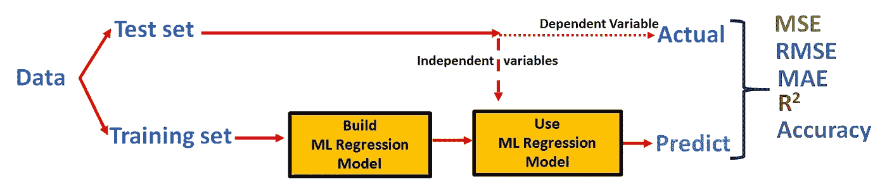
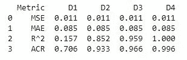
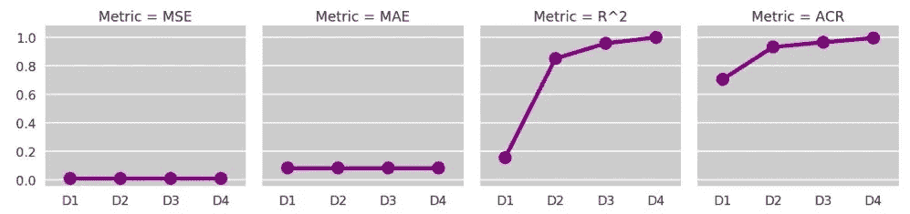
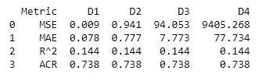
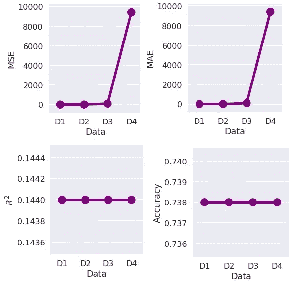

# 变量系数对 ML 回归模型精度的影响分析

> 原文：<https://medium.datadriveninvestor.com/an-analysis-of-variables-coefficients-effect-on-the-ml-regression-models-accuracy-3ba7a1d3a06a?source=collection_archive---------4----------------------->

R 平方(R)、均方误差(MSE)、平均绝对误差(MAE)和均方根误差(RMSE)是衡量连续变量准确性的最常用指标。在本文中，我们将观察变量系数(CoV)对 MAE、MSE、R 和精度的影响。我们将对 4 个不同的数据应用相同的线性回归，这些数据具有不同系数的变量，以解释 MSE、MAE、R 和精度如何以及为什么变化。首先，当我们保持 MSE 和 MAE 不变时，我们将观察 R 和精度随变量系数的变化。其次，当我们保持 R 和精度集不变时，我们将观察 MSE 和 MAE 随变量系数的变化。

# 1.恒定 MSE 和增加 R

我们将用不同的系数变量创建 4 个不同的数据(D1、D2、D3、D4)。首先，我们保持 D1、D2、D3 和 D4 的 MSE 和 MAE 不变，而 D1、D2、D3 和 D4 的变量系数值分别为 0.1、0.5、1、10。

**Data1(D1)**= 0.1+0.1 * x1+0.1 * x2+0.1 * x3+(随机误差)

当常数和变量系数(CoV)为 0.1 时，我们将添加误差系数(CoE)=0.1 的随机误差。我们将了解 CoE=0.1/CoV=0.1 rate 对精度和 R 的影响。

**data 2(D2)**= 0.5+0.5 * X _ 1+0.5 * X _ 2+0.5 * X _ 3+(随机误差)
当常数和 CoV 均为 0.5 时，我们再加上 CoE=0.1 的随机误差。观察 CoE=0.1/CoV=0.5 比率对准确性和 R 的影响。

**Data3(D3)**= 1+1 * X _ 1+1 * X _ 2+1 * X _ 3+(随机误差)
当常数和系数为 1 时，我们将加上 CoE= 0.1 的随机误差。

**数据 4(D4)**= 10+10∫X1+10∫X2+10∫X3+(random error)

**指标表:**

我们保持了 D1、D2、D3 和 D4 的误差，而 D1、D2、D3 和 D4 的 CoV 值分别为 0.1、0.5、1、10。我们对 D1 采用了 0.1/0.1(特遣队所属装备/覆盖)的费率，对 D4 采用了 0.1/10(特遣队所属装备/覆盖)的费率。由于将所有 D1、D2、D3 和 D4 的固定误差率保持为 0.1，我们获得了恒定的 MSE 和 MAE。另一方面，D1 到 D4 的特遣队自备装备/覆盖比率从 1 变为 0.01。结果表明，CoE/CoV 比率与对准确度的影响成正比。由于特遣队所属装备/覆盖物比率的正比效应，从 D1 到 D4，相关系数和准确度都在增加。

**2。常数 R 和增加的 MSE**

在这一部分，我们将再次创建 4 个不同的数据(D1、D2、D3、D4)。我们将把 D1、D2、D3 和 D4 的 CoE/CoV 费率定为 1。那是卑鄙的；D1、D2、D3 和 D4 的 CoE 和 CoV 值分别为 0.1、1、10、100。

**Data1(D1)**= 0.1+0.1 * X _ 1+0.1 * X _ 2+0.1 * X _ 3+(随机误差)
当常数和 CoV 值为 0.1 时，会加上 te CoE=0.1 的随机误差。

**data 2(D2)**= 1+1 * X _ 1+1 * X _ 2+1 * X _ 3+(随机误差)
当常数和 CoV 值为 1 时，我们将加上 CoE=1 的随机误差。

**data 3(D3)**= 10+10 * X _ 1+10 * X _ 2+10 * X _ 3+(随机误差)
当常数和 CoV 值为 10 时，我们将加上 CoE=10 的随机误差。

**data 4(D4)**= 100+100 * X _ 1+100 * X _ 2+100 * X _ 3+(随机误差)
当常数和 CoV 值为 100 时，我们将加上 CoE=100 的随机误差。

**指标表:**

从图中可以看出，当 MSE 和 MAE 增加而精度不变时。我们将 D1、D2、D3 和 D4 的特遣队所属装备/覆盖范围费率定为 1。虽然随机误差的 CoE 值增加了，但由于 D1、D2、D3 和 D4 的 CoE/CoV=1，R 和精度没有变化。

# 3.结论

对度量进行了详细的分析，以观察变量系数对 ML 回归模型精度的影响。通过将线性回归模型应用于 D1，MSE=0.09，精确度=73%，从而获得 MSE 和精确度值。同样的线性回归模型已经应用于 D4，我们已经获得了 MSE=9405 和精确度=73%的 MSE 和精确度。

分析结果表明，R 值和精度值是 CoE/CoV 率的强函数，MSE 评价回归模型没有特定的限制。

木星笔记本可以在 [Github](https://github.com/ahmtkaya/ML_Matrics/blob/master/Matrics_Validation.ipynb) 上找到。