# 印度死亡率数据分析。

> 原文：<https://medium.datadriveninvestor.com/an-analysis-of-women-mortality-data-of-india-54598f384324?source=collection_archive---------12----------------------->

在这种可视化分析的帮助下，政府可以了解死亡的各种因素，并可以改善其政策。

**这里是各年因怀孕死亡人数的包装气泡**

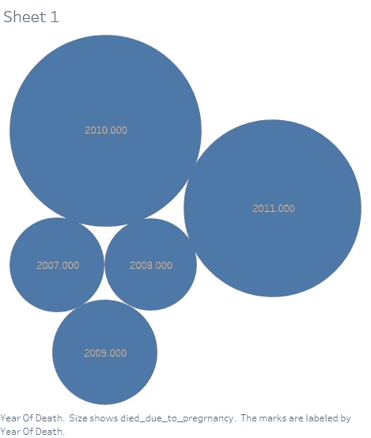

**下一个气泡显示特定年份因怀孕而死亡的已婚人数**

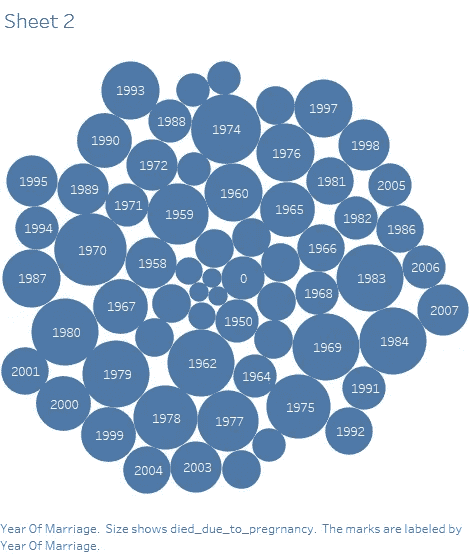

**下面的图表显示了这些人在各自年份的死亡地点**

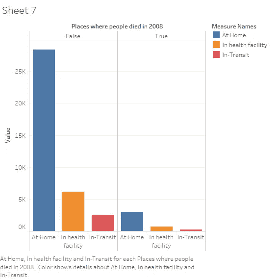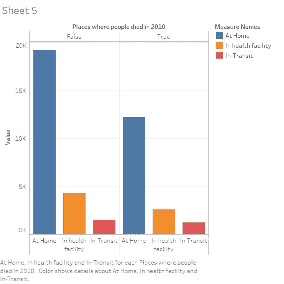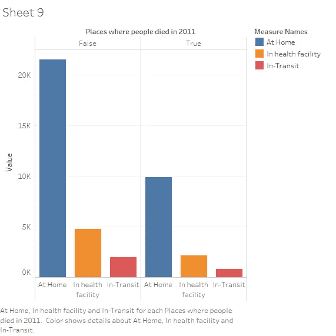

**下面的图表显示了各年影响人口死亡的因素**

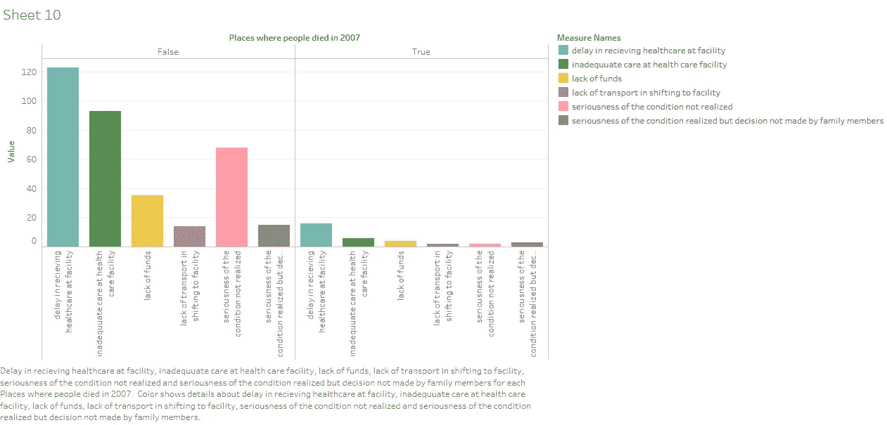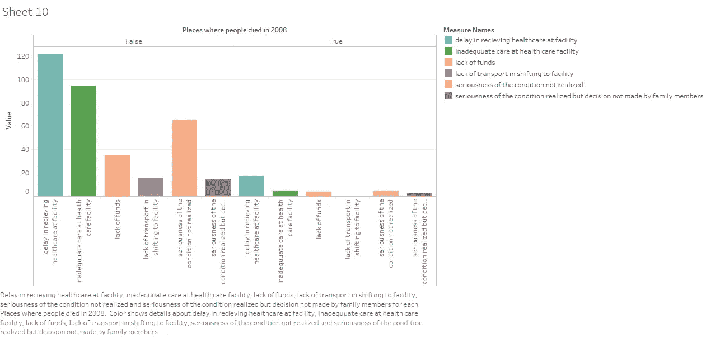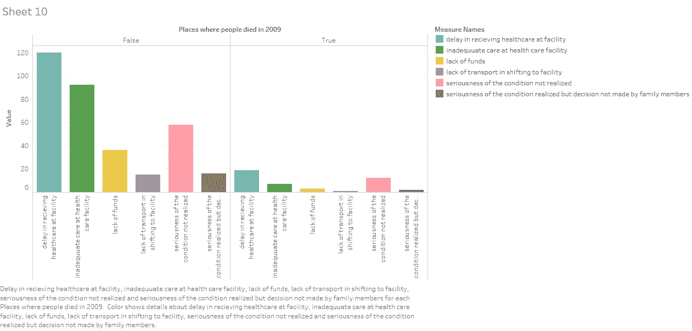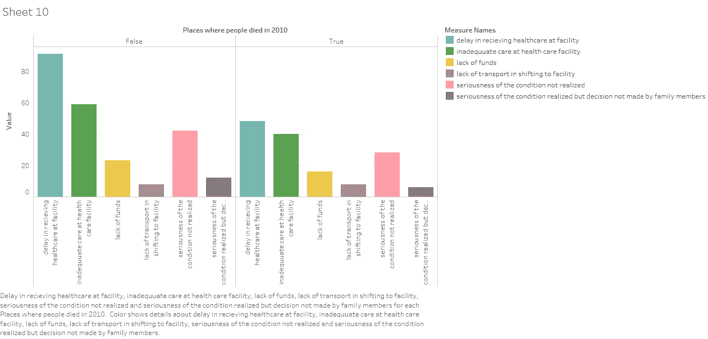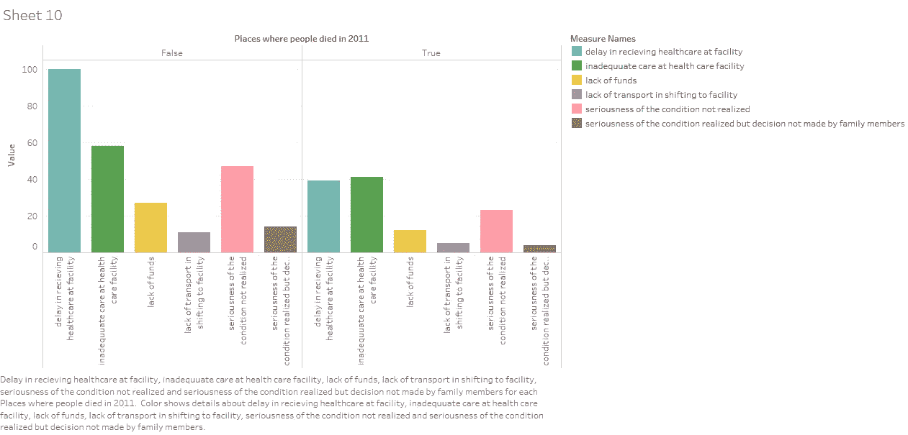

# 下图将显示哪个州因怀孕而死亡的人数更多

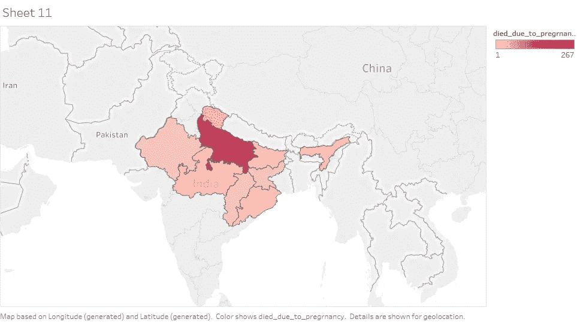

# **相关矩阵**

**农村** =1(如果是农村)，2(如果是城镇)，**死者性别** =1(男)，2(女)，**是 _ 死亡 _ 已登记** =1(是)，2(否)，3(不知道)。

