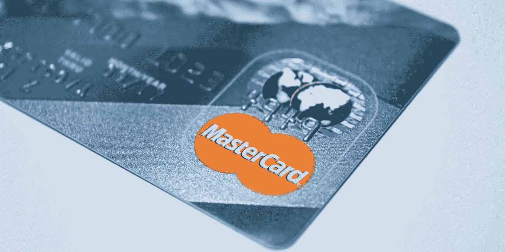

# 保护您在线支付的应用程序

> 原文：<https://medium.datadriveninvestor.com/an-app-to-protect-your-online-payments-8f3eada739a9?source=collection_archive---------36----------------------->

## 似乎每隔一天，我们都会听到公司数据泄露导致信用卡信息泄露、身份信息被盗等等..

*最初发表于*[*【millennialmoderator.com】*](https://millennialmoderator.com/an-app-to-protect-your-online-payments)*。*

但是，尽管在线支付技术可能带来风险，但只要开发者高度重视安全措施，先进的安全措施也有很大的潜力。然而，网上支付的真正问题是，你访问的每个网站都需要输入你的卡信息。您将该信息提交到网上的次数越多，欺诈活动的可能性就越大。坏人可以在很多地方找到你的东西！

想象一下，如果您可以在一个安全的地方输入您的信用卡信息，然后通过一个屏蔽的虚拟信用卡进行所有的在线支付，该信用卡使用加密代码进行支付，不会留下任何您的卡信息。那是 privacy.com 做的，不，我不为他们工作。

# privacy.com

我通过 Reddit 上的一则广告认识了 privacy.com，并决定尝试一下这个平台。如果你还没有机会浏览他们的网站，他们的价值主张是，通过创建和使用安全的虚拟卡来完成结帐表单，你将节省时间和金钱，同时掩盖你的真实卡信息。要点是他们为你创建一个虚拟支付卡，它使用一个极其难以解码的加密系统(使用 PBKDF2 散列 100k 次迭代并加盐以使彩虹表攻击更加困难)链接到你的实际支付卡，然后可以在网络上使用它来提交支付。如果你想了解更多科技方面的信息，你可以阅读他们的安全分析。

现在，如果一个网站被入侵，攻击不会有你具体的卡信息，而是你用来支付的一次性加密代码。对我来说，这似乎是最大限度地降低了欺诈风险！让你所有的交易都通过这张虚拟卡来完成也是一种很好的在线支付方式。在 privacy.com 仪表板上，您可以查看虚拟卡的所有尝试交易，并确定您可能尚未授权的任何支付尝试。拥有一个单一的在线支付管理点对企业主来说是一个巨大的优势，因为它降低了支付信息的控制风险。

虚拟卡的另一个巧妙之处在于，你只需点击仪表盘上的虚拟卡并输入金额，就可以设置**消费限额**，以防止意外的高额交易。如果你喜欢这种东西，你也可以给你的虚拟卡取个昵称。如果你想给 privacy.com 一个尝试，使用我的[推荐链接](https://privacy.com/join/9FZGR)来注册，我们都会得到 5 美元。

你可以在 [iTunes 商店](https://itunes.apple.com/us/app/privacy-com/id1040298266?mt=8)或[谷歌 Play 商店](https://play.google.com/store/apps/details?id=com.privacy.pay&hl=en_US)上下载 privacy.com 手机应用。

你觉得这个 mod 有用吗？你认为能想到的一些潜在的漏洞或安全风险是什么——如果有的话？如果你喜欢这篇文章，请考虑注册我的[个人简讯](http://alekseyweyman.com/#newsletter)，在那里我每周分享有价值的商业、技术和生活指导技巧。一如既往的在[推特](https://twitter.com/alekseyweyman)上连线吧！

标记为: [TechApps](https://millennialmoderator.com/an-app-to-protect-your-online-payments#)

*原载于*[*millennialmoderator.com*](https://millennialmoderator.com/an-app-to-protect-your-online-payments)*。*