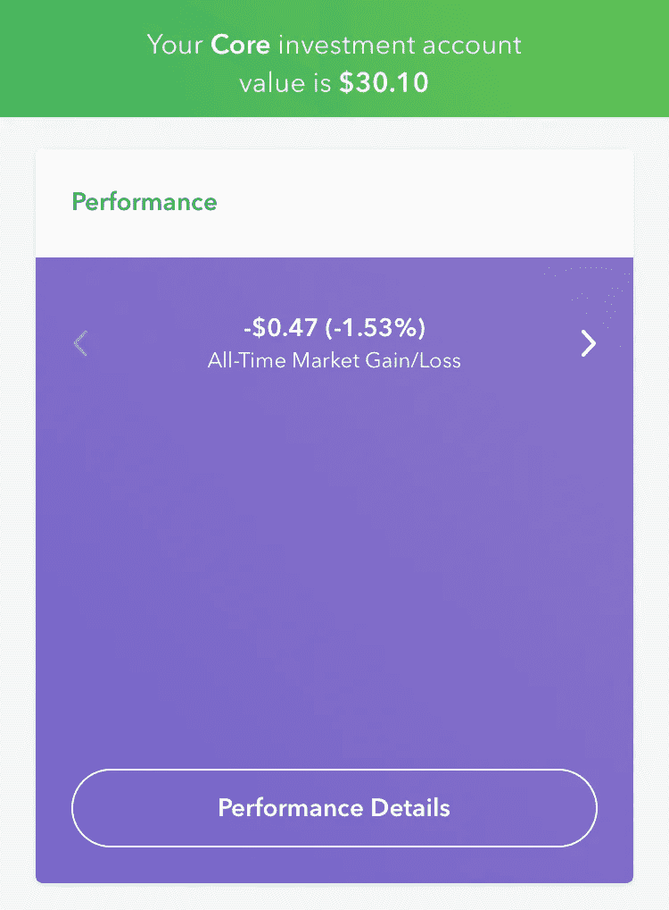
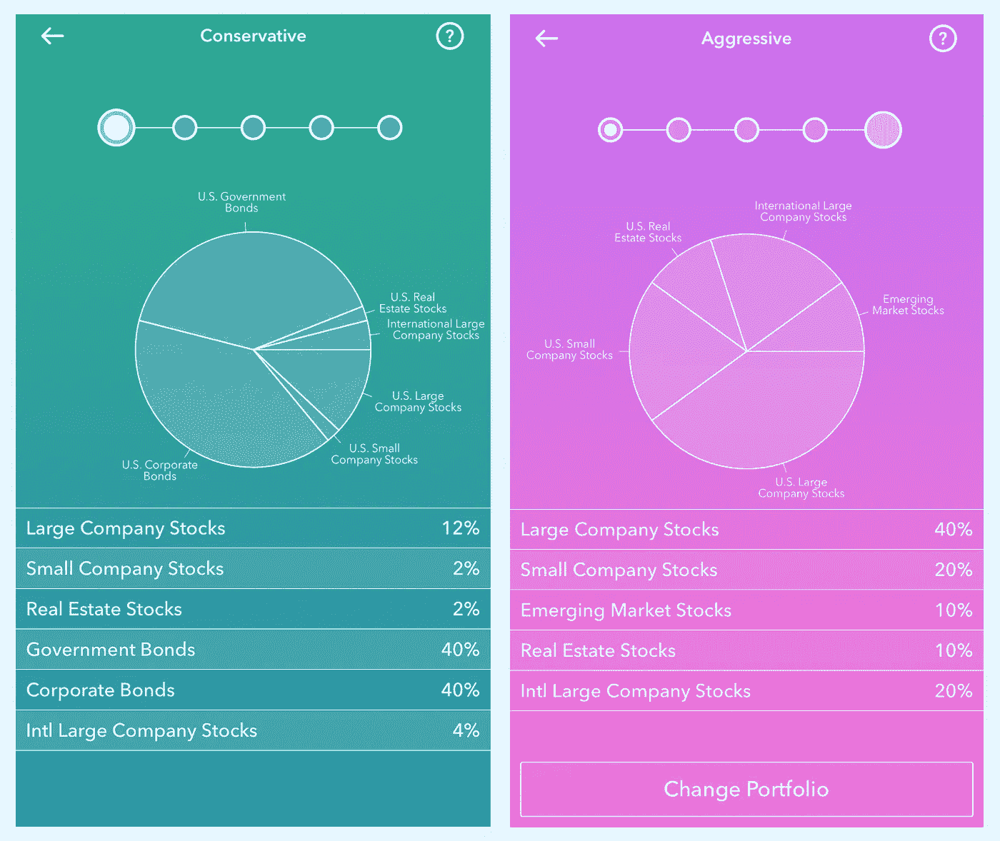
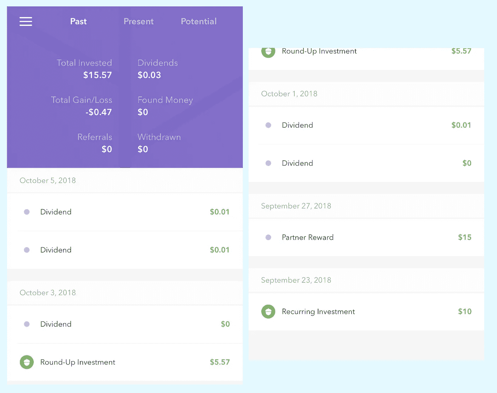
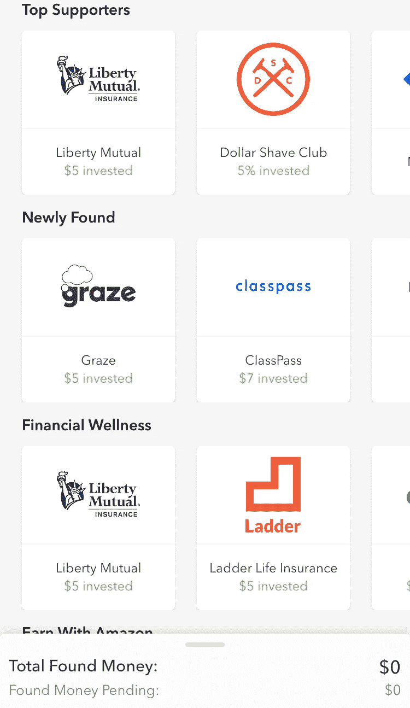

# 一位作家尝试橡子

> 原文：<https://medium.datadriveninvestor.com/an-author-attempts-acorns-60f50ce69302?source=collection_archive---------65----------------------->

Photo courtesy of [undefined undefined](https://www.istockphoto.com/photo/people-a-woman-writing-on-the-paper-gm866419464-144049131) on iStock.

如果作家是糟糕的投资者这是一种刻板印象，我想我会继续下去并强化它。既然有这么多的应用程序宣传让小额投资变得容易，我想我应该尝试一下，试着把一些钱存起来投资。

# 它……可能会更好。

Acorns 设计得很漂亮，我得给他们这个评价。很高兴使用和导航这个应用程序。

我不是股票专家，但即使采用保守的策略，我的橡子账户也一直在缩水。这款应用并不能让你很好地控制你的投资资金是如何分配的，或者是用来做什么的。

考虑到我的投资是如此之少，我能理解为什么。对于你想采取的总体策略类型，有一些选择；你可以是保守的，适度保守的，适度的，适度激进的，或者激进的。看到这些损失，我选择了保守。

# 就投资组合分布而言，这里有一个保守型和激进型的小屏幕。

由于 30.57 美元的投资分散在不同的来源，我在股票中的比例非常小，所以我可以理解为什么市场的巨大变化不会对账户产生太大影响。才过了一个月左右，但是对于一个新手来说，我的微小投资亏了 1.53%，也就是 0.47 美分，还是有点心灰意冷。由于我采取了保守策略，我希望它要么保持不变，要么可能有几分的增长。

# 这是我的帐户的一个小旅行。

当你的余额因为分红而“上升”时，摘要会很高兴地显示给你，但当它因为亏损而下降时，它不会显示给你。这种形式似乎突出了好的一面，掩盖了不好的一面。

这让我对橡子产生了怀疑；我更希望看到每天的总结中不断增加的美分，而不仅仅是便士。

你会在我的账户上看到那个小小的“合作伙伴奖励”；我决定试一试，因为我的手机供应商威瑞森在他们的奖励计划中提供了一点奖励，投资 10 美元，你就可以在你的 Acorns 账户中存入 15 美元。我还做了他们的汇总功能，将你最近的交易中的美分进行汇总，并将剩余的零钱进行投资。这听起来像是一个很酷的选择，因为这是一个很方便的方式，以很小的、几乎不引人注意的增量增加你的储蓄，但是有很多传统的储蓄账户会做同样的事情。

# 然而，正是橡子的拾金不昧特性让我想拿钱走人。

这是截至 2018 年 10 月该应用程序的该部分的外观。

如果你购买他们的商品或服务，许多商家会给你一点回扣。Acorns 会不断给你这些机会的信息。

听起来很酷！5 美元或更多的投资，听起来棒极了。

然而，在我看来，它让 Acorns 更像是 Drop 和 Ibotta 之类的奖励应用，而不是真正的投资工具。

如果你想用它作为一个奖励应用程序，从 Dollar Shave Club、Apple Music 或 Blue 围裙上购买商品获得少量奖金，那么这可能会给你带来一些现金。

我觉得这是让你的橡子账户真正盈利的唯一方法。这样你可以赚很多钱。例如，如果你是他们服务的新用户，蓝色围裙会在你的账户上投资 30 美元。我经常光顾那里的一些商家，比如 EyeBuyDirect 和 Expedia，它们会把你购买的商品的 4%和 5%作为投资返还给你。

不过，这确实值得怀疑。像许多奖励计划一样，你必须通过应用程序，点击他们的特殊链接，在同一个会话中进行购买，等等。就我个人而言，我觉得大费周章去收获这些回报，看着它们在我的投资组合中慢慢恶化，似乎有点费力。我只是不经常从附属供应商那里购物，不能充分利用这个项目。

然而，如果你把 Acorns 想成一个奖励应用程序，并努力实现找到钱的功能，你可能会对你得到的结果相当满意。

*原载于***。**