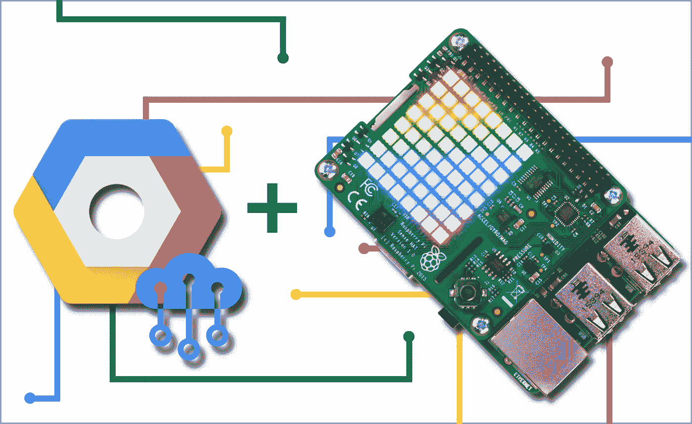
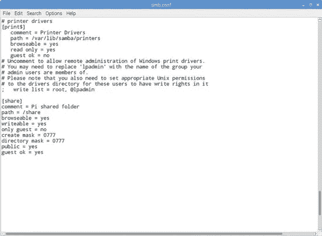

# 用于机器学习数据集的 Easy 40€云存储服务器(第 1 部分)

> 原文：<https://medium.datadriveninvestor.com/an-easy-40-cloud-storage-server-for-machine-learning-data-sets-part-1-5790733d6801?source=collection_archive---------12----------------------->

[](http://www.track.datadriveninvestor.com/1B9E)

Source: Google

当我继续我的机器学习之旅时，我经常遇到的一个场景是；我收到一个数据集，训练我的模型，并将其转储到机器学习数据集“墓地”文件夹中。现在，这些数据集相当庞大，它们很快吞噬了我的硬盘空间，使我的系统变慢，留给新来的空间很少。我也不能删除它们，因为可能会有新的变更需求，我可能需要用新旧数据集重新训练模型。

我也碰巧在我的台式机和笔记本电脑上工作(在我的床上或沙发上),每次起床取出外部硬盘并将其连接到任何一个系统都是一件苦差事。正如他们所说，懒惰是所有工程师的母亲，我们应该尊重我们的母亲。毕竟她是个母亲！所以…

[](https://www.datadriveninvestor.com/2019/01/23/meet-raspberry-pi-a-revolutionary-computing-device/) [## 认识 Raspberry Pi——革命性的计算设备|数据驱动的投资者

### 计算机过去笨重、昂贵且难以操作的日子一去不复返了。随着技术的进步…

www.datadriveninvestor.com](https://www.datadriveninvestor.com/2019/01/23/meet-raspberry-pi-a-revolutionary-computing-device/) 

## 进入桑巴和树莓派

我从易贝买了一个便宜的覆盆子酱，做了类似的事情。

安装 Raspbian 后，我安装了 VNC 服务器和 VNC 浏览器(因为我没有多余的显示器、键盘和鼠标。我不是网络管理员)。然后，我花了大约 10 分钟的时间，按照我找到的一个很棒的网站上的指南进行操作。

```
install Samba
sudo apt-get update
sudo apt-get upgrade
sudo apt-get install samba samba-common-bin
sudo mkdir -m 1777 /share                // give all permissions
```

现在，在成功执行命令之后，我们必须设置。conf 文件，如下所示:



samba .conf file

打开。使用以下命令创建 conf 文件

```
sudo leafpad /etc/samba/smb.conf
```

…并添加以下几行。在。会议文件

```
[share]
Comment = Pi shared folder  // just a comment
Path = /ml-datasets         // name of the cloud folder
Browseable = yes            // allow users to browse
Writeable = Yes             // allow users to write
only guest = no             // allow any device to connect
create mask = 0777          // allow all three read write delete
directory mask = 0777
Public = yes
Guest ok = yes
```

接下来，我们将创建用户名和密码。

```
sudo smbpasswd -a ml-storage     // where ml-storage is username
```

最后，使用以下命令重新启动 samba 服务器:

```
sudo service smbd restart
sudo service nmbd restart
```

现在只需转到您的文件浏览器，单击连接到服务器，并在服务器字段中输入以下内容。

```
smb://<ip-address of raspberry pi device>/ml-datasets
```

就是这样！！

您已经成功创建了您自己的机器学习云存储服务器，您可以从您的所有设备访问它，而无需物理连接到您的外部硬盘。

> 下一步是什么？

嗯，这只是服务器设置的一部分，在下一部分，我们将重点关注如何配置您的 FAT32 系统格式的外部硬盘驱动器，并使用外部供电的 USB 集线器将您的硬盘驱动器连接到 Raspberry Pi。外部供电 USB 集线器的原因是，Raspberry Pi 的 USB 端口没有足够的功率来给外部硬盘供电。

祝你周日愉快！如果你觉得这篇文章有用，请留下你的掌声！:D。谢谢你！

> 来源:

[](https://www.raspberrypi.org/magpi/samba-file-server/) [## Samba:设置一个 Raspberry Pi 作为本地网络的文件服务器 MagPi Magazine

### 很容易将 Raspberry Pi 用作 Samba 文件服务器，您可以在其中存储备份和共享来自所有其他…

www.raspberrypi.org](https://www.raspberrypi.org/magpi/samba-file-server/)