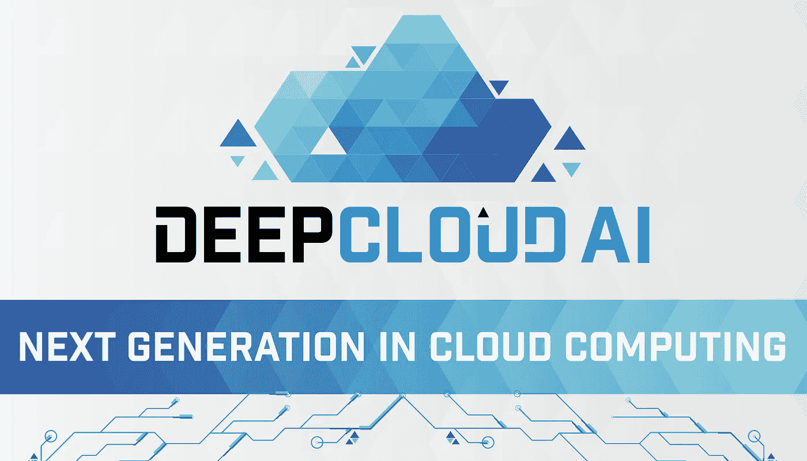
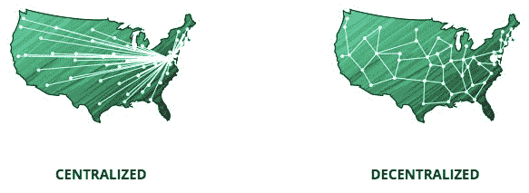
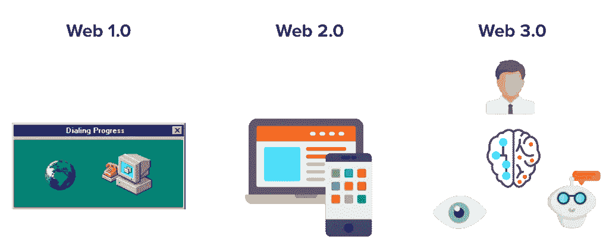
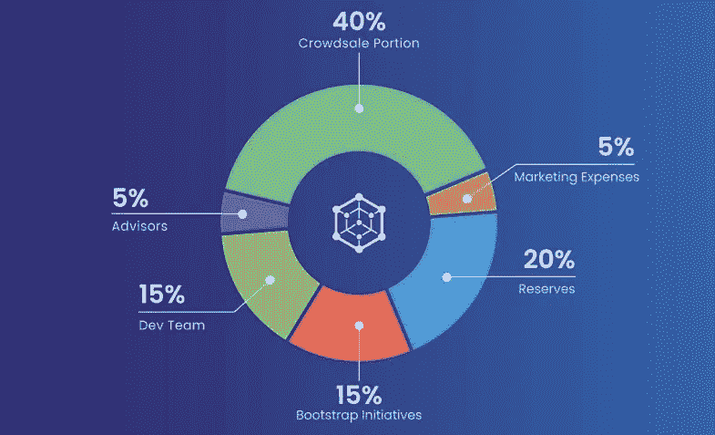
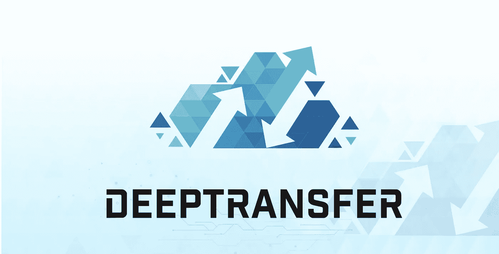

# 一篇关于 DeepCloud AI 项目的浅显易懂的综述。

> 原文：<https://medium.datadriveninvestor.com/an-easy-to-understand-review-about-the-deepcloud-ai-project-f3f0ff7c4cac?source=collection_archive---------17----------------------->

最近出了这么多项目，很难从中挑出好的。在这篇文章中，我将向你展示为什么 DeepCloud 是 2019 年最有前途的项目之一。

我将尽可能简单地解释这一点，以便每个人都能理解这个项目是怎么回事。如果你完全是加密货币世界的新手，不要害怕，读完这篇文章后，你就会确切地知道 DeepCloud AI 是什么，以及为什么它可能是一项重大投资。

> **什么是 DeepCloud AI**

*DeepCloud 正在构建一个 AI 驱动的去中心化云计算平台，用于运行去中心化应用——IoT 和 Web 3.0 DApps。*

如果你读了上面的文字，你可能会想，好吧，酷，但它到底是什么？:)我们将从这句话中分解出难懂的概念，分别对待。

【艾】艾

AI 是**人工智能**的缩写。基本上，人工智能是机器或计算机程序思考和学习的能力。人工智能的概念是基于制造能够像人类一样思考、行动和学习的机器的想法。

DeepCloud 正在使用一种基于几个参数的人工智能匹配算法。人工智能控制器将分析网络上的每一笔交易。从这些见解，控制器将建立预测和反应策略。例如，反应式方法可以测量事务的当前状态，而预测式方法旨在基于历史数据预测系统的未来行为。

**分散应用**

分散是集中的反义词。集中式系统例如脸书、推特和谷歌。这些系统都由一个中央机构控制，这意味着对于要验证的数据交易，将由第三方代表您进行验证。

这意味着你必须相信这些人会保护你所有数据的隐私和安全。你也必须相信他们不会为了自己的利益而使用这些数据。比如卖给广告公司。

去中心化描述了一个不受中央控制的网络的设计。相反，对等交互驱动网络，而不需要第三方。DeepCloud AI 是这些平台中的一个，它们可以在分散的环境中运行。它们为公司和个人的计算和存储资源提供了一个功能齐全的市场，使他们能够通过分散的云来共享其过剩的容量。

**物联网**

IoT 是**物联网的缩写。**你可以称之为互联网的发展建议，日常物品都连接到网络上，可以交换数据。

IOT 系统只是由相互通信的独立部分组成。例如，一些组件仅收集数据或测量不同的值。这些组件可以通过互联网工作并相互通信。DeepCloud AI 的伟大之处在于，开发者可以在深度平台上构建物联网应用。

**Web 3.0**

Web 3.0 也被称为语义网。这意味着网络理解网站的内容。因此，网络可以开始为用户着想。不同类型的数据被组合在一起，因此网络可以向用户提供相关的建议和意见。

例如，网络知道你每周三晚上在当地的比萨饼店订一份比萨饼。网络突然看到，由于装修，餐馆下周三关门。因此，它建议在附近的另一家比萨店买一份比萨。

除了物联网，开发者还可以在 DeepCloud AI 平台上构建 web 3.0 应用(采用去中心化协议)。我们称这些应用程序为 **dApps。**

> **深层令牌详情**

股票代码:深

令牌类型:实用程序

ICO 代币价格:1 深= 0.25 美元

总代币供应量:2 亿深

Token Allocation

Deep 将作为 ERC-20 令牌推出，它将与以太坊网络兼容。由于可扩展性问题，这些令牌将不会在以太网上使用。ERC-20 令牌稍后将被转换为另一种令牌，可用于更好、更快和更具可扩展性的区块链。DeepCloud 人工智能测试网目前正在区块链星云上运行，到目前为止一直工作得非常出色。

DeepCloud AI 的平台上有几种深度令牌的用法:

*   进入 DeepCloud AI 的网络系统。
*   利用高端用户的高级功能
*   网络用户和应用程序开发者的支付方式
*   对网络资源提供商和应用市场提供商的支付方法

如果我们将 Deep 的市场价值与竞争对手进行比较，你会发现 Deep 的增长潜力很大。

竞争对手:假人(GNT)

就像假人一样，DeepCloud AI 也有同样的分散云计算愿景，但目标是匹配提供商和应用程序开发者。

在 2018 年 1 月的巅峰时期，假人的市值为 9.65 亿美元。以 0.25 美元的价格，deep 的市值将达到 5000 万美元。如您所见，在增长方面，Deep 有着巨大的潜力。

> **深入(但可以理解)了解 DeepCloud 人工智能平台**

我们现在正处于一个更具技术性的阶段。区块链是一种相对较新的技术，理解这一点可能很困难。我会尽量保持简单。

DeepCloud AI 的主要思想是通过 AI 构建一个自组织的分布式网络。DeepCloud AI 专注于构建基于区块链的分布式云基础设施，而不是构建未使用的存储、人工智能计算平台或数据库即服务等特定服务。

DeepCloud AI 平台基本上渴望深入挖掘，并为区块链技术的利用奠定基础。不仅仅是区块链，还有未来的 dApp 分销。它试图调查分散解决方案的最新市场。怎么会？通过为用户提供基于区块链的去中心化云服务替代方案。

DeepCloud 平台相信，设置所有这些创新不仅会支持现有的发明用例，还会支持尚未开发的发明用例。该平台为用户提供了一个完全可操作的市场，不仅为企业及其成员提供数字资产，还提供存储资产。这将允许用户和公司通过分散的云来分配他们所有的容量。

**为什么要利用 DeepCloud AI 平台？**

DeepCloud 利用区块链去中心化权威，增长信任。此外，它旨在允许增加交易和降低交易价格。

它对顾客的保护措施是好的。该平台为英特尔的 SGX 发明创造了一个保护区。更重要的是，它将持续跟踪平台上发生的活动，以防止欺诈和网络攻击问题。

DeepCloud 连接到分散的资产，以提供最佳的管理。个人和公司应该利用 DeepCloud AI 平台的另一个重要原因是，它将人工智能作为其运营的核心。

它利用最佳匹配发明以绝对方式为计算请求分配资产。分散的应用程序要求资产靠近其来源。然而，匹配的发明完全基于不同的标准，例如来自系统用户请求的数据、使用位置和最终系统中网络贡献者的状态。

**deep cloud 人工智能平台将解决哪些问题？**

DeepCloud 人工智能平台将解决各种不同的用例。他们是；

*   **智慧城市**

物联网和人工智能处于智能城市场景的边缘。这是因为，通过它们，传统政府可以专注于创建主要基础，并依赖 DeepCloud 的人工智能资产来运营和分发他们的各种应用程序。

*   **供应链**

具有困难的供应链监控问题的企业和航运机构可以在 DeepCloud AI edifice 上运营和分发其多样化的区块链应用程序。这可以通过高度保护和不变的完整分析来监控所有交易。

*   **电视服务提供商**

电视和有线电视公司等服务提供商可以利用 DeepCloud 的分散服务。这包括在足球比赛或奥运会等大型活动期间对媒体频道的传统缓存。

*   **分布式人工智能算法学习**

具有安全和信息匿名问题的物联网应用可以通过在设备附近操作分散式 AI 发明来解决。产生了对 DeepCloud 人工智能资产的有限见解，这为物联网设备用户提供了一种机制，以发布他们自己的信息，包括所有交易和数据代码，甚至是使用区块链的算法。

**结论**

基于技术概念，DeepCloud AI 平台有一个关于基本解决方案的优秀想法。在 DeepCloud 之前，它的许多竞争对手已经推出了这个概念。基本上，与其他一些公司(如假人)的分辨率相比，DeepCloud 的总体目的分辨率可以获得比其 1500 万 ICO 硬上限更大的资本。

我希望通过阅读这篇文章，你已经对 DeepCloud Ai 有了很好的了解。如果你能留下评论或掌声，我会很高兴的！感谢阅读！

> **深度转移**

另一个很酷的功能是 DeepTransfer！

使用 DeepTransfer，您可以通过一个独特的链接发送和共享文件，该链接将在 14 天后过期。这可以确保您的文件不会长时间在线。您可以发送高达 3GB 的大文件，高级版(即将推出)甚至可以发送 30GB 的大文件！

试一试吧，免费的！

 [## 深度转移

### DeepTransfer 提供高达 3GB 的免费文件共享|无限制、即时、安全可靠|链接持续 14 天|运行于…

www.deeptransfer.net](https://www.deeptransfer.net/) 

> 你可以在以下网址找到关于 DeepCloud AI 的更多详细信息:
> 
> 网址:[https://www.deepcloudai.com/](https://www.deepcloudai.com/)
> 
> 推特:[https://twitter.com/deepcloud_ai](https://twitter.com/deepcloud_ai)
> 
> 电报:[https://t.me/deepcloud_ai](https://t.me/deepcloud_ai)
> 
> 中:[https://medium.com/@DeepCloud_AI](https://medium.com/@DeepCloud_AI)