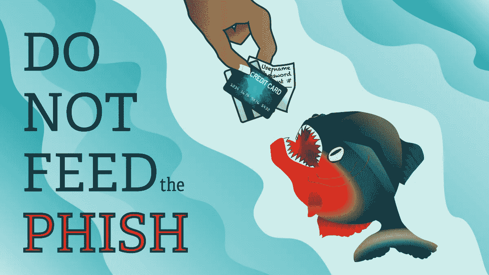
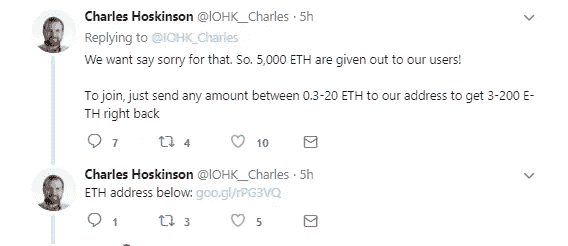
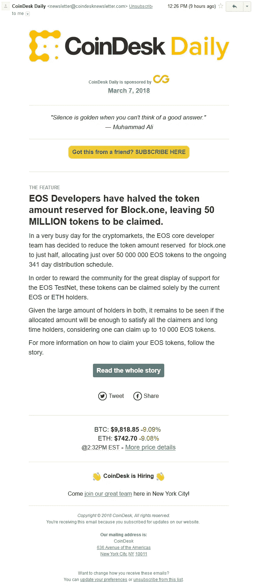
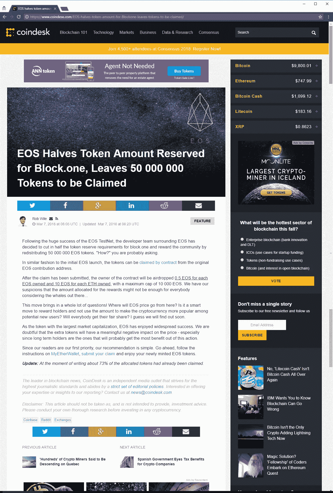
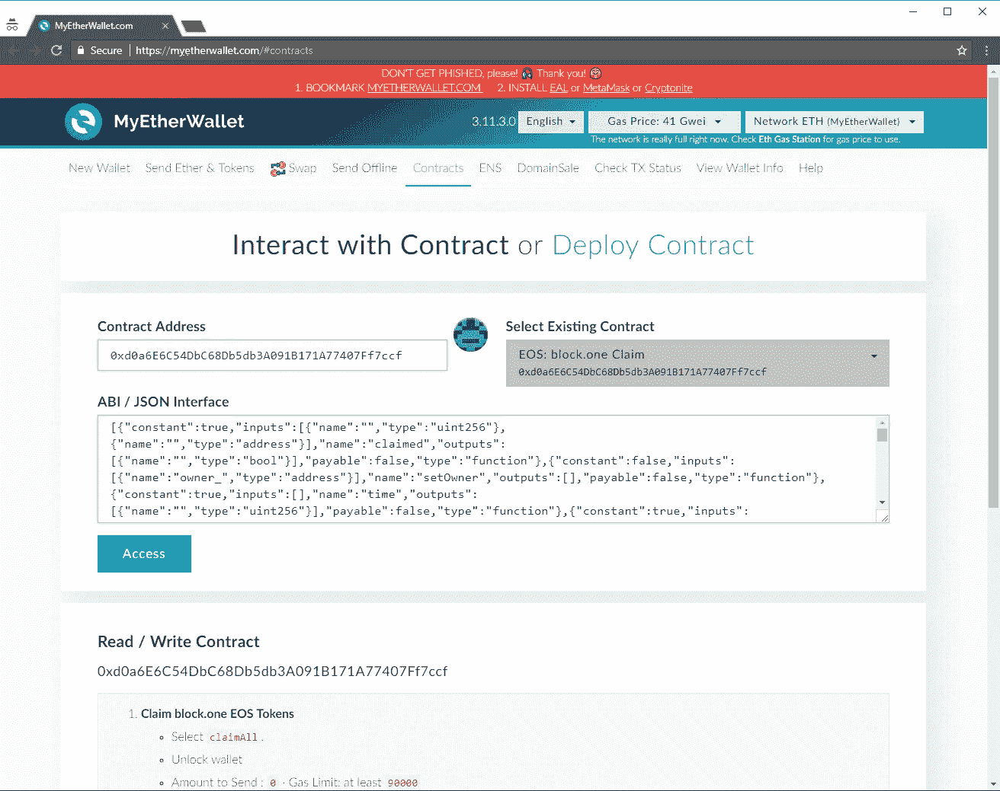
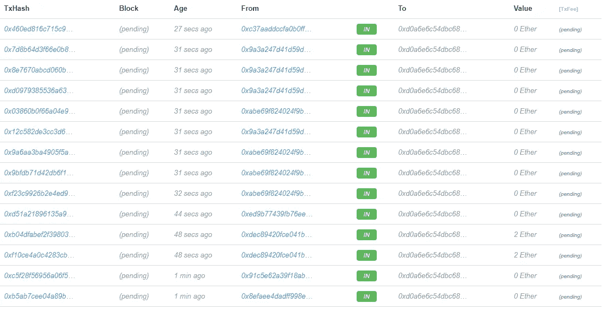
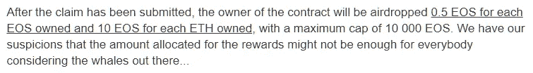
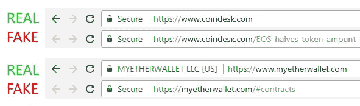
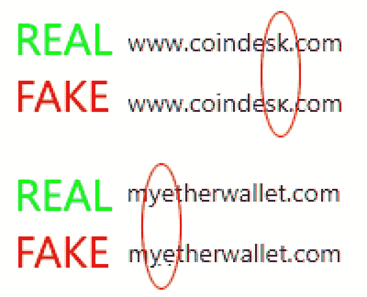
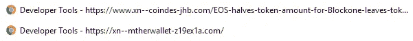

# 精心制作的加密网络钓鱼企图(以及如何检测)

> 原文：<https://medium.datadriveninvestor.com/an-expertly-crafted-crypto-phishing-attempt-and-how-to-detect-it-2861de0ebfb4?source=collection_archive---------0----------------------->

您看到的大多数网络钓鱼企图对大多数人来说都是显而易见的。通常他们会宣传某种免费赠品，你只需要先给他们寄钱。

A common and obvious phishing attempt on Twitter.

你见过多少公司在推特上随便给人送人 370 万美元就“说对不起”了？这看起来很傻，但每天都有人上当。

今天，我收到了一封电子邮件，内容是一次网络钓鱼，做得非常好，我相信甚至一些精通互联网的人也会上当。这种网络钓鱼非常复杂，它由四部分组成:一封电子邮件、两个独立的网站和一份以太坊智能合同。

## 第 1 部分:电子邮件

电子邮件本身是普通的 CoinDesk 时事通讯的翻版。考虑到这些天空投的频率，这个故事听起来有些可信。Gmail 没有将其标记为网络钓鱼企图。

## 第 2 部分:CoinDesk 文章

一旦你点击了邮件中的链接，你就会看到一篇关于 CoinDesk 的文章。再一次，没有什么看起来不寻常的。这个故事听起来仍然有些可信，你似乎是在一个合法的新闻网站上。谷歌 Chrome 不会将该网站标记为诈骗网站。

## 第 3 部分:我的钱包索赔表

如果您点击索赔链接，将会看到 MyEtherWallet 合同。第三次，一切看起来完全正常。没有一个骗局的迹象。它甚至在页面顶部有一个鲜红色的钓鱼警告。同样，谷歌 Chrome 不会将该网站标记为诈骗网站。

## 第 4 部分:以太坊智能合约

如果您检查引用的合同地址上的活动，您会看到一个不间断的持续活动流。没什么异常。如果这是合法的赠品，就应该是这个样子。

## 识破骗局

虽然很难发现，但有一些迹象表明这是一个骗局。

*   贵重的硬币是不会送人的。这些天有令人眼花缭乱的赠品和空投，但它们总是针对少量毫无价值的硬币。这样做是为了促销的目的。EOS 是该领域最有价值的项目之一。
*   **EOS ICO 还在运行。**EOS ICO 的不同寻常之处在于它持续了大约一年，但仍在运行。在 ICO 还在运行的时候，创始人赠送礼物是没有意义的。
*   **硬币赠送限额没有意义。**该网站声称 EOS 限制为 10，000，但没有办法强制执行。拥有大量 ETH 的人可以简单地将其拆分为多个账户，然后提交多个索赔。

*   **分配方式不公平，意义不大。**已经为 EOS 币支付了数十亿美元。将额外的 EOS 币发放给碰巧最先获得新闻的一小部分用户是完全不公平的。一个更公平的方法是焚烧硬币，这意味着销毁它们。这使它们永久退出流通，增加了持有 EOS 的每个人的平均价值。
*   **这篇文章没有链接到官方声明。**如果真的有这么大规模的泄露，这将会成为头条新闻，官方声明也将会被作为证据。
*   **URL SSL 证书不匹配。**这一点不太明显，因为网络钓鱼者会花时间为他们的域颁发 SSL 证书。两个 CoinDesk 网站都在地址栏显示“安全”。真正的 MyEtherWallet 更进了一步，在证书中提供了扩展验证，这使得它们的名字被放在了 URL 栏中。大多数域不提供扩展验证，所以这个细节很容易被忽略。

*   **网址并不*完全*相同。如果你仔细观察这些网址，就会发现它们略有不同。coindesk 中“k”的顶部被切掉了。我的钱包里有两个小的重音符号。这些在 unicode 标准中是技术上不同的字符。**

*   **虚假网址在开发者工具中被揭露。**如果开发者工具打开，您可以看到 IDNA 编码的网址。(在 Firefox 或 Chrome 中按 F11，或者从菜单中打开。)这揭示了 URL 实际上是看起来相似的国际域名。

*   **智能合同不是免费赠送的。**所提供的合同地址不是 EOS 赠品。是为了 EOS 众筹 ICO。

## 我还能做什么来保护自己？

*   **使用硬件钱包，如 Trezor、Ledger 或 Bitbox。**这些设备存储您的私人密钥并保证其安全。当连接到硬件钱包时，即使被入侵的网站也无法窃取您的密钥。所做的一切都可以在设备上验证。
*   **仅使用众所周知的钱包软件。基于网站的钱包非常方便，但也经常成为攻击的目标。使用 MetaMask、以太坊钱包或以太坊 Mist 等软件可以增加伪造请求的难度。**
*   **不要点击链接。自己输入网址。**如果是自己输入网址，是无法伪造的。
*   **使用“punycode alert”浏览器插件。**如果你访问一个可能试图伪装成普通域名的国际化域名，这些插件会向你发出警告。
*   寻找第二来源来验证声明。新闻网站总是在竞相发布头条新闻。如果是重要的事情，多个网站都会有相关信息。
*   **查看官方网站。**重大项目经常成为错误信息和骗局的目标。如果有合法的推广在进行，它会一直列在官网上。
*   **仔细思考，永远保持怀疑的态度。**疯狂的促销活动几乎和骗局一样多。有时很难区分，但是稍加研究，你通常可以找到真正的答案。如果听起来好得令人难以置信，那很可能是真的。