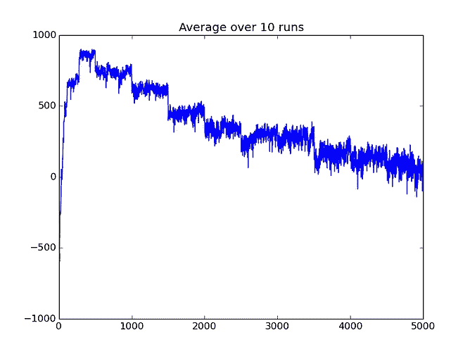
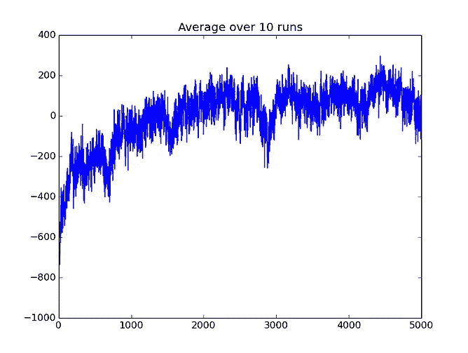
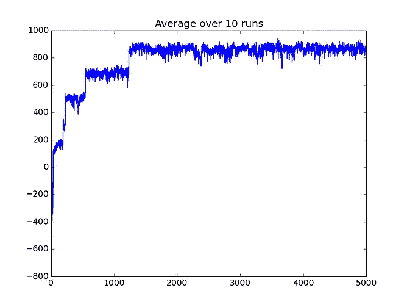
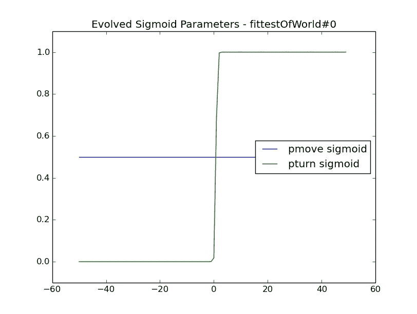
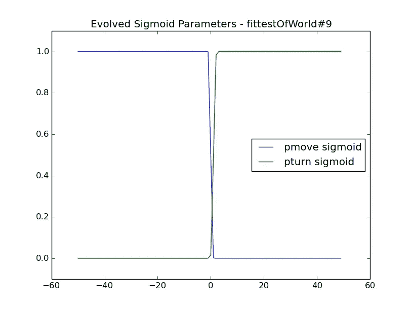
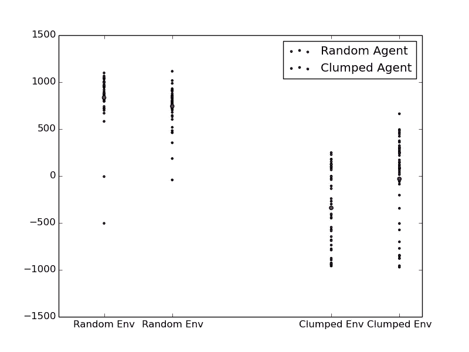

# 用人工进化探索生存与灭绝

> 原文：<https://medium.datadriveninvestor.com/an-exploration-into-survival-and-extinction-using-artificial-evolution-a10981796532?source=collection_archive---------0----------------------->

摘要
纵观历史，许多物种都表现出极强的适应力，历久弥新，而有些却灭绝了。本文对进化中的智能体在不断变化的环境中生存的能力进行了分析。具有给定基因型和进化能力的代理被设计并允许在变化的环境中进化。随着时间的推移，代理人可能会变得更适合，因此生存或变得不适合，并灭亡。

研究了一个具体情况，其中通过从伊辛模型的阶段采样来模拟动态环境。事实证明，这里所说的代理人最终会灭绝。这表明，随着环境的变化，如果代理人不得不生存，它需要一个更复杂的控制机制。这项研究的一个应用是识别能够在相当已知的动态环境中生存的最小认知代理。在环境中不断学习和进化的智能系统是可以高效构建的。

 [## 人工智能预测能力的神话——数据驱动的投资者

### AI(人工智能)最有前途的优势之一似乎是它预测未来的能力…

www.datadriveninvestor.com](https://www.datadriveninvestor.com/2019/03/01/the-myth-of-ais-predictive-power/) 

简介
进化过程极其复杂，取决于许多因素，因为有几个物种在平行进化。这些过程虽然是平行的，但并不是独立的。动物的环境强烈地影响着它的“适应性”或生存能力。这里，环境被定义为主体生态中所有其他有生命/无生命的组成部分。

另一方面，人工进化通常被视为一种优化算法，其中精心设计的基因型被允许在规定的环境中进化，以识别“最适合”的个体。
这项研究旨在模拟两个平行的进化过程——环境和主体。环境被共同定义为主体的周围环境，并被允许与主体并行进化。代理进化的时间尺度比环境的时间尺度更快。在这里，人工进化被应用于模拟自然过程，并且人工进化的目标从寻找最优解转移到允许这些并行过程运行并检查代理是否能够跟上环境，使用其适应性作为生存性的度量。

罗尔夫·普费菲(普费菲和谢尔，2001 年)提出的生态平衡原则指出，主体的感觉机制、运动机制和控制系统的复杂性应该与其生态位和期望的行为相匹配。这里表明，在一个不断变化的生态位中，就像在自然系统中的情况一样，主体的复杂性决定了主体是能够维持其物种还是灭亡。反过来，这些模拟可以指导为这种情况开发的智能人工智能体的设计。

生物与环境相互作用，并与环境一起进化的想法，以前已经被探索过，作为“生态位构建”的过程(Odling-Smee et。艾尔。, 2003).这项工作将有助于从模拟中设计生态平衡的代理，然后可以在能够具有类似一般行为的机器人系统中实施。艾尔。, 1995).

案例研究——设计
概述
案例研究涉及一个人工进化范例，其中一个智能体在一个不断变化的环境中进化。代理进化的时间尺度比环境快 500 倍。目标是分析代理在这种环境中的持续能力。

代理
代理是一个简单的细胞自动机，占据一个 2x2 的网格空间(a=2)。这种病原体可以在环境中移动并进食。代理在开始时被提供 100 的“生命强度”(LS)。代理以恒定的速率丢失 LS，并且在它四处移动时也有摩擦。代理的固定“寿命”为 1000 个时间步长，如果达到其寿命或 LS 达到 0，代理将“死亡”。代理根据控制移动概率和转弯概率的 2 个 sigmoids 来决定移动和/或转弯。

> *Sigmoid(x)= 1/(1+egain(x-bias))*

在上式中，增益控制 sigmoid 的斜率，偏置控制沿 x 轴的失调。代理的基因型是两个 sigmoids 的参数[moveGain，moveBias，turnGain，turnBias]。
环境
环境是一个简单的网格，在边上是循环的，也就是说，如果代理从一端穿过边，它会出现在另一端。环境的细胞要么是空的，要么含有“食物”。食物在环境中的分布取自伊辛模型不同阶段的样本。环境从完全随机分布变为聚集环境。随机环境的食物密度为 30%，而聚集环境的密度为 22%。

案例研究—模拟
代理可以在环境中四处移动，并接受人工进化。GA 是微生物的，执行 10 次，并在这 10 次迭代中取平均值。遗传算法的参数如下——种群规模= 10，繁殖率= 0.9，变异率= 0.3。在遗传算法的每一次迭代中，一个智能体被允许在环境中“生存”并处于其生命周期的末期(或者由于死亡或者因为 LS 达到 0 ),并且适应性计算如下

> if finalLS == 0:
> f = -initLS —(寿命—年龄)
> if finalLS>0:
> f =(finalLS—initLS)

对于每种试剂，适合度是 5 次试验的平均值。
模拟 1 —静态随机环境
环境保持静态，食物的分布是随机的。允许代理进化，并且通过 10 次迭代来估计适应度。
模拟 2 —静态成团环境
在这种情况下，环境是成团环境。情况和代理一样。允许它进化并评估它的适应性。
模拟 3 —动态环境
在这种情况下，环境从随机转变为聚集，总共经历 10 个阶段。代理每迭代 500 次，环境就会发生变化。

案例研究—结果
1。随机环境中可实现的整体适应度大于聚集环境中的适应度。
2。当环境是动态的时，适合度水平从随机环境中可达到的最大值下降到聚集环境中可达到的最大值。即动态环境开始和结束期间的适应度分别匹配静态随机和静态聚集环境的适应度。当药剂从随机状态转变为聚集状态时，它会暴露在 10 种不同的环境中。

Figure 1\. The fitness across 10 iteration for static random environment (right), static clumped environment (middle) and dynamic environment (left)

3.在遗传过程中，动态情况下进化个体的 sigmoidsss 从最适随机个体的 sigmoid 变为最适聚集个体的 sigmoid。在图 2 中，可以看到进化的 sigmoids 从最适合的随机代理的 sigmoids 变换到分别进化的最适合的聚集代理的 sigmoids。这些数字是 GA 的 1 次运行，其中 sigmoids 是在进化过程中环境改变到新环境之前捕获的。这些结果在其他运行中是相似的。

Figure 2\. The sigmoids of static random and static clumped environment. Also the sigmoids of environment of dynamic environment 0 and dynamic environment 9

4.对代理的交叉测试表明，在集群环境中进化的代理在随机环境中表现相对较差，反之亦然。

Figure 3\. Cross testing of evolved agents

讨论
结果清楚地表明，在这样的环境中，药剂不够复杂，不足以维持或提高其适应性。代理需要在其控制机制方面更复杂(神经？).将来，环境可能会变得更加复杂，代理也可能如此。这一模拟告诉我们，为这种环境设计的这种代理是行不通的。进一步的探索可以导致不同的机制，可能更好地推广。该基因型也可以具有扩展和生长的能力。

参考资料
米格利诺，o .隆德，H. H .，&诺尔菲，S. (1995)。在模拟和真实环境中进化移动机器人。人工生命，2(4)，417–434 页。

Odling-Smee，F. J .，Laland，K. N .，& Feldman，M. W. (2003 年)。生态位构建:进化中被忽视的过程(第 37 期)。普林斯顿大学出版社。

普费菲，r .，舍尔，c .，，插图画家-福拉斯，I. (2001)。理解智能。麻省理工出版社。