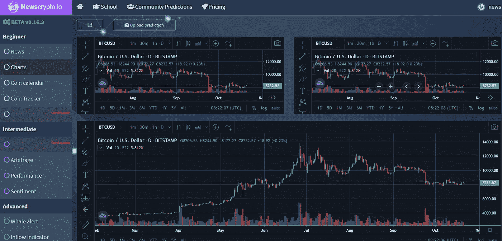
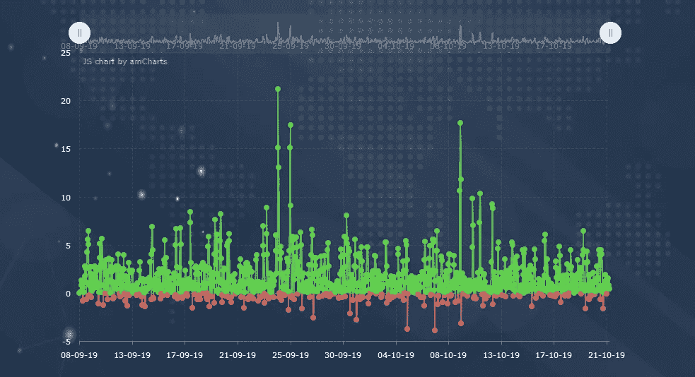
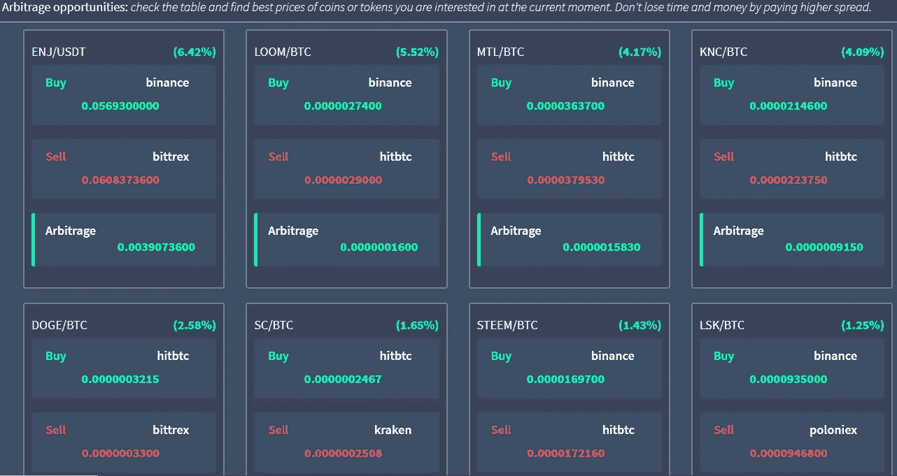

# 对 Newscrypto.io 平台的深入审查

> 原文：<https://medium.datadriveninvestor.com/an-in-depth-review-of-the-newscrypto-io-platform-824c9aade29d?source=collection_archive---------2----------------------->

## Newscrypto.io 平台有其宣称的那么好吗？

现在市面上有很多信息化和加密货币交易平台号称做 ABC，承诺人间天堂，但是哪一个最适合你呢？你怎么知道你找到了适合你需求的那一个呢？

我最近遇到了 [Newscrypto.io](https://newscrypto.io) ，这是一个信息和交易平台，据说在加密货币和区块链设置中的信息、新闻、分析和交易的传播和渗透方面是最好的。Newscrypto.io 平台真的名副其实吗？

 [## 总部位于瑞士的 ETP 进入加密交易市场|数据驱动的投资者

### 虽然金融市场几乎没有沉闷的时刻，特别是在引入…

www.datadriveninvestor.com](https://www.datadriveninvestor.com/2019/03/10/swiss-based-etp-enters-the-crypto-trading-market/) 

在过去的一个月里，我一直以完全访问模式( ***高级层*** )使用该平台——测试并浏览所有可用的信息和数据，以获得健康的用户体验，从而得出关于 NewsCrypto.io 是否是合法平台的知情结论。

## **在选择最佳加密信息和交易平台时，需要考虑哪些重要因素？**

1.  ***硬币/代币质量图表和指标*** —这有助于您分析市场供求趋势以及相关资产的历史表现。
2.  ***直接从平台/图表*** 进行交易的能力——这样你就可以快速有效地利用瞬息万变的市场头寸，这些头寸可能在几秒钟内上涨或下跌。
3.  ***成本*** —包括平台接入费和交易费在内的交易成本，决定了使用平台盈利是否可行。
4.  ***平台可用性选项*** —在一个日益向基于移动平台发展的世界中，用户倾向于选择能够通过手机、笔记本电脑等访问他们的平台。

# **news crypto . io 简评**

***利弊***

*   该平台提供**实时新闻更新**链接到[密码恐慌](https://cryptopanic.com)
*   易于登录/注册
*   对于新手和最资深的交易者来说，可用的工具**易于设置和理解**。
*   全球**实时交易数据**随时可用
*   提供全面教育体验的秘密学校是一个经过深思熟虑的想法，执行得非常出色。
*   NewsCrypto 提供了一个用户可以见面和互动的论坛。
*   价格合理:在撰写本文时，初级免费提供，中级定价为 50 NWC(根据 NWC 上市的交易所之一 [Probit 交易所](https://www.probit.com/app/exchange/NWC-BTC)，大约 1.65 美元)，而高级定价为 100 NWC(大约 3.30 美元)。

***缺点***

*   该平台仍处于测试模式，这意味着它的一些关键功能，如交易和采矿还不可用。
*   NewsCrypto.io 平台仍然是相当新的，这意味着它还没有针对更大的用户群进行全面测试，以完全得出结论。

# 深入的评论

# 好人

1.  ***图表*** —图表位于**初级**下，所有交易者均可免费获得。该门户网站有助于跟踪硬币/代币的价格，订阅源每秒更新一次。在写这篇文章的时候，只有 BTC/美元的图表是可用的和准确的。我期待着其他硬币被添加，因为这将走很长的路。这个标签下的另一个有趣的功能是上传预测选项，交易者可以上传他们自己的图表到平台，以供将来参考。

3.  *****流入指标*** —显示在菲亚特完成的实际存取款。这些信息包括有多少钱通过法定提款离开了 crypto 以及有多少钱正在流入。这告诉交易者在任何给定的时间市场可能走向的方向。**

****

**Inflow Indicator showing actual deposits and withdraws in FIAT (real currencies like Euro, USD Dollar, etc…)**

**4. ***硬币追踪器*** —该功能允许用户将他们在其他地方持有的所有交易导入平台，并计算他们当前的持有量。交易是从各种交易所导入的，如币安、北海巨妖、HitBTC 等。**

# **伟大的**

1.  *****新闻反馈*** —平台上的新闻每分钟更新一次，并来自广泛的来源，从而带来平衡、多样性，同时消除偏见。新闻提要为用户提供了一个选项，可以完美地将对所选新闻项目的讨论转移到 [cryptopanic](https://cryptopanic.com) 以便更好地理解。新闻免费提供。**
2.  **新闻加密学校(news crypto School)——也是免费向所有用户提供的，是一系列简短而强大的课程，以简单易懂的方式提供。**
3.  *****套利*** —这是我最喜欢的 NewsCrypto.io 平台的功能。它提供了通向市场的线索，在市场中，用户可以通过从另一个用户那里购买/出售并在另一个用户那里做相反的事情来获利。这使得使用 NewsCrypto 平台的交易者比他们在市场上的同行更有优势，因为这些套利线索对于中级和高级层用户来说是容易获得的，并且已经计算了从每个交易硬币对和交易所获得的潜在百分比收益。**

5.  *******鲸鱼警报*** —该指标监控所有主要加密货币市场的大买家和大卖家。它向用户提供选项，将他们喜欢的参数设置为他们感兴趣的硬币，反过来，他们会收到实时通知，允许他们采取与市场鲸鱼配对的行动。这意味着当大鲸鱼买卖时,“小家伙”通过新闻加密获益。****

********

****NewsCrypto.io platform provides arbitrage leads to markets where a user can make a profit by buying/selling from and doing the opposite in another at a profit****

# ****不太好****

1.  ****门户网站上的许多选项尚未投入使用，其中包括: ***Altcoin Police，Trading，Correlation*** 和 ***Crypto mining*** 由于该平台仍处于其 **beta 模式**中，这意味着我无法如我所愿地全面体验该平台，但当这些选项可用时，我会继续通过评论部分更新你们的信息。****

# ******结论******

****在使用这个平台整整一个月后，我可以放心地说, [Newscrypto.io](https://newscrypto.io) 团队在这方面有所进展。该平台在大多数情况下都超出了我的预期。****

****我对在中间层发现的套利选择印象深刻，因为我得到了有用的线索，可以利用这些交易对并获得合理的利润。老实说，我在这上面已经有一段时间了！****

****如果您正在寻找一个包罗万象的实时平台，将信息、新闻、分析和最先进的交易工具放入加密市场，那么 Newscrypto 平台是您的最佳选择。****

*****上面这篇文章是从独立的角度写的。上述内容不构成财务建议，在决定是否投资任何金融产品之前，应寻求独立的财务建议。*****

*****如果你喜欢这篇文章，请关注我的*[*Twitter*](https://twitter.com/Tendy263)*/*[*Linkedin*](https://www.linkedin.com/in/tendai-tomu-75903612/)*。*****

*****最好还是买我的书:* ***非洲的天秤座，脸书的天秤座要如何颠覆*** ***非洲****(*[*https://urlzs.com/7kK6P*](https://urlzs.com/7kK6P)*)*****