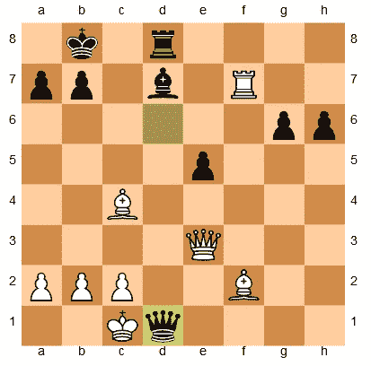
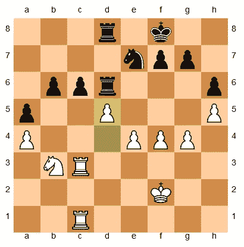

# 计算机象棋的增量评估函数和测试套件

> 原文：<https://medium.datadriveninvestor.com/an-incremental-evaluation-function-and-a-testsuite-for-computer-chess-6fde22aac137?source=collection_archive---------2----------------------->

本文是帖子[https://medium . com/@ Andreas stckl/writing-a-chess-program-in-one-day-30 daff 4610 EC](https://medium.com/@andreasstckl/writing-a-chess-program-in-one-day-30daff4610ec)的续篇

它展示了如何用 Python 编写一个简单的计算机象棋程序，并且包含了象棋引擎的所有主要部分。在这篇文章和以后的文章中，我将展示如何增强这个程序。

代码可以在 https://github.com/astoeckl/mediumchess/[找到](https://github.com/astoeckl/mediumchess/)

前一篇文章中的简单程序有一个非常简单的评估函数，但是评估以及整个搜索过程非常慢，因为搜索中的每个节点都是从头开始评估的。在搜索过程中，位置仅相差一步，因此最好在搜索开始时初始化评估，然后在每次移动后逐步更新评估。

# 增量评估

我定义了一个函数来计算实际位置，并将值存储在一个全局变量中。这个函数在搜索开始时调用一次。

评估函数现在只检查 mate 或 draw，并从全局变量中读取电路板值。

方块表的定义保持不变。

现在，我必须定义一个函数，在每次移动和搜索过程中收回一次移动后更新全局棋盘值。

使用 make_move(mov)和 unmake_move()函数，而不是直接使用 board.push(mov) board.pop()。使用此功能修改搜索功能。

使用新的评估在中间游戏位置上测试搜索显示了更快的搜索过程，对于深度为 5 的搜索大约 2 分钟。用老版本，同样的搜索要半个多小时。

Test position

# 一套测试位置

我想使用一组位置来测试象棋引擎解决战术位置的能力，从而测试搜索的质量。80 年代的 Bratko-Kopec 测试(【https://www.chessprogramming.org/Bratko-Kopec_Test】)就是这类问题的集合。这个测试已经成为计算机国际象棋近 20 年的标准，在我们的时代，测试像我这样的弱引擎是很好的。

我在上面的速度测试中使用的位置是这组中的位置 1。

我导入了[分](https://en.wikipedia.org/wiki/Forsyth%E2%80%93Edwards_Notation)符号中的 24 个位置。

我们可以计算每个位置的搜索，并与解进行比较。例如位置 9。

BK Position 9

现在，我循环所有位置，并计算不同搜索深度的正确解的数量。

对于 3 的搜索深度，它在 15 秒内求解 4 个位置。

对于 4 的搜索深度，它在 2 分 14 秒内求解 5 个位置。

对于 5 的搜索深度，它在 29 分 12 秒内解决 7 个位置。

该程序现在能够在几分钟内解决 24 个测试位置中的一些。在接下来的文章中，我会努力提高搜索的速度和质量。