# 信息图表文摘—第 1 卷

> 原文：<https://medium.datadriveninvestor.com/an-info-graphic-special-everything-you-want-to-know-f59fd714b78e?source=collection_archive---------5----------------------->

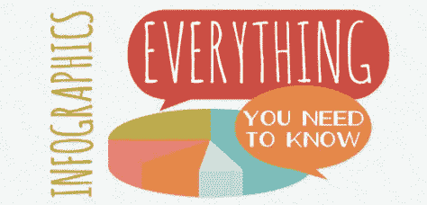

我在推特上转发了很多有用的信息图(金融科技、人工智能、大数据、计算、市场等)。)每天都在我的 Twitter 上发布，但是你永远也不可能找到每个想得到这些有用信息的人，所以我想为什么不把它放在一个博客上发布呢——如果你们喜欢的话，我甚至可以每周发布一次。正如他们所说，一幅画胜过千言万语，所以给你…

## 人工智能(AI):

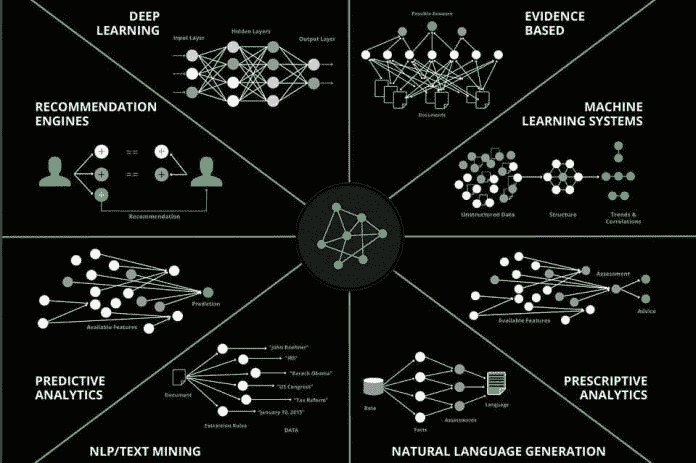

## 大数据:

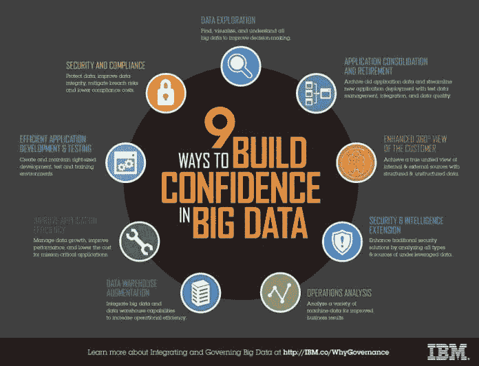

## 区块链:

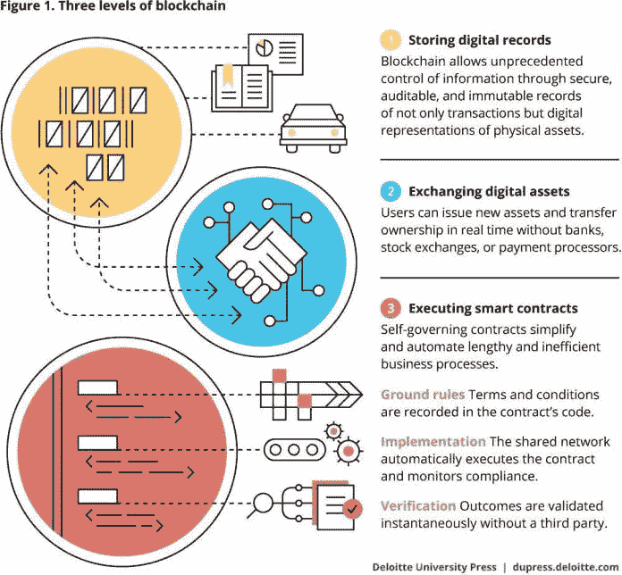

## 机器人:

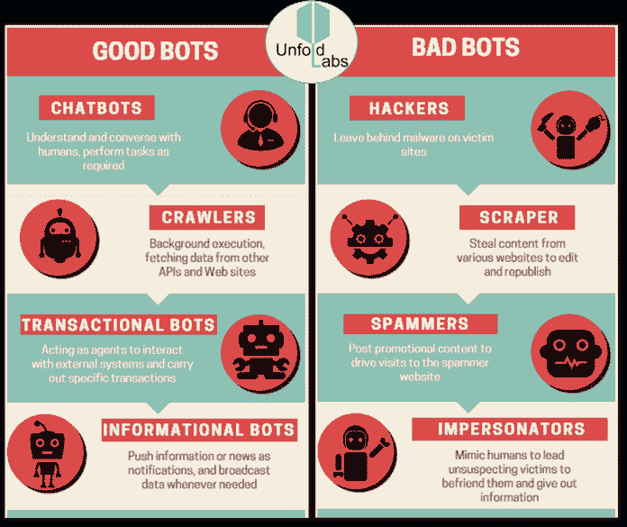

## 加密电流:

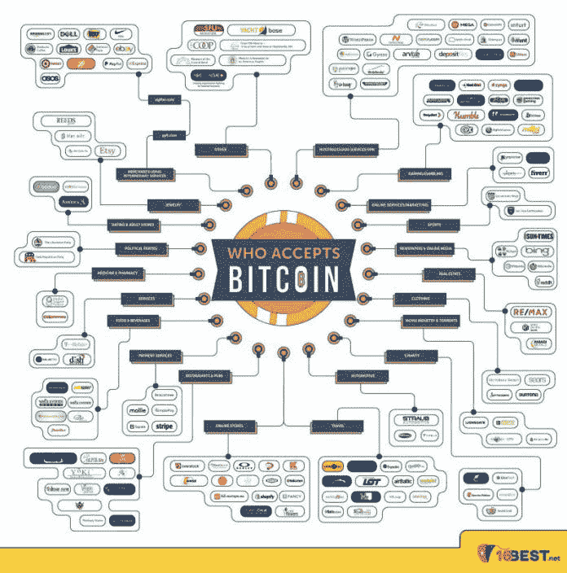

## 云计算:

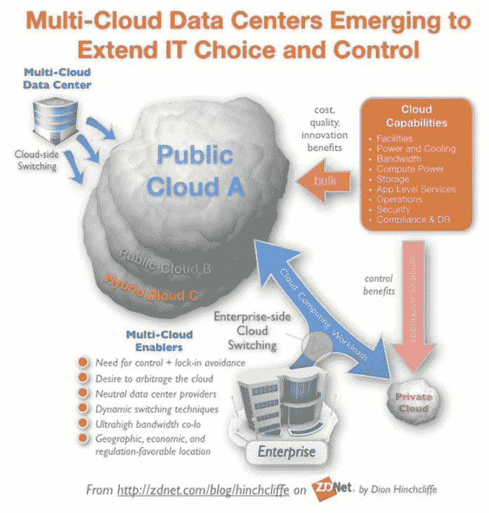

## 网络安全:

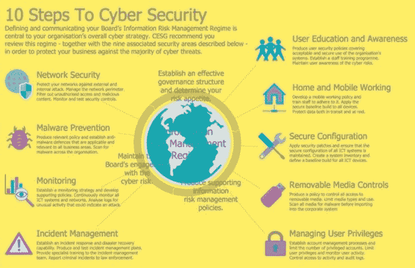

## 暗网:

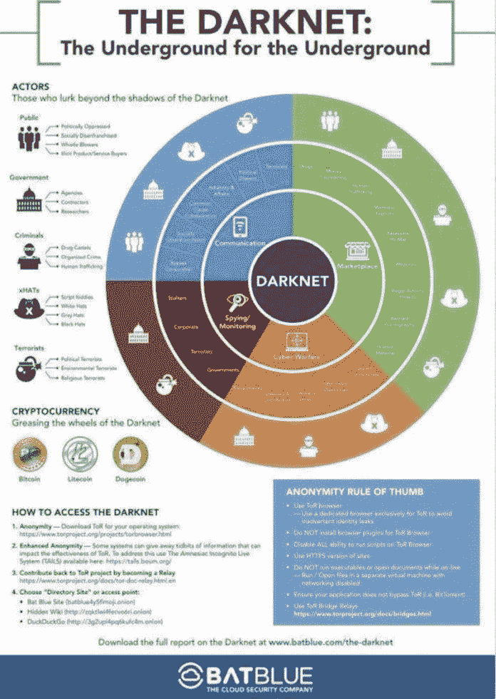

## 金融市场:

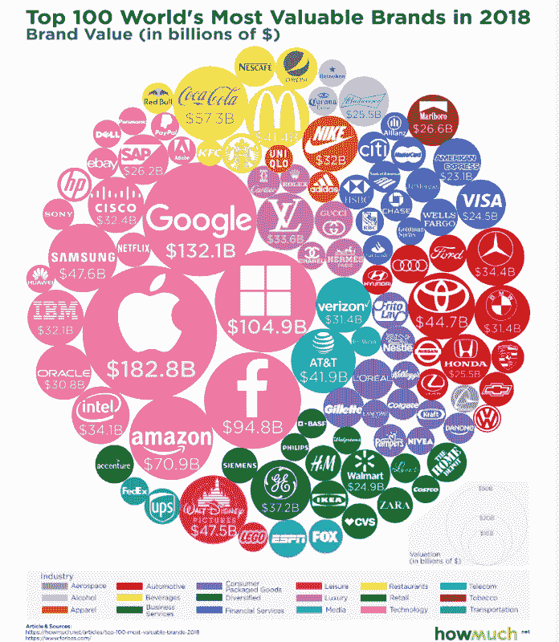

## 金融科技:

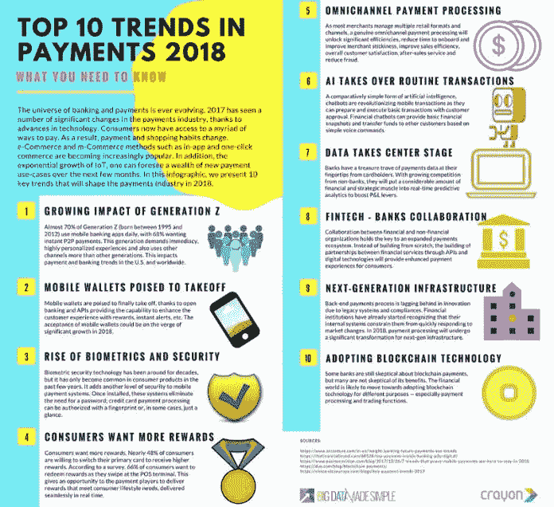

## 未来派:

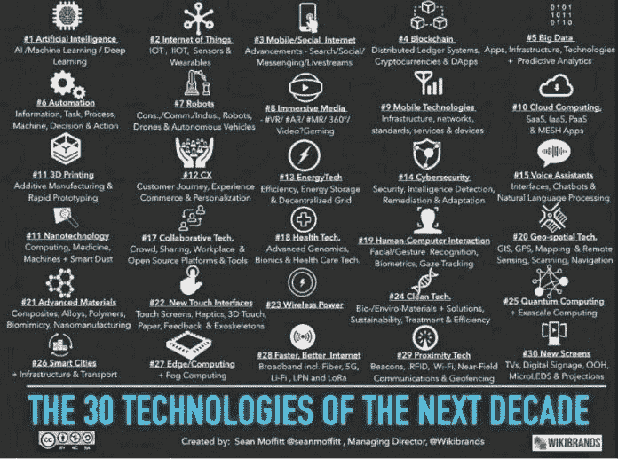

## 工业革命:

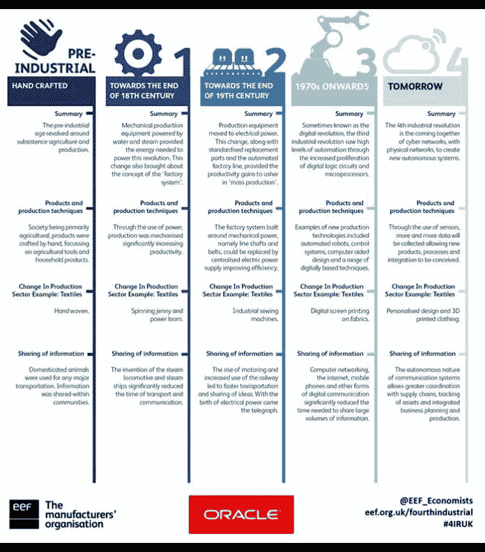

## 物联网(IoT):

## 机器学习:

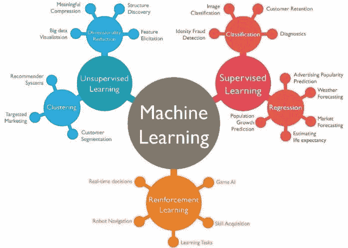

## 交易:

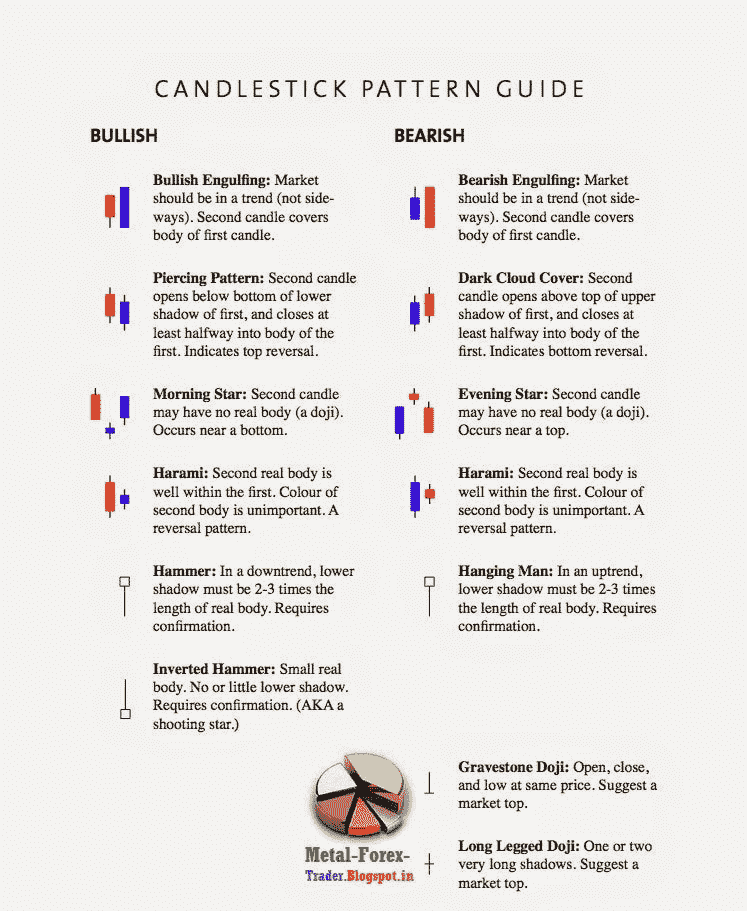

## 虚拟现实(VR):

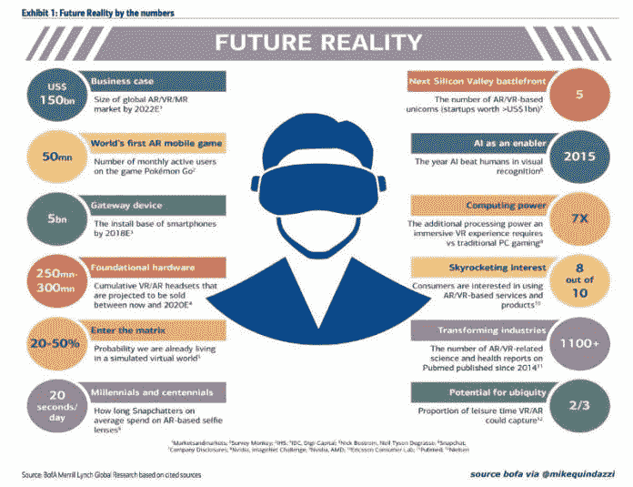

## 未来的工作:

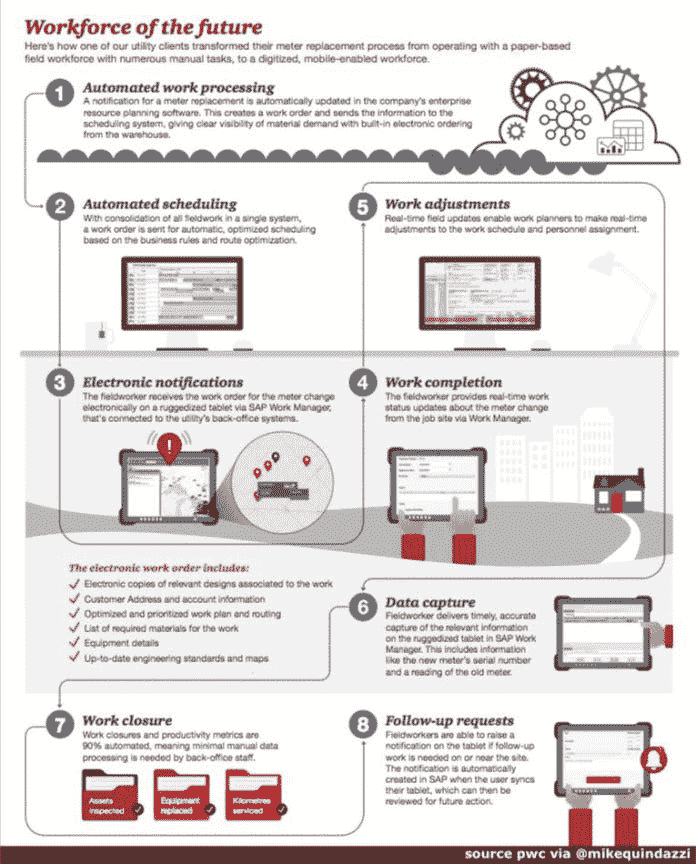

## Web 3.0:

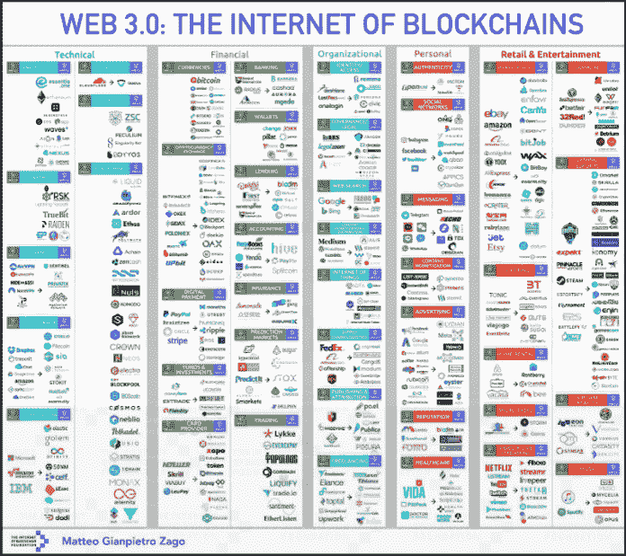

**保持联系:** [推特](https://twitter.com/fklivestolearn) **|** [**斯托克斯**](https://stocktwits.com/trade_nut) **|** [**领英**](https://www.linkedin.com/in/faisal-khan-2a3009b/)|**|**[**trade alike**](http://www.tradealike.com/)**|**[**脸书**](https://www.facebook.com/cryptos.forex.stocks/)

*原载于 2018 年 6 月 20 日*[*datadriveninvestor.com*](http://datadriveninvestor.com/dev/2018/06/20/an-info-graphic-special%E2%80%8A-%E2%80%8Aeverything-you-want-to-know/)*。*