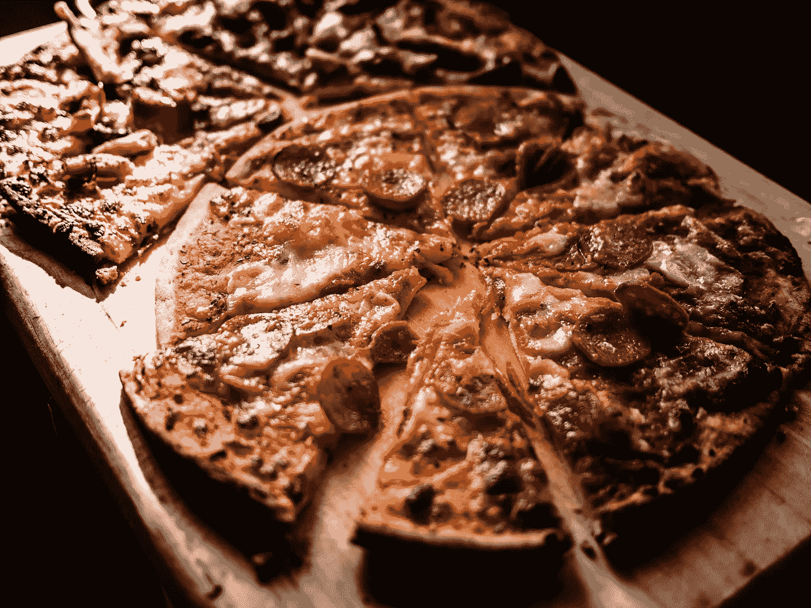
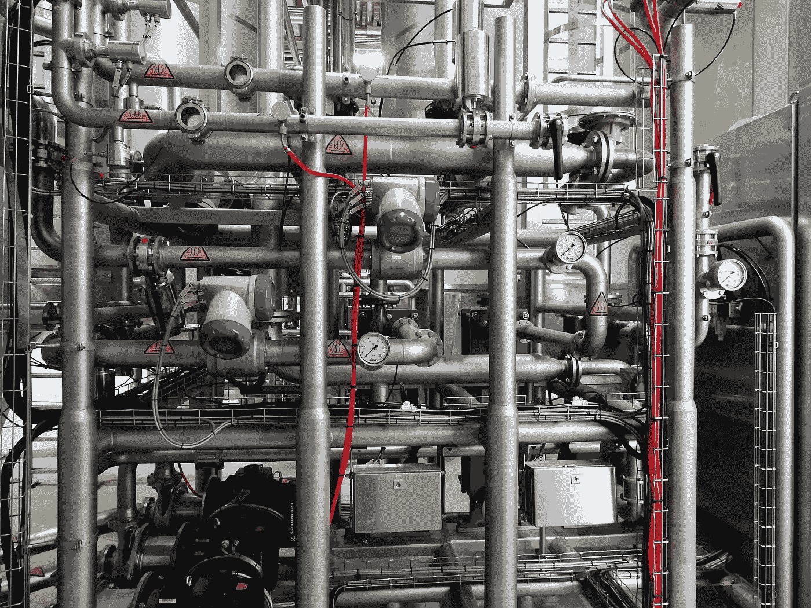

# 后工业时代奶酪的内幕

> 原文：<https://medium.datadriveninvestor.com/an-inside-look-at-post-industrial-cheese-7dbfd6234758?source=collection_archive---------3----------------------->

By T[abitha Mort](https://www.pexels.com/photo/close-up-photography-of-cheese-773253/) at [Pexels](https://www.pexels.com/)

每天早上，我都要开一个小时的车穿过威斯康辛州的乡村，去我在奶酪厂的暑期工作。我醒来时通常会闭上双眼，在黑暗中摸索着关掉闹钟，然后在日出前上路。我会带着困倦的兴趣看着熟悉的绿色牧场和红色谷仓从我身边经过。

在开车的过程中，我最喜欢看奶牛懒洋洋地嚼着它们的干草和青草早餐。有些人会因为拥有新鲜空气和食物而高兴得跳起来。其他人会躺在泥里，拍打成群的苍蝇。

令我感到谦卑的是，与此同时，这一幕正在整个威斯康星州重演，近[130 万头奶牛](http://www.wisconsindairy.org/assets/images/pdf/WisconsinDairyData.pdf) **每天早上都以完全相同的方式被喂养**。早餐后，这些奶牛会被挤奶，它们的鲜奶会被装在保温卡车里运往所有与牛奶相关的生产商——黄油、奶油、奶粉、酸奶等等。但是我们不要忘记威斯康辛州真正的意义——奶酪。

**还有一个奶酪市场？披萨。**

当我开车进入停车场时，我会看到奶酪厂旁边隐约可见的牛奶筒仓。每天三次，数千加仑的牛奶将被泵入这些筒仓。每天，成千上万磅的低水分 A 级马苏里拉奶酪都是由同样的牛奶昼夜不停地新鲜制成，运往全国各地的比萨饼烤箱。

By [Steyn Viljoen](https://www.pexels.com/photo/photography-of-cows-during-sunset-787647/) at [Pexels](https://www.pexels.com/)

# 为奶酪带来自动化

**所有的** [**奶酪制作的基本步骤**](https://www.dairygoodness.ca/cheese/how-cheese-is-made) **依然清晰可见。牛奶经过巴氏灭菌，与凝乳酶(一种用于凝固牛奶蛋白质的消化酶)和其他专有成分混合，煮至完全胶凝，切割，加盐，压制成模具，并在冷盐水中浸泡数天。新形成的块状物被包装起来，放在冷藏设施中，直到它们准备好运送给下游的奶酪加工商和商业客户。奶酪工厂现代化程度惊人，与其说是食品生产设施，不如说更像是一个化学精炼厂。每个房间都有不锈钢管道和设备。**自动化在每一个接缝、泵和管接头处都显而易见。****

电脑屏幕分布在每项操作的各个角落，操作员和主管无需离开座位就能观察和控制过程的每个阶段。至少，奶酪生产的整个操作需要**七名操作员**。几十年前，做同样的工作需要 **20 到 30 人**。

经营这些岗位的经营者已经在这里干了几十年了。他们中的许多人已经经历了从手动到自动系统的相对快速的转变。这一变化受到了大多数人的欢迎，因为它节省了数千小时的繁重劳动。

任务可以从工厂的不同部分执行，允许操作员承担辅助任务，同时保持他们对其利基业务的关注。但奶酪制作突然变成了一个推触摸屏和阅读数字图表的过程，这些任务更符合我们年轻的、手持 iPhone 的一代。

虽然很多年长的经营者通过多年的学习获得了奶酪制作执照，但他们的年轻同事不再需要获得这样的执照。问他们奶酪是怎么做的，他们会一脸茫然的盯着你。经验丰富的奶酪老兵可能会期待即将到来的退休，但很明显，他们怀念过去制作奶酪的方式，当他们离开时，这些知识将会丢失。

By [Brett Jordan](https://www.pexels.com/photo/pizza-on-brown-wooden-board-825661/) at [Pexels](https://www.pexels.com/)

# 行业的经济现实

随着商品比萨饼奶酪的市场价格徘徊在每磅 1 美元左右，一切削减成本的努力变得势在必行。这主要是通过保持奶酪中蛋白质和水分的精确水平来保证的——水基本上是免费的，而牛奶蛋白总是要花钱的。

奶酪厂面对严酷的生产经济现实的方式与伊卡洛斯的神话没有什么不同。水分含量过低，牛奶价格(和蛋白质质量)波动会使工厂面临破产的风险。飞得太接近法定水分上限****，他们的奶酪就会在客户经营的火热披萨烤箱中蒸发殆尽。这些现实驱使我们需要不断的监控和调整。计算机和人类都会产生无穷无尽的数据，每天都要对这些数据进行仔细研究，以确保最高的生产率。现代奶酪制作需要一定程度的统计精确度，而人类的技能工具箱中根本没有这种精确度。因此，在奶酪行业，自动化将继续在市场上超越人工。经理的角色仍将保留，但会越来越关注自动化系统优化。管理层已经做了大量的工作来扑灭由错误的计算机程序引起的火灾。****

****

**By [Pixabay](https://www.pexels.com/photo/equipment-factory-industrial-industry-371938/) at [Pexels](https://www.pexels.com/)**

# **持续的劳动力短缺**

**具有讽刺意味的是，缺乏好的、稳定的劳动力是围绕饮水机讨论中出现的另一个问题。很少有年轻的工人想以他们在奶酪厂的职位为终身职业。有些人把这个机会作为短期跳板，通过去职业学校或夜校寻找更赚钱的工作。其他人只是在劳动力大军中进进出出，不确定未来就业的下一步。**

**这是可以理解的，特别是考虑到自动化和人工智能的不断进步可能会很快让他们的位置过时。尽管如此，留下来的经营者和劳动者仍然以他们的工作为荣。该厂生产的大部分奶酪将继续供给他们自己的家庭和社区，即使只是通过拜占庭式的国家分配过程以一种间接的方式。**

**尽管劳动力需求存在不确定性，奶酪生产仍然是农村地区薪酬最高和最稳定的工作之一，许多人仍然留在离家近的地方，而不是搬到麦迪逊或密尔沃基这样的“大”城市寻找更多的潜在机会。**

**一些人抱着获得管理职位的渴望，承诺更高的薪酬、更多的责任和来自同龄人的认可。一名工人甚至每周加班 80 小时，几乎接近令人垂涎的六位数收入。

到最后，比萨奶酪还会继续生产，以满足全球比萨消费者的无尽需求。快餐比萨连锁店和冷冻比萨产品提供的便利，以及其他富含奶酪的食品，将继续推动对这种低成本马苏里拉奶酪的需求。而 [**在中国**](https://www.nytimes.com/2016/07/01/world/what-in-the-world/china-cheese-pizza.html) 的前景看好的市场，其日益壮大的中产阶级正从**必胜客**和**达美乐**等公司那里获得对美国披萨的喜爱，这将使这些披萨奶酪生产商在未来几十年继续经营下去。**

**这只是他们的奶酪是否会再次由人类手工制作的问题。**

**喜欢你刚刚读的吗？这里有一些我写的关于食物和风味的文章，供你阅读。**

**[**香草，一种传说中的味道**](https://medium.com/@bryanquocle/vanilla-a-legendary-flavor-6f5691cb6a0d)**

**[**方便面**](https://medium.com/@bryanquocle/instant-ramen-421be88d971d)**