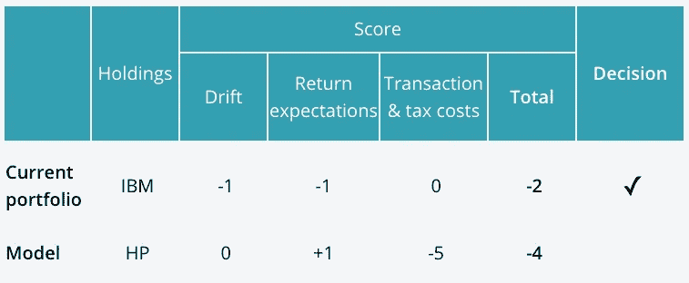
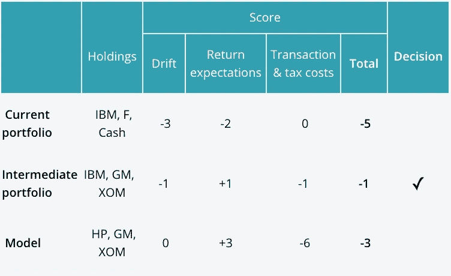

# 优化者的内部指南

> 原文：<https://medium.datadriveninvestor.com/an-insiders-guide-to-optimizers-b6e85afdcd75?source=collection_archive---------43----------------------->

杰拉德·迈克尔

*优化器如何工作*

作为这篇博客的读者，你无疑知道优化器——即使只是模糊地知道。它们已经成为管理复杂的定制和税务管理投资组合的标准工具。但是，它们究竟是如何工作的呢？如果你想知道，也许我们能帮上忙。这是一份内部人士的优化指南。(很棒的素材。读读这篇文章，你肯定会成为派对的焦点。[1])

要了解它们是如何工作的，请想一想老式的天平。假设 IBM 在一个模型中被惠普取代，我们试图决定，在一个特定的投资组合中，是卖掉 IBM 还是买惠普。在标尺的左侧，我们放置了所有有利于销售的因素(例如，减少漂移和提高预期回报)。在天平的右侧，我们将所有有利于*而非*销售的因素(例如，降低税收和交易成本)放在一起。如果天平向左倾斜，我们就卖出。如果天平向右倾斜，我们保持不动。

这是它的本质，但是，当然，在现实生活中，它更复杂。

首先，我们实际上不能把东西放在天平上。相反，我们给每个我们考虑的因素一个数字分数。然后，对于任何一组交易和任何由此产生的投资组合，我们把所有的分数加起来，看哪一个分数最高。在我们的例子中，我们将计算持有 IBM 的总得分，将一个负数加到漂移上，一个负数加到回报预期上。对于出售 IBM 和购买惠普，我们将为回报预期加上一个正数，为税收和交易成本加上一个负数。我们比较这两个投资组合的总额，选择较高的一个。它看起来像这样:

在这个例子中，持有 IBM 的股票会赢，因为它的分数更高。

第二个复杂因素是，我们的目标不仅仅是对某一单笔交易做出决定(卖出 IBM，买入 MSFT)。我们正在对投资组合中的每个头寸做出决策，而这些决策不能独立做出。风险和漂移不是单一头寸的属性；它们是整个投资组合的属性。在其他条件相同的情况下，在 IBM 的仓位过重会导致漂移。但其他一切可能都不平等。如果有一个“永远不买惠普”的限制，让投资组合减持惠普，增持 IBM 可能会*降低*整体漂移(因为 IBM 是缺失的惠普头寸的一个很好的替代品)。

因此，我们不希望仅仅通过出售 IBM 和购买惠普来得分。我们要给每一种可能的允许买卖组合打分(计算为总税收、漂移和交易成本的总和)，并选择得分最高的一种。它可能看起来像这样:

在这个例子中，购买模型比保持当前的投资组合更好，但还有一个更好的中间选择，我们持有 IBM 以减少税收和交易成本，但在其他方面购买模型。

优化者不会给每一个可能的组合打分。他们从现有的投资组合开始，并逐渐发现使事情变得更好的小变化。你可以把它想象成一个试图找到山顶的徒步旅行者。无论你在哪里，只要朝着上坡的方向前进，当你不能再往上走的时候就停下来。[2]

如您所料，实际构建优化器逻辑需要很多细节。其中包括:

*   *服从约束。*你不能考虑每一个投资组合，只能考虑那些服从约束的。这些可以是适用于所有账户的基本约束，比如“你不能花得比你拥有的多”(不能用保证金购买)或者“你不能拥有负股”(不能卖空)。或者它们可以是帐户特定的，如“永远不要卖沃尔玛”和“永远不要买烟草”。
*   *处理相互冲突的约束。*有时约束会发生冲突。例如，可能无法同时遵守税务预算和资产类别最小/最大约束。您需要决定优化器应该做什么。返回一个“我不能这样做”的错误信息？或者让其中一个约束优先于另一个约束？
*   *你需要一个统一的漂移度量。*在上面的例子中，我们谈到了漂移，但从未描述如何测量它。标准的方法是使用预期“跟踪误差”，定义为(等等)两个投资组合之间收益差异分布的估计标准差。跟踪误差通常使用风险模型来计算(这是它自己的故事——可能是未来帖子的主题)。
*   不在嘈杂的数据上交易。漂移和返回估计不精确。如果你把它们视为未来的完美预测者，你最终会交易太多，可能会下过于集中的赌注。你需要采取对策来防止嘈杂的数据导致嘈杂的交易。
*   *损失收割。*损失收获意味着出售头寸，不是因为你本质上想摆脱它，而是为了实现可以用来降低税收的资本损失。通常情况下，你卖出头寸，然后在 31 天后(即所谓的洗盘后)再买回。但是，在未实现亏损的情况下，卖出头寸的最佳价格是多少呢？您希望至少涵盖往返交易成本(否则您在整个过程中都在赔钱)。但仅仅弥补交易成本不会带来任何净收益，这毫无意义。所以你需要覆盖的不仅仅是交易成本。但是多了多少呢？对此有一个最佳策略，并且需要将其纳入流程中。
*   *短期收益。*当面对短期获利的加码头寸时，你不只有两种选择(卖出或不卖出)，而是有三种选择(现在卖出，以后长期时卖出，或不卖出)。因此，你所看到的选择需要扩展到包括“以后再卖”选项。

优化器旨在帮助顾问做出更好的权衡决策。但它们是复杂的工具，而且，传统上，它们只被“宽客”使用。这使得它们的部署成本很高，因此它们对私人账户的应用非常局限于高净值(HNW)和超高净值(UHNW)投资组合。

但这种情况正在改变。由于自动化的进步，现在对所有帐户使用它们很经济，甚至是机器人帐户(你可以在这里了解 Smartleaf 如何使用优化器:[smart leaf 和优化器的区别](https://www.smartleaf.com/our-thinking/smartleaf-blog/the-difference-between-smartleaf-and-an-optimizer))。因此，它们的用途正在扩大，提供曾经是超高净值账户专属的定制服务正成为“赌注”。我们认为这是最理想的。

***【1】****警告:不是真的。我们不建议在聚会上谈论优化者。*

***【2】****这个程序并不是万无一失的。有一种危险不是在顶峰，而是在露头的顶端(所谓的“局部最大值”)。优化者采取措施来避免这种情况。*

*原载于***。**