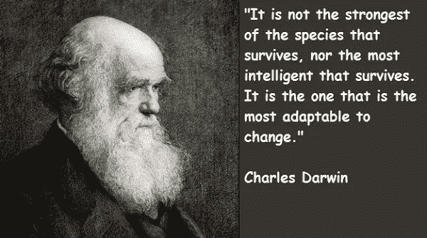
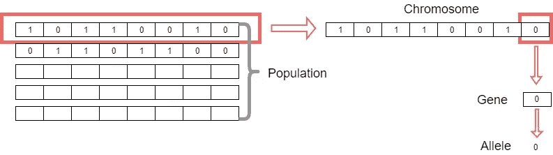
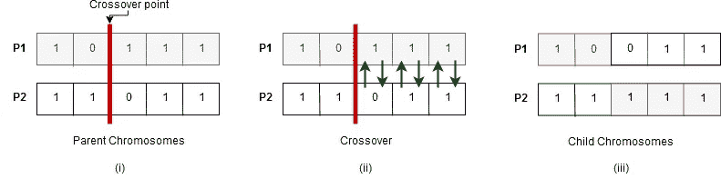
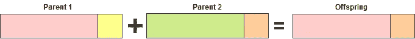
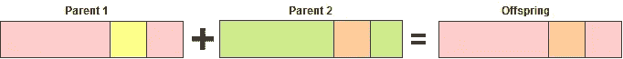
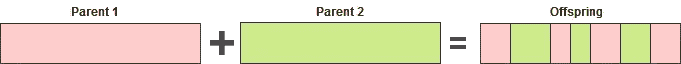
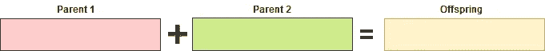
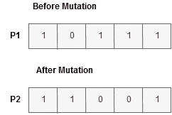
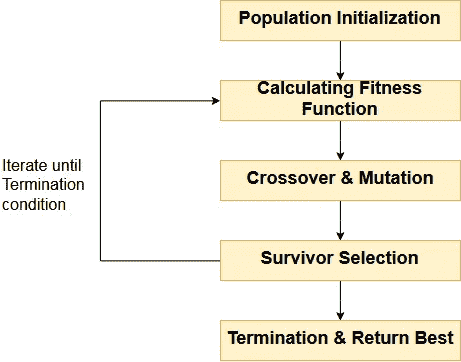
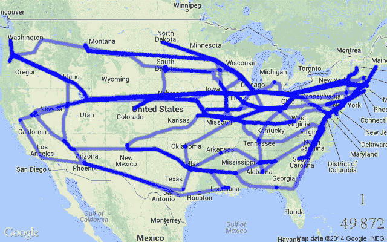

# 遗传算法透视——第一部分

> 原文：<https://medium.datadriveninvestor.com/an-insight-to-genetic-algorithms-part-i-a7f5a5d6d214?source=collection_archive---------7----------------------->

让我们从查尔斯·达尔文的名言开始:

***“生存下来的不是物种中最强的，也不是最聪明的，而是最能适应变化的。”***

你一定想知道这句话和遗传算法有什么关系？实际上，遗传算法的整个概念就在于上面的引用！

遗传算法是一种基于 T4 搜索的优化技术，基于达尔文的自然选择原理。这是 20 世纪 70 年代推出的一种新颖的人工智能技术。它有能力解决通过任何其他技术如人工神经网络无法解决的问题。

大自然一直是全人类灵感的巨大源泉。遗传算法是基于自然选择和遗传学的生物学概念的搜索算法。遗传算法是一个更深层次的计算分支的子集，被称为进化计算。

遗传算法最初是由密歇根大学的霍兰德和他的学生及同事开发的。值得注意的是，戴维·e·戈德堡(David E. Goldberg)已经尝试了各种优化问题，并在遗传算法方面取得了很大的成功。

在遗传算法中，对于给定的问题，我们有一个**池或一群可能的解决方案**。这些解决方案然后经历一些遗传操作，产生新的子代，该过程在各代中重复。每个个体(或候选解)基于评估函数值被分配一个适应值，并且更适合的个体被给予更高的机会来交配并产生更多“更适合”的个体。这符合**达尔文的“适者生存**”理论。

通过这种方式，我们不断“进化”更好的个体或解决方案，直到我们达到一个终止标准。

## **优化**

优化就是**让某样东西变得更好的过程。**

优化指的是找到输入值，使我们获得“最佳”输出值。“最佳”的定义因问题而异，但在数学术语中，它指的是通过改变输入参数来最大化或最小化一个或多个目标函数。

输入可以采用的所有可能的解或值的集合构成了搜索空间。在这个搜索空间中，有一个点或一组点给出了最优解。优化目的是找到搜索空间中的点或点集。

## **进化算法**

进化算法执行的主要任务是**优化**。传统算法和进化算法之间的区别在于，进化算法是动态的，因此它们可以随着时间而进化，并且可以有效地用于表示频繁变化的信息。

进化算法有三个主要特征:

**1。基于群体的**:进化算法是优化一个过程，在这个过程中，当前的解决方案集是坏的/不是最优的，以生成新的/更好的/最优的解决方案。这里所指的当前解的集合称为总体。

**2。面向适应度:**每个单独的解决方案都有一个适应度值，该值由适应度函数计算得出。这个适应值反映了解决方案好到什么程度。

**3。变异驱动:**根据每个个体计算出的适应度函数，如果当前种群中没有可接受的解，就要进行适应，产生新的更好的解。因此，单个解决方案将经历许多变化，简单地迭代生成新的解决方案。

# 遗传算法——动机

遗传算法具有提供“足够好”和“足够快”的解决方案的惊人能力。这使得遗传算法在解决现实世界的问题时很有吸引力。需要遗传算法的原因如下

1)解决难题

想象一下有一大堆复杂的问题需要解决的情况。即使是最强大的计算系统也需要很长时间(甚至几年)来解决这样的难题。在这种情况下，遗传算法被证明是在短时间内提供可用的近似最优解的有效工具。

**2)快速获得更好/最优的解决方案**

一些现实世界的问题可能有许多解决方案。在现实生活中，我们遇到的情况只需要手头最合适的答案。例如，在船坞中存储不同尺寸的集装箱，在房屋图中安排房间，使得最终获得相同的房屋面积，在货架中存储货物，使得存在最小的空间浪费。像旅行推销员问题和超大规模集成电路设计这样的寻路问题也可以用遗传算法来解决。

**3)处理动态信息**

回想一下，人工神经网络需要收集长时间的数据，并且数据应该能够表示系统试图预测的未来的每个状态。该网络无法处理模型开发时无法获得的奇怪信息。遗传算法通过能够为动态变化的数据提供解决方案来解决这个问题。因为遗传算法可以有效地用于交通灯控制系统、天气预报以及预测股票市场的趋势和模式。

**4)获得相似的解**

你有没有想过通过分析和寻找以前中奖彩票号码中的一个模式来赢得彩票号码？遗传算法能够为我们需要发现一些匹配的相似解的这种情况提供解决方案。神奇！不是吗？

**5)发现不可预见的解决方案**

我们遇到过这样的情况，孩子的性格与他们的父母几乎完全不同。根据这种遗传现象，很明显，遗传算法可以用来发现不可预见的解决方案。这一特性可以用于设计房屋或公司的内部建筑等情况。

**6)检查是否有解决方案**

遗传算法可用于系统中，以检查给定问题是否有解决方案。例如，有些问题不能用线性规划来解决，但可以用遗传算法来解决。除此之外，遗传算法还被用于确定波音 747 巨型喷气式飞机涡轮的形状。早些时候，据计算，如果只使用超级计算机、微积分和线性编程，大约需要 10 年才能完成。

**7)随机实验的科学解决方案**

当一个给定的问题有多种可能的解决方案时，我们倾向于使用随机答案作为解决方案。但是随机答案不一定是问题的最优解。遗传算法可以为这种随机实验提供更有把握的答案。例如，想象一位大学讲师通过从大量问题列表中选择问题来准备试卷。如果使用遗传算法，他可以准备包含高质量问题的试卷。

# 基本术语

遗传算法属于以下基本原理术语，您需要熟悉这些术语。

***群体** —它是给定问题的所有可能(编码)解决方案的子集。简单地说，这是一组个体，每个个体都是我们想要解决的问题的解决方案。

* **染色体**——染色体是给定问题的一种解决方案。

***基因**——基因是染色体的一个元素位置。群体中的个体由一组参数(变量)表征，它们是独特的，称为基因。基本上是基因连成一串，形成一条染色体(解)。

***等位基因**——它是一个特定染色体的基因值。

Population, Chromosomes, Gene and Allele

***基因型**——基因型是计算空间中的总体。在计算空间中，解决方案以一种使用计算系统可以容易理解和操作的方式来表示。

***表现型**—表现型是实际现实世界解决方案空间中的群体，在该空间中，解决方案以其在现实世界中的表现方式来表现。

***解码和编码**—解码是将解从基因型转换到表型空间的过程，而编码是将表型转换到基因型空间的过程。

***适应度函数/评估函数—**适应度函数评估给定解决方案与所需问题的最佳解决方案的接近程度。它决定了特定解决方案的适合程度。

***遗传算子**——这些算子改变后代的遗传组成。这些包括交叉、变异、选择等。

# 选择

**选择**阶段的想法是选择最适合的个体，让他们把基因传递给下一代。

两对个体(**父母**)基于他们的适应性分数被选择。高适合度的个体有更多的机会被选择交配。

# **交叉**

受精发生在染色体基因交换的过程中。到目前为止，杂交就是这样一种基因交换机制。这是遗传算法中最重要的阶段之一。交叉是染色体之间最常见的遗传操作。这里，对于每一对要交配的父母，从基因中随机选择一个交叉点。

在交叉中，后代是通过在它们之间交换父母的基因来产生的，直到到达交叉点。通过父母之间交换基因的过程，新的后代被添加到群体中。

例如，考虑在亲代染色体的基因 2 和 3 之间选择的交叉点，如下面的(I)所示。这里(I)分别显示了亲代染色体，(ii)交叉操作和(iii)产生的子代染色体/子代。

Crossover Operation

基本上，有如下 4 种类型的交叉。

> **单点交叉—** 选择一个交叉点，从染色体开始到交叉点的二进制串从一个亲本复制，其余的从第二个亲本复制。

Single point crossover

> **例:-1 1 0 0 1 0 1 1+1 1 0 1 1 1 1 1 = 1 1 0 0 1 1 1 1 1 1**

> **两点交叉—** 选择两个交叉点，从染色体开始到第一个交叉点的二进制串从一个亲本复制，从第一个到第二个交叉点的部分从第二个亲本复制，其余部分从第一个亲本复制。

Two point crossover

> **举例:-1 1 0 0 1 0 1 1+1 1 0 1 1 1 1 1 = 1 1 0 1 1 1 1 1 1 1 1**

> u**n form crossover—**位随机从第一个或第二个父节点复制。

Uniform Crossover

> **例:-1 1 0 0 1 0 1 1+1 1 0 1 1 1 1 = 1 1 0 1 1 1 1 1 1 1 1 1 1**

> **算术交叉—** 执行一些算术运算以产生新的后代

Arithmetic crossover

> **例:-1 1 0 0 1 0 1 1+1 1 0 1 1 1 1 = 1 1 0 0 1 0 0 1 0 1(AND)**

请注意，在交叉过程中，亲代染色体直接传递给后代。因此，后代与他们的父母有几乎或某些相似的特征。

# **突变**

在某些情况下，我们看到孩子与他们的父母相比有几乎不同的特点。这是染色体之间发生突变的结果。在这里，染色体中的一些基因被翻转，得到完全相反的值。

请注意，交叉是染色体中经常发生的现象，而突变很少发生，因此随机概率很低。交叉发生在两条染色体之间，而突变发生在一条染色体内的一个/多个基因中。

Mutation: Before and After

因为非弹簧手具有完全不同的特征；变异的发生是为了保持群体的多样性，防止过早收敛。因此，突变总是给种群增加一种干扰/随机性/噪声。所以突变在遗传学中也被称为**随机添加/噪声添加操作**。

# 遗传算法的基本过程

遗传算法的基本结构如下。

这个过程应该从一个初始群体开始，这个群体可以是随机产生的，也可以是由其他启发式算法产生的。接下来，使用评估函数，从该群体中选择父母进行交配。然后将交叉和变异算子应用于父代以产生新的子代。最后，这些子代取代了群体中现有的个体，这一过程不断重复。这就是遗传算法模拟人类进化的方式。整个过程可以结合流程图如下。

Basic Process of a Genetic Algorithm

# 遗传算法的应用

遗传算法主要用于优化问题，然后他们也经常用于其他应用领域。

下面是遗传算法经常使用的一些领域。这些是

**-优化**-遗传算法最常用于优化问题，在这些问题中，我们必须在给定的一组约束条件下最大化或最小化给定的评估函数值。

**-人工神经网络**-训练神经网络，主要是递归神经网络。

**-金融部门**-在金融市场中，遗传算法最常用于寻找交易规则中参数的最佳组合值，它们可以内置于旨在挑选股票和识别交易的人工神经网络模型中。

**-经济学**-描述各种经济模型的特征，如蛛网模型、资产定价、博弈论均衡解析等。

**-并行化**-遗传算法具有非常好的并行能力，并被证明是解决某些问题的非常有效的手段，也提供了一个很好的研究领域。

**-图像处理**-遗传算法用于各种数字图像处理应用，如密集像素匹配。

**-农业部门** -精准农业是农业部门的新趋势，它主要基于农场管理的决策支持系统(DSS)，目标是在保护资源的同时优化投入回报。遗传算法用于精确农业系统，以确定温室中的最佳营养组合，确定最佳种植模式，以及开发农业推广代理等。

**-调度应用**-遗传算法用于解决各种调度问题，例如，时间表问题。

**-机器人轨迹生成**-规划机器人手臂从一点移动到另一点的路径。

**-飞机的参数化设计**通过改变参数和发展更好的解决方案来设计飞机。

**-DNA 分析**-利用样本的光谱数据确定 DNA 的结构。

**多模态优化**——遗传算法显然是非常好的多模态优化方法，在这种方法中，我们必须找到多个最优解。

**旅行推销员问题及其应用**——遗传算法已被用于解决旅行推销员问题，这是一个众所周知的组合问题，采用了新颖的交叉和打包策略。

Traveling Salesman Problem.Source: [link](http://mathgifs.blogspot.com/2014/03/the-traveling-salesman.html)

# **遗传算法的局限性**

像任何科学技术一样，遗传算法也有一些局限性。这些包括

I)不适用于所有问题，尤其是简单的和有导数信息的问题。

ii)适应值被重复计算，这对于某些问题可能在计算上是昂贵的。

iii)需要具有高处理能力和容量的计算机。因为当遗传算法运行时，需要大量空间来存储不断增长的种群。

iv)如果没有足够的处理能力和计算机容量，则需要更多的时间来产生结果。

v)由于是随机的，所以不能保证最优解或解的质量。

vi)如果执行不当，遗传算法可能不会收敛到最优解。

# 遗传算法的实现

本节包括一个用 Python 开发的演示应用程序，演示遗传算法是如何工作的。

这个例子使用基因的十进制表示、单点交叉和一致突变。

演示的目的是最大化一个等式。这里，遗传算法被用于在若干代之后获得最佳可能值。

该解决方案可从以下网址获得:-

 [## ChathurangiShyalika/遗传算法

### 通过在 GitHub 上创建一个帐户，为 ChathurangiShyalika/遗传算法开发做出贡献。

github.com](https://github.com/ChathurangiShyalika/Genetic-Algorithms) 

在我的下一篇博文中，我将提供更多关于这个实现的细节。

希望你通过这个倡议博客帖子有一个清晰的认识。如果你对这篇博文有任何问题或评论，请在下面留下你的评论。

干杯！

# 参考

[1]《搜索、优化和机器学习中的遗传算法》作者**大卫·e·戈德堡**。

[2]人工智能作者**AS Karunananda 教授**

【3[https://www . LinkedIn . com/pulse/introduction-optimization-genetic-algorithm-Ahmed-gad/](https://www.linkedin.com/pulse/introduction-optimization-genetic-algorithm-ahmed-gad/)

[4[]https://www . kdnugges . com/2018/03/introduction-optimization-with-genetic-algorithm . html](https://www.kdnuggets.com/2018/03/introduction-optimization-with-genetic-algorithm.html)

【5[】https://www . analyticsvidhya . com/blog/2017/07/introduction-to-genetic-algorithm/](https://www.analyticsvidhya.com/blog/2017/07/introduction-to-genetic-algorithm/)

[6[]http://mathgifs . blogspot . com/2014/03/the-traveling-salesman . html](http://mathgifs.blogspot.com/2014/03/the-traveling-salesman.html)

【7[】http://www . obit ko . com/tutorials/genetic-algorithms/crossover-mutation . PHP](http://www.obitko.com/tutorials/genetic-algorithms/crossover-mutation.php)