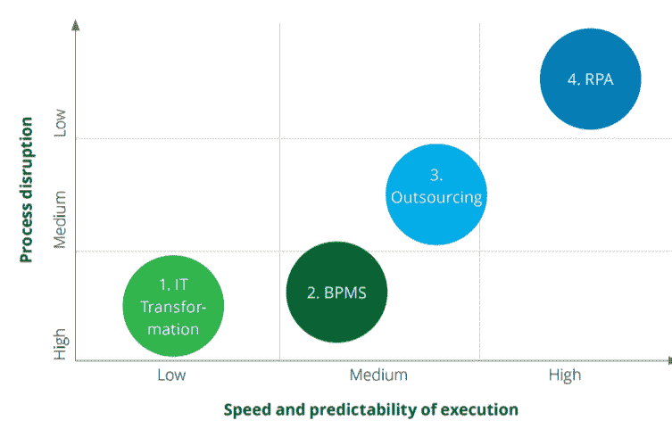
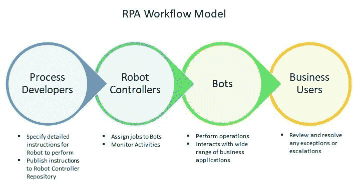
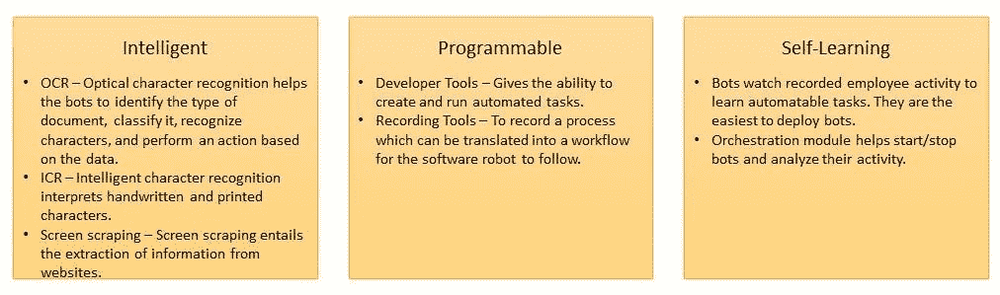
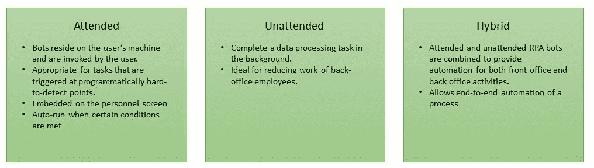
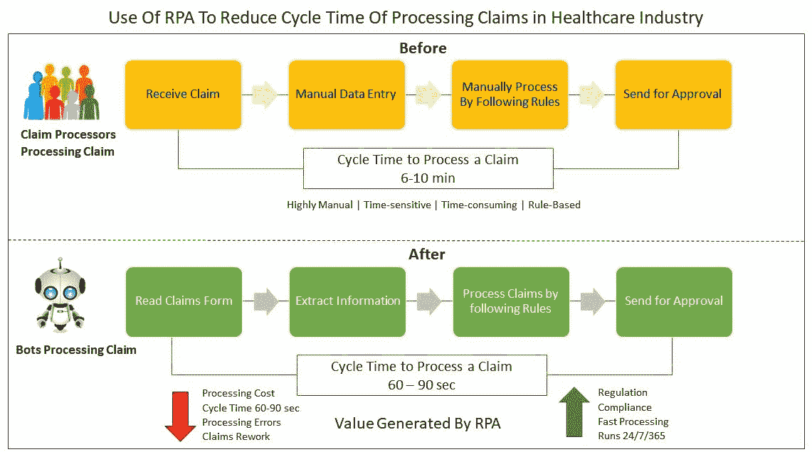
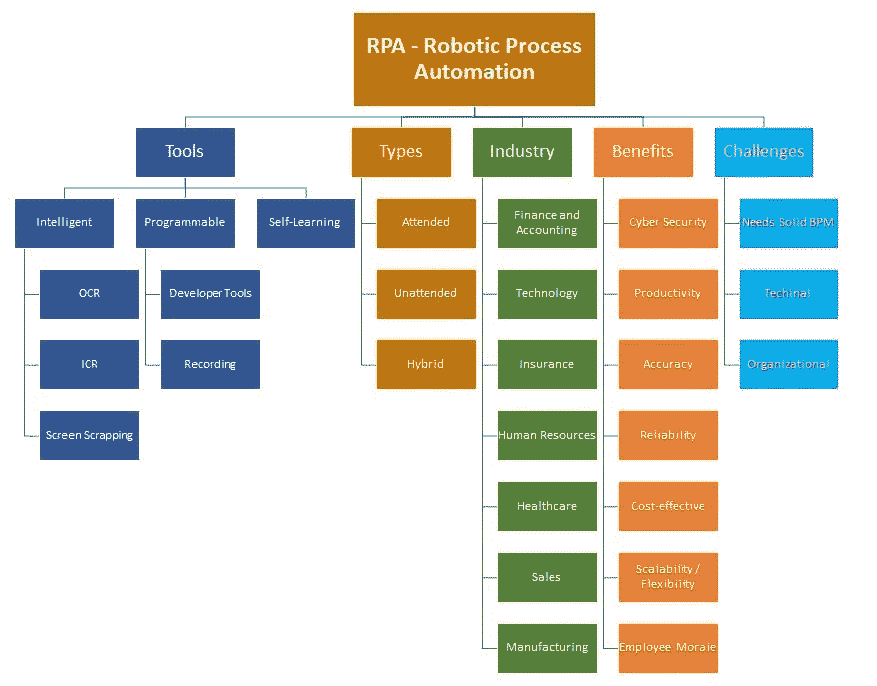

# 对机器人和智能过程自动化的认识

> 原文：<https://medium.datadriveninvestor.com/an-insight-to-robotic-and-intelligent-process-automation-1a8686a160fd?source=collection_archive---------1----------------------->

在这个人工智能的时代，机器人可以模仿人类的思维，超越人类；名为 RPA 的新时代流程自动化工具“机器人流程自动化”已经引起了很多关注。它是高度通用的，每个行业都可以使用它来简化和优化他们的业务流程。从数据输入到索赔处理再到自动付款，RPA 都可以完成。

根据 Forrester 的报告，RPA 市场将从 2016 年的 2.5 亿美元增长到 2021 年的 29 亿美元。(未注明日期的克莱尔)

RPA 有着巨大的潜力，一些企业已经开始意识到 RPA 可以带来的好处，以及通过实施 RPA 来改进其流程和降低成本的潜力。

# RPA 是什么？

RPA 使用由业务逻辑和规则控制的自动化系统来简化和优化流程。它们被称为“机器人”，它们有助于高效和有效地执行可重复的、基于规则的任务。被雇佣来执行后台操作过程的普通知识员工有许多重复的、例行的任务，这些任务是乏味和无趣的。RPA 工具模拟人类在流程中执行定义明确、基于规则的任务的活动。它可以比人类更快、更准确、更勤奋地完成重复性和例行任务，因此它们可以执行其他需要与客户互动并需要情商、推理和判断的任务。仅在前 12 个月，RPA 系统的投资回报率就可以达到 30%到 200%。(莱斯利·威尔科克，荷兰)

# 为什么是 RPA？

可以受益于 RPA 的业务流程通常与 it 应用程序具有可重复且可预测的交互，包括那些可能需要在多个应用程序或屏幕之间切换的应用程序。如果没有 RPA，那么企业将不得不通过实施 IT 驱动的转型来重新设计他们的流程，或者外包他们的运营，但是 RPA“机器人”可以通过模拟人类通过用户界面与应用程序交互的方式，并遵循简单的规则来做出决策，来执行这些日常业务流程。常规业务流程的一个例子是从一个系统中检索信息，并将相同的信息输入到另一个系统中。其他任务，如打开电子邮件和附件、数据处理以及与企业工具集成。RPA 比任何人类都更快更准。例如，研究表明，机器人可以在仅仅 60 秒内完成人类需要 15 分钟才能完成的任务。

RPA 与传统的流程转换方法相比

来源:德勤分析

# RPA 是如何工作的？

下面是企业如何使用 RPA 执行任务的工作流模型。流程开发人员向机器人指定执行任务的详细指令，并在机器人控制器中发布这些信息。控制器给机器人分配任务并监控它们的活动。机器人执行任务，并与广泛的业务应用程序进行交互。一旦执行了任务，业务用户就审查任务中的任何例外或升级。(彼得·劳斯，荷兰)

# RPA 工具

RPA 工具有 3 种类型—智能、可编程和自学。

# RPA 的类型

RPA 有 3 种类型—有人值守、无人值守和混合式。

# RPA 在不同行业中的使用

RPA 可以惠及任何行业。对于使用传统系统的公司或大部分员工在后台从事非技术职能的企业来说，这是一个非常好的解决方案。下面是 RPA 可用于简化流程的几个示例。(应用人工智能博客，未注明日期)

**销售** —开具并交付发票，更新 CRM。

**客户服务** —自动化重复性任务，解决客户问题，加载配置文件，或获取客户数据。

**技术** —软件安装

**财务** —对账、财务规划或损益准备。

**人力资源** —候选人搜寻、员工历史记录验证、雇用和入职、薪资自动化、费用管理、员工数据管理。

**操作** —更新库存记录，发放退款。

**银行** —贷款处理，KYC。

**零售** —产品分类。

**下面是一个来自医疗保健行业的使用案例，展示了 RPA 如何通过使用 RPA 工具减少处理索赔所需的时间来转变索赔处理流程**。

# RPA 的优势

**灵活性** — RPA 适用于所有行业和组织。它易于扩展，可以承担任何基于规则的重复性任务。

**经济高效** —通过实施 RPA，企业将能够减少执行低效运营流程所花费的时间和金钱。

**生产力** — RPA 可以显著提高生产力。RPA 产品通常带有拖放界面，这有助于员工，因为他们不需要在编码或其他复杂领域接受额外培训。

**可靠性** —机器人可以全天候工作。它提供了超越人类劳动的速度和精确度。

**准确性** —无论过程有多乏味、重复或基于规则，机器人都会遵循规则，确保准确性和可靠的结果。RPA 在容易出现人为错误的角色中尤其有用。

**员工士气** — RPA 是提高员工效率的一种途径。它让员工专注于增值任务。

**网络安全**——机器人不会被常见的网络相关攻击(如鱼叉式网络钓鱼和社会工程)打败。(亚当·马斯普拉特，未注明日期)

# 实施 RPA 的挑战

**需要扎实的业务流程管理** — RPA 不会思考也不会学习；企业希望使用 RPA 实现自动化的流程需要在实施前进行优化。无效的过程会使组织容易受到一大堆问题的影响，尤其是当它们被自动化时。问题的范围从因浪费导致的成本超支，到对服务或产品产生负面影响的错误。

**组织支持** —自上而下支持卓越运营是有效业务流程管理的基础。高管的认同是必不可少的，他们还需要在流程改进工作中宣传自动化的重要性。

**技术陷阱** —选择难以使用的 RPA 工具可能会减缓开发和改进工作，因为 RPA 解决方案的部署时间可能会比预期的长。

# RPA 的下一步是什么？

大型 IT 公司正在开发内部 RPA 工具，并与提供自动化软件解决方案的供应商合作。目前，大多数 RPA 解决方案都提供基于规则的解决方案，但是我们正在慢慢向能够提供基于知识和判断的能力的 RPA 解决方案发展。

# RPA 概览

参考

亚当·马斯普拉特。(未注明)。*机器人流程自动化指南*。检索自[https://www . processexcellencenetwork . com/RPA-artificial-intelligence/articles/a-guide-to-robotic-process-automation-RPA](https://www.processexcellencenetwork.com/rpa-artificial-intelligence/articles/a-guide-to-robotic-process-automation-rpa)

应用人工智能博客。(未注明)。 *45 个 RPA 使用案例/应用:深入指南*。检索自[https://blog . applied ai . com/robotic-process-automation-use-cases/# insurance](https://blog.appliedai.com/robotic-process-automation-use-cases/#insurance)

克莱尔，加州大学洛杉矶分校。*到 2021 年，RPA 市场将达到 29 亿美元*。检索自[https://www . Forrester . com/report/到 2021 年，RPA+市场+将达到+290 亿+/-/E-RES 137229](https://www.forrester.com/report/The+RPA+Market+Will+Reach+29+Billion+By+2021/-/E-RES137229)

莱斯利·威尔科克。(未注明)。*机器人流程自动化的价值*。检索自[https://www . McKinsey . com/industries/financial-services/our-insights/the-value of-robotic-process-automation](https://www.mckinsey.com/industries/financial-services/our-insights/the-value-of-robotic-process-automation)

彼得·劳斯。(未注明)。*机器人过程自动化指南*。检索自[https://www2 . Deloitte . com/us/en/pages/operations/articles/a-guide-to-robotic-process-automation-and-intelligent-automation . html](https://www2.deloitte.com/us/en/pages/operations/articles/a-guide-to-robotic-process-automation-and-intelligent-automation.html)

实验室咨询。(未注明)。*医疗保险的机器人流程自动化——索赔中的机器人用例*。从 https://thelabconsulting.com/health-insurance-rpa-use-case/[取回](https://thelabconsulting.com/health-insurance-rpa-use-case/)