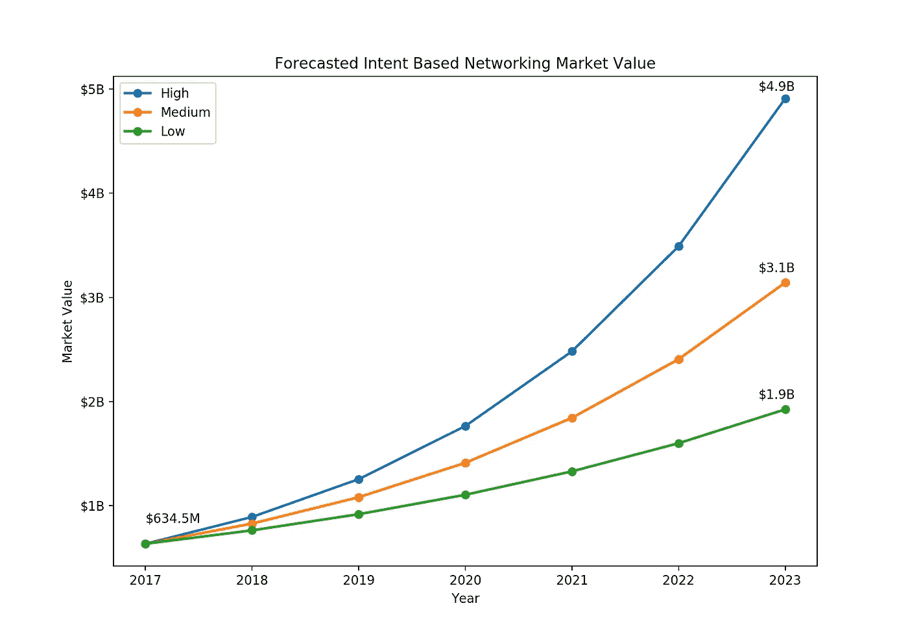
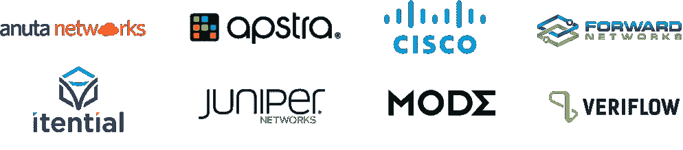

# 基于意图的未来

> 原文：<https://medium.datadriveninvestor.com/an-intent-based-future-1e1145ff3172?source=collection_archive---------3----------------------->

***预测 IBN 的出现***

Photo by [Anastasia Dulgier](https://unsplash.com/photos/OKOOGO578eo?utm_source=unsplash&utm_medium=referral&utm_content=creditCopyText) on [Unsplash](https://unsplash.com/search/photos/network?utm_source=unsplash&utm_medium=referral&utm_content=creditCopyText)

自 2017 年由 Gartner 推广以来，术语“基于意图的网络”(IBN)一直在 IT 界流行。在初期，IBN 更多的是一个宽泛的概念，如何实现这一愿景的细节仍在不断变化。虽然人们一致认为 IBN 将是未来网络的核心，但一个主要障碍在于对 IBN 的具体构成存在分歧。

 [## 金融中的机器学习——数据驱动的投资者

### 在我们讲述一些机器学习金融应用之前，我们先来了解一下什么是机器学习。机器…

www.datadriveninvestor.com](https://www.datadriveninvestor.com/2019/02/08/machine-learning-in-finance/) 

IBN 是一款用于规划、设计、实施和运行网络的网络软件。IBN 的主要目标是以自动化的方式提高网络可用性和敏捷性。

2017 年， [Gartner](https://blogs.gartner.com/andrew-lerner/2017/02/07/intent-based-networking/) 提供了一套标准来定义 IBN 解决方案。

1.**转换和验证** —在较高的层面上，IBN 解决方案采用总体意图或业务策略，并配置/验证网络以满足该意图。

2.**自动化实施** — IBN 解决方案必须能够通过网络协调或自动化来配置现有网络的网络变更。

3.**感知网络状态** — IBN 解决方案接收实时网络状态数据，确保系统管理人员准确感知网络状态。

4.**保证和动态优化/补救**——IBN 解决方案必须持续验证和核实原始业务意图的执行情况。如果检测到问题，IBN 解决方案可以采取纠正措施来恢复预期的网络行为。

Source: [https://www.veriflow.net/verification-intent-based-networking-closing-control-loop/](https://www.veriflow.net/verification-intent-based-networking-closing-control-loop/)

在此后的两年中，IBN 的出现与同一时期机器学习(ML)实践的发展密切相关。这不是巧合，因为 IBN 解决方案在执行业务策略时严重依赖 ML 来学习基线网络行为的能力。IBN 出现的另一个驱动因素是分析和配置企业网络所需的网络工具质量不高。网络配置在很大程度上仍然是通过手动 CLI 方法来处理的，这是一个非常容易出现人为错误的繁琐过程。IBN 解决方案通过关注业务策略而不是特定于基础架构的配置来缓解这一问题。

Gartner [预测](https://blogs.gartner.com/andrew-lerner/2017/07/11/intent-based-networking-faq/) IBN 在 2020 年之前不会成为主流技术。现在，随着受物联网影响的企业网络变得越来越大、越来越复杂，市场已经为增长做好了准备。没有 IBN，管理拥有无数设备的网络将会非常困难。此外，随着软件定义网络(SDN)的不断发展，IBN 将能够共存并增强这些网络，因为 IBN 解决方案可以驱动 SDN 和非 SDN 网络。

# **Trace3 研究市场预测**

Trace3 设想了未来四年 IBN 市场的三种潜在情况(见下图)。根据市场搜索 Future 的[预测](https://www.marketresearchfuture.com/reports/intent-based-networking-market-6846)，2017 年 IBN 市场价值 6.345 亿美元。这个数据点用于三个场景的起点。所有预测值都四舍五入到最接近的一亿。

Source: [Trace3 Research](https://www.trace3.com/innovation/research)

## **1。** **高增长(CAGR = ~40%)**

**置信度:15%**

根据 Market Search Future 的[预测](https://www.marketresearchfuture.com/reports/intent-based-networking-market-6846)，IBN 市场预计将以 40%的复合年增长率(CAGR)从 2017 年的 6.345 亿美元增长到 2023 年的 49 亿美元。这一预测在 2017 年首次做出时是乐观的，因为基于意图的网络在今年早些时候从 Gartner 和思科制作的内容中获得了巨大的动力。此外，在过去五年中，风险投资界向一些新兴公司(Forward Networks、Mode、Veriflow、Itential、Apstra)提供了约 5500 万美元的资金，其中包括最近两年的近 4000 万美元。然而，自 2017 年以来，除了 2018 年的 Mode 之外，对任何新兴参与者的风险投资都很少。这可能是由于技术功能落后于最初动力所设定的预期。因此，这种高增长结果似乎不太可能出现。为了实现这一目标，IBN 工具的功能必须变得更加强大和可靠，才能正确地驱动网络。

## **2。** **中等增长(CAGR = ~30%)**

**信心:60%**

2019 年来自研究和市场的一份[报告](https://www.globenewswire.com/news-release/2019/02/22/1740159/0/en/Global-Intent-Based-Networking-Market-2019-2024-IBN-by-Technology-Infrastructure-Solutions-Deployment-Type-Network-and-Connection-Organization-Type-and-Industry-Verticals.html)预测增长率略低，以 30%的 CAGR 计算，该市场到 2024 年将达到 41 亿美元(到 2023 年将达到 31 亿美元)。这一预测似乎纠正了市场搜索未来报告中的一些乐观情绪。谷歌趋势对基于意图的网络的搜索支持这一修正，因为该词的受欢迎程度在 2018 年初达到顶峰，然后进入波动期，永远不会完全回到之前的势头水平。

Source: [Google Trends](https://trends.google.com/trends/explore?date=today%205-y&q=intent%20based%20networking)

Trace3 以更高的信心看待这种情况，这似乎是 IBN 市场未来的一个可能基线，即使工具的功能稍微落后于最初的预期，这种情况也可能发生。许多参与者为客户提供了重要的附加值，以完成乏味的任务，如网络映射和“假设”分析。虽然它们的上限可能低于完全自治的 IBN，但这些工具具有推动市场增长的巨大潜力。

## **3。** **低增长(CAGR = ~20%)**

**置信度:25%**

还有一种可能的情况是，IBN 技术未能获得广泛的市场采用，市场增长明显低于预期。要实现这一点，IBN 领域的技术进步将不得不停止，并大大落后于市场预期。如果 IBN 解决方案不能提供比标准网络自动化解决方案(Ansible、Puppet、Salt 等)更简单、更高效的网络控制。)，新客户不会有采用新技术的动力。或者，新的竞争技术的出现，如不需要供应意图的自主、自我修复网络，可能会导致这种低增长结果。Trace3 怀疑这种结果是否会发生，因为新兴的 IBN 厂商继续在市场上看到相对的势头，并且 IBN 与其他网络技术(如 SDN)具有内在的兼容性和一致性。同样值得注意的是，这仍然是一个快速的增长率，尽管与其他情景相比，它被归类为“低”。

## **谁是 IBN 市场的参与者？**

以下是目前提供各种 IBN 解决方案的几家公司:

*在* [*了解更多 https://www.trace3.com/innovation/research*](https://www.trace3.com/innovation/research)