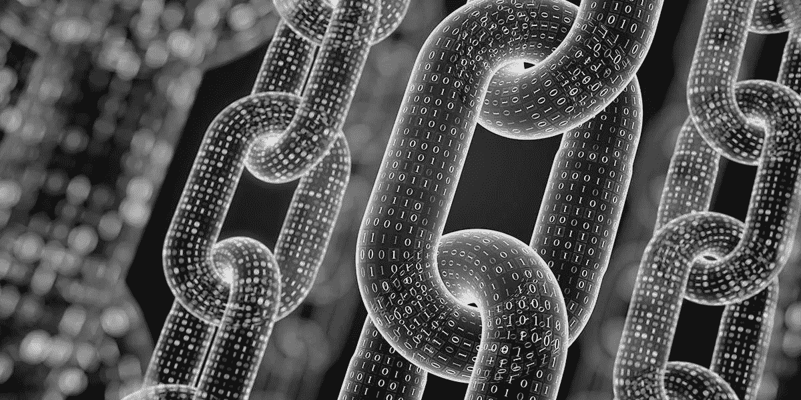

# 区块链简介

> 原文：<https://medium.datadriveninvestor.com/an-intro-to-blockchain-5ce66cfc57d5?source=collection_archive---------19----------------------->

到目前为止，几乎每个人都听说过比特币和区块链，但对大多数人来说，这是一项我们只有粗略了解的技术。当你深入研究这项技术及其对从金融交易到组织土地所有权和其他政府文件的一切影响时，你会意识到区块链有巨大的潜力可以做好事。它有能力创建智能契约(写入代码的自动执行契约)，更重要的是，它有能力大幅提高许多领域中集成的信任级别。

 [## 十大区块链课程-数据驱动的投资者

### 渴望在区块链发展吗？你想知道区块链是如何工作的，但不知道在哪里？或者就是太多了…

www.datadriveninvestor.com](https://www.datadriveninvestor.com/2019/03/08/top-10-blockchain-courses/) 

那么区块链到底是什么？区块链本质上是互联网的新层(有人称之为信任层)。对于互联网来说，它将像万维网最初的样子一样具有变革性。它将允许人们控制自己的身份，并将减少至少一级中间人，从而提高信息的透明度和安全性。

我将区块链定义为一个廉洁的点对点公共数据库，它可以用来永久记录交易，使交易完全可供公众查看，同时在交易的发起者和接收者周围保持极高的私人安全级别。该系统通过强有力的激励计划来维护，激励任何有兴趣成为永久公共记录保存流程一部分的人。

它是如何工作的？区块链技术的主要区别在于它是分散的。现在世界上大多数数据库都是集中存储的。例如，想象一下脸书的数据库或你的银行的数据库，它们所有的客户信息都存储在一个地方。虽然我们“相信”这些实体会保护我们的信息安全，但我们仍然目睹了数十起重大的身份盗窃案件，在这些案件中，黑客访问并窃取了大量信息数据库，包括密码、信用卡信息和个人信息(出生日期、地址等)。).通过分散这些数据库，黑客将有更多的工作要做，以窃取价值无限低的信息。区块链机制使用数百、数千甚至数百万个“公共节点”(任何类型的有兴趣下载软件并使用其处理能力加入系统的计算机或服务器)来维护每个数据库。这些节点受到硬币或代币(表示价值)的激励，通过称为“证明或工作”、“股权证明”或其他技术选项的机制成为这一“信任层”的一部分。

区块链技术从何而来？一个中本聪笔名的人在 2008 年 10 月 31 日向几位著名的编码者发布了一份白皮书，描述了这项技术，第一个代码(比特币是第一个被发布的区块链)于 2009 年 1 月 9 日发布。区块链的名字来源于这项技术的工作原理。块(数字信息)存储在公共数据库(链)中，并通过称为哈希的东西连接起来，哈希是一种同时加密信息、给信息打上时间戳并将块链接在一起的方法。使用这种方法，虽然信息在块内是安全的，但块链是公共的，因此我们看到“身份 1”在特定时刻将“对象或服务 A”(存储在块内)出售给了“身份 2”。“身份 2”现在可以随心所欲地控制那个“街区”。这种方法确保了同一物品不能被出售超过一次，同样的代币或硬币也不能被使用超过一次。请注意，资产交易只是区块链用途的一个例子。

我特意写了身份 1，而不是“约翰”或“玛丽”，因为区块链允许没有身份的所有权。如果我有资金，我可以通过这个信任层转移资金，它保证我的资金存在，并在我收到资产时转移资金，而不必暴露我的真实身份。

区块链安全吗？虽然有些人可能会认为，由于区块链在多个公共节点上共享所有信息，所有人都可以访问这些信息，因此隐私性会降低，但事实恰恰相反。虽然信息存储在任何地方，并有时间标记，但系统本身实际上不可能被破坏，数据实际上被保护在块中，只有当您有数字密钥(您的私人访问代码)时，您才可以访问。

这种隐私级别引起了全球许多政府的关注，因为处于合法商业利益错误一方的人们正在使用像区块链这样的技术来资助恐怖活动和其他邪恶活动，因为他们被赋予了这样做的隐私。没错，但是我最近读到 80-90%的美国和加拿大钞票上都有微量的可卡因。这证明了法定货币不像区块链那样容易受到邪恶的人的攻击，而且有了区块链，虽然你不能确定它的主人，但你可以一直追踪这些钱。它是数字的和永久的。

在以后的文章中，我会提供一些区块链用法的例子，特别是当它们与发展中国家相关时。如果这有助于你了解区块链的基本情况，请告诉我。

Derek Kopke 是一名高级业务发展主管和顾问。他到过超过 65 个国家，在全球 80 多个国家完成了销售。作为一名教育学本科生和国际商务 MBA，他独特的世界观和全球文化经验给了他宝贵的经验，他将这些经验用于对海外发展感兴趣的公司。德里克与妻子和两个十几岁的孩子住在加拿大蒙特利尔。