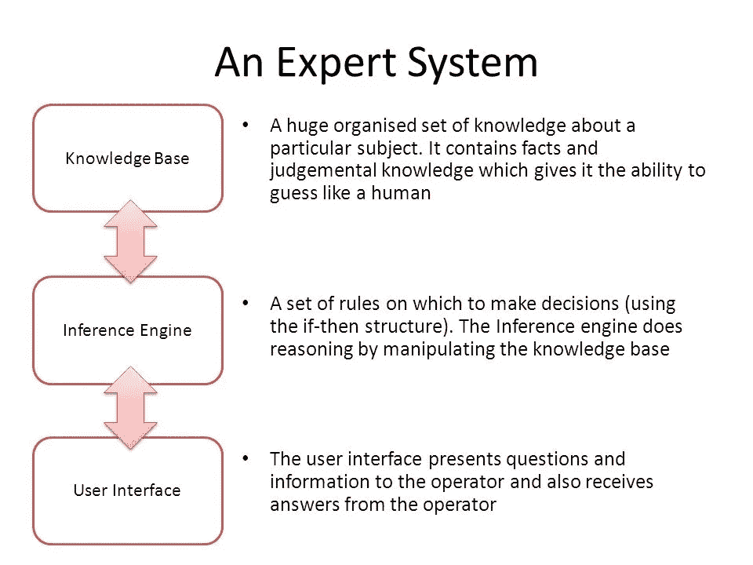
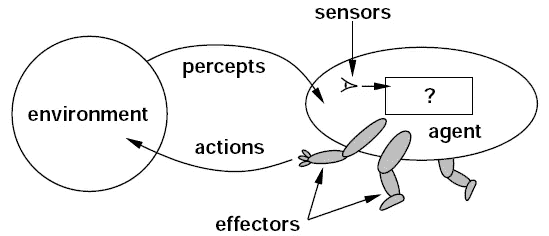
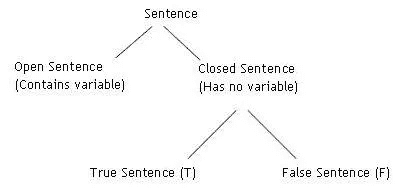

# 基于知识的代理介绍

> 原文：<https://medium.datadriveninvestor.com/an-introduction-into-knowledge-based-agents-4e5c4ea0e8a?source=collection_archive---------3----------------------->

## 本文是关于基于知识的代理、知识表示和逻辑的多部分讨论的第一部分。

在人工智能领域的早期，关注的焦点是知识库和创建与它们交互的代理。这导致了我们现在称之为“[专家系统](https://en.wikipedia.org/wiki/Expert_system)的东西的产生这些都是复杂的系统，需要一个中央知识库，然后可以用“如果-那么”的方式进行复杂的决策和推理。一些人称这些系统是人工智能的第一次重大突破，而另一些人则认为专家系统甚至不属于人工智能的范畴。



尽管如此，基于知识的代理和知识库仍然与我们当前的人工智能工作相关。如果你从事过自然语言处理的工作，你可能会遇到像 WordNet 这样的知识库。或者你可能熟悉维基百科，一个描述实体间各种语义关系的大型知识库。

想想我们在现代互联网时代可以访问的这个和其他巨大的知识库，就引出了一个问题:我们如何构建与知识库交互的代理，更新它们并根据其中包含的知识做出复杂的决策？值得我们花时间吗？它能帮助人工智能向前发展吗？


不管怎样，反思这些想法和基于知识的代理的想法是有用的。本文是关于基于知识的代理、知识表示和逻辑的多部分讨论的第一部分。

# 知识型代理有什么？

代理是在环境中起作用的任何东西。在人工智能中，有人可能会说，我们正试图研究和创造理性的代理人，代理人在环境中以有意义的方式行事。在我们完全理解行动-反应对的环境中，我们可以说一个主体在选择会产生预期结果的行动时是理性的。在具有任何程度不确定性的环境中，我们可以说一个主体是理性的，如果它以这样一种方式行动，给它带来最高程度的期望结果。



但是，如果我们希望创造一个不是纯粹反动的代理人呢？如果我们希望创造一个智能体，它保持知识的内部状态，对知识进行推理，并在观察和采取行动时更新知识，会怎么样？这就是基于知识的代理和基于知识的智能的思想。

# 知识库

任何基于知识的代理的核心部分是它的知识库，就像你根据它的名字所想的那样。从现在开始，在这篇文章中，我们经常将知识库称为 KB。

知识库总是由一组句子组成。不是自然语言的句子，而是用不同类型的语言写成的句子，一种[知识表示语言](https://en.wikipedia.org/wiki/List_of_constructed_languages#Knowledge_representation)。

知识表示语言只是一种以简洁的方式表示关于世界的断言的语言，可以很好地进行推理。因此，为什么我们可能关心用知识表示语言来构造我们的代理人的知识库。

不是从知识库中的任何其他东西派生出来的、只是被假定为真的句子被命名为[公理](https://en.wikipedia.org/wiki/Axiom)(如果你熟悉任何数学背景的术语，这将是一个自然的标签)。

任何从知识库中派生出来的句子都被认为是推断出来的。这些句子不是编造的，它们只是根据已知的东西推断出来的。这可以通过具有一组规则的逻辑推理来实现，这些规则甚至可以自然地来自知识表示语言。



# 代理人的行为

为了与知识库进行交互，任何基于知识的代理都需要两个动作:问和说。

提问是代理如何从知识库中提取信息。我们可以说一个代理问了一个“问题”,或者我们可以说一个代理通过 Ask 操作查询了它的知识库。重要的是代理将其请求格式化为知识库所期望的格式(可能是知识表示语言),并且知识库用存储在知识库中或从知识库中的信息推断出的句子来响应这样的请求。这保证了知识库给出的响应不会与知识库中保存的任何知识相矛盾。

当我们不向知识库询问信息时，我们可能希望用新信息更新知识库。也许我们的代理已经观察到了环境中的变化，或者希望用它已经制定了计划或采取了行动的知识来更新知识库。这就是我们使用 Tell 动作的目的。像 ask 一样，我们需要正确地格式化我们的知识。知识库将获取我们新格式化的句子并存储它，也许通过推理和推断过程更新它自己。

# 通用知识代理

那么，从高层次上看，知识型代理是什么样的呢？也许是这样的:

```
def kb_agent(percept):   
   Tell(KB, make_percept_sentence(percept, t)) 
   action = Ask(KB, make_action_query(t))
   Tell(KB, make_action_sentence(action, t))   
   t = t + 1
   return action
```

我们来分析一下这是怎么回事。

我们可以把它想象成一个函数，它接收环境的感知，通过告诉动作更新知识库，询问知识库要采取什么动作，然后告诉知识库它正在采取这样的动作。

在两个函数`make_percept_sentence`和`make_action_sentence`中，我们将编写逻辑，将感知和动作格式化为适当的知识表示语言。同样，我们可以将函数`make_action_query`理解为一个函数，它采用一个时间步长，并用知识表示语言创建一个查询，这样我们的代理可以询问知识库它应该采取什么动作。

这里面缺了什么？做出感知的实际代码(那些只是简单地传递到函数中)和与外部世界交互以做出动作的代码。这只是对知识库进行推理并提出应该采取什么行动的逻辑。这是大脑的运作。

# 知识型代理的透镜

既然我们已经介绍了什么是知识库以及基于知识的代理如何与之交互的概念，我们可以从几个不同的角度来看基于知识的代理。

# 知识水平

这是我们分析知识型代理的最高层次。这是指定代理的目标是什么和它知道什么知识的级别。也许我们会问这样一个问题“我的代理一开始对这个世界了解多少？”这个层面帮助我们分析和提出这个问题。

# 逻辑层次

这是我们问知识的逻辑表示是如何储存的层次。这就是我们在讨论知识表示语言时要考虑的因素。每种语言都有它的优点和缺点。有些东西在某些语言中不容易描述。这一层也是我们观察我们的逻辑是如何表现的地方。我们用的是命题逻辑吗？一阶逻辑？这些都是我们将在另一篇文章中详细讨论的问题。

# 实施水平

最后，我们到了实现层。很像你可能已经推断出的，这是我们问实际上如何表现这种知识的层次？它是用 C 结构包装的吗？我们有关系数据库吗？我们在使用对象吗？向量？就像我们可以在更高的层次上做出许多设计选择一样，这里也会做出一些重大的设计决策，这些决策会严重影响我们基于知识的代理。

# 基于知识的代理中的学习

到目前为止，我们已经讨论了什么是知识库，基于知识的代理的基础，以及我们可以用来设计代理的不同层次的分析。一旦我们处理了我们的设计问题，我们可以简单地通过用一个空的知识库初始化它，然后告诉它我们希望它开始的所有句子，来创建一个基于知识的代理。

这种方法被称为声明性的，这与系统设计的过程化方法形成对比，在系统设计的过程化方法中，人们只需编写一个已经编码了我们希望代理知道的基本内容的程序。在现实世界中，我们最有可能想要一个声明性和过程性代理构建的综合体，但是理解它们的区别是很重要的。

将这两种方法结合在一起，我们也可以开始看到如何将学习整合到基于知识的代理中。举个例子，你有一个可以学习的代理和一个知识库。一个能够学习的智能体可以想出各种方法来组合它正在制造的感知，以便它可以创建句子并存储在知识库中，从而帮助它变得更加成功并更快地实现目标。还有一些学习方法，利用知识库中已有的知识，帮助推理过程。在像 WordNet 这样的 KBs 中生成新连接的研究是存在的，并且有效的方法仍然是开放的研究问题，随着越来越多的语义网在线创建，这些问题变得越来越有趣。


# 总结

我们讲述了许多关于基于知识的代理的基础知识，这将有助于我们在未来使用更多的这些想法。我们讨论了 KBs、基于知识的代理的行为，以及一个通用的基于知识的代理可能是什么样子。我们还讨论了我们可以通过哪些不同的视角来看待我们的代理商，尤其是在设计阶段。我们已经结束了关于 KBs 学习和程序性/声明性系统设计的讨论。

如果你有任何问题，让我知道！我自己仍然在学习人工智能领域的很多东西，讨论有助于加深理解。

如果你喜欢这篇文章或者觉得它有任何帮助，如果你给我一两美元来资助我的机器学习教育和研究，我会永远爱你！每一美元都让我离成功更近一步，我永远心存感激。

—

*原主办:*[*【hunterheidenreich.com】*](http://hunterheidenreich.com/blog/knowledge-based-agents/)