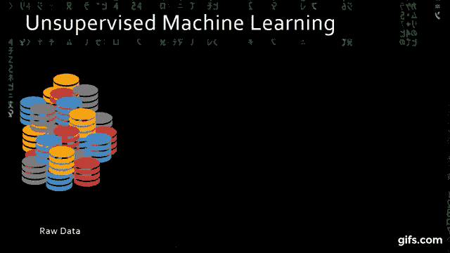
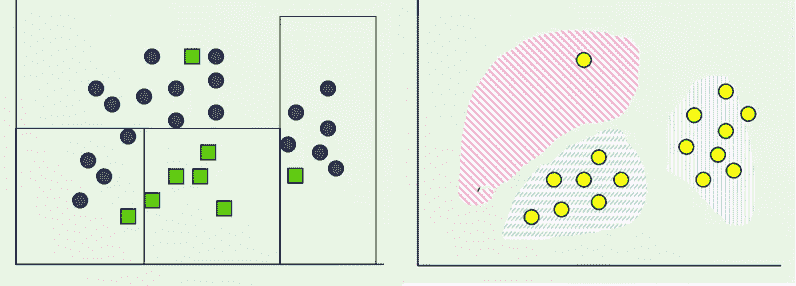
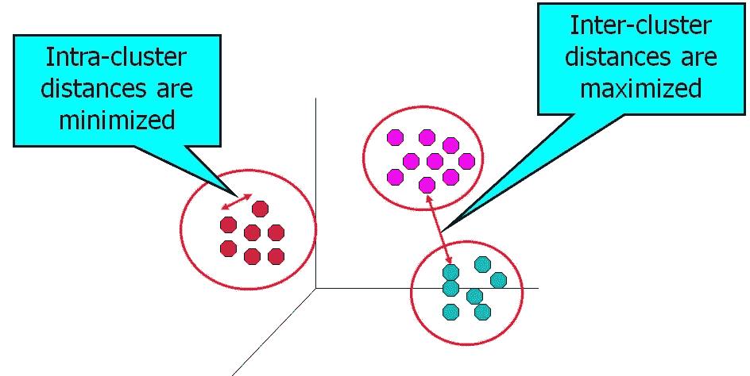
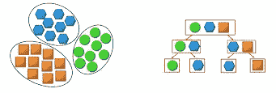
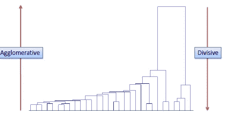

# 聚类的介绍

> 原文：<https://medium.datadriveninvestor.com/an-introduction-to-clustering-61f6930e3e0b?source=collection_archive---------0----------------------->

聚类被认为是无监督学习中最重要的技术。在这篇博客中，我们将试图理解机器学习中聚类的一些基础知识。

在我们开始讨论集群之前，让我们先了解什么是集群。

**簇**是同一组(类或类别)内彼此相似而与其他簇中的对象不同的数据对象的集合。

聚类是一种无监督的学习技术，其中有预定义的类和先验信息，这些信息定义了应该如何将数据分组或标记到单独的类中

它也可以被认为是探索性数据分析(EDA)过程，帮助我们发现数据中隐藏的感兴趣的模式或结构

聚类也可以作为一个独立的工具来获得关于数据分布的见解，或者作为其他算法中的预处理步骤。

**为什么集群？**

聚类使我们能够发现数据集中数据点之间的隐藏关系。

示例:

1.在营销上，根据相似性对客户进行细分，进行针对性营销。

2.给定一个文本集合，我们需要根据内容的相似性来组织它们，以创建一个主题层次结构

3.检测图像数据中不同种类的模式(图像处理)。这在生物学研究中对于识别潜在模式是有效的。

有很多例子说明了集群的重要性。

**分类 vs 聚类**

让我们了解一下监督学习中的分类和无监督学习中的聚类有什么不同。

**分类**

在监督学习中，我们的模型学习从预先标记的(分类的)实例中预测实例类的方法。

**聚类**

在无监督学习中，我们的模型试图为给定的未标记数据找到实例的**【自然】**分组。

Classification vs clustering

**我们如何定义好的聚类算法？**

可以通过减小同一聚类中的对象之间的距离(称为聚类内最小化)以及增大与另一聚类中的对象之间的距离(称为聚类间最大化)来创建高质量聚类。

**聚类内最小化:**聚类中的对象越接近，它们越有可能属于同一个聚类。

**聚类间最大化:**这使得两个聚类之间分离。主要目标是最大化两个集群之间的距离。

有许多聚类算法，它们都使用不同的技术进行聚类。它们可以分为两类

1.平面或分区算法

2.分层算法

Flat/ partitioning and Hierarchical methods of clustering

**平面或分区算法:**

该算法试图将感兴趣的数据集分成预定数量的组/簇。

所有的组/群都是相互独立的。例如:K-means

**层次聚类算法**

分层聚类不会在一个步骤中将数据集划分为多个聚类。相反，它包括从包含所有数据点的单个聚类到包含单个数据点的 n 个聚类的多个步骤。

该算法进一步分为分裂法和凝聚法。

可以使用树状图(如下)来显示层次聚类。

Types of Hierarchical clustering

**除法**

这种方法也称为自顶向下聚类方法。它将所有数据点分配给一个聚类，然后将该聚类划分为两个最不相似的聚类。然后，对两个聚类递归地应用相同的方法，直到我们得到每个数据点的聚类。

**烧结法**

它也被称为自底向上聚类方法。这里，它将 n 个数据点分配给 n 个聚类，并通过计算相似性(即每个聚类之间的距离)来加入最相似的聚类。这个过程一直持续到我们得到一个单独的集群。

这是关于聚类的简单介绍。我希望现在您已经了解了集群的基本概念以及为什么使用它。

感谢阅读。

