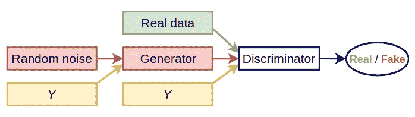
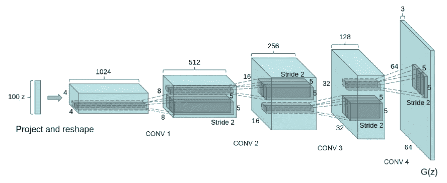
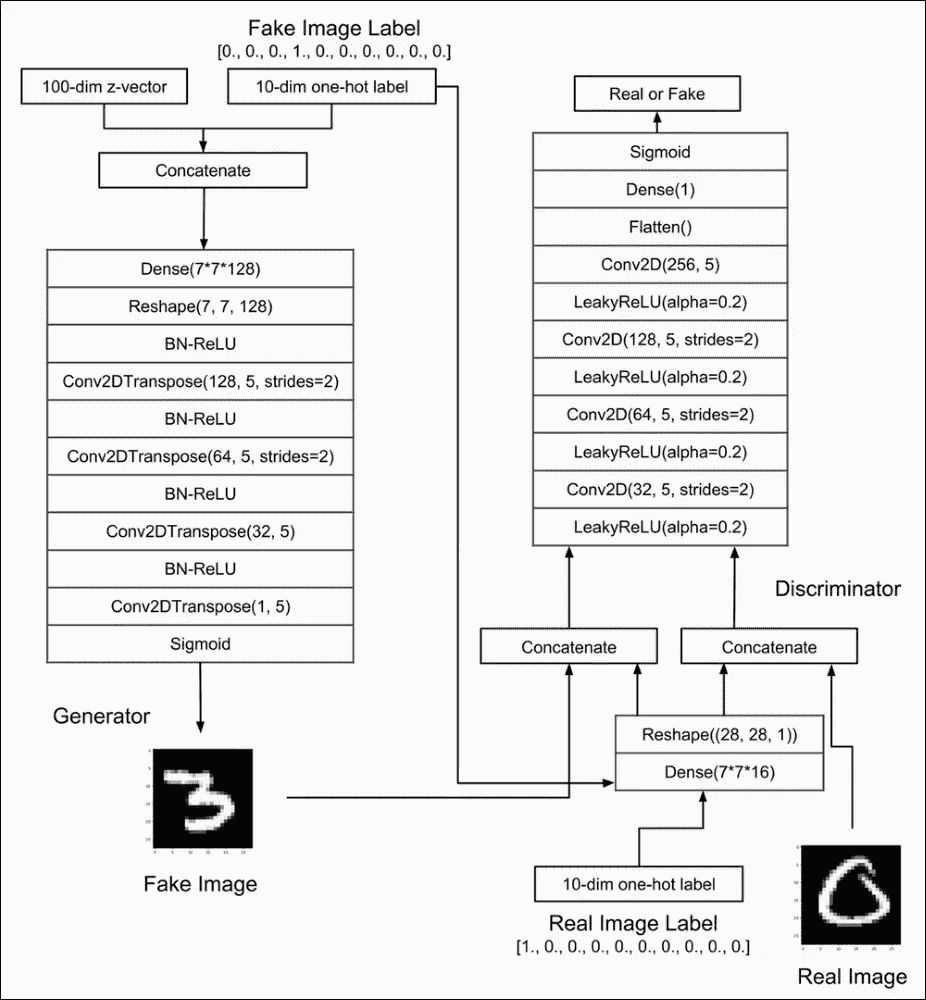
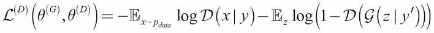
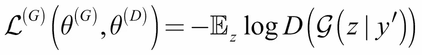
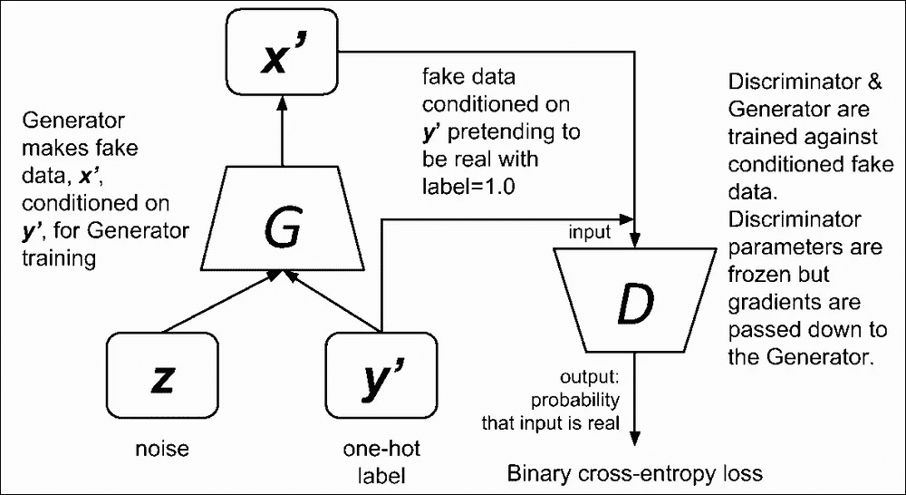

# 条件甘的介绍

> 原文：<https://medium.datadriveninvestor.com/an-introduction-to-conditional-gans-cgans-727d1f5bb011?source=collection_archive---------0----------------------->

# 介绍

**条件甘斯** ( [**CGANs**](https://arxiv.org/abs/1411.1784) )是甘斯模型的扩展。你可以在我之前的文章[这里](https://medium.com/datadriveninvestor/deep-convolutional-generative-adversarial-networks-dcgans-3176238b5a3d)中读到 GANs 的一个变种，叫做 DCGANs。**cgan 被允许**生成具有特定条件或属性的图像。

像 DCGANs **一样，条件 GANs** 也有两个组成部分。

*   一个**生成器(**一个艺术家 **)** 神经网络。
*   一个**鉴别器(**一个艺术评论家 **)** 神经网络。

 [## 用 7 个步骤解释深度学习——数据驱动投资者

### 在深度学习的帮助下，自动驾驶汽车、Alexa、医学成像-小工具正在我们周围变得超级智能…

www.datadriveninvestor.com](https://www.datadriveninvestor.com/2019/01/23/deep-learning-explained-in-7-steps/) 

**条件 GANs**(**CGANs**)**发生器**和**鉴别器**都接收一些附加的条件输入信息。这可能是当前图像的类或一些其他属性。

例如，如果我们训练一个 DCGANs 生成新的 MNIST 图像，那么无法控制**生成器**将生成哪些特定的数字。没有关于如何从**发生器**请求特定数字的机制。这个问题可以通过称为**条件 GAN** ( **CGAN** )的 GAN 变体来解决。我们可以添加一个额外的输入层，其中包含一次性编码图像标签的值。

# 在**条件动作**(**cgan**)中

*   添加特征向量控制输出，并引导**生成器**计算出要做什么。
*   这种特征向量应该从对类别进行编码的图像(如果我们试图创建假想演员的脸，就像女人或男人的图像)或我们期望从图像中得到的一组特定特征(在假想演员的情况下，它可以是头发、眼睛或肤色的类型)中导出。
*   我们可以将信息整合到将要学习的图像中，也可以整合到 *Z* 输入中，这不再是完全随机的了。
*   **鉴别器的**评估不仅针对伪数据和原始数据之间的相似性，还针对伪数据图像与其输入标签(或特征)的对应性
*   我们可以使用相同的 DCGANs，并对**发生器的**和**鉴别器的**输入施加一个条件。该条件应该是该数字的一个热点向量版本的形式。这与图像到**发生器**或**鉴别器**的真假有关。

N**OTE:****cgan**有一个缺点。CGANs 并不是严格意义上的无人监管，我们需要某种标签来让它们工作。

# **高层 CGAN 架构图**

**Conditional GAN**

# 鉴频器网络

*CGAN***鉴频器的** *模型与 DCGAN* **鉴频器的** *模型相似，除了一位热码矢量，它用于调节* **鉴频器** *输出。*你可以在我之前的帖子[这里](https://medium.com/datadriveninvestor/deep-convolutional-generative-adversarial-networks-dcgans-3176238b5a3d)中读到关于**鉴别器的**网络

# 发电机网络

*CGAN***发生器的** *模型与 DCGAN* **发生器的** *模型相似，除了一位热矢量，它用于调节* **发生器** *的输出。*你可以在我之前的帖子[这里](https://medium.com/datadriveninvestor/deep-convolutional-generative-adversarial-networks-dcgans-3176238b5a3d)中读到关于**发电机的**网络

The DCGAN architecture of the **generator** [https://arxiv.org/pdf/1511.06434.pdf](https://arxiv.org/pdf/1511.06434.pdf)

# CGAN 的架构图

CGAN’s Architecture

# 损失函数

**鉴别器有两个任务**

*   **鉴别器**必须正确地将来自训练数据集的真实图像标记为“*真实*”。
*   **鉴别器**必须将来自**发生器**的生成图像正确标记为“*假”*。

我们需要计算**鉴频器的两个损耗。“*假“*图像”和“*真”*图像损失之和就是总的鉴别器损失*。*** *因此***鉴别器**的损失函数旨在最小化预测来自数据集的真实图像和来自**生成器**的假图像的误差，给定它们的一个热标签。

**Discriminator’s loss function**

**发电机网络有一个任务**

*   制造一个看起来尽可能像*真实的*的图像来欺骗**鉴别器**。

**发生器**的损失函数最小化了**鉴别器**对基于指定独热标签的伪图像的正确预测。

**Generator’s loss function**

# **dcgan 的培训**

**训练中重复以下步骤**

*   **鉴别器**使用真假数据和生成的数据进行训练。
*   在**鉴别器**被训练后，两个模型一起被训练。
*   首先，**生成器**创建了一些新的例子。
*   **鉴别器**的权重被冻结，但其梯度被用于**发生器**模型，以便**发生器**可以更新其权重。

# **鉴频器的训练流程**

**Discriminator’s training process**

# **发电机培训流程**

**Generator’s training process**

**本帖随附的 jupyter 笔记本可以在这里找到******。****

# **结论**

*****CGANs*** 可用于构建模型，该模型可生成给定类别的假想演员的图像，如男性或女性。它还可以用来构建 [*人脸老化*](https://arxiv.org/pdf/1702.01983.pdf) 系统*，*年龄合成和年龄递进有许多实际的工业和消费应用像跨年龄人脸识别、寻找走失儿童、娱乐、电影中的视觉效果。**

**我希望这篇文章能帮助你开始构建自己的 CGANs。我认为它至少提供了一个关于 CGANs 的很好的解释和理解。**