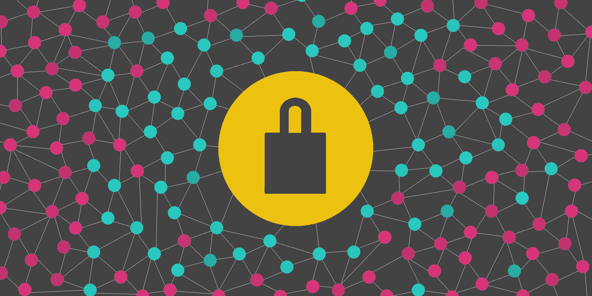
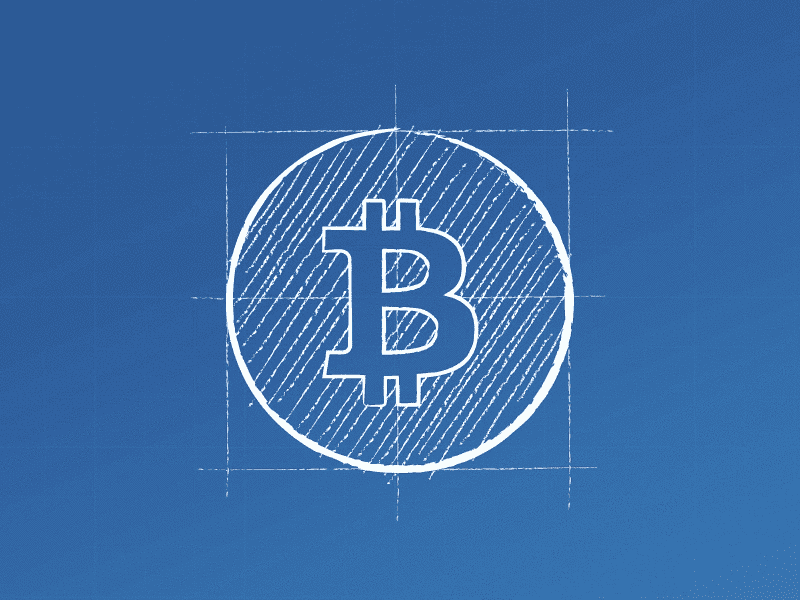
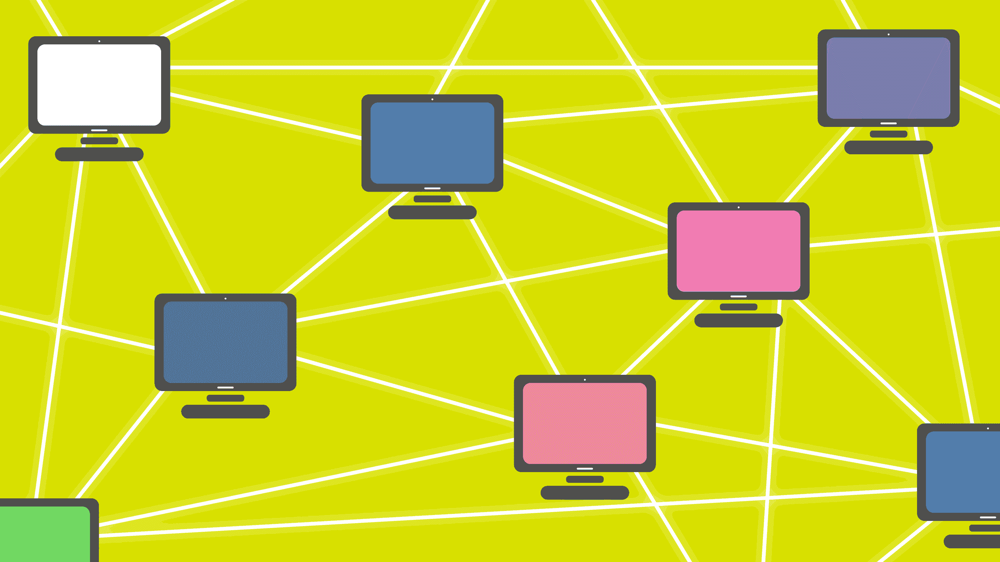
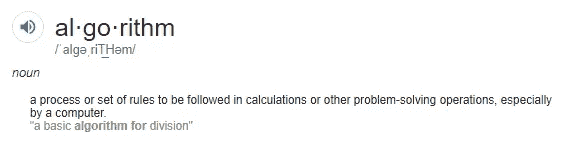
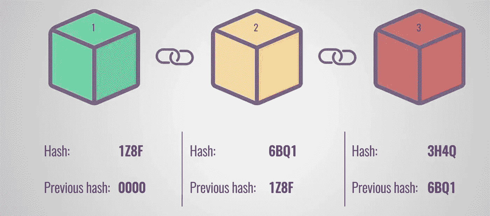
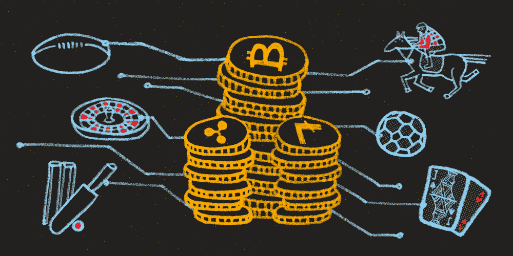

# 加密货币简介

> 原文：<https://medium.datadriveninvestor.com/an-introduction-to-cryptocurrencies-c0b8673aec30?source=collection_archive---------2----------------------->

怎么形容摸不到的钱？

*呃，你的 Visa 卡，鲁哈尼，* ***咄***

 [## 总部位于瑞士的 ETP 进入加密交易市场|数据驱动的投资者

### 虽然金融市场几乎没有沉闷的时刻，特别是在引入…

www.datadriveninvestor.com](https://www.datadriveninvestor.com/2019/03/10/swiss-based-etp-enters-the-crypto-trading-market/) 

你怎么解释你不能碰的，不受银行控制的钱？

*嗯，藏在你床下的信用卡，* ***咄***

**那种你摸不到的，不受任何一种力量控制的，你决定值多少就值多少的钱呢？**

*…亵渎神明*

# 什么是加密货币？

*   不是信用卡或借记卡
*   不是现金
*   没有任何权力或银行的支持

它们是什么？

很高兴你问了。

加密货币是*去中心化*的数字货币。这意味着我之前说过，他们没有任何银行或政府机构的支持。然而，他们确实遵守一套规则。这些规则允许它存在于传统金融体系之外，而不是计算机网络之内。

我一会儿会解释怎么做。

Bitcoin

我相信很多读到这里的人会认出上面的是比特币。当我第一次听说它时，我的印象是它是一种货币，就像垄断货币一样，是用在视频游戏的一些虚假现实中。

男孩，是我错了。

事实并非如此。比特币是第一种*非常真实*的分散式数字货币。它于 2009 年推出，随之而来的是区块链。

woah woah woah woah——区块链是什么？

现在我将回到解释这种货币如何存在于计算机网络中。区块链是一个大规模的数字分类账(对于那些不了解会计术语的人来说，分类账是用来跟踪交易的财务账户的集合)，在上面记录了*网络*上的每笔交易。

# **区块链是如何工作的？**

这是一个许可- *少*的系统。没有人需要许可才能参与总账，也没有人负责这个系统。

区块链从根本上挑战了使用加密技术创建一个开放和分散的数据库的现状。它创造了一个记录，现在由一个社区而不是一个管理国来验证。

一个巨大的好处是，任何有互联网连接的人都可以使用这种货币。全球经济的整体未来将转向一个包含如此大规模信任的经济。

即使在传统的银行系统中，这种*新权力*将使公共当局**更难**执行不公正的金融监管，因为这种数字账本带来了新的可能性。

*但是，鲁哈尼，如果没有人负责这个庞大的全球货币系统，那么如何防止欺诈呢？*

这项工作由*矿工负责。*

Blockchain Miners

矿工是核实区块链上发生的交易的人。他们在区块链记录这些交流，这为他们赢得了比特币作为奖励。**事实:现存的每一枚比特币最初都是为了奖励一名矿工而产生的。**

对于每 *210，000 个块*，创建一个新块时产生的硬币数量减少一半。最终的比特币将在 *2140* 被开采(这将是第 2100 万个)。围绕这一点的想法是*保留有限的供应*以*维持比特币的价值*。

交易信息包含时间、日期、参与者和涉及的金额。区块链上的每个人都可以接触到一个共享的真相来源。

为了防止欺骗系统，我们需要另一个系统。区块链通过个人电脑网络存储信息。这就是区块链是如何去中心化和分布的更具技术性的地方。

点对点的网络布局使得任何人都很难试图搞垮或破坏区块链。数字账本使用密码术——一种数学形式——来保证数据块不能被任何人更改或伪造。

区块链允许我们绕过中介机构。

传统上，供应链依赖于中间商。金融业依赖中介进行交易。有了区块链，透明交易成为现实。

A P2P Network (peer-to-peer)

当有人请求交易时，该过程开始。这个请求被广播到区块链的*对等网络*，包括节点(我之前提到的所有那些计算机)。**节点网络**通过*算法*验证交易和用户状态。

一旦通过验证，通过为分类帐创建新的数据块，交易将被添加到其他交易中。新块被添加到现有的区块链中。

每个块通过其*散列与其前后的块相连。*这是*极其重要的*，因为它让它的路径很容易被追踪。数据一旦被记录下来，就很难改变。

每个包含数据的块都有自己的哈希。这是一个数字指纹，有助于识别特定块*及其内容*。这个散列值*总是唯一的。*比特币区块链使用 sha 256——一组加密哈希函数。

每当一个新的块被添加到链中(*看看这个名字从何而来*😉)它是用之前块的散列和它自己的散列编码的。

散列中保存的数据取决于它所在的区块链类型。例如，比特币的*块中的散列包含关于交易的细节。*

改变任何事情变得困难的原因是因为**改变一个块** k 将**改变它的散列**。因为在它之后的块将包含被改变的块的散列，它将*也必须被改变*，在它之后的块，在它之后的块等等。

它导致后面的块变得无效，因为它们不再包含其前任的正确散列。

这使区块链变得安全。只有第一个不能指向前一个块的散列。**第一块**称为*创世纪块*。

然而，这不足以防止篡改，因为计算机能够非常快速地计算哈希和重新验证块。为了解决这个问题，区块链还使用了其他安全机制。

# **什么是工作证明？**

平均需要*十分钟*来计算向链中添加新块所需的工作证明。如果一个区块**被**篡改，其余所有后续区块的工作证明将不得不**被更改。**

**工作证明**是一个*共识算法。*所有这一切，都是一个用来确认交易和为交易链创建新区块的系统。矿工们竞相解决这个算法，并获得奖励；这是他们用来验证交易的加密技术。

为了保证网络安全，加密算法变得越来越困难。 它们需要大量的计算能力来解决。这些数学问题的答案就是我们之前讲过的，*哈希*。

这个计算难题保证了区块链的安全性，因为它保证了一定数量的计算机周期来解决它。这确保了一定量的工作已经完成来解决难题——这是工作的证明。

这种挖掘难度实际上也直接影响了比特币的价格(我将在最后更多地谈论购买和投资 crypto)。

这是因为低挖掘难度说明加密货币*容易挖掘*。这反过来意味着**更容易提供**更多的密码，从而对其价格造成压力。

# 另一个安全机制可以追溯到区块链的一个重要方面——它是分布式的**。**

像我前面提到的，区块链使用节点网络或对等网络。这意味着每个人都可以加入，每个人都可以得到一份区块链。如果每个节点都通过了*所有人*的验证，那么每个节点只会向链中添加一个新块。

这一共识禁止任何人轻易篡改区块链——为了接管，一个人必须控制超过 50%的对等网络，否则提议的欺诈性改变不会被其他所有人接受。

*等等，如果有成千上万的人试图更新区块链，所有的分类账如何保持同步？*

正如我前面提到的，每笔交易都向网络公布。该公告包括您的账号、您发送/接收的人的账号以及所涉及的金额。

# **密钥**

比特币使用的另一种安全机制是加密密钥。这些密钥是用于保证交易中涉及的人员的有效性的信息集合。

当在比特币网络上创建账户时，钱包(存放钱的地方)会被赋予两把钥匙。

要验证网络上的交易，您可以使用您的私钥对其进行签名。然后，比特币网络上的其他人使用你的公钥来确保它通过检查。

# 数字钱包

钱本身存储在数字钱包里。有几种。

1.  **热钱包:**将您的密码保存在连接到互联网的设备中
2.  **冷钱包:**离线加密存储
3.  **硬件钱包:**存储密码的物理设备(如 USB)
4.  **纸质钱包:**离线冷藏，保存打印出来的公私钥

# **交易属性**

当交易在区块链发生时，这种交换的性质不同于常规货币(即法定货币，即欧元)的交换条件。

1.  **不可逆:**当交易确实在区块链上发生时，发出或收到的钱是不可挽回的。
2.  **假名:**这意味着交易和账户与用户的真实身份无关
3.  全球:交易可以在全球范围内发生
4.  及时:交流很快
5.  **安全:**密钥系统、工作证明系统和散列系统

# **我在哪里可以找到比特币？**

几个地方。

**加密货币兑换:**您可以在这里用普通硬币兑换比特币

**比特币 ATM:** 将比特币兑换成现金或其他加密货币

本地比特币:一个定位卖家的网站，该卖家将比特币兑换成现金

**存储:**您的加密货币存储在数字钱包中

# **多少钱？**

关于实际收购比特币的话题，需要注意的是**账本并不关心一个比特币的价值。你可以决定一个单位值多少钱，甚至它代表什么。**

*“…亵渎*”——我觉得不会。

Users Assign Value

加密货币的每个单位都是可单独识别和编程的。对网络上的一个人来说，一个单位可能相当于一欧元。对其他人来说，可能是公司的一定数量的股份。

使用这些编程规则，现金和资金流变得自动化。

# 好吧——但是，宣传是什么？

为什么要用加密货币？许多人喜欢不受机构或政府控制的货币体系。加入一个在传统银行业之外发挥作用的财政体系，有些人可能会称之为一种政治声明或立场。

这种全新的经济也提供了投资机会(即在比特币激增时买入，然后在触底之前卖出，以赚取利润)。

加密货币交易背后的匿名对许多人来说是一笔巨大的交易……而且不仅仅是为了那些见不得人的东西。在很多情况下，匿名更受青睐——也许是捐款或资助。

然而，需要注意的是，并不全是阳光和彩虹——使用外部信息来识别区块链用户是可能的。出于安全和隐私的原因，包括加拿大在内的许多国家打算制定*协调政策*来规范区块链的使用。

另一个巨大的好处是这个时代极大地促进了贸易。几乎任何有网络连接的人都可以使用区块链。这种交易是全球性的，并有私人簿记🤯

我们也通过这种方式消除了中间商。政府和银行等机构都需要收费来换取会计或金融服务。比特币创造了一个计算机网络，在公共环境下维护互联网上真实记账的单一来源。

潜在的影响是巨大的——在 IOT(物联网)的未来，机器将积极参与经济交通。

当你购买比特币时，有两种类型的交易可以发生。首先是对加密的限制。这是你把法定货币兑换成加密货币的时候。第二种是加密对加密。这是把以太之类的东西换成比特币，反之亦然。

关于实际使用比特币的话题，我们还必须谈谈*税。*如果钱是用加密技术赚来的，用户必须纳税，但免增值税。然而，如果你持有你的比特币超过一年，你就可以在出售时免税。

# **投资加密货币**

当谈到*投资这项技术时，*有许多方面需要考虑。我不打算**假装**是投资密码的专家，但是我可以给一些**指点**要寻找的东西。

对于加密货币，*市值*是指该货币所有代币的价值。确定 crypto 价值的最有效方法之一就是确定它。

*白皮书*绝对有必要阅读。这些是由货币发行机构撰写的报告，旨在指导和告知用户货币想要解决的问题以及他们的*信仰*是什么。

不要被硬币的流行所困扰——看看它是否真的给数字货币经济带来了效用。例如，一种加密货币以太坊(Ethereum)率先推出了一个名为“**智能合约**的概念。不涉及太多细节，这些是用于促进各方之间交易的密码条件。这里有一个关于它如何工作的非常棒的总结:

一个好主意是通过硬币购买模拟器练习购买和预测加密运动。

# 关键要点

关于加密货币还有很多需要学习的地方。存在哪些类型的货币？数字交易的经济学是如何运作的？SHA256 到底是怎么工作的？

加密货币具有巨大的潜在影响，了解起来非常有趣。以下是一些需要记住的最重要的信息:

*   加密货币是去中心化的数字货币
*   区块链是一个去中心化和分布式的公共数字账本
*   通过矿工在区块链上验证交易
*   存在像 PoW 和 hash 系统这样的安全机制

*如果你喜欢这篇文章，一定要给它几个*👏s，在 Medium 上跟我学！随时和我联系[*LinkedIn*](http://www.linkedin.com/in/ruhaniwalia)