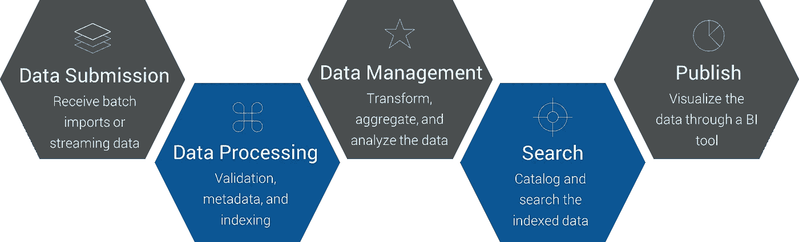

# 医疗保健 IT 数据湖简介

> 原文：<https://medium.datadriveninvestor.com/an-introduction-to-data-lakes-for-healthcare-it-46c905426bc0?source=collection_archive---------3----------------------->

Photo by [mahdis mousavi](https://unsplash.com/@dissii?utm_source=unsplash&utm_medium=referral&utm_content=creditCopyText) on [Unsplash](https://unsplash.com/?utm_source=unsplash&utm_medium=referral&utm_content=creditCopyText)

随着医疗保健数据源的数量不断增长，数据格式和交付方法的种类也在不断增加，强大的数据管理策略比以往任何时候都更加重要。通过利用数据湖，您可以让您的组织以简单有序的方式应对这些挑战。

Photo by [Mika Baumeister](https://unsplash.com/@mbaumi?utm_source=unsplash&utm_medium=referral&utm_content=creditCopyText) on [Unsplash](https://unsplash.com/s/photos/data?utm_source=unsplash&utm_medium=referral&utm_content=creditCopyText)

## 什么是数据湖？

> 数据湖是一个存储库，以其原始(结构化或非结构化)格式保存大量原始数据，直到需要这些数据。

以原生格式存储数据使您能够适应任何未来的模式需求或设计更改。

当有价值的数据源分散在内部数据中心、软件提供商、合作伙伴、第三方数据提供商或公共数据集之间时，数据湖是理想的选择。数据湖为以低价格和高性能存储本地、第三方和公共数据集提供了基础。

 [## 信息图:云之旅|数据驱动的投资者

### 聪明的企业领导者了解利用云的价值。随着数据存储需求的增长，他们已经…

www.datadriveninvestor.com](https://www.datadriveninvestor.com/2018/09/22/infographic-journey-to-the-clouds/) 

此外，在此基础上构建的一系列描述性、预测性和实时敏捷分析有助于满足公司最重要的业务需求，例如预测服务交付和服务利用模式，评估服务交付的有效性和成本，以及分析财务绩效与估计费用的比较，以支持联邦和/或州报告。

Photo by [Ian Battaglia](https://unsplash.com/@ianjbattaglia?utm_source=medium&utm_medium=referral) on [Unsplash](https://unsplash.com?utm_source=medium&utm_medium=referral)

## **数据湖和数据仓库有什么不同？**

Pentaho 的首席技术官 James Dixon 创造了这个术语，他说数据仓库就像“一个瓶装水的商店——经过清洗、包装和结构化，以便于消费——数据湖是一个更自然状态的大型水体。数据湖的内容从一个源头流入湖中，湖的各种用户可以来检查、潜水或采集样本。”

这就是为什么许多医疗保健组织正在转向数据湖架构。数据湖是一种架构方法，它允许您将大量数据存储到一个中心位置，以便组织内的不同团队可以随时对其进行分类、处理、分析和消费。由于数据可以按原样存储，因此不需要将其转换为预定义的模式，也不需要事先知道要对数据提出什么问题。

数据湖可以包含各种类型的数据，无论是结构化的还是非结构化的，并提供了动态重新配置底层模式的灵活性。数据仓库就不一样了。此外，存储在数据湖中的原始数据永远不会丢失，而是以原始格式存储，以供进一步分析和处理。

数据湖实际上可以补充和扩展您现有的数据仓库。如果您已经在使用数据仓库，或者正在寻求实现数据仓库，那么数据湖可以用作结构化和非结构化数据的来源。

## **了解数据湖的功能**

**1。** **数据提交** 数据湖的首要功能是接收大量数据。这些数据可以作为批量上传或流数据提交到数据湖。

**2。** **数据处理** 数据湖然后验证数据，添加任何必要的元数据，并相应地索引数据。

**3。** **数据管理** 接下来，数据被转换和聚合为一种可长期存储的格式，并可供分析应用程序使用。

**4。** **搜索** 数据湖对索引的数据进行编目，并提供以只读方式与数据交互的查询工具。

**5。** **发布** 数据湖的最终功能是通过 BI 工具或数据可视化工具将分析后的数据发布成有意义的图表和图形。

Photo by [Stephen Dawson](https://unsplash.com/@srd844?utm_source=medium&utm_medium=referral) on [Unsplash](https://unsplash.com?utm_source=medium&utm_medium=referral)

# **数据湖的出现对医疗保健 IT 意味着什么**

到 2015 年，96%的非联邦急症护理医院已经采用了电子健康记录，而 2011 年只有 71.9%。随着医疗保健行业过渡到全电子记录的世界，包括收费服务和基于价值的护理，积累的数据量急剧增加。这些数据有多种形式，但主要可以归类为临床数据或索赔数据。来自支付者的索赔数据通常是一致的和结构良好的，而来自提供者的临床数据可能以多种格式出现。

一个可扩展的数据湖可以容纳大量的原始数据。借助精算师和数据科学家的战略分析应用和可操作的见解，提供商和支付者可以通过多种方式轻松消费和利用这些数据，包括:

有效过渡到基于价值的护理

预测和规划增长

提高成本效益

减少再入院和提高护理质量

随着医疗保健行业中可用数据量的持续增长，灵活、经济高效的解决方案(如数据湖)成为医疗保健机构成功定位的重要因素。

[1]: *美国卫生与公众服务部*[https://dashboard . Health it . gov/quick stats/pages/FIG-Hospital-EHR-adoption . PHP](https://dashboard.healthit.gov/quickstats/pages/FIG-Hospital-EHR-Adoption.php)