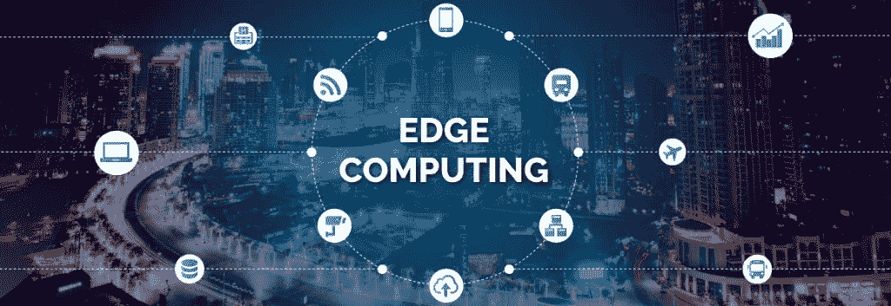

# 边缘计算简介

> 原文：<https://medium.datadriveninvestor.com/an-introduction-to-edge-computing-75f3e3a9ee53?source=collection_archive---------19----------------------->

物联网(IoT)正在席卷全球，因为它不仅在科技领域，而且在许多其他行业都已成为最具影响力的流行语之一。从农场到工厂，从智能城市到家庭，物联网技术无处不在，互联系统和设备不断扩展。

根据 Statista 的数据，预计全球物联网设备的安装数量将增长至近 310 亿台。因此，随着数十亿联网设备生成的海量数据需要存储以供处理和检索，云计算将成为一种日益主导的趋势。物联网和云计算这两种技术是相互关联的，一个为另一个提供了成功的平台。

 [## 生活在边缘|数据驱动的投资者

### 为边缘和混合计算而重新设计的旧思想这是一种数据抓取！感觉每个行业的每个人…

www.datadriveninvestor.com](https://www.datadriveninvestor.com/2019/03/22/living-life-on-the-edge/) 

在传统的物联网架构中，数据是从地理上分散的传感器收集的，并被传输到中央存储库，在那里进行组合和集中处理。提高日常任务的效率、可扩展性和性能，云计算与物联网的集成使企业能够更快地做出更好的业务决策，并实时响应不断变化的市场条件。

物联网连接预计将在未来几年蓬勃发展，预计到 2021 年将达到 137 亿(思科系统预测)，从而增加对数据中心和云资源的需求。精简来自所有互联设备的前所未有的流量，聚合数据并提取可操作的见解，物联网/云融合被证明是数据驱动世界的完美合作伙伴。

虽然[云计算](https://www.logiticks.com/azure-app-development/)使得处理大量数据成为可能，但它并不是所有应用和用例的理想选择。从传感器前线到服务器来回发送的大量数据堵塞了网络带宽，从而降低了响应时间。解决所有这些与传统云计算基础设施相关的限制的答案是所谓的“边缘计算”。

与遵循集中式流程的传统云架构不同，边缘计算将大部分流程分散到边缘设备，使其更接近最终用户。由于存储容量和处理能力是分散的，它将为物联网部署提供精确的结果。边缘计算使操作和管理物联网设备变得更容易，确保低延迟访问、减少带宽消耗、离线可用性和本地机器学习(ML)推理。

边缘计算的低延迟和更快的实时分析在汽车、消费电子、能源、医疗保健等各个领域都有广泛的应用。自动驾驶汽车是一个很好的用例，需要从周围环境和云中收集数据，以便快速安全地做出决策。传感器数据中的模式应被快速检测、存储和传输，以帮助本地节点的实时决策。边缘计算的分散架构消除了关键数据通信中的延迟，从而确保了安全性。

根据 CB Insights 市场规模评估工具，全球边缘计算市场预计到 2022 年将达到 67.2 亿美元。随着越来越多的联网设备出现在世界上，科技巨头们正在大力投资一项复杂的边缘计算战略。到目前为止，亚马逊、微软和谷歌已经涉足边缘计算。亚马逊在 2017 年推出了其边缘平台 AWS Greengrass，在新兴技术领域处于领先地位，而微软去年推出了 Azure 物联网边缘解决方案。谷歌也加入了这场竞赛，推出了两款新产品——一款集成软件(云物联网边缘)和定制硬件堆栈(边缘 TPU)，以便在边缘直接利用数据。

综上所述，我们可以说，边缘计算在这里不是取代云计算，而是补充云计算。由于边缘计算技术仍处于起步阶段，挑战可能会增加。但随着对边缘设备和应用需求的不断增长，企业将有更多机会在各种垂直领域测试和部署这项技术。

*最初发表于*[*【https://www.logiticks.com】*](https://www.logiticks.com/blog/an-introduction-to-edge-computing/)*。*