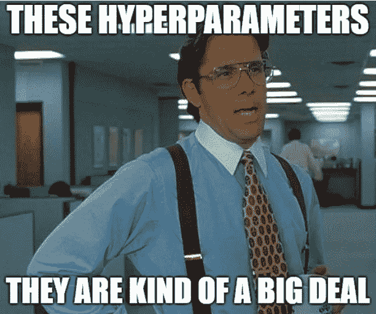

# 网格搜索简介

> 原文：<https://medium.datadriveninvestor.com/an-introduction-to-grid-search-ff57adcc0998?source=collection_archive---------0----------------------->

[](http://www.track.datadriveninvestor.com/1B9E)

本文将深入浅出地解释什么是网格搜索，以及如何在 python 中使用`sklearn`实现网格搜索。

**什么是网格搜索？**

网格搜索是执行超参数调整的过程，以确定给定模型的最佳值。这一点非常重要，因为整个模型的性能取决于指定的超参数值。

**我为什么要用？**

如果你和 ML 一起工作，你会知道为超参数规定值是一场噩梦。有一些已经实现的库，比如`sklearn`库的`[GridSearchCV](https://scikit-learn.org/stable/modules/generated/sklearn.model_selection.GridSearchCV.html)`，为了自动化这个过程，让 ML 爱好者的生活稍微轻松一点。

**它是如何工作的？**

下面是使用`sklearn`库的`[GridSearchCV](https://scikit-learn.org/stable/modules/generated/sklearn.model_selection.GridSearchCV.html)`的网格搜索的 python 实现。

```
from sklearn.model_selection import GridSearchCV
from sklearn.svm import SVRgsc = GridSearchCV(
        estimator=SVR(kernel='rbf'),
        param_grid={
            'C': [0.1, 1, 100, 1000],
            'epsilon': [0.0001, 0.0005, 0.001, 0.005, 0.01, 0.05, 0.1, 0.5, 1, 5, 10],
            'gamma': [0.0001, 0.001, 0.005, 0.1, 1, 3, 5]
        },
        cv=5, scoring='neg_mean_squared_error', verbose=0, n_jobs=-1)
```

首先，我们需要从`sklearn`库导入`GridSearchCV`，这是一个 python 的机器学习库。`GridSearchCV`的`estimator`参数需要我们用于超参数调整过程的模型。对于这个例子，我们使用支持向量回归模型(SVR)的`rbf`内核。`param_grid`参数需要指定*估算器*的参数列表和每个参数的取值范围。使用 SVR 模型的`rbf`内核时，最重要的参数是`c, gamma`和`epsilon`。应该为模型的每个超参数提供一个可供选择的值列表。您可以更改这些值，并进行更多的实验，以查看哪个值范围可以提供更好的性能。执行[交叉验证过程](https://medium.com/datadriveninvestor/k-fold-cross-validation-6b8518070833)以确定提供最佳精度水平的超参数值集。

```
grid_result = gsc.fit(X, y)
best_params = grid_result.best_params_best_svr = SVR(kernel='rbf', C=best_params["C"], epsilon=best_params["epsilon"], gamma=best_params["gamma"],
                   coef0=0.1, shrinking=True,
                   tol=0.001, cache_size=200, verbose=False, max_iter=-1)
```

然后，我们在实际模型中使用网格搜索中选择的最佳超参数值集，如上所示。

如果你想知道如何使用网格搜索和交叉验证，并训练和测试一个模型，请查看这篇文章。

希望这篇文章对你有帮助。下次见…再见！

***参考文献***

[](https://scikit-learn.org/stable/modules/generated/sklearn.model_selection.GridSearchCV.html) [## sklearn.model_selection。GridSearchCV-scikit-学习 0.20.2 文档

### 如果为真，则返回各层的平均分，并根据每个测试集中的样本数进行加权。在这种情况下……

scikit-learn.org](https://scikit-learn.org/stable/modules/generated/sklearn.model_selection.GridSearchCV.html)