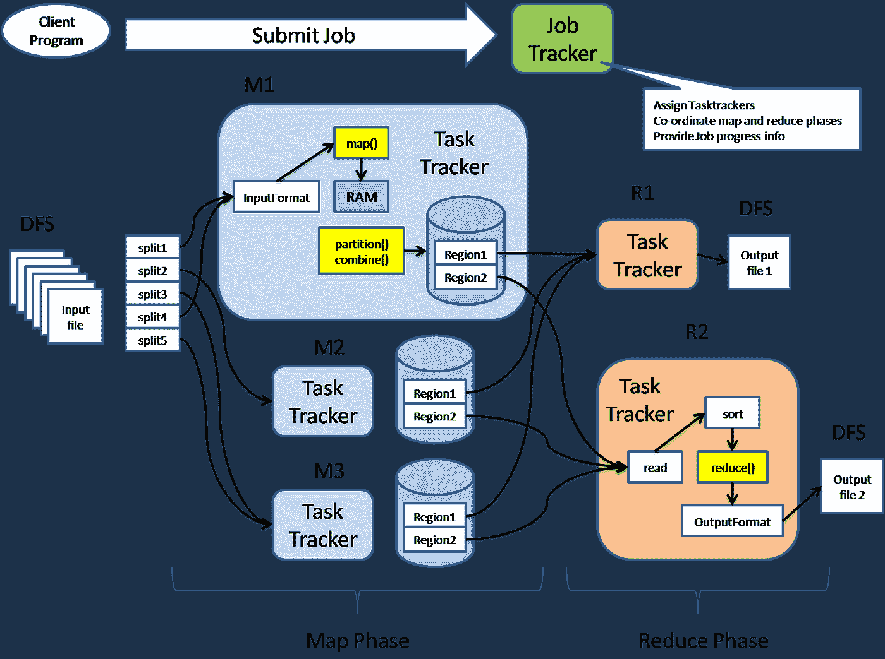

# 面向 Noobs 的 Hadoop 简介

> 原文：<https://medium.datadriveninvestor.com/an-introduction-to-hadoop-for-noobs-53e13646d81c?source=collection_archive---------3----------------------->

客户端-服务器模型改变了数据行业，因为它有助于分解过载的系统，但是，20 世纪 80 年代的客户端-服务器模型无法处理大数据所需的处理。

谷歌出现了。

作为对早期客户机-服务器模型的一些最大限制的回答，例如长处理时间、频繁的系统过载和客户机-服务器瓶颈，Google 创建了 Google 文件系统(GFS)。GFS 具有开创性，因为它大规模使用了行业标准硬件。它在世界各地的节点上把数据分成块。在这种模式下，数据不再像以前那样集中。

向前看，GFS 背后的一些后台工作发布在一个白皮书上，以便整个社区都可以使用它，这在产品周围产生了很大的反响。就在那时，创始人戴夫和迈克开发了开源软件，该软件最终成为 Hadoop(T3)。

**但是什么是 Hadoop 呢？**

数据传入并保存在服务器上。然后，工作被推到本地化的服务器上，这样一个集中的位置就不会超负荷。这消除了早期客户机-服务器模型中出现的瓶颈。为了实现这个过程，Hadoop 依赖于两个主要的过程，MapReduce 和 HDFS。

HDFS 是一个基于 java 的专门构建的系统，旨在处理大数据的需求。在 Hadoop 中，数据存储在称为 Hadoop 集群的集群中，这使得查找文件更加容易和快速。

MapReduce 旨在处理一个计算机集群中的大型数据集。它有两个部分，映射器和减速器。

[举个例子](https://www.dezyre.com/article/hadoop-architecture-explained-what-it-is-and-why-it-matters/317)，如果你想知道单词“the”在整本书中出现了多少次，MapReduce 会很有帮助。首先，您将把书的每一页分发并发送给制图者，制图者将执行映射功能来查找单词“the”。最终，数据变成了一个更小的键，你得到了最终的结果。

**您为什么想使用 Hadoop？**

HDFS 的主要优势是可伸缩性。它可以用来扩展到 4500 个服务器集群和 200 PB 的数据。存储以分布式方式处理，因此不会发生过载。

**非结构化数据**

这也是管理非结构化数据的一种强大方式。超过 90%的数据是非结构化的。这方面的例子包括电视剧本、电子邮件和博客。

**可导入的数据工具**

HBASE 和 HIVE 等应用程序可以从其他数据库导入或导出。

**开源**

像创建它的 GFS 一样，Hadoop 也是开源的。

我*高度*建议你考虑在下一个大数据项目中使用 Hadoop。

*原载于 2018 年 6 月 8 日*[*www.datadriveninvestor.com*](http://www.datadriveninvestor.com/2018/06/08/an-introduction-to-hadoop-for-noobs/)*。*