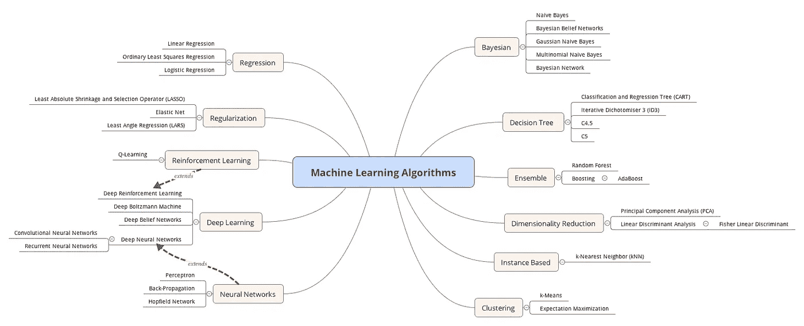

# 机器学习导论

> 原文：<https://medium.datadriveninvestor.com/an-introduction-to-machine-learning-60decab24a2a?source=collection_archive---------0----------------------->

机器学习是让计算机像人类一样学习和行动的科学，并随着时间的推移以自主的方式改进它们的学习，而不需要任何其他人。通过观察真实世界的互动，给他们数据和信息。

换句话说，它是让计算机像人类一样行为的领域，而不需要显式编程。

在人工智能的早期，研究人员对让机器从数据中学习的想法感兴趣。**人工智能领域的美国先驱 Arthur Samuel** 在 **1959** 创造了机器学习这个术语，作为一种让程序从数据中学习的方式，在这个过程中不需要人类的干预。换句话说就是自主自学计划。

当时，机器学习大多与人工智能方法融合在一起。直到 20 世纪 80 年代，当专家系统和归纳逻辑编程超越人工智能时，机器学习获得了左边的统计方法，自主学习的新领域已经创建。

在 20 世纪 90 年代，机器学习作为一个独立的领域开始蓬勃发展。将目标从实现人工智能转变为解决实际问题。

**机器学习**和**数据挖掘**经常采用相同的方法。**机器学习侧重于预测**，基于从训练数据集学习到的已知属性，**数据挖掘侧重于发现**数据集中的未知属性。

## **机器学习算法**

我们定义了四类机器学习算法: ***监督、半监督、无监督和强化*** *。*

**监督学习**是通过一组例子来教会机器的方法。这些例子是来自真实世界的输入和输出的集合，我们称之为数据集。因此，监督算法应该找到一组从输入到输出的规则。通过识别这些模式或规则，算法将它们应用于只有输入的新数据，以提供输出。我们得到的结果，主要是三个目标中的一个。它用于分类、回归或预测。

为了****分类*** 的目的，机器学习程序从观察值中检测模式和规则，然后它确定这些新的观察值应该被分类到哪里。例如，当试图根据学生的成绩对其进行分类时，我们会查看其他学生，根据他们的成绩以及他们被分类的位置(精英、中等……)，然后根据这些，我们为新生选择班级。*

*然而， ***回归分析*** ，也许是统计学和机器学习中最广为人知和最容易理解的算法之一。*

**回归*基本上是一种寻找变量之间关系的统计方法。在机器学习中，这用于根据从数据集获得的变量之间的关系来预测事件的结果。*

## ***半监督学习***

***半监督学习**是一类监督学习任务和技术，也利用未标记数据进行训练，通常是少量标记数据和大量未标记数据。该算法试图标记未标记的数据，用于解决这一问题的模型有点复杂，难以理解，因为它们根据数据的性质利用了启发式方法。*

## ***无监督学习***

****无监督学习*** ，在不依赖已标记或已分类数据的情况下，从数据集推断模式。与监督学习不同，非监督学习不能应用于回归或分类问题。因为我们在这里不处理类或输出，所以我们不知道输出会是什么样子。然而，这种无监督学习被用来发现数据的底层结构。*

## ***强化学习***

*强化学习侧重于系统化的学习过程，其中为机器学习算法提供一组动作、参数和最终值。通过定义规则，机器学习算法然后试图探索不同的选项和可能性，监控和评估每个结果，以确定哪个是最佳的。强化学习教会机器试错。它从经验中学习，并开始根据情况调整其方法，以实现最佳结果。*

****强化学习，*** 是受人类学习如何执行新任务的方式的启发。该算法不依赖于预先存在的数据来训练，而是通过经验来学习正确的方法。*

*换句话说，*强化学习，*被称为“代理”，可以应用于自动驾驶汽车或与环境交互的象棋程序的例子。在每一次 *p* 的积极表现之后，算法会收到一份奖励。然而，在每一个消极的举动之后，它得到一个惩罚。到那时，算法就知道哪些表现会产生奖励，哪些会产生惩罚。随着时间的推移，它试图最大化给予他奖励的动作，最小化产生惩罚的动作。*

## ***结论***

*请记住，没有更好的机器学习算法。每一个都有特定的用途。明确的挑战是定义需求，并选择合适的算法来使用。在下一节中，我们将修改机器学习的所有主要算法，为每个算法设置示例，并在 r 中实现它们。*

*下面的图表总结了所有的机器学习算法，以及它们的分类。*

**

> *这是我将要写给你们的关于机器学习的一系列课程中的第一课。**喜欢就拍**和**分享**。*