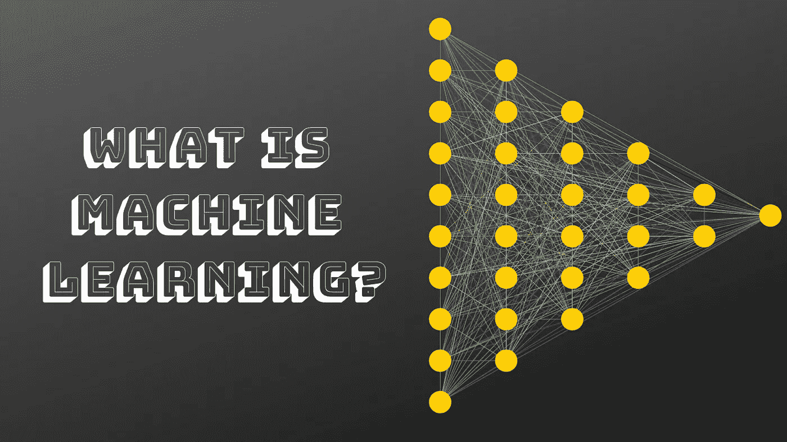

# 机器学习介绍——入门基础

> 原文：<https://medium.datadriveninvestor.com/an-introduction-to-machine-learning-the-basics-to-get-you-started-76652fcb5d2e?source=collection_archive---------20----------------------->

机器学习是这样一门学科，既有趣又让人望而生畏。如果你最近开始接触机器学习，那么你一定会因为在网上和书中阅读如此多的东西而感到不知所措。如果你是新手，这篇文章会给你很大的帮助。我把这篇文章命名为***‘机器学习导论’***。之所以如此，是因为这将帮助你对机器学习有一个更广泛、更清晰的了解。

 [## 2019 年深度学习的终极学习路径及更多...-数据驱动型投资者

### 又一个美好的一周，一些好的教育内容将会到来。我最喜欢的&最受欢迎的帖子之一…

www.datadriveninvestor.com](https://www.datadriveninvestor.com/2019/01/07/the-ultimate-learning-path-for-deep-learning-in-2019-more/) 

# 什么是机器学习？

最好的起点是了解定义。两个最常见的定义是:

> *如果一个计算机程序在* T *任务中的性能(由* P *测量)随着经验*E .**T
> Tom M . Mitchell**而提高，则称该计算机程序从关于某类任务 T *和性能测量* P *的经验* E *中学习*
> 
> *机器学习:在没有明确编程的情况下赋予计算机学习能力的研究领域。*
> 
> **亚瑟·塞缪尔**

上述两个是机器学习的最基本定义，你可以在任何介绍性课程中找到。

我将尽力提供基本理论。这是因为机器学习的领域是广阔的。任何初学者都会发现自己在思考非常具体的行业术语。然而，一旦人们真正了解什么是机器学习，这些术语就像是老朋友一样。

在继续讨论之前，让我先提出一点。现在，阅读这篇文章的许多人必须是传统的程序员，如果你不是，那么你可能处于优势，但不一定。 ***为什么？*** 你可能会问。这是因为许多从常规编程领域进入机器学习的人认为机器学习就是写代码。但不，机器学习更多的是解决问题和分析数据。这也发生在我身上。

我发现很难理解我花更多时间分析和微调数据而不是编码的事实。但是一旦你开始理解事物，真正的乐趣就开始了。那么，让我们开始吧。

# 机器学习的类型

概括地说，机器学习可以分为三种类型:

**1。监督学习**

**2。无监督学习**

**3。半监督学习**

**4。强化学习**

# 监督学习

监督学习可能是机器学习领域中使用最广泛的方法。

顾名思义，学习是在监督中进行的。这与小孩子在学习新事物时受到的监督非常相似。

这里，你有一组输入变量和一组输出变量。你的工作是找到一个算法，这样你就可以把输入映射到输出。这个学习阶段应该是非常好的，模型可以在未来自行将新的输入变量映射到输出变量。

有两种类型的监督学习:

**1。分类:**在分类问题中，输出是一个类标签，也常称为类别。例如，分类标签可以是简单的“是”或“否”，或者如果是体育数据的分类，可以是“赢”或“输”。

**2。回归:**回归则是根据训练数据和未来预测，寻找一个数值。这些值可以是基于您正在处理的特定数据类型的任何值。它可能是下周你网站的访客数量，也可能是股市价格。

# 无监督学习

在无监督学习中，你有输入数据，但没有输出数据。

无监督学习被如此称呼是非常正确的。与监督学习方法不同，这里的模型或算法没有任何要学习的输出变量。

与监督学习相比，另一种思考方式可以是，给模型所有的输入数据和变量，但不提供标记或分类的输出。模型本身必须找到数据中的模式，并做出未来的推断。一旦你了解了无监督学习中使用的方法，这一点会变得更加清楚。他们分为两组:

**1。聚类:**这里聚类的意思很字面。您需要根据一个共同的特征或行为将给定的数据分组到不同的组中。

下面是一个非常简单的集群示例。假设，你有一个 100 人的团队。他们都喜欢吃不同口味的冰淇淋。你的模型必须把有相同爱好的人聚集到同一个组。因此，吃巧克力冰淇淋的人分成一组，吃香草冰淇淋的人分成另一组，吃草莓冰淇淋的人分成第三组。在很高的层面上，这就是该方法的工作方式。

**2。关联:关联是将一个相似的模式与另一个模式关联起来。你可以再次考虑上述冰淇淋的例子。可能所有喜欢巧克力口味的人也喜欢香草口味。所以，吃巧克力冰淇淋的群体也和吃香草冰淇淋联系在一起。**

# 半监督学习

这种类型的学习介于监督学习和非监督学习之间。

在半监督学习中，数据集包含输入和输出数据。但是在这种情况下，一些输出变量被标记，一些没有被标记。

也许，半监督学习的最好例子属于图像分类的范畴，尽管不是必须的。我这样说是因为，举例来说，你有一个数据集来分类图像，如果三种类型的水果，即。苹果、橘子和香蕉。然后，集合中的一些输出变量标有正确的水果名称，一些没有。

在这种情况下，模型必须能够使用监督和非监督学习。另一个现实世界的例子是将推文分为正面和负面。这里也是一样，不可能训练一个每个输出都被标记的模型，因为数据集可能非常大。

半监督学习已经在人工智能行业的实际应用中找到了出路，并且非常普遍地被使用，因为大多数数据集在某种程度上是不完整的。

# 强化学习

在这种类型的学习中，算法或模型不会被告知它给出的输出是正确的还是错误的。更确切地说，答对了就奖励，答错了就惩罚。

强化学习基于反馈循环结构，其中，模型从奖励或惩罚方面获得反馈，并且它必须从每个反馈中学习和改进自己。

在玩游戏方面可以举一个最简单的例子。以国际象棋为例。模型不会被告知是赢了游戏还是输了游戏。假设它赢了比赛。然后以某种方式回报。下一次玩这个游戏时，它会尝试模仿之前的步骤或在此基础上进行改进。但是，如果模型因为输掉游戏而受到惩罚，那么它知道自己做了一些错误的决定，并试图在下一次避免它们。

显然，上述场景会变得更加复杂。如果模型在某种程度上做出了正确的决定，但却下了所有错误的棋会怎样？回答这个问题需要更复杂的方法。因为我想保持这篇文章对初学者友好，所以我把它删掉了。尽管如此，你仍然可以自由地自己搜索并了解它。你一定会喜欢了解它。

这一次到此为止。请随意对所讨论的方法做更多的研究，并尝试通过编程来实现它们(Google 总是在那里帮助你)。感谢阅读。请分享并喜欢帖子。关注我的 [**Twitter**](https://twitter.com/SovitRath5) 定期更新。

你可以 [**联系**](https://debuggercafe.com/contact-us/) 我这里也一样。

标签:[数据科学](https://debuggercafe.com/tag/data-science/)，[机器学习](https://debuggercafe.com/tag/machine-learning/)

*原载于 2019 年 3 月 11 日*[*debuggercafe.com*](https://debuggercafe.com/an-introduction-to-machine-learning/)*。*