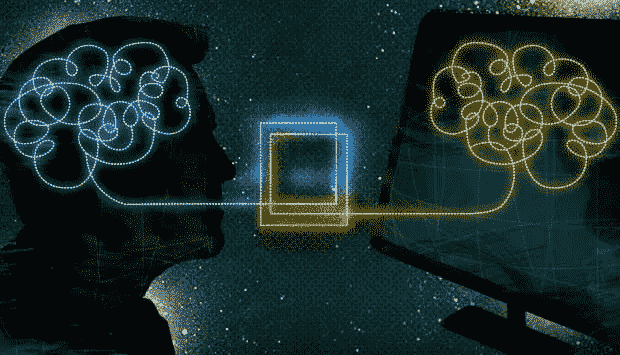
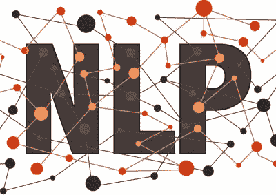

# 自然语言处理导论

> 原文：<https://medium.datadriveninvestor.com/an-introduction-to-natural-language-processing-c7d66be89df6?source=collection_archive---------10----------------------->

聊天机器人代表了自然语言处理的下一次发展，它们提供了一种廉价而有效的方式来回答简单的问题，并在企业和客户之间提供了一个全天候的接入点。是时候拥抱我们的机器人霸主了。”

——凯西·马基

**自然语言处理**和听起来差不多。这是一个总括术语，用来指机器处理和理解人类书写或说出的语言的能力。虽然认为我们的语言具有逻辑意义并遵循语法和标点符号的基本规则是件好事，但我们都知道情况并非总是如此。我们使用俚语、专有名词、缩写和首字母缩略词，并不是每个人都能像斯蒂芬·金或 J. K .罗琳那样把一个句子串起来。

这就是自然语言处理的用武之地。不严格地说，它是一种人工智能的形式，旨在分析和理解书面或口头语言及其使用环境。自然语言处理的一个基本例子是我们使用智能手机时看到的预测文本。当我们键入信息时，手机的操作系统使用人工智能和自然语言处理来尝试猜测我们可能正在键入的内容以及接下来可能会出现的单词。

自然语言处理并不完美，如果你曾经使用过像 Google Translate 这样的工具，你就会看到这一点，但是它非常强大，并且一直在变得越来越好。它甚至可以与机器学习相结合来创建一个系统，不仅可以理解正在说的话，而且还会随着它的使用而不断改进。谷歌助手就是一个很好的例子，它能更好地理解和响应个人用户的命令。如果你有口音或言语障碍，这可能会很有用，这一切都是通过自然语言处理和机器学习的结合实现的。

# 自然语言处理

没有多少人有足够的勇气来解决自然语言处理这一复杂的话题，但罗伯特·沃希特博士给了它一个很好的机会。在[为医院领导](http://bit.ly/wachternlp)(医院医学协会的官方博客)写的一篇文章中，沃希特分享了对自然语言处理和医生笔记历史的惊人描述。

沃希特认为，软件“阅读”笔记的能力可能是数字医学中最重要的突破之一。他说，“最近的一项研究将质子泵抑制剂的使用与随后的心脏病发作联系起来。它通过在电子健康记录中挖掘 1600 万条记录做到了这一点。

回溯到希波克拉底时代医学的开端，医疗记录是由医生用散文写的。沃希特引用了医学历史学家斯坦利·雷瑟的话，他描述了生活在公元前 5 世纪的阿卜杜拉的阿波罗尼奥斯的案例。他的医生证明经受住了时间的考验[，上面写着](http://bit.ly/apolloniusrecord)，“发烧加剧；肠子通过几乎没有食物；尿液稀薄。没有睡觉…大约在他上床的第十四天，在一次僵硬之后，他变得很热；疯狂地神志不清，大喊大叫，苦恼，漫无边际，接着是平静；这时候昏迷开始了。

不幸的是，这个故事没有一个美好的结局。阿卜德拉病历的最后一项是:“第三十四天。死亡。”

当然，从那时起，医疗健康记录发生了很大变化。随着我们对人体的了解越来越多，我们能够添加新的数据点，如血液测试的结果和生命体征的稳定性。沃希特解释说，这一切都很好，直到两个主要力量扎根。第一个是医生笔记受众的变化，这突然引起了大量利益相关者的兴趣，包括“政府官员、监管者、认证者、付款人、质量测量员和医疗事故律师。”

第二，沃希特说，是医学的数字化转型。“现在，所有对医生的笔记有浓厚兴趣的当事人都不再需要仔细检查难以辨认的潦草字迹。好吧。但是他们真的想知道一组有限的事实，这可以通过强迫医生填写各种模板并检查几十个框来最有效地进行编目。这当然成了冲突的直接来源，因为医生继续被训练和社会化，用故事来思考。但是付款人想知道医生是否记录了至少九次系统元素的检查。质量测量员想知道医生有没有记录戒烟咨询。诸如此类。”

这就是为什么医生花这么多时间填写文件，而不是和病人交谈。这也是为什么现代的病人记录和医生笔记往往如此臃肿，不知所云，以至于在帮助病人时没有实际用途。

这就是自然语言处理的用武之地。这个想法是，如果 NLP 软件可以理解医生笔记中的文字，它就可以代表医生填写表格。

当然，前进的道路上有许多障碍需要克服，如果你想了解更多，沃希特在他的文章中有更详细的介绍。至于我，我想留给你们他对未来的愿景:“想象一下这样一个世界，在这个世界中，可以从病人多年前的电子记录中挖掘关键风险因素或其他历史元素，而无需将搜索局限于处方清单或账单记录等结构化数据字段。计算机已经将我们从记叙文的世界中解放出来，并将我们置于一个越来越严格、越来越没有人性的模板和清单的世界。如果计算机可以把我们从复选框中解放出来，让我们回到与患者交谈的工作中，用散文描述他们的发现和我们的想法，这不是很好吗？”

# 自然语言生成

自然语言处理最令人兴奋的应用之一是自然语言生成的潜力(NLG)。我们正在谈论人工智能被用来创作书面作品，无论我们是在谈论新闻文章，还是在谈论电子邮件和社交媒体更新。

由于时间、资金和认可的结合，芝加哥的叙事科学处于这一趋势的前沿。该公司成立于 2010 年，不断壮大，筹集了 3000 万美元的资金，并在 CB Insights 的人工智能 100 强名单中占据一席之地。他们的人工智能创造的副本甚至已经发表在《福布斯》杂志上。

但是，叙事科学和其他从事该领域工作的公司的有趣之处在于，他们有效地提供了自然语言处理的对立面。该公司的首席执行官斯图尔特·弗兰克尔[解释道](http://bit.ly/narrativesciencenanalyze)“先进的 NLG 平台……从理解用户想要交流的东西开始。然后，这些系统执行相关分析，以突出最有趣和最重要的内容，识别和访问讲述故事所需的数据，并最终以个性化、易于消费的方式提供分析:作为叙事。”

当然，目前市场上的许多产品主要侧重于自动化耗时的任务，如遵循预定义公式的天气和金融报告。创造能够创造性写作的人工智能会更加困难，而且作者不太可能很快被取代——这对我是个好消息！

不过，很容易看出自然语言生成在医疗保健行业的潜在应用。我们都知道医生在填写电子病历(EMRs)上花费了太多时间，那么我们为什么不应该将这项工作外包给人工智能呢？

人工智能甚至可能会接管其他创意领域，就像英伟达的人工智能[一样，它创造了](http://bit.ly/nvidianewai)“令人信服的假视频”，例如通过拍摄冬天积雪行驶的视频，然后将它变成夏天。这比任何人能做到的都更令人信服，同时占用的人力也少得多。

自然语言处理和自然语言生成仍处于早期，尤其是在医疗保健行业。不过，看它在未来几年如何发展还是很有趣的，我个人对此很乐观。如果在所有关于人工智能将取代我们工作的讨论之后，它最终让我们腾出更多时间来做我们最擅长的事情——治疗我们的病人并与他们交谈，这难道不具有讽刺意味吗？

# 想了解更多？

在我的书《医疗保健的未来:人类和机器合作获得更好的结果》中，我更多地讨论了自然语言处理及其对医疗保健行业的影响。[点击这里给自己买一本。](https://www.amazon.com/Future-Healthcare-Machines-Partnering-Outcomes/dp/0692122966/ref=sr_1_4?s=books&ie=UTF8&qid=1532451664&sr=1-4&keywords=future+of+healthcare)