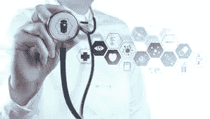
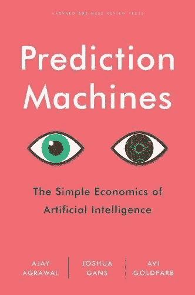
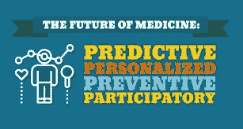
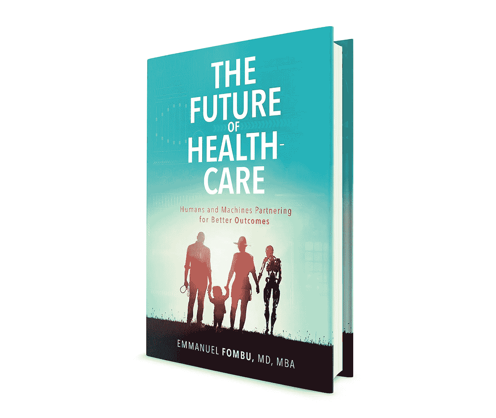

# 预测医学导论

> 原文：<https://medium.datadriveninvestor.com/an-introduction-to-predictive-medicine-17e0f4498f63?source=collection_archive---------5----------------------->

> “预测下雨不算。建造方舟需要。” *—巴菲特*

**当我们从当前的医疗保健收费模式转向预防性医疗时，人工智能、机器学习、自然语言处理、机器人和数据的真正好处**将会显现。这个想法很简单:与其等着人们生病，然后试图治疗他们的症状，我们可以在关口处阻止疾病，从一开始就阻止它们成为问题。这可能会增加前期成本，但从长远来看，它可以为医疗保健行业节省大量资金。

预测医学和预防医学相似但不同，因为预测医学围绕着识别未来可能发生的事情，而预防医学涉及基于这些见解采取积极措施。预测医学自然会导致预防医学，但我现在想谈论的是预测医学，因为人工智能本质上依赖于从大量数据中得出的预测。输入算法的数据越多，预测就越准确。

有趣的是，一旦我们进入预测健康的行业，这个行业将被迫彻底重新定义自己。随着健康维护和预防新机会的出现，我们可以获得的服务数量也将增加。

从基因组学和蛋白质组学到细胞组学和遗传学，预测医学有不同的方法。基因检测可以说是在任何实际症状出现前几十年就发现潜在疾病的最有力的方法。在某些情况下，它甚至可以用于在婴儿在子宫中时识别潜在的疾病，以便更容易感染疾病的人可以采取预防措施并改变他们的行为，以避免潜在的风险因素。这就是预测医学成为预防医学的地方。

预测医学的总体目标是标记风险因素，以便医生和患者能够共同努力减少未来问题的机会。例如，心脏病发作和心律不齐风险较高的患者可以接受更常规的心电图检查和心脏病专家预约。它既针对健康人，也针对现有疾病患者，但这两种情况下的目标都是一样的:利用预测和预防性药物给人们提供尽可能好的生活质量。

# 预测医学示例

预测医学不缺乏很好的例子，我已经在我的书和文章中分享了很多。这里还有几个例子可以帮助你理解预测医学的一些潜力。

**新生儿筛查:**通常在出生后不久进行，目标是尽早发现潜在的遗传疾病。这是目前最广泛的预测医学形式之一，这要归功于美国各州的法律，该法律要求采集各州每个新生儿的血液样本。

**风险测试:**这种预测医学的方法旨在观察患者是否有可能加剧疾病可能性的风险因素。例如，50 岁的重度吸烟者比 20 岁的非吸烟者更容易患肺癌、肺气肿和其他疾病。

**诊断测试:**当医生做出一个试探性的诊断时，诊断测试用于确认或反驳该诊断。例如，可以进行乳糜泻血液测试，以确定患者是否患有谷蛋白不耐受症，或者其他问题是否是根本原因。

孕前测试:这里的想法是在父母试图怀上孩子之前对他们进行测试，以确定是否有一方(或双方！)父母携带可能导致遗传疾病的基因突变。然后，父母可以根据任何潜在的风险因素，就是否要孩子做出更明智的决定。

**直接面向消费者测试:**这种相对较新的现象的特点是像 23AndMe 这样的服务，它允许人们测试他们的基因，而不需要医生作为中间人。这些测试可能不像其他类型的预测医学那样全面，但它们确实具有增加可及性和更大隐私性的优势。此外，它们还将权力交还给消费者——在这种情况下就是病人。

# 预测机器

在我为这本书进行研究的时候，我很幸运地遇到了 [*预测机器:Ajay Agrawal、Joshua Guns 和 Avi Goldfarb 的《人工智能的简单经济学》*](http://amzn.to/predictionmachines) 。我在旅途中读了很多书，经常通过有声读物来听，但这本书是我遇到的关于这个主题的最佳资源。它充满了适用于任何行业的见解，但可以说尤其适用于医疗保健行业。

预测机器将减少不确定性，但它们可能不会完全消除不确定性。尽管如此，任何给医生带来优势的东西都可能给我们苦苦挣扎的医疗体系带来巨大的变化。例如，作者谈到如果预测机器被用来检查肿瘤会发生什么。如果他们能给我们一个明确的答案，告诉我们它们是良性的还是非良性的，没有任何出错的余地，医生会更容易知道是否要安排一个侵入性的程序，如活检，以找到更多的信息。作者解释说，“安排活检是风险较小的决定”。“是的，这是昂贵的，但它可以产生一个更确定的诊断。从这个角度来看，预测机器的作用是增加医生对*而不是*进行活检的信心。这种非侵入性程序成本较低，尤其是对患者而言，它们可以告知医生患者是否可以避免侵入性检查，如活检，并使他们更有信心放弃治疗和进一步分析。”

另一个很好的例子是医学成像，作者解释说，在可预见的未来，这将需要人类的监督，尽管从长远来看，人工智能可能会接管。“成像是昂贵的，在时间和辐射暴露的潜在健康后果方面都是如此，”作者解释道。“对于一些成像技术来说，随着成像成本的下降，成像量会增加。因此，从短期和中期来看，这种增长可能会抵消人们花在每幅图像上的时间的减少。”

对于如何选择是否在你的业务中使用特定的人工智能工具，作者也有一些很好的建议。“每项任务的核心都有一组决策，”他们解释道。“这些决定有一些预测因素。我们建议将这些任务分解成组成元素。将决策的各个部分分解成各个要素。为了了解这一点，让我们来看看初创公司 Atomwise，它提供了一种预测工具，旨在缩短发现有前途的制药药物前景的时间。数百万种可能的药物分子可能成为药物，但购买和测试每种药物既费时又费钱。制药公司如何决定测试哪一个？他们根据表明哪些分子最有可能成为有效药物的研究，做出有根据的猜测或预测。”

Atomwise 首席执行官 Abraham Heifets 解释说:“要使药物发挥作用，它必须结合患病的目标，并且不能结合肝脏、肾脏、心脏、大脑和其他会导致毒副作用的东西中的蛋白质。归根结底，坚持你想坚持的事情，不坚持你不想坚持的事情。”

“如果制药公司可以预测结合亲和力，那么他们就可以确定哪些分子最有可能起作用，”作者解释说。“Atomwise 通过提供一种人工智能工具来提供这种预测，这种工具使识别潜在药物的任务更加有效。该工具使用人工智能来预测分子的结合亲和力，因此 Atomwise 可以在排名列表中向制药公司推荐哪些分子对疾病蛋白质具有最佳的结合亲和力。例如，Atomwise 可能提供对埃博拉病毒具有最高结合亲和力的前 20 个分子。Atomwise 的预测机器不只是一次测试一个分子，而是可以处理数百万种可能性。虽然制药公司仍然需要通过人类和机器的判断和行动来测试和验证候选人，但 Atomwise AI 工具大大降低了成本，并加快了找到这些候选人的第一项任务的速度。”

# 预测医学的问题

预测医学并不完美，尤其是现在处于早期阶段。我更愿意认为自己是一个现实主义者，而不是乐观主义者，这就是为什么我承认在我们迎来医疗保健的新曙光之前还有很多工作要做的原因之一，我们离这个曙光如此之近，却又如此之远。

预测医学的一个问题是假阳性的风险。即使有 99.9%的准确率，也有 1/1000 的人承受着不必要的压力和紧张，认为他们处于永远不会发展的风险之中。还有一个事实是，我们可能最终会为了预防疾病而给予大量的药物，而许多人可能根本就没有患上这种疾病。这将是浪费、昂贵和低效的，但还有更糟糕的。许多药物都有令人不快的副作用，会降低患者的生活质量。

预测医学也有伦理意义。例如，如果雇主开始强制要求对每个员工进行基因测试，如果他们使用这些数据来决定对谁投资和给谁升职，会怎么样？如果健康保险公司开始要求人们在提供保险之前进行基因测试，会怎么样？

这些只是我们必须考虑的一些伦理问题，但好消息是这可能只是一个先例。回到 2008 年 5 月 21 日，时任总统乔治·布什签署了《基因信息非歧视法案》，使之成为法律。根据 KaiserNetwork.org 的说法，“根据该法案，雇主不能根据基因测试的结果来决定是否雇佣潜在的雇员或者解雇或提升雇员。此外，健康保险公司不能因为基因测试结果而拒绝为潜在成员提供保险或向成员收取更高的保费。支持者称该法案为“21 世纪第一部重要的民权法案”，并表示他们希望该法案将鼓励更多的人参与特定基因序列治疗的临床研究。

# 想了解更多？

我在我的书《医疗保健的未来:人类和机器合作获得更好的结果》中更多地谈到了新技术及其对医疗保健行业的影响。[点击这里给自己买一本。](https://www.amazon.com/Future-Healthcare-Machines-Partnering-Outcomes/dp/0692122966/ref=sr_1_4?s=books&ie=UTF8&qid=1532451664&sr=1-4&keywords=future+of+healthcare)