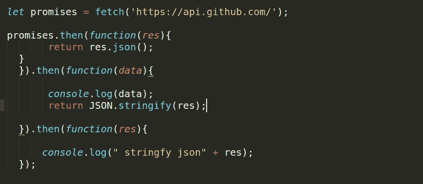
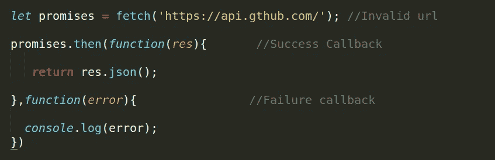
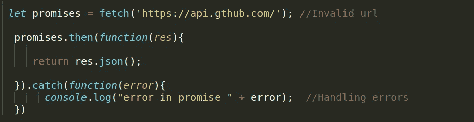
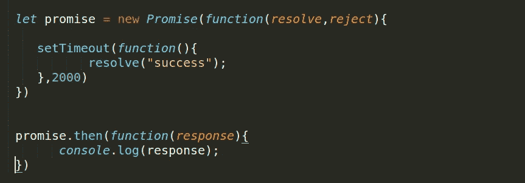
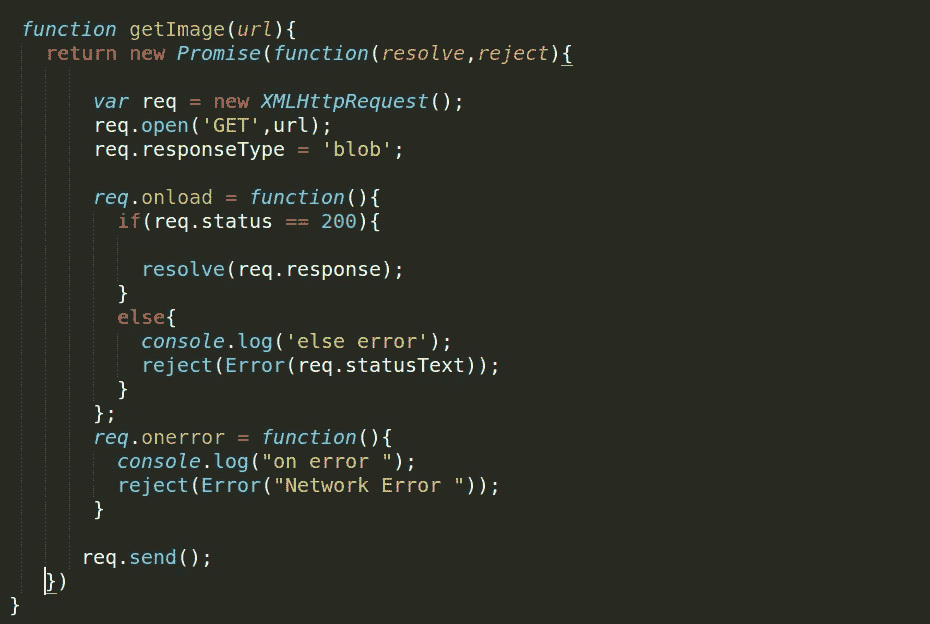
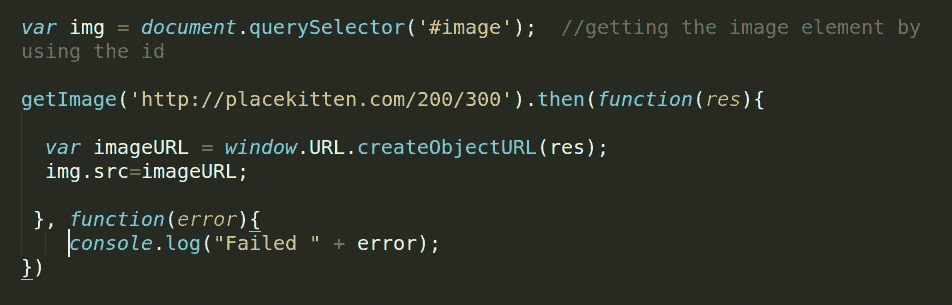
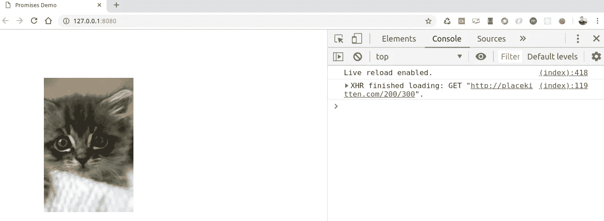

# 承诺导论

> 原文：<https://medium.datadriveninvestor.com/an-introduction-to-promises-299f474392b5?source=collection_archive---------5----------------------->

[](http://www.track.datadriveninvestor.com/1B9E)

JavaScript 中的*承诺是基本上用来处理异步请求*的对象。JavaScript 是单线程语言，这意味着两部分代码不能同时运行，它们必须一个接一个地运行。但通常 JavaScript 与绘画、更新样式和处理用户动作在同一队列中，其中一个的活动会延迟另一个。

承诺是在未来某个时间产生输出的对象，该输出可能是已解决的值或失败值(例如网络错误)。

让我们使用获取 API 获取一些数据，它返回承诺—

```
var promises = fetch("[https://api.github.com/](https://api.github.com/)");promises.then(function(res){return res.json();  //Also return promise.},function(error){
     console.log("Error occured" + error); ).then(function(data){
  console.log(data);
})
```

在上面的例子中，获取 API 返回承诺，当数据可用时，我们可以使用包含两个回调的`then`进行访问，第一个回调用于成功，另一个用于处理错误，并且`res.json()`也返回承诺，我们可以再次使用`then`进行访问。

## 承诺的状态—

承诺可以处于以下状态之一—

1.  已完成—操作已成功完成。
2.  拒绝—操作失败
3.  待定—操作未完成未被拒绝。

一个承诺一旦实现或被拒绝就被认为是确定的。

## 一些与承诺相关的事实—

*   在 JavaScript 事件循环的当前运行完成[之前，不会调用回调。](https://developer.mozilla.org/en-US/docs/Web/JavaScript/EventLoop#Run-to-completion)
*   在异步操作成功或失败后，添加了`then`甚至*的回调将被调用。*
*   通过多次调用`then` 可以添加多个回调。每个回调都按照插入的顺序依次执行。
*   一个承诺只能成功或失败一次。它不能成功或失败两次，也不能从成功切换到失败，反之亦然。
*   如果一个承诺已经成功或失败，您稍后添加成功或失败回调，它将被忽略。
*   `then()`有两个参数，一个是成功案例的回调，另一个是失败案例的回调，这两个参数都是可选的，所以您可以只为成功案例添加一个回调。

## 链接—

让我们用下面的例子来理解—



在上面的例子中`fetch`返回一个在第一个`then`中解决的承诺。现在，当成功回调或失败回调也返回承诺时会发生什么，如上例`res.json()`也返回承诺，我们可以通过创建承诺链来处理它们。

`then()`本身返回一个不同于原来的新的承诺。

## 错误处理—

包含两个回调函数参数，一个表示成功，另一个表示失败。我们可以通过使用这个失败回调来处理错误。



现在，如果成功回调函数抛出一些错误，那么从`.then()`返回的承诺将被拒绝，但是没有任何东西可以捕捉拒绝。所以为了处理这种情况，我们可以使用`catch().`



在上面的例子中，我们使用`catch()`来处理错误。

## 创造你自己的承诺—

到目前为止，我们一直在使用`fetch` API，这是一个承诺。您可以使用 promise 构造函数创建自己的 promise。



在上面的例子中，我们使用 promise 构造函数创建了一个 promise，它接受一个回调函数，回调函数包含两个参数`resolve`和`reject`。

如果动作成功完成，将调用`resolve()`，否则将调用`reject()`。

## 使用 XMLHttpRequest 和 Promise 加载图像—

创建一个使用`XMLHttpRequest`从服务器获取数据并返回承诺的`getImage()`函数。



using HMLHttpRequest to fetch data from server.

现在使用`getImage()`功能获取图像。



calling the getImage.

您将获得以下输出—



Image is loaded .

感谢阅读😙。