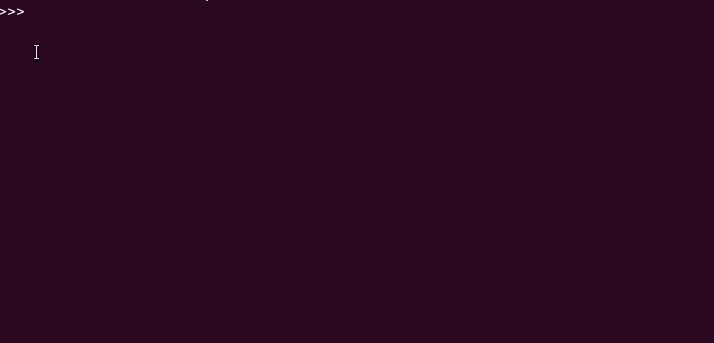

# Python 计数器简介

> 原文：<https://medium.datadriveninvestor.com/an-introduction-to-python-counter-47948fdd9c1a?source=collection_archive---------1----------------------->

## Python Counter 是一个有趣且有用的数据结构。让我们深入研究一下，看看它是如何工作的。


Photo by [Hitesh Choudhary](https://unsplash.com/@hiteshchoudhary?utm_source=medium&utm_medium=referral) on [Unsplash](https://unsplash.com?utm_source=medium&utm_medium=referral)

Python 中有几个著名的内置集合，如 [**list、dict、set、tuple** 、](https://python.swaroopch.com/data_structures.html)等。这些充当用于存储数据集合的容器。

已经开发了几个其他模块来合并附加的数据结构。 [**集合**](https://docs.python.org/3.1/library/collections.html#collections.Counter) 就是这样一个模块。

[](https://www.datadriveninvestor.com/2019/02/21/best-coding-languages-to-learn-in-2019/) [## 2019 年最值得学习的编码语言|数据驱动的投资者

### 在我读大学的那几年，我跳过了很多次夜游去学习 Java，希望有一天它能帮助我在…

www.datadriveninvestor.com](https://www.datadriveninvestor.com/2019/02/21/best-coding-languages-to-learn-in-2019/) 

集合模块有多种数据结构，如 [**计数器**、 **OrderedDict** 、**链表**](https://docs.python.org/3.1/library/collections.html#collections.Counter) 等。在这个故事中，我们将介绍**计数器类**。我们将首先讨论一些基本的数据结构操作，然后看看一些有趣的附加函数。

# 介绍

**Python 计数器**是`**dict**`或[字典类或](https://docs.python.org/3/tutorial/datastructures.html#dictionaries)的子类。**它跟踪容器中每个元素的频率**。

它将一个 iterable 对象(如 list)作为参数，并返回一个字典。在这本词典中，

1.  **Key:**iterable 中的一个元素
2.  **值:**iterable 中元素的频率

> Python 中的计数器计数 hashable **对象。**

这里有一个简单的例子:



Counter counts hashable objects in python

# 创建计数器对象

计数器对象可以用多种方式定义:

1.  **使用列表、字符串或元组**

这里，我们将一个列表传递给`Counter()`函数。作为回报，我们收到一个字典，告诉我们给定的参数有 3 个' **a** '，2 个' **b** '和 1 个' **c** '。

```
my_count = Counter(['a','b','c','a','b','a'])
my_count# Output
# Counter({‘a’: 3, ‘b’: 2, ‘c’: 1})
```

同样，我们可以使用一个**元组**。

```
my_count = Counter(('a','b','c','a','b','a'))
my_count# Output
# Counter({‘a’: 3, ‘b’: 2, ‘c’: 1})
```

或者一个 **Python 串**。

```
my_count = Counter("Hello World")
my_count# Output
# Counter({'l': 3, 'o': 2, 'H': 1, 'e': 1, ' ': 1, 'W': 1, 'r': 1, 'd': 1})
```

> 注意计数总是以降序显示。

值得注意的是，Python 集合只保存唯一的项目，也就是说，每个元素在一个集合中只能出现一次。**所以，在 Python 集合中使用** `**Counter()**` **函数** **没有任何意义。**

**2。使用字典**

字典也可以作为参数提供给`Counter()`函数。**一个键的值应该是那个键的“计数”**。

```
my_count = Counter({'a':3, 'b':2, 'c':1})
my_count# Output
# Counter({'a':3, 'b':2, 'c':1})
```

**3。使用关键字参数**

我们可以使用关键字参数手动输入计数。

```
my_count = Counter(i = 1, c = 2, e = 3)
my_count# Output 
# Counter({'e': 3, 'c': 2, 'i': 1})
```

注意在输出中，计数是如何按降序排列的。

# 更新 Python 计数器

我们也可以声明一个空的 Python 计数器。稍后，我们使用`update()`方法给它添加值。

```
my_count = Counter()   # defining an empty Countermy_count.update("a")   # adding values to my_count
my_count# Output
# Counter({a:1})
```

`update()`方法主要是将新值添加到现有的计数器中。我们可以进一步更新这个计数器，并不断添加更多的值。例如:

```
my_count.update("ab")
my_count# Output
# Counter({'a': 2, 'b': 1})
```

更新操作将另一个“a”和新元素“b”添加到计数器中。

> 方法向现有计数器添加新值。

# 访问计数

我们可以通过使用特定元素的索引来访问它的计数。这类似于它的超类，一个 Python 字典。

在字典中，当我们作为参数发送一个不存在的键时，我们会收到一个 **KeyError** 。但是在计数器中，我们得到零。

```
print(my_count['b'])
# 1print(my_count['c'])
# 0
```

> 当您尝试访问一个不存在的元素时，Counter 对象将返回零。

# 在 Python 中重新分配计数

类似于字典，计数器也是可变的。我们可以使用以下方式重新分配计数:

```
# To reassign 'b' to 2
my_count['b'] = 2
my_count# Output
# Counter({'a': 2, 'b': 2})# To clear a Python counter
my_count.clear()
my_count# Output
# Counter()
```

到目前为止，我们已经看到了一些基本的数据结构操作，比如在 Python 计数器中添加、访问和删除元素。

因为，`Counter`是`dict`的子类，它拥有`dict`类的所有方法。但是，`Counter`有三个额外的函数:Elements、Most_common 和 Subtract。

# **元素()方法**

我们使用`elements()`函数列出一个`Counter`对象中的所有元素。它用`Counter`对象中的值返回一个[迭代器](https://www.programiz.com/python-programming/iterator)。

请看下面的例子:

```
my_count = Counter({'a':1,'b':2, 'd':5, 'c':4})
my_count.elements()
# <itertools.chain object at 0x7f21ccbd8898>print(list(my_count.elements())) 
```

**输出:**

```
['a', 'b', 'b', 'd', 'd', 'd', 'd', 'd', 'c', 'c', 'c', 'c']
```

我们首先使用字典作为参数创建了一个`Counter`对象。`elements()`函数返回一个迭代器，作为参数传递给`list()` 函数。

> elements()函数列出了一个计数器对象中的所有元素

**注意输出不再是降序，而是与输入参数类似的顺序。**

# 访问最常见的值

我们可以使用`Counter`对象的`most_common()`函数来检索最高频率值。举个例子，

```
my_count.most_common()
# Output
[('d', 5), ('c', 4), ('b', 2), ('a', 1)]
```

我们收到一个按频率降序排列的列表。该列表由元组构成。

我们也可以给这个函数传递一个参数，以获取对象中最常见的值。看一看:

```
my_count.most_common(1)
# Output
[('d',5)]my_count.most_common(2)
# Output
[('d',5), ('c',4)]
```

我们还可以使用`most_common()`函数来找到 **n** 个最不常见的元素。

```
my_count.most_common()[:-n:-1]
```

> most_common()函数返回一个元组列表，其中包含一个元素及其对应的频率，按降序排序。

# 减法函数

`subtract()`与`update()`功能相反。它接受一个 iterable(列表、字符串、元组)或一个字典作为参数，并使用该参数推导元素计数。例如:

```
my_count = Counter(['hi','hi','hello'])
print("Original Counter : ", my_count)to_deduct = ['hi']
my_count.subtract(to_deduct)
print("New Counter : ", my_count)
```

**输出:**

```
Original Counter :  Counter({'hi': 2, 'hello': 1})
New Counter :  Counter({'hi': 1, 'hello': 1})
```

`subtract()`功能从键“hi”中减去 1 个计数。

# 结论

Python 计数器是一个跟踪某个值出现的次数的容器。以下是一些关键要点:

1.  Python Counter 是`dict`或 dictionary 类的子类。
2.  计数总是以降序显示。
3.  方法向现有计数器添加新值。
4.  当您尝试访问一个不存在的元素时，Counter 对象将返回零。
5.  `elements()`函数列出一个计数器对象中的所有元素。
6.  `most_common()`函数返回一个元组列表，其中包含一个元素及其相应的频率，按降序排列。

# 进一步阅读

1.  [Python 集合文档](https://docs.python.org/3.1/library/collections.html)
2.  [Python 中的计数器|极客中的极客](https://www.geeksforgeeks.org/counters-in-python-set-1/)