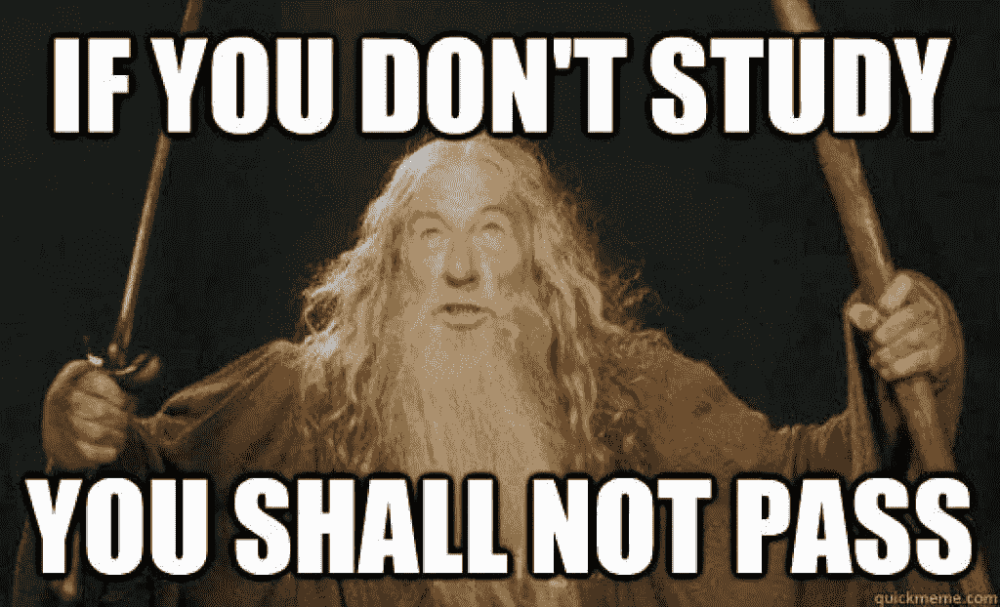
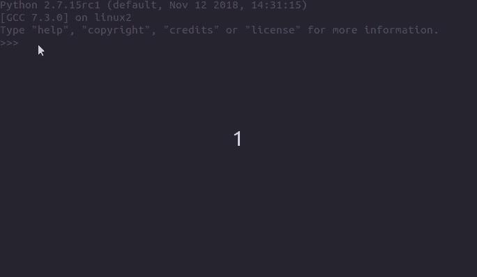
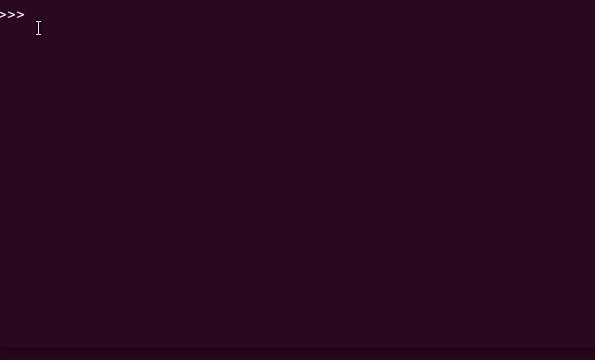
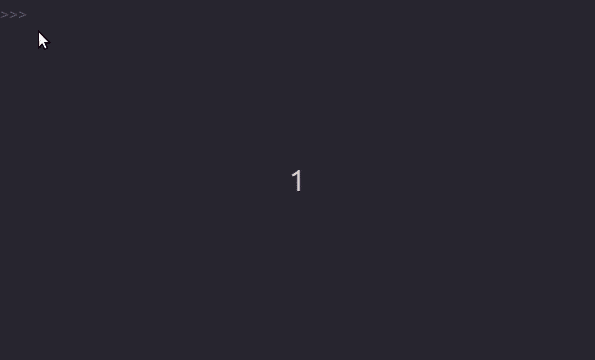
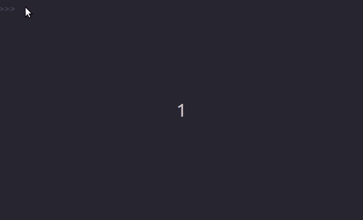
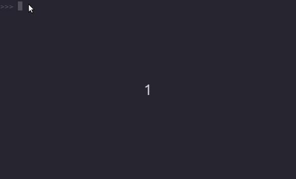

# Python 集合介绍—第二部分

> 原文：<https://medium.datadriveninvestor.com/an-introduction-to-python-sets-part-ii-operations-on-set-objects-in-python-5a9b8c85dede?source=collection_archive---------3----------------------->

[](http://www.track.datadriveninvestor.com/1B9E)

## Python 中对集合对象的操作

将对象分组到一个集合中在编程中也很有用，Python 提供了一个内置的集合类型来做到这一点。上一部分我们学习了:[**如何在 Python 中定义 set 对象**](https://medium.com/python-pandemonium/https-medium-com-python-pandemonium-an-introduction-to-python-sets-part-i-120974a713be) **。**



现在我们将会发现一些**标准的数据结构操作**比如大小、添加元素、删除元素和修改集合。集合运算，如并集、交集等。将在下一部分讨论。

本文将讨论的方法如下:

1.  **主要操作** : len，in(会员)
2.  **数据结构**:添加、更新、丢弃、删除、弹出、清除

[](https://www.datadriveninvestor.com/2019/02/21/best-coding-languages-to-learn-in-2019/) [## 2019 年最值得学习的编码语言——数据驱动的投资者

### 在我读大学的那几年，我跳过了很多次夜游去学习 Java，希望有一天它能帮助我在…

www.datadriveninvestor.com](https://www.datadriveninvestor.com/2019/02/21/best-coding-languages-to-learn-in-2019/) 

# 设置大小和成员

标准的`len()`函数可以用来返回集合中元素的**个数。**

```
>>> my_set = {'a', 'd', 'b', 'c'}
>>> len(my_set)
4
```

具有不同元素的集合的属性创造了独特的机会。我们可以使用这个函数来计算列表中唯一元素的数量。



Count unique elements in a list using set

我们首先将一个列表转换成一个集合，然后使用`len()`函数来计算元素的数量。最后，我们通过将集合转换回列表，将唯一元素存储在`unique_list`中。

注意:集合中元素的顺序与列表中的不同。使用 [**命令集合**](https://pypi.org/project/ordered-set/) 来维持顺序。

为了检查一个元素是否存在于集合中，我们使用了`in`和`not in`操作符:


membership operations on a set

# 集合上的数据结构操作

集合是可变的。但是由于它们是无序的，许多数据结构操作像**索引和切片没有意义**。因此，我们不能访问或更改集合中的元素。

> 这意味着虽然我们可以改变集合中的元素，但是我们不能修改集合中的元素。

**在集合中插入元素:**

1.  `add()`:将单个元素添加到集合中
2.  `update`:向集合中添加多个元素

在这两种情况下，都避免了重复。

> `*x.add(<item>)*` 将单个不可变对象`*<item>*`添加到`*x*`中



add( ) method

update 方法非常有用，因为您甚至可以将元组、字符串和列表(除了集合之外)作为它的参数。

> `*x.update(a)*`向`*x*`添加`*a*`中`*x*`还没有的任何元素



update( ) method

**从集合中删除元素:**

1.  `remove()`或`discard()`:从集合中删除特定元素
2.  `pop()`:移除并返回集合中的最后一个元素
3.  `clear()`:清空器械包

> `*x.remove(<item>)*` 和`*x.discard(<item>)*`将`*<item>*`从`*x*`中移除。



discard( ) and remove( )

> 不同之处在于，如果使用`remove(<item>)`，如果`<item>`不在`x. But no exception is raised if discard(<item>) is used.`中，Python 会抛出一个异常


> `*x.pop()*`删除集合中的最后一个元素。

由于一个集合是无序的，所以一个元素是任意选择、移除和返回的。如果`x`为空，则`x.pop()` **引发异常**。



pop( ) method

> `*x.clear()*`删除`*x*`中的所有元素

```
>>> my_set = {'a', 'd', 'b', 'c'}
>>> my_set.clear()
>>> my_set
set([])
```

# 结论

> 由于集合是无序的，切片和索引操作没有意义。
> 
> 使用 add 方法插入单个元素，使用 update 插入多个元素。
> 
> Remove 和 discard 用于从集合中删除特定元素。但是，如果元素不存在，remove 将给出警告。

# 有用的链接

1.  [什么是集合？](https://snakify.org/en/lessons/sets/)
2.  [Python 集](https://www.programiz.com/python-programming/set)

这个故事的第一部分可在[这里](https://medium.com/python-pandemonium/https-medium-com-python-pandemonium-an-introduction-to-python-sets-part-i-120974a713be)找到。
这个故事的第三部分在这里[可以看到。](https://medium.com/@chaitanyabaweja1/an-introduction-to-python-sets-part-iii-dbb3e5df2ffc)

如果你喜欢这个故事，你可能也会喜欢我关于 Python 中的列表理解和 Python 中的对象函数的故事。