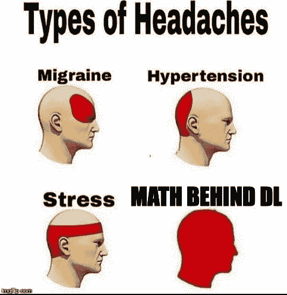
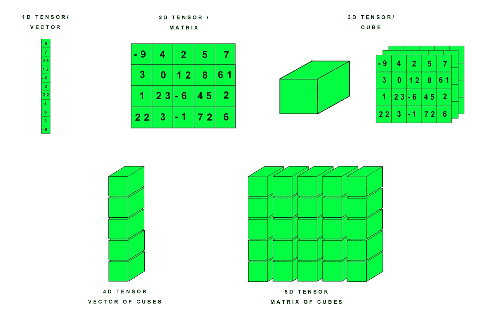
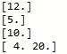
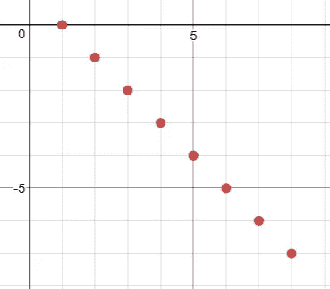
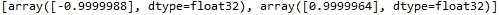
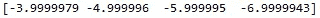

# TensorFlow 简介和实现简单的线性回归模型

> 原文：<https://medium.datadriveninvestor.com/an-introduction-to-tensorflow-and-implementing-a-simple-linear-regression-model-d900dd2e9963?source=collection_archive---------0----------------------->

当你看所有与之相关的数学、统计和各种算法时，机器学习似乎非常复杂，但随着许多开源包如 TensorFlow 的兴起和发展，建立机器学习模型的艰巨任务似乎比以前容易得多。TensorFlow 最初是由谷歌人工智能组织谷歌大脑团队的研究人员和工程师开发的，它为机器学习和深度学习提供了强大的支持，灵活的数值计算核心被用于许多其他科学领域。

因此，在今天的博客文章中，我们将学习 TensorFlow 的基础知识，并尝试实现一个简单的线性回归模型，而不会过多地考虑其中涉及的所有数学难题。尽管你不会理解“打破你的头”意味着什么的真正含义，除非你试图解决模式识别的深度学习模型背后的数学问题，并解释它产生的结果。*眨眨眼！*

但是不要失去勇气。忠于你的道路，正如一位伟人曾说过的那样:“不入虎穴，焉得虎子！”，虽然那只是我最喜欢的动漫斯坦斯的主角的一段对话；门，但它确实很有激励性！对吗？

好吧，让我们现在不要跑题，继续前进。

TensorFlow 使用张量的概念，可将其视为数据的基本单位。张量的结构是类似的，可以比作一些原始值的数组。张量可以定义为 N 维向量，可以通过多维数组来表示。

Visual Representation of Tensors

# 节点和图的概念

使用 TensorFlow 创建模型时，有两个主要步骤，第一步是创建一个类似图形的结构并组织其中的节点。完成后，我们只需要运行图表。

因此，基本上有三种不同类型的节点用于制作这些图形:常量、变量和占位符节点。

常量节点包含不能更改的常量值。

一个变量节点可以用来存储一些初始值，但是如果我们想的话，我们可以在以后修改它们。开始时需要一个特殊的函数来初始化这些值。

占位符节点不需要初始定义任何特定的值，但是可以在运行会话时赋值。下面我们有一个代码片段，展示了这些节点实际上是如何工作的。

The output for the above code

在第 6 行中，我们看到一个常量节点是如何定义的。我们也可以像在第 7 行中那样定义一个节点，而不需要明确提到节点的数据类型。很容易理解常数节点相加的输出。我们还可以看到如何定义变量节点，并根据需要随时更改它们的值。变量 node 的初始值在第 17 行中给定为[5.0]，但我们在第 24 行将其值更改为[10.0]。

我们将会大量使用占位符节点，以更好的方式理解它们是至关重要的。与常量或变量节点不同，我们不提供占位符在定义它们时必须保存的任何特定数据。我们定义另一个操作符节点，一旦提供了这些占位符节点的值，就将它们的值相乘。在第 35 行中，我们以 2 个数组的形式提供了占位符节点的值，我们得到的输出是这 2 个数组按元素相乘的结果。

# **线性回归**

因此，在教程的下一部分，我们将看到如何使用 TensorFlow 实现线性回归模型。

想象我们有一个函数***y=mx+c*** 。这里***y*** 为因变量， *x* 为自变量。因此，变量 ***x*** 的变化产生变量 ***y*** 的变化。因此，在线性回归任务中，我们的工作是找到斜率 ***m*** 和截距值 ***c*** 的适当值，这样我们就可以对任何给定的***×***得到 ***y*** 的精确估计值。

Getting a best fit line for the data points

为了获得斜率和截距的正确值，我们最初假设斜率和截距的一些虚拟值，并找出关于*的 ***y*** 的估计解。我们求出 ***y*** 的估计值和 ***y* 的实际值之间的平方误差。**在 ***机器学习术语中*** 斜率和截距被广泛称为**。从现在开始，我们将使用这个术语来指代它们。我们的目标是通过找到斜率和截距的适当值，尽可能地最小化平方误差项。这是通过一个叫做 ***梯度下降*** 的过程实现的。***

**正如我之前已经承诺过的，现在我们不会过多地涉及数学，但是需要对这个主题有一个正确的理解，我会感谢你自己做一些研究。**

****

**Gradient Descent**

**那么，让我们开始编码，我们导入 TensorFlow 包如下:**

**然后我们以 ***x_train*** 和 ***y_train*** 的形式定义值。 ***y_train*** 的值会相对于 ***x_train*** 的值而改变。我们模型的目的是提供一个结果数组，其值非常接近于 ***y_train 的值。*** 我们还定义了两个占位符节点，我们稍后会用到。我们还定义了权重和偏差项的值。最初总是建议保持它们的值较小。**

**接下来，我们将我们的线性模型定义为 ***lm= Wx+b*** ，其工作原理与之前定义的 ***y=mx+c*** 相同。使用为 ***x_train*** 和 ***y_train*** 定义的值，这意味着如果绘制一个图，它将类似于下面给出的图，其中显然 ***W*** 的值应该是-1， ***b*** 的值应该是 1。因此，我们的目标是创建一个能够接近实现这些价值的模型。**

****

**我们计算总损失并使用学习率为 0.01 的梯度下降，并尝试最小化损失函数。建议学习率不要太大，否则需要很多时间才能收敛，或者太小，因为达到最终结果需要很多时间。**

**我们现在定义并运行我们的会话。我们训练我们的模型 1000 次迭代以最小化损失。**

****

**final values of the weight and bias**

****

**Output provided by the model**

**因此，我们最终看到，在训练 1000 次迭代后，我们有了一个模型，它使用非常接近-1 和 1 的权重和偏差值，并且该模型提供的输出非常接近[-4，-5，-6，-7]。这意味着我们已经成功地建立了我们的线性回归模型！**

**你现在可以恭喜自己了！你做得很好，学到了一些新东西。现在，你可以做的下一件事是为 y 和 x 选择更多的任意值，并尝试自己训练一个模型。**

**你可以看看下面的完整代码:**