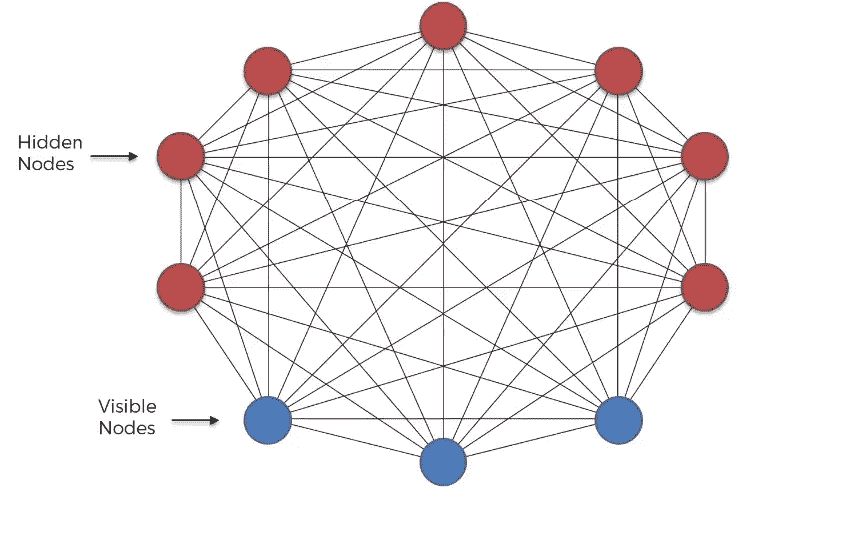
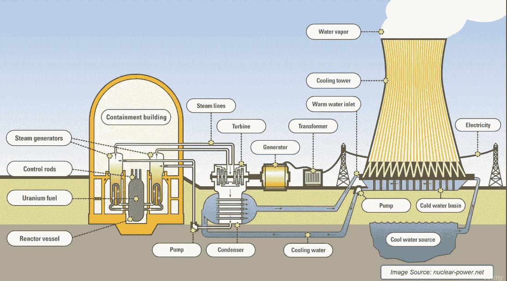

# 玻尔兹曼机的直观介绍

> 原文：<https://medium.datadriveninvestor.com/an-intuitive-introduction-of-boltzmann-machine-8ec54980d789?source=collection_archive---------1----------------------->

玻尔兹曼机器是由多伦多大学的杰弗里·辛顿教授在 1985 年首先发明的。他是深度学习社区的领军人物，被一些人称为“深度学习的[教父”。](https://en.wikipedia.org/wiki/Geoffrey_Hinton)

*   *玻尔兹曼*机器*是一个*生成式无监督模型，它涉及从原始数据集学习概率分布，并使用它对从未见过的数据做出推断。
*   *玻尔兹曼*机有一个输入层(也称为*可见层*)和一个或几个隐藏层(也称为*隐藏层*)。

*   玻尔兹曼机器使用具有神经元的神经网络，这些神经元不仅连接到其他层中的其他神经元，还连接到同一层中的神经元。
*   一切都是相互联系的。连接是双向的，*可见的*神经元相互连接，*隐藏的*神经元也相互连接
*   *玻尔兹曼机器不期望输入数据，它生成数据。*神经元*不管是隐藏的还是可见的，都会产生信息。*
*   *对于玻尔兹曼机来说，所有 n 个*神经元都是相同的，它不会区分*隐藏的*和*可见的 n 个*神经元。*对于玻尔兹曼机来说，整体事物是系统及其生成的*状态*的系统。*

最好的思考方式是通过一个核电厂的例子。

*   例如，假设我们有一个核电站，我们可以在核电站中测量某些东西，比如安全壳建筑的温度，涡轮机旋转的速度，泵内的压力等。
*   有很多东西我们没有测量，比如风速、特定位置的土壤湿度、晴天还是雨天等等。
*   所有这些参数一起形成一个系统，它们一起工作。所有这些参数都是二进制的。所以我们得到一大堆二进制数，告诉我们一些关于电站的状态。
*   我们想做的是，我们想注意到，当它处于不寻常的状态时。这种状态不像我们以前见过的正常状态。我们不想为此使用监督学习。因为我们不想有任何导致它爆炸的状态的例子。
*   我们更希望能够检测到它何时进入这样一种状态，而不需要之前看到这样一种状态。我们可以通过建立一个正常状态的模型来做到这一点，并注意到这个状态不同于正常状态。
*   那就是*玻尔兹曼机所代表的东西。*
*   这个系统的工作方式是，我们使用我们的训练数据，并将其输入到*波尔兹曼机器中，以帮助系统调整其权重。它类似于我们的系统，而不是世界上任何一座核电站。*
*   它从输入中学习，所有这些参数之间可能的联系是什么，它们如何相互影响，因此它成为一台代表我们系统的机器。
*   我们可以用这个*波尔兹曼机器来监控我们的系统*
*   *玻尔兹曼机器通过好例子了解系统如何在其正常状态下工作。*

玻尔兹曼机由具有一个输入层和一个或几个隐藏层的神经网络组成。神经网络中的神经元根据我们在训练期间提供的数据和波尔兹曼机器试图最小化的成本函数，随机决定是打开还是关闭。

通过这样做，玻尔兹曼机器发现了关于数据的有趣特征，这有助于对数据中存在的复杂潜在关系和模式进行建模。

这些玻尔兹曼机器使用具有神经元的神经网络，这些神经元不仅连接到其他层中的其他神经元，还连接到同一层中的神经元。这使得训练不受限制的玻尔兹曼机器非常低效，玻尔兹曼机器几乎没有商业成功。

# 结论

玻尔兹曼机器是一个非常普通的连接神经元的双向网络。例如，给定层中的神经元相互连接，为网络张量的数学表示增加了额外的维度。因此，这种网络架构的学习过程是计算密集型的，并且难以解释。

***希望这篇文章能帮助你对玻尔兹曼机有一个直观的了解。我认为它至少会提供一个很好的解释和一个高层次的架构。***